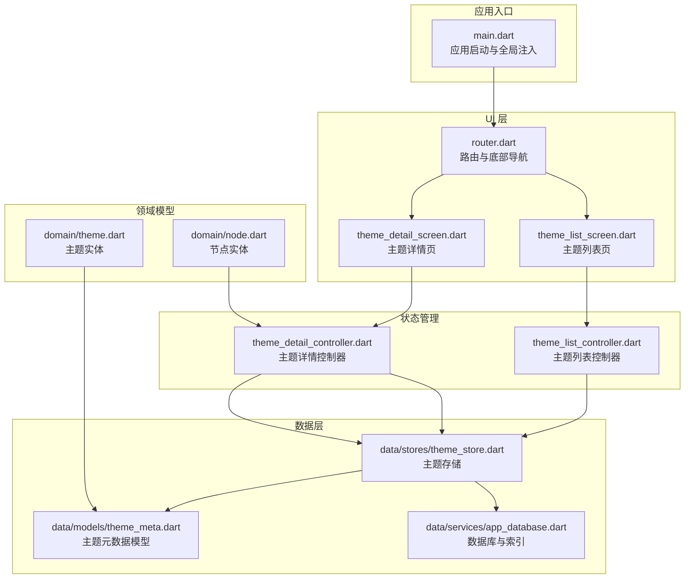
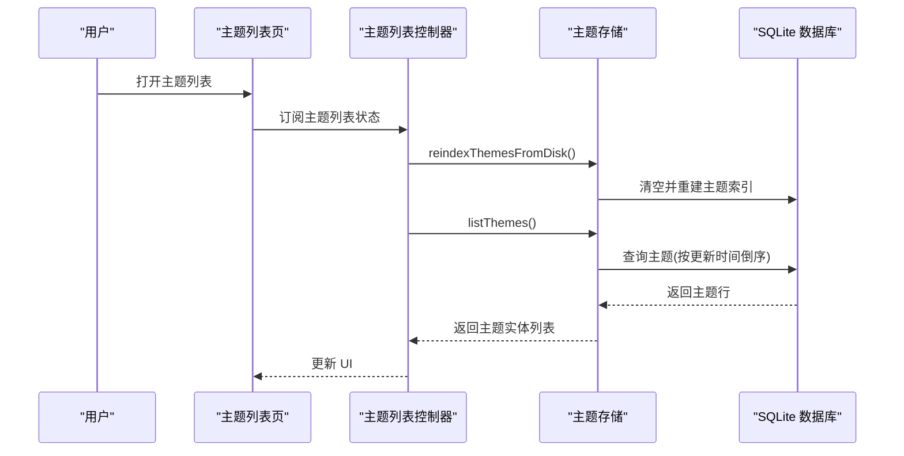
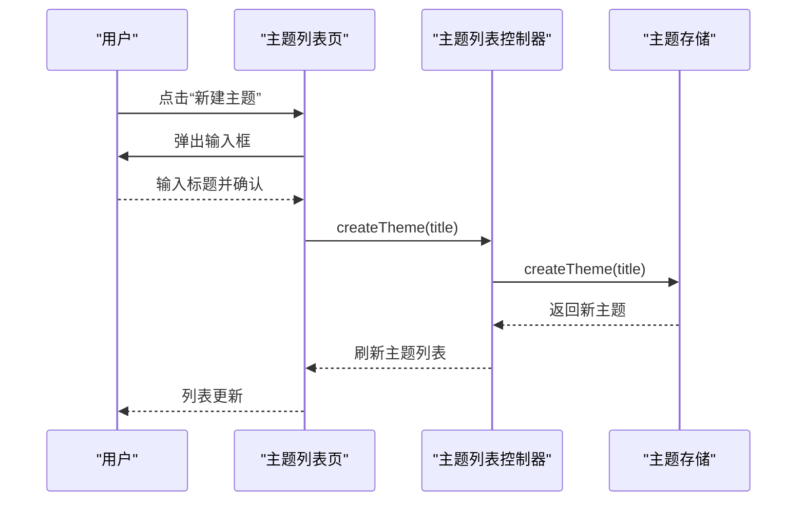
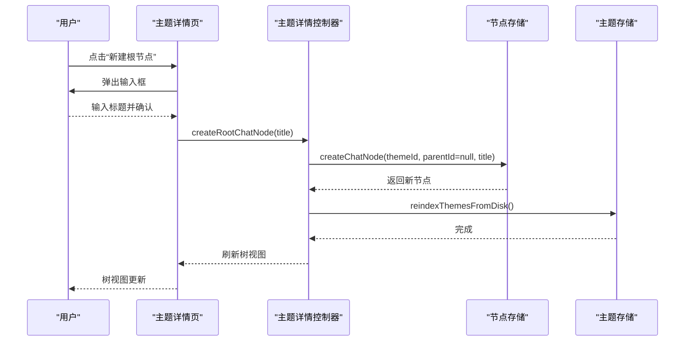
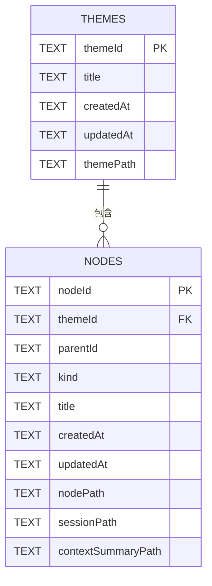
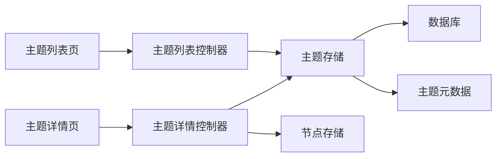

# 主题管理系统

<cite>
**本文引用的文件**
- [lib/main.dart](file://lib/main.dart)
- [lib/ui/core/router.dart](file://lib/ui/core/router.dart)
- [lib/ui/features/themes/theme_list_screen.dart](file://lib/ui/features/themes/theme_list_screen.dart)
- [lib/ui/features/themes/theme_list_controller.dart](file://lib/ui/features/themes/theme_list_controller.dart)
- [lib/ui/features/themes/theme_detail_screen.dart](file://lib/ui/features/themes/theme_detail_screen.dart)
- [lib/ui/features/themes/theme_detail_controller.dart](file://lib/ui/features/themes/theme_detail_controller.dart)
- [lib/domain/theme.dart](file://lib/domain/theme.dart)
- [lib/domain/node.dart](file://lib/domain/node.dart)
- [lib/data/models/theme_meta.dart](file://lib/data/models/theme_meta.dart)
- [lib/data/stores/theme_store.dart](file://lib/data/stores/theme_store.dart)
- [lib/data/services/app_database.dart](file://lib/data/services/app_database.dart)
</cite>

## 目录
1. [简介](#简介)
2. [项目结构](#项目结构)
3. [核心组件](#核心组件)
4. [架构总览](#架构总览)
5. [组件详解](#组件详解)
6. [依赖关系分析](#依赖关系分析)
7. [性能考量](#性能考量)
8. [故障排查指南](#故障排查指南)
9. [结论](#结论)
10. [附录：扩展与自定义](#附录扩展与自定义)

## 简介
本系统围绕“主题”构建，主题是树形知识组织的基本容器，每个主题拥有独立的元数据与节点树。系统采用 Riverpod 状态管理与 GoRouter 路由，结合本地 SQLite 数据库与磁盘文件夹进行持久化，支持主题列表、主题详情（树形视图）、节点增删与分支摘要生成等核心能力。

## 项目结构
- 应用入口与全局配置位于 lib/main.dart，负责初始化路径、日志、国际化与路由。
- UI 层按特性分层：ui/features/themes 提供主题列表与详情页面；ui/core/router 定义路由与底部导航。
- 领域模型位于 lib/domain，包含主题与节点的数据结构。
- 数据层位于 lib/data，包含模型序列化、数据库与存储服务；主题存储 ThemeStore 负责主题级 CRUD 与磁盘索引重建。
- 数据库结构在 lib/data/services/app_database.dart 中定义，包含 themes 与 nodes 表及索引。

图表来源
- [lib/main.dart:15-59](file://lib/main.dart#L15-L59)
- [lib/ui/core/router.dart:18-87](file://lib/ui/core/router.dart#L18-L87)
- [lib/ui/features/themes/theme_list_screen.dart:8-88](file://lib/ui/features/themes/theme_list_screen.dart#L8-L88)
- [lib/ui/features/themes/theme_detail_screen.dart:14-90](file://lib/ui/features/themes/theme_detail_screen.dart#L14-L90)
- [lib/ui/features/themes/theme_list_controller.dart:5-28](file://lib/ui/features/themes/theme_list_controller.dart#L5-L28)
- [lib/ui/features/themes/theme_detail_controller.dart:19-88](file://lib/ui/features/themes/theme_detail_controller.dart#L19-L88)
- [lib/domain/theme.dart:1-15](file://lib/domain/theme.dart#L1-L15)
- [lib/domain/node.dart:1-30](file://lib/domain/node.dart#L1-L30)
- [lib/data/models/theme_meta.dart:1-61](file://lib/data/models/theme_meta.dart#L1-L61)
- [lib/data/stores/theme_store.dart:11-157](file://lib/data/stores/theme_store.dart#L11-L157)
- [lib/data/services/app_database.dart:20-46](file://lib/data/services/app_database.dart#L20-L46)

章节来源
- [lib/main.dart:15-59](file://lib/main.dart#L15-L59)
- [lib/ui/core/router.dart:18-87](file://lib/ui/core/router.dart#L18-L87)

## 核心组件
- 主题实体与节点实体：定义主题与节点的字段与类型，确保跨层一致的数据契约。
- 主题元数据模型：负责主题元数据的 JSON 序列化/反序列化，兼容版本 schema。
- 主题存储：负责主题的创建、重索引、读取与磁盘元数据写入，保证数据库与磁盘一致性。
- 列表控制器：负责加载主题列表、触发重索引与创建主题。
- 详情控制器：负责加载主题详情、刷新、创建根/子节点、删除子树。
- 路由与屏幕：提供主题列表与详情的 UI 交互，以及节点详情与摘要生成的导航。

章节来源
- [lib/domain/theme.dart:1-15](file://lib/domain/theme.dart#L1-L15)
- [lib/domain/node.dart:1-30](file://lib/domain/node.dart#L1-L30)
- [lib/data/models/theme_meta.dart:1-61](file://lib/data/models/theme_meta.dart#L1-L61)
- [lib/data/stores/theme_store.dart:11-157](file://lib/data/stores/theme_store.dart#L11-L157)
- [lib/ui/features/themes/theme_list_controller.dart:5-28](file://lib/ui/features/themes/theme_list_controller.dart#L5-L28)
- [lib/ui/features/themes/theme_detail_controller.dart:19-88](file://lib/ui/features/themes/theme_detail_controller.dart#L19-L88)
- [lib/ui/core/router.dart:18-87](file://lib/ui/core/router.dart#L18-L87)

## 架构总览
系统采用“UI 层（屏幕+控制器）—领域模型—数据层（存储+数据库）”的分层设计。Riverpod 负责状态订阅与更新，GoRouter 负责页面导航与参数传递。主题与节点分别有独立的存储与模型，通过 themeId 关联。

图表来源
- [lib/ui/features/themes/theme_list_screen.dart:14-88](file://lib/ui/features/themes/theme_list_screen.dart#L14-L88)
- [lib/ui/features/themes/theme_list_controller.dart:7-11](file://lib/ui/features/themes/theme_list_controller.dart#L7-L11)
- [lib/data/stores/theme_store.dart:17-29](file://lib/data/stores/theme_store.dart#L17-L29)
- [lib/data/services/app_database.dart:20-46](file://lib/data/services/app_database.dart#L20-L46)

## 组件详解

### 主题概念、生命周期与管理机制
- 概念
  - 主题是知识树的顶层容器，包含唯一标识、标题与时间戳。
  - 主题在磁盘上以独立目录存在，并在数据库中维护索引。
- 生命周期
  - 创建：生成唯一 ID，创建主题目录，写入主题元数据文件，插入数据库。
  - 重索引：扫描主题目录，读取元数据，重建数据库索引。
  - 更新：重命名时更新元数据与数据库 updatedAt 字段。
  - 删除：通过节点存储删除子树，主题本身仍保留但可被重新索引清理。
- 管理机制
  - 列表控制器在首次加载时触发重索引，确保 UI 与磁盘一致。
  - 详情控制器在加载时先重索引主题，再加载节点树。

章节来源
- [lib/data/stores/theme_store.dart:31-80](file://lib/data/stores/theme_store.dart#L31-L80)
- [lib/data/stores/theme_store.dart:82-108](file://lib/data/stores/theme_store.dart#L82-L108)
- [lib/data/stores/theme_store.dart:110-139](file://lib/data/stores/theme_store.dart#L110-L139)
- [lib/ui/features/themes/theme_list_controller.dart:7-11](file://lib/ui/features/themes/theme_list_controller.dart#L7-L11)
- [lib/ui/features/themes/theme_detail_controller.dart:25-44](file://lib/ui/features/themes/theme_detail_controller.dart#L25-L44)

### 主题列表页面实现
- 功能
  - 展示主题列表（按更新时间倒序），支持创建新主题与手动重索引。
  - 点击进入主题详情树视图。
- 交互流程
  - 首次进入触发重索引，然后列出主题。
  - 新建主题弹出输入框，调用控制器创建后刷新列表。
  - 同步按钮触发重索引，避免磁盘变更未被数据库感知。

图表来源
- [lib/ui/features/themes/theme_list_screen.dart:77-86](file://lib/ui/features/themes/theme_list_screen.dart#L77-L86)
- [lib/ui/features/themes/theme_list_controller.dart:13-17](file://lib/ui/features/themes/theme_list_controller.dart#L13-L17)
- [lib/data/stores/theme_store.dart:31-80](file://lib/data/stores/theme_store.dart#L31-L80)

章节来源
- [lib/ui/features/themes/theme_list_screen.dart:8-88](file://lib/ui/features/themes/theme_list_screen.dart#L8-L88)
- [lib/ui/features/themes/theme_list_controller.dart:5-28](file://lib/ui/features/themes/theme_list_controller.dart#L5-L28)
- [lib/data/stores/theme_store.dart:17-80](file://lib/data/stores/theme_store.dart#L17-L80)

### 主题详情页面交互逻辑
- 功能
  - 展示主题树形结构，根节点按创建时间排序。
  - 支持创建根节点、展开节点详情、分支摘要生成、删除节点及其子树。
- 交互流程
  - 加载：重索引主题 → 获取主题信息 → 重索引节点 → 列出所有节点。
  - 刷新：重新执行上述步骤。
  - 创建根节点：弹出输入框，调用控制器创建后刷新。
  - 分支摘要：读取父会话内容，跳转到摘要对话页。
  - 删除节点：收集子树，确认后删除并提示数量。

图表来源
- [lib/ui/features/themes/theme_detail_screen.dart:74-84](file://lib/ui/features/themes/theme_detail_screen.dart#L74-L84)
- [lib/ui/features/themes/theme_detail_controller.dart:51-61](file://lib/ui/features/themes/theme_detail_controller.dart#L51-L61)
- [lib/data/stores/theme_store.dart:110-139](file://lib/data/stores/theme_store.dart#L110-L139)

章节来源
- [lib/ui/features/themes/theme_detail_screen.dart:14-90](file://lib/ui/features/themes/theme_detail_screen.dart#L14-L90)
- [lib/ui/features/themes/theme_detail_controller.dart:19-88](file://lib/ui/features/themes/theme_detail_controller.dart#L19-L88)

### 控制器设计模式与状态管理
- 设计模式
  - 列表控制器使用 AsyncNotifier 管理异步状态，首次构建时触发重索引并加载主题列表。
  - 详情控制器使用 AsyncNotifier<ThemeDetailState>，封装主题信息与节点集合，支持刷新、创建节点、删除子树。
- 状态管理
  - 使用 Riverpod 的 ProviderScope 注入全局依赖，屏幕通过 ref.watch/ref.read 订阅与驱动状态。
  - 控制器内部通过 ref.watch/ref.read 获取存储服务实例，保证状态与数据的一致性。

章节来源
- [lib/ui/features/themes/theme_list_controller.dart:5-28](file://lib/ui/features/themes/theme_list_controller.dart#L5-L28)
- [lib/ui/features/themes/theme_detail_controller.dart:19-88](file://lib/ui/features/themes/theme_detail_controller.dart#L19-L88)
- [lib/main.dart:49-58](file://lib/main.dart#L49-L58)

### 主题数据模型、存储机制与索引策略
- 数据模型
  - 主题实体：包含主题 ID、标题、创建与更新时间。
  - 节点实体：包含节点 ID、主题 ID、父节点 ID、类型（聊天/摘要）、标题、创建与更新时间。
  - 主题元数据：JSON 结构，包含 schema 版本与主题信息，用于磁盘持久化。
- 存储机制
  - 主题存储：创建主题时写入磁盘元数据文件与数据库记录；重索引时扫描主题目录重建索引。
  - 数据库：themes 表与 nodes 表，nodes 上建立复合索引以加速按主题与父节点查询。
- 索引策略
  - nodes 表的 idx_nodes_theme_parent 复合索引，优化树形查询与父子关系检索。

图表来源
- [lib/data/services/app_database.dart:20-46](file://lib/data/services/app_database.dart#L20-L46)
- [lib/domain/theme.dart:1-15](file://lib/domain/theme.dart#L1-L15)
- [lib/domain/node.dart:10-30](file://lib/domain/node.dart#L10-L30)

章节来源
- [lib/data/models/theme_meta.dart:1-61](file://lib/data/models/theme_meta.dart#L1-L61)
- [lib/data/stores/theme_store.dart:11-157](file://lib/data/stores/theme_store.dart#L11-L157)
- [lib/data/services/app_database.dart:20-46](file://lib/data/services/app_database.dart#L20-L46)

### 路由与导航
- 路由结构
  - 根路由：主题列表页。
  - 主题详情：/themes/:themeId/tree。
  - 节点详情：/themes/:themeId/nodes/:nodeId。
  - 分支摘要：/themes/:themeId/nodes/:parentNodeId/summary。
- 导航行为
  - 底部导航切换主题与笔记分支。
  - 主题详情页支持返回上级或首页。

章节来源
- [lib/ui/core/router.dart:18-87](file://lib/ui/core/router.dart#L18-L87)

## 依赖关系分析
- 组件耦合
  - 屏幕依赖控制器；控制器依赖存储；存储依赖数据库与文件系统。
  - 控制器之间低耦合，通过 Provider 解耦。
- 外部依赖
  - Riverpod：状态管理与依赖注入。
  - GoRouter：声明式路由与参数传递。
  - sqflite：本地数据库。
  - path：路径拼接。
- 潜在循环依赖
  - 当前结构无直接循环依赖，控制器仅单向依赖存储。

图表来源
- [lib/ui/features/themes/theme_list_screen.dart:8-88](file://lib/ui/features/themes/theme_list_screen.dart#L8-L88)
- [lib/ui/features/themes/theme_detail_screen.dart:14-90](file://lib/ui/features/themes/theme_detail_screen.dart#L14-L90)
- [lib/ui/features/themes/theme_list_controller.dart:5-28](file://lib/ui/features/themes/theme_list_controller.dart#L5-L28)
- [lib/ui/features/themes/theme_detail_controller.dart:19-88](file://lib/ui/features/themes/theme_detail_controller.dart#L19-L88)
- [lib/data/stores/theme_store.dart:11-157](file://lib/data/stores/theme_store.dart#L11-L157)
- [lib/data/models/theme_meta.dart:1-61](file://lib/data/models/theme_meta.dart#L1-L61)
- [lib/data/services/app_database.dart:20-46](file://lib/data/services/app_database.dart#L20-L46)

## 性能考量
- 查询优化
  - nodes 表的 idx_nodes_theme_parent 复合索引可显著提升树形查询性能。
- I/O 与原子写入
  - 主题元数据写入采用临时文件 + 原子重命名，避免部分写入导致的损坏。
- 磁盘扫描
  - 重索引遍历主题目录读取元数据，建议在后台任务中执行，避免阻塞 UI。
- 列表排序
  - 主题列表按 updatedAt 倒序，详情页根节点按 createdAt 正序，减少 UI 排序成本。

章节来源
- [lib/data/services/app_database.dart:45](file://lib/data/services/app_database.dart#L45)
- [lib/data/stores/theme_store.dart:151-157](file://lib/data/stores/theme_store.dart#L151-L157)
- [lib/ui/features/themes/theme_list_screen.dart:30-76](file://lib/ui/features/themes/theme_list_screen.dart#L30-L76)
- [lib/ui/features/themes/theme_detail_screen.dart:30-73](file://lib/ui/features/themes/theme_detail_screen.dart#L30-L73)

## 故障排查指南
- 主题未显示或为空
  - 检查是否已触发重索引；确认主题目录下是否存在 theme.meta.json。
- 创建主题失败
  - 检查磁盘权限与路径可用性；确认主题 ID 冲突处理逻辑。
- 删除节点后 UI 未更新
  - 确认控制器已刷新状态；检查删除子树返回值与提示。
- 路由跳转异常
  - 检查路由参数是否正确传入；确认主题 ID 与节点 ID 有效。

章节来源
- [lib/ui/features/themes/theme_list_controller.dart:19-23](file://lib/ui/features/themes/theme_list_controller.dart#L19-L23)
- [lib/ui/features/themes/theme_detail_controller.dart:46-49](file://lib/ui/features/themes/theme_detail_controller.dart#L46-L49)
- [lib/ui/core/router.dart:32-61](file://lib/ui/core/router.dart#L32-L61)

## 结论
该主题管理系统以清晰的分层架构、稳定的持久化策略与直观的 UI 交互实现了主题与节点的全生命周期管理。通过 Riverpod 与 GoRouter 的组合，系统具备良好的可维护性与扩展性。建议在后续迭代中进一步完善错误恢复、批量操作与离线同步能力。

## 附录：扩展与自定义
- 扩展主题功能
  - 添加主题标签/分类：在主题元数据中增加字段并在 UI 中展示。
  - 自定义排序：在列表控制器中调整 orderBy 条件。
- 自定义主题行为
  - 在主题存储中新增方法（如批量导入/导出），并通过控制器暴露给 UI。
  - 在详情控制器中添加更多节点操作（如移动、合并）。

章节来源
- [lib/ui/features/themes/theme_list_controller.dart:13-23](file://lib/ui/features/themes/theme_list_controller.dart#L13-L23)
- [lib/ui/features/themes/theme_detail_controller.dart:51-81](file://lib/ui/features/themes/theme_detail_controller.dart#L51-L81)
- [lib/data/stores/theme_store.dart:17-139](file://lib/data/stores/theme_store.dart#L17-L139)