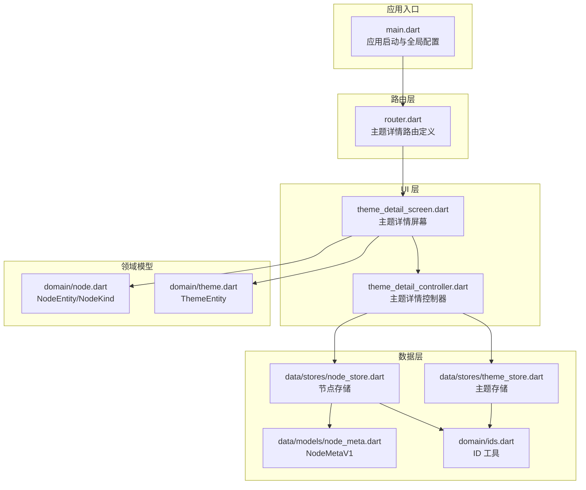
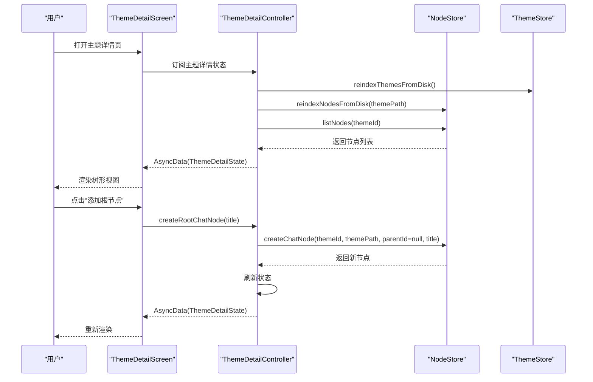
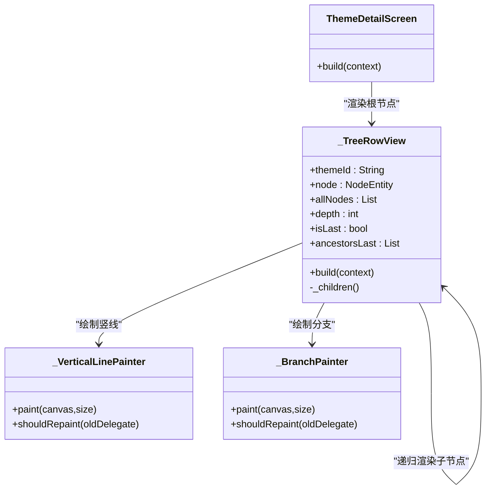
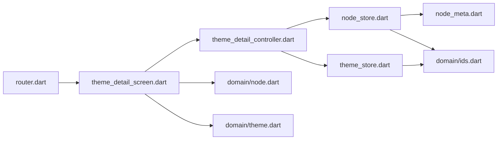

# 主题详情页面

<cite>
**本文档引用的文件**
- [lib/main.dart](file://lib/main.dart)
- [lib/ui/features/themes/theme_detail_screen.dart](file://lib/ui/features/themes/theme_detail_screen.dart)
- [lib/ui/features/themes/theme_detail_controller.dart](file://lib/ui/features/themes/theme_detail_controller.dart)
- [lib/ui/core/router.dart](file://lib/ui/core/router.dart)
- [lib/domain/node.dart](file://lib/domain/node.dart)
- [lib/domain/theme.dart](file://lib/domain/theme.dart)
- [lib/data/stores/node_store.dart](file://lib/data/stores/node_store.dart)
- [lib/data/stores/theme_store.dart](file://lib/data/stores/theme_store.dart)
- [lib/data/models/node_meta.dart](file://lib/data/models/node_meta.dart)
- [lib/domain/ids.dart](file://lib/domain/ids.dart)
</cite>

## 目录
1. [简介](#简介)
2. [项目结构](#项目结构)
3. [核心组件](#核心组件)
4. [架构总览](#架构总览)
5. [详细组件分析](#详细组件分析)
6. [依赖分析](#依赖分析)
7. [性能考虑](#性能考虑)
8. [故障排除指南](#故障排除指南)
9. [结论](#结论)
10. [附录](#附录)

## 简介
本文件面向“主题详情页面”的实现与使用，系统性阐述以下内容：
- 主题信息展示：主题标题、路径与节点列表加载
- 树形结构可视化：节点展开/折叠、层级显示、连接线绘制
- 操作面板：节点创建、删除、分支生成、跳转到节点详情
- 父子节点关系管理：层次结构与导航逻辑
- 实现参考：节点拖拽、右键菜单、键盘快捷键的可扩展点
- 渲染优化与大数据量最佳实践：针对树形UI的建议

## 项目结构
主题详情页面位于 UI 层的 themes 功能模块中，采用 Riverpod 状态管理与 go_router 路由集成，并通过 Store 抽象访问数据库与文件系统。

**图表来源**
- [lib/main.dart:15-59](file://lib/main.dart#L15-L59)
- [lib/ui/core/router.dart:18-87](file://lib/ui/core/router.dart#L18-L87)
- [lib/ui/features/themes/theme_detail_screen.dart:14-90](file://lib/ui/features/themes/theme_detail_screen.dart#L14-L90)
- [lib/ui/features/themes/theme_detail_controller.dart:19-87](file://lib/ui/features/themes/theme_detail_controller.dart#L19-L87)
- [lib/data/stores/node_store.dart:12-375](file://lib/data/stores/node_store.dart#L12-L375)
- [lib/data/stores/theme_store.dart:11-140](file://lib/data/stores/theme_store.dart#L11-L140)
- [lib/data/models/node_meta.dart:5-83](file://lib/data/models/node_meta.dart#L5-L83)
- [lib/domain/node.dart:10-30](file://lib/domain/node.dart#L10-L30)
- [lib/domain/theme.dart:1-15](file://lib/domain/theme.dart#L1-L15)
- [lib/domain/ids.dart:1-10](file://lib/domain/ids.dart#L1-L10)

**章节来源**
- [lib/main.dart:15-59](file://lib/main.dart#L15-L59)
- [lib/ui/core/router.dart:18-87](file://lib/ui/core/router.dart#L18-L87)

## 核心组件
- 主题详情屏幕（ThemeDetailScreen）：负责加载主题元数据与节点集合，渲染树形视图，提供创建根节点、刷新、返回等操作入口。
- 主题详情控制器（ThemeDetailController）：封装异步状态加载、刷新、创建根/子节点、删除子树等业务逻辑。
- 树形行视图（_TreeRowView）：递归渲染单个节点及其子树，绘制连接线与缩进，提供点击跳转、分支生成、删除等交互。
- 节点存储（NodeStore）：负责从磁盘扫描节点、写入数据库、创建节点目录与元数据、删除子树并重新索引。
- 主题存储（ThemeStore）：负责主题的创建、重命名与从磁盘重建索引。
- 领域模型：NodeEntity/NodeKind、ThemeEntity 定义了节点与主题的数据结构。

**章节来源**
- [lib/ui/features/themes/theme_detail_screen.dart:14-90](file://lib/ui/features/themes/theme_detail_screen.dart#L14-L90)
- [lib/ui/features/themes/theme_detail_controller.dart:19-87](file://lib/ui/features/themes/theme_detail_controller.dart#L19-L87)
- [lib/data/stores/node_store.dart:12-375](file://lib/data/stores/node_store.dart#L12-L375)
- [lib/data/stores/theme_store.dart:11-140](file://lib/data/stores/theme_store.dart#L11-L140)
- [lib/domain/node.dart:10-30](file://lib/domain/node.dart#L10-L30)
- [lib/domain/theme.dart:1-15](file://lib/domain/theme.dart#L1-L15)

## 架构总览
主题详情页面遵循“路由 -> 控制器 -> 存储 -> 数据模型”的分层设计，UI 通过 Riverpod 订阅异步状态，存储层负责与数据库和文件系统交互。

**图表来源**
- [lib/ui/features/themes/theme_detail_screen.dart:25-89](file://lib/ui/features/themes/theme_detail_screen.dart#L25-L89)
- [lib/ui/features/themes/theme_detail_controller.dart:29-44](file://lib/ui/features/themes/theme_detail_controller.dart#L29-L44)
- [lib/data/stores/node_store.dart:112-204](file://lib/data/stores/node_store.dart#L112-L204)
- [lib/data/stores/theme_store.dart:110-139](file://lib/data/stores/theme_store.dart#L110-L139)

## 详细组件分析

### 主题详情屏幕（ThemeDetailScreen）
- 加载与渲染
  - 通过 Riverpod 异步监听主题详情控制器，根据加载状态渲染加载中、错误或树形视图。
  - 根据节点的 parentId 过滤根节点，并按创建时间排序。
- 操作入口
  - 刷新按钮：触发控制器刷新。
  - 浮动按钮：弹出输入框，创建根节点。
  - 导航栏返回：支持返回上一页或首页。
- 树形视图
  - 使用 ListView 布局，每个根节点由 _TreeRowView 渲染。
  - 支持空树提示。

**章节来源**
- [lib/ui/features/themes/theme_detail_screen.dart:25-89](file://lib/ui/features/themes/theme_detail_screen.dart#L25-L89)

### 树形行视图（_TreeRowView）
- 结构与连接线
  - 通过深度 depth 与祖先链 ancestorsLast 控制缩进与垂直连线。
  - 使用 CustomPainter 绘制竖直线段与分支拐角线。
- 子节点渲染
  - 递归渲染子节点，深度+1，更新 isLast 与 ancestorsLast。
- 交互行为
  - 点击行：跳转到节点详情页。
  - 分支按钮：基于父会话文本生成分支摘要。
  - 删除按钮：收集子树节点，确认后删除并提示删除数量。

**图表来源**
- [lib/ui/features/themes/theme_detail_screen.dart:92-264](file://lib/ui/features/themes/theme_detail_screen.dart#L92-L264)
- [lib/ui/features/themes/theme_detail_screen.dart:266-305](file://lib/ui/features/themes/theme_detail_screen.dart#L266-L305)

**章节来源**
- [lib/ui/features/themes/theme_detail_screen.dart:92-264](file://lib/ui/features/themes/theme_detail_screen.dart#L92-L264)

### 主题详情控制器（ThemeDetailController）
- 负责加载主题元数据与节点列表，提供刷新、创建根节点、创建子节点、删除子树等方法。
- 通过 AsyncNotifier 提供异步状态，自动触发 UI 更新。

**章节来源**
- [lib/ui/features/themes/theme_detail_controller.dart:19-87](file://lib/ui/features/themes/theme_detail_controller.dart#L19-L87)

### 节点存储（NodeStore）
- 从磁盘扫描节点目录，解析 node.meta.json，写入数据库并维护父子关系。
- 创建节点时分配唯一 nodeId，写入目录与数据库；删除子树时递归删除目录与数据库记录，并重新索引。
- 提供 getNodeRow/getThemeRow 等查询接口，用于分支生成时读取会话文本。

**章节来源**
- [lib/data/stores/node_store.dart:18-59](file://lib/data/stores/node_store.dart#L18-L59)
- [lib/data/stores/node_store.dart:112-204](file://lib/data/stores/node_store.dart#L112-L204)
- [lib/data/stores/node_store.dart:206-257](file://lib/data/stores/node_store.dart#L206-L257)
- [lib/data/stores/node_store.dart:259-273](file://lib/data/stores/node_store.dart#L259-L273)

### 主题存储（ThemeStore）
- 从磁盘扫描主题目录，解析 theme.meta.json，写入数据库。
- 提供创建主题、重命名主题、重建主题索引等能力。

**章节来源**
- [lib/data/stores/theme_store.dart:17-29](file://lib/data/stores/theme_store.dart#L17-L29)
- [lib/data/stores/theme_store.dart:31-80](file://lib/data/stores/theme_store.dart#L31-L80)
- [lib/data/stores/theme_store.dart:110-139](file://lib/data/stores/theme_store.dart#L110-L139)

### 领域模型与 ID 工具
- NodeEntity/NodeKind：描述节点的标识、父子关系、类型与时间戳。
- ThemeEntity：描述主题的标识与时间戳。
- IDs：提供 ULID 生成工具，确保主题、节点、笔记等资源的唯一标识。

**章节来源**
- [lib/domain/node.dart:10-30](file://lib/domain/node.dart#L10-L30)
- [lib/domain/theme.dart:1-15](file://lib/domain/theme.dart#L1-L15)
- [lib/domain/ids.dart:1-10](file://lib/domain/ids.dart#L1-L10)

## 依赖分析
- UI 依赖控制器（Riverpod），控制器依赖存储层，存储层依赖领域模型与 ID 工具。
- 路由层将主题详情页与节点详情页串联，形成完整的导航链路。

**图表来源**
- [lib/ui/core/router.dart:18-87](file://lib/ui/core/router.dart#L18-L87)
- [lib/ui/features/themes/theme_detail_screen.dart:14-90](file://lib/ui/features/themes/theme_detail_screen.dart#L14-L90)
- [lib/ui/features/themes/theme_detail_controller.dart:19-87](file://lib/ui/features/themes/theme_detail_controller.dart#L19-L87)
- [lib/data/stores/node_store.dart:12-375](file://lib/data/stores/node_store.dart#L12-L375)
- [lib/data/stores/theme_store.dart:11-140](file://lib/data/stores/theme_store.dart#L11-L140)
- [lib/data/models/node_meta.dart:5-83](file://lib/data/models/node_meta.dart#L5-L83)
- [lib/domain/node.dart:10-30](file://lib/domain/node.dart#L10-L30)
- [lib/domain/theme.dart:1-15](file://lib/domain/theme.dart#L1-L15)
- [lib/domain/ids.dart:1-10](file://lib/domain/ids.dart#L1-L10)

**章节来源**
- [lib/ui/core/router.dart:18-87](file://lib/ui/core/router.dart#L18-L87)

## 性能考虑
- 渲染优化
  - 使用 ConsumerWidget 与 AsyncNotifier 的细粒度状态订阅，避免不必要的重建。
  - 树形渲染采用递归列布局，建议在节点较多时引入虚拟列表或分页加载。
- 数据加载
  - reindexNodesFromDisk 在创建/删除节点后执行，确保数据库与磁盘一致；可在批量操作时合并多次 reindex 调用。
- 大数据量处理
  - 对于超大规模树，建议：
    - 仅渲染可视区域内的节点，延迟加载非可视子树。
    - 将 children 查询改为分页或增量加载。
    - 缓存节点元数据，减少重复查询。
- I/O 与事务
  - 删除子树使用事务保证一致性，但涉及大量文件删除时应考虑后台任务与进度反馈。

[本节为通用指导，不直接分析具体文件，故无“章节来源”]

## 故障排除指南
- 节点未显示或为空树
  - 检查主题是否已重建索引，确认 NodeStore.reindexNodesFromDisk 是否成功执行。
  - 确认 node.meta.json 是否存在且格式正确。
- 删除失败或残留
  - 确认删除前已收集完整子树 ID，删除后是否调用 reindexNodesFromDisk。
  - 检查目录权限与磁盘空间。
- 分支生成异常
  - 确认父节点会话文件存在且可解析，分支参数传递正确。

**章节来源**
- [lib/data/stores/node_store.dart:18-59](file://lib/data/stores/node_store.dart#L18-L59)
- [lib/data/stores/node_store.dart:206-257](file://lib/data/stores/node_store.dart#L206-L257)
- [lib/data/models/node_meta.dart:39-68](file://lib/data/models/node_meta.dart#L39-L68)

## 结论
主题详情页面以清晰的分层架构实现了主题信息展示、树形可视化与节点操作。通过 Riverpod 的异步状态管理与 NodeStore 的磁盘/数据库同步，系统具备良好的可维护性与扩展性。对于更复杂的交互（如拖拽、右键菜单、快捷键），可在现有控制器与存储之上进行增强，同时结合虚拟化与批处理策略提升性能。

[本节为总结性内容，不直接分析具体文件，故无“章节来源”]

## 附录

### 树形结构可视化要点
- 展开/折叠
  - 当前实现为一次性渲染所有子节点；若需懒加载，可在子节点列表为空时触发加载。
- 层级显示
  - 通过 depth 与 ancestorsLast 控制缩进与竖线显示。
- 连接线绘制
  - 使用 _VerticalLinePainter 与 _BranchPainter 绘制竖线与分支拐角。

**章节来源**
- [lib/ui/features/themes/theme_detail_screen.dart:124-137](file://lib/ui/features/themes/theme_detail_screen.dart#L124-L137)
- [lib/ui/features/themes/theme_detail_screen.dart:266-305](file://lib/ui/features/themes/theme_detail_screen.dart#L266-L305)

### 操作面板与交互
- 节点创建
  - 根节点：FloatingActionButton 触发创建，调用控制器 createRootChatNode。
  - 子节点：可在节点详情页或通过扩展支持在树中直接创建。
- 删除
  - 删除前收集子树，确认后调用 deleteNodeSubtree 并刷新状态。
- 分支生成
  - 读取父会话文本，跳转到摘要页生成分支。

**章节来源**
- [lib/ui/features/themes/theme_detail_screen.dart:74-84](file://lib/ui/features/themes/theme_detail_screen.dart#L74-L84)
- [lib/ui/features/themes/theme_detail_screen.dart:165-202](file://lib/ui/features/themes/theme_detail_screen.dart#L165-L202)
- [lib/ui/features/themes/theme_detail_screen.dart:207-234](file://lib/ui/features/themes/theme_detail_screen.dart#L207-L234)
- [lib/ui/features/themes/theme_detail_controller.dart:51-81](file://lib/ui/features/themes/theme_detail_controller.dart#L51-L81)

### 右键菜单与键盘快捷键（可扩展点）
- 右键菜单
  - 可在 InkWell 上添加 onSecondaryTap 或使用 PopupMenuButton，在菜单中提供“新建子节点”、“重命名”、“删除”、“复制/粘贴”等选项。
- 键盘快捷键
  - 可通过 Shortcuts/LogicalKeyboardKey 监听常用快捷键（如回车进入详情、Delete 删除、N 新建等），并在控制器中映射到对应操作。

[本节为概念性扩展建议，不直接分析具体文件，故无“章节来源”]

### 代码示例路径（不展示具体代码）
- 主题详情屏幕与树形渲染
  - [主题详情屏幕构建:25-89](file://lib/ui/features/themes/theme_detail_screen.dart#L25-L89)
  - [树形行视图与连接线绘制:92-264](file://lib/ui/features/themes/theme_detail_screen.dart#L92-L264)
- 控制器与存储交互
  - [主题详情控制器加载与刷新:25-49](file://lib/ui/features/themes/theme_detail_controller.dart#L25-L49)
  - [创建根节点:51-61](file://lib/ui/features/themes/theme_detail_controller.dart#L51-L61)
  - [删除子树:76-81](file://lib/ui/features/themes/theme_detail_controller.dart#L76-L81)
  - [节点存储：创建节点:112-204](file://lib/data/stores/node_store.dart#L112-L204)
  - [节点存储：删除子树:206-257](file://lib/data/stores/node_store.dart#L206-L257)
- 路由与导航
  - [主题详情路由:32-47](file://lib/ui/core/router.dart#L32-L47)
  - [节点详情路由:48-59](file://lib/ui/core/router.dart#L48-L59)