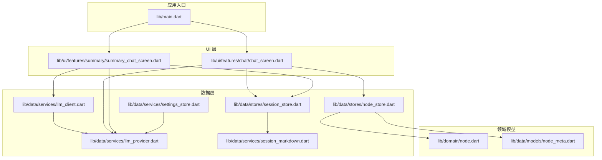
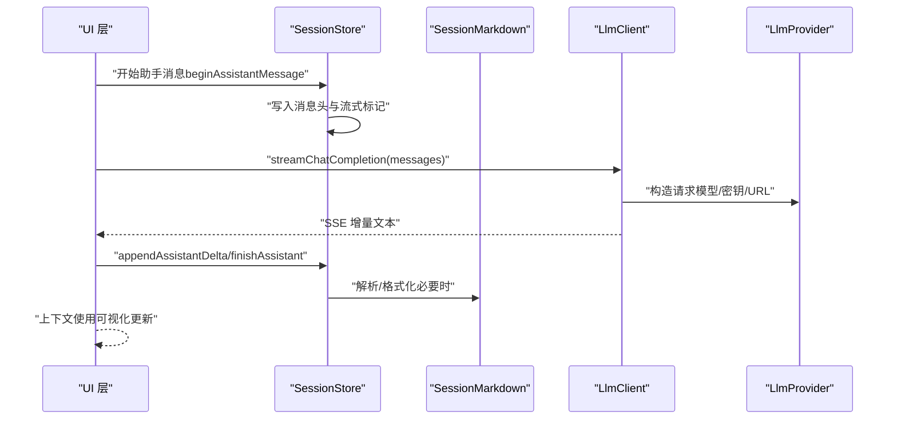
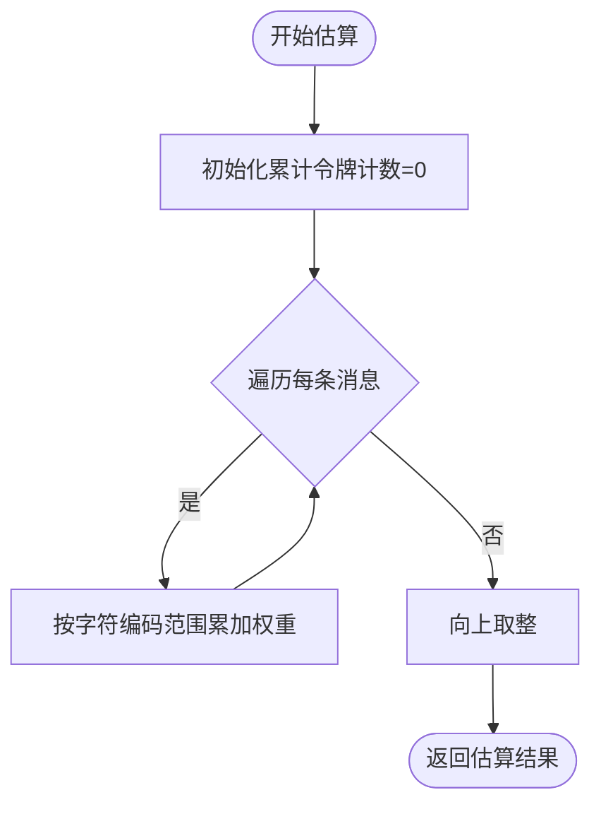
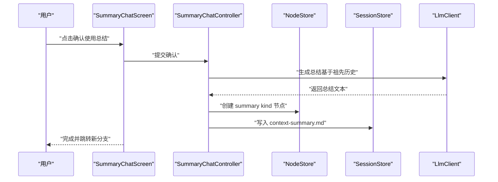
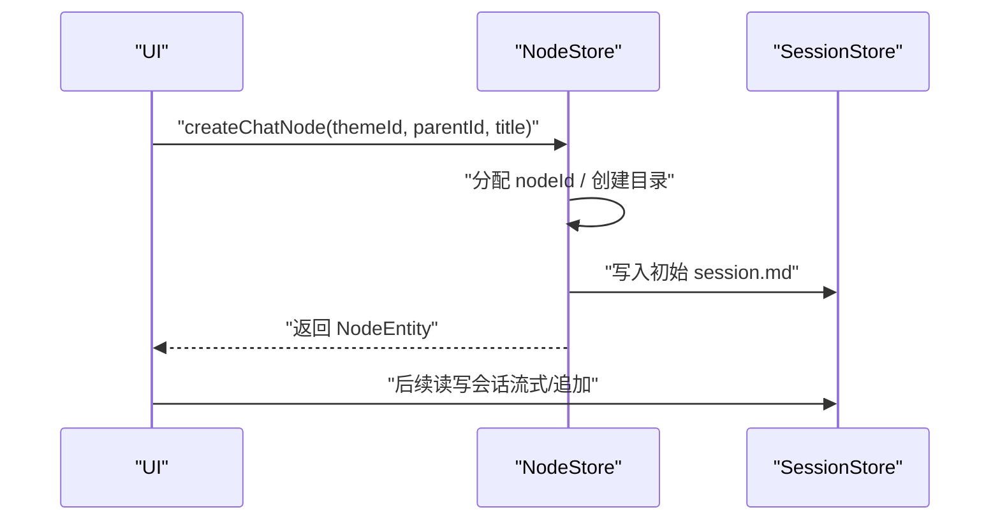
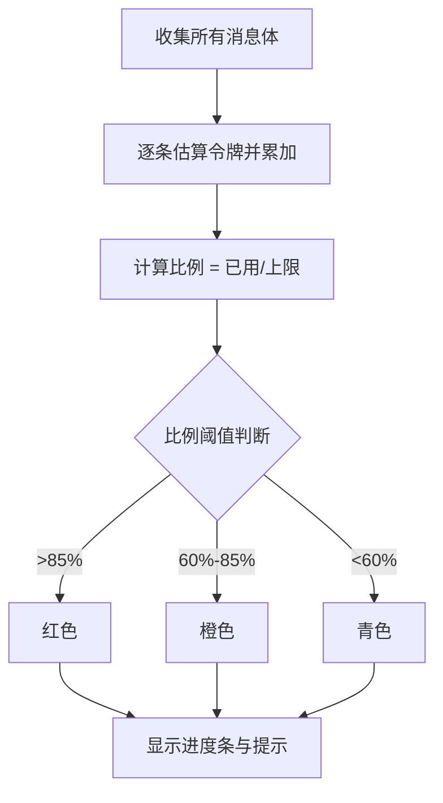
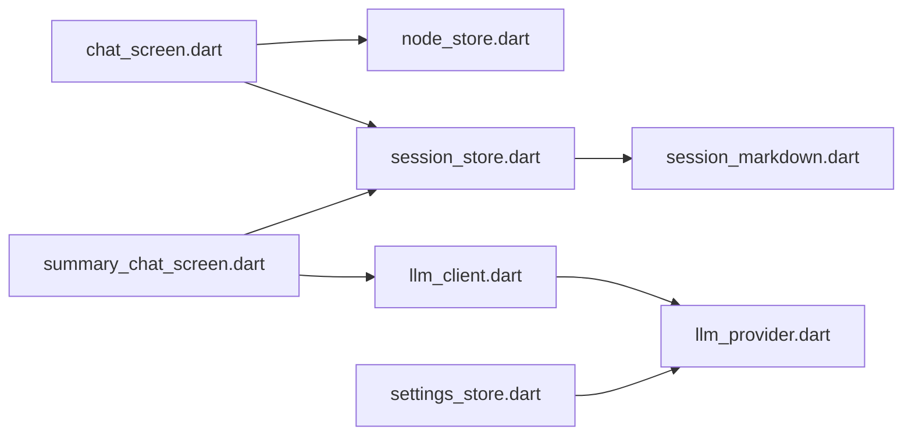

# 上下文管理系统

<cite>
**本文引用的文件**
- [lib/main.dart](file://lib/main.dart)
- [lib/data/services/llm_provider.dart](file://lib/data/services/llm_provider.dart)
- [lib/data/services/llm_client.dart](file://lib/data/services/llm_client.dart)
- [lib/data/services/session_markdown.dart](file://lib/data/services/session_markdown.dart)
- [lib/data/services/settings_store.dart](file://lib/data/services/settings_store.dart)
- [lib/data/stores/session_store.dart](file://lib/data/stores/session_store.dart)
- [lib/data/stores/node_store.dart](file://lib/data/stores/node_store.dart)
- [lib/domain/node.dart](file://lib/domain/node.dart)
- [lib/data/models/node_meta.dart](file://lib/data/models/node_meta.dart)
- [lib/ui/features/chat/chat_screen.dart](file://lib/ui/features/chat/chat_screen.dart)
- [lib/ui/features/summary/summary_chat_screen.dart](file://lib/ui/features/summary/summary_chat_screen.dart)
- [lib/ui/features/summary/summary_chat_controller.dart](file://lib/ui/features/summary/summary_chat_controller.dart)
- [docs/design.md](file://docs/design.md)
- [docs/branch-summary-flow.md](file://docs/branch-summary-flow.md)
- [REQUIREMENTS.md](file://REQUIREMENTS.md)
</cite>

## 目录
1. [简介](#简介)
2. [项目结构](#项目结构)
3. [核心组件](#核心组件)
4. [架构总览](#架构总览)
5. [详细组件分析](#详细组件分析)
6. [依赖分析](#依赖分析)
7. [性能考量](#性能考量)
8. [故障排查指南](#故障排查指南)
9. [结论](#结论)
10. [附录](#附录)

## 简介
本文件为 ThkTree 上下文管理系统的综合技术文档。系统围绕“节点树 + 会话 Markdown + LLM 推理”的模式构建，重点覆盖以下方面：
- 上下文窗口管理：令牌估算、上下文长度控制与内存优化策略
- 祖先总结功能：上下文压缩、重要信息保留与语义完整性保证
- 分支创建机制：新对话节点创建、上下文继承与独立会话管理
- 上下文使用可视化：进度条颜色编码、令牌估算算法与警告机制
- 总结生成流程：自动摘要、手动打磨与摘要质量评估
- 实战示例：如何调整上下文策略、自定义总结算法与优化内存使用

## 项目结构
ThkTree 采用按职责分层的模块化组织方式，核心目录与职责如下：
- domain：领域模型（Node、NodeKind、ID 生成等）
- data：数据访问层（NodeStore、SessionStore、LLM 客户端、设置存储）
- ui：界面层（聊天屏、总结屏、路由等）
- docs：设计与需求文档（设计说明、分支总结流程、存储格式）

图表来源
- [lib/main.dart:15-59](file://lib/main.dart#L15-L59)
- [lib/ui/features/chat/chat_screen.dart:177-219](file://lib/ui/features/chat/chat_screen.dart#L177-L219)
- [lib/ui/features/summary/summary_chat_screen.dart:234-276](file://lib/ui/features/summary/summary_chat_screen.dart#L234-L276)
- [lib/data/stores/node_store.dart:12-204](file://lib/data/stores/node_store.dart#L12-L204)
- [lib/data/stores/session_store.dart:8-169](file://lib/data/stores/session_store.dart#L8-L169)
- [lib/data/services/llm_client.dart:8-31](file://lib/data/services/llm_client.dart#L8-L31)
- [lib/data/services/llm_provider.dart:1-111](file://lib/data/services/llm_provider.dart#L1-L111)
- [lib/data/services/session_markdown.dart:49-61](file://lib/data/services/session_markdown.dart#L49-L61)
- [lib/data/services/settings_store.dart:106-184](file://lib/data/services/settings_store.dart#L106-L184)
- [lib/domain/node.dart:1-30](file://lib/domain/node.dart#L1-L30)
- [lib/data/models/node_meta.dart:5-83](file://lib/data/models/node_meta.dart#L5-L83)

章节来源
- [lib/main.dart:15-59](file://lib/main.dart#L15-L59)
- [docs/design.md:20-46](file://docs/design.md#L20-L46)

## 核心组件
- LLM 提供商与令牌估算
  - LlmProvider 定义了多家模型提供商的基础信息、默认模型、基础 URL、是否 OpenAI 兼容以及上下文窗口大小；提供令牌格式化工具函数。
  - estimateTokens 提供基于字符集的粗略令牌估算，用于上下文长度控制与可视化。
- 会话 Markdown 解析与格式化
  - SessionDocument/SessionMessage 定义消息结构；parseSessionMarkdown 将 session.md 解析为消息列表；formatMessageHeader/buildConversationTranscript 支持消息头格式化与对话转录。
- 会话存储与流式写入
  - SessionStore 负责读取/追加/结束流式消息，使用 FileWriteQueue 保证同一节点的原子写入；支持“流式”和“错误”标记。
- 节点存储与树管理
  - NodeStore 负责节点创建、删除、树重建与磁盘索引；支持父子关系与节点元数据持久化。
- UI 上下文使用可视化
  - 聊天屏与总结屏均内置上下文使用进度条，依据 estimateTokens 与 LlmProvider.contextWindowTokens 计算比例并按阈值着色。

章节来源
- [lib/data/services/llm_provider.dart:97-110](file://lib/data/services/llm_provider.dart#L97-L110)
- [lib/data/services/session_markdown.dart:49-61](file://lib/data/services/session_markdown.dart#L49-L61)
- [lib/data/stores/session_store.dart:17-169](file://lib/data/stores/session_store.dart#L17-L169)
- [lib/data/stores/node_store.dart:112-204](file://lib/data/stores/node_store.dart#L112-L204)
- [lib/ui/features/chat/chat_screen.dart:177-219](file://lib/ui/features/chat/chat_screen.dart#L177-L219)
- [lib/ui/features/summary/summary_chat_screen.dart:234-276](file://lib/ui/features/summary/summary_chat_screen.dart#L234-L276)

## 架构总览
系统围绕“节点树 + 会话 Markdown + LLM 推理”三要素协作：
- 节点树：NodeStore 管理节点关系与元数据，支撑分支创建与上下文继承。
- 会话存储：SessionStore 以 Markdown 文件为真相源，配合流式写入与状态标记，确保并发安全与 UI 一致性。
- LLM 推理：LlmClient 抽象不同提供商的流式接口，SessionStore/Summary 控制器驱动生成与写回。

图表来源
- [lib/data/stores/session_store.dart:84-131](file://lib/data/stores/session_store.dart#L84-L131)
- [lib/data/services/llm_client.dart:38-100](file://lib/data/services/llm_client.dart#L38-L100)
- [lib/data/services/llm_provider.dart:43-95](file://lib/data/services/llm_provider.dart#L43-L95)
- [lib/data/services/session_markdown.dart:49-61](file://lib/data/services/session_markdown.dart#L49-L61)

## 详细组件分析

### 上下文窗口管理与令牌估算
- 令牌估算算法
  - 基于字符编码范围的加权估算：ASCII、扩展拉丁、其他字符分别赋予不同权重，最终向上取整。
  - 估算结果用于 UI 进度条与上下文长度控制。
- 上下文长度控制
  - LlmProvider.contextWindowTokens 提供各模型的上下文窗口上限；UI 将实际使用量与上限比较，超过阈值（如 60%/85%）改变进度条颜色。
- 内存优化策略
  - 使用流式写入与增量拼接，避免一次性加载全部历史。
  - 通过“祖先总结”将长历史压缩为 approvedText，减少注入到 prompt 的上下文体积。

图表来源
- [lib/data/services/llm_provider.dart:97-110](file://lib/data/services/llm_provider.dart#L97-L110)

章节来源
- [lib/data/services/llm_provider.dart:73-95](file://lib/data/services/llm_provider.dart#L73-L95)
- [lib/ui/features/chat/chat_screen.dart:185-218](file://lib/ui/features/chat/chat_screen.dart#L185-L218)
- [lib/ui/features/summary/summary_chat_screen.dart:242-275](file://lib/ui/features/summary/summary_chat_screen.dart#L242-L275)

### 祖先总结功能与上下文压缩
- 总结生成流程
  - 读取祖先链上所有节点的 session.md，拼接为初始提示。
  - 调用 LLM 生成初稿总结，用户在 kind: summary 的辅助节点中多轮打磨。
  - 用户确认后，将 approvedText 写入目标节点的 context-summary.md，并标记 stale=false。
- 重要信息保留与语义完整性
  - 初始提示包含完整祖先正文，确保关键上下文不丢失。
  - UI 在祖先节点新增消息后标记 stale=true，提醒用户重新总结。
- 兜底策略
  - 若总结不足，允许从笔记插入补充内容，或从历史消息复制片段。

图表来源
- [lib/ui/features/summary/summary_chat_screen.dart:156-185](file://lib/ui/features/summary/summary_chat_screen.dart#L156-L185)
- [lib/ui/features/summary/summary_chat_controller.dart:96-120](file://lib/ui/features/summary/summary_chat_controller.dart#L96-L120)
- [lib/data/stores/node_store.dart:112-204](file://lib/data/stores/node_store.dart#L112-L204)
- [REQUIREMENTS.md:158-181](file://REQUIREMENTS.md#L158-L181)
- [docs/branch-summary-flow.md:13-33](file://docs/branch-summary-flow.md#L13-L33)

章节来源
- [lib/ui/features/summary/summary_chat_controller.dart:87-134](file://lib/ui/features/summary/summary_chat_controller.dart#L87-L134)
- [REQUIREMENTS.md:158-181](file://REQUIREMENTS.md#L158-L181)
- [docs/branch-summary-flow.md:1-52](file://docs/branch-summary-flow.md#L1-L52)

### 分支创建机制与上下文继承
- 新对话节点创建
  - NodeStore.createChatNode 生成唯一 nodeId，创建节点目录与 node.meta.json，初始化 session.md，写入 SQLite。
- 上下文继承
  - 新分支节点可选择性地注入已批准的祖先总结（context-summary.md）与本节点历史。
- 独立会话管理
  - 每个节点拥有独立的 session.md，支持流式写入、错误标记与重试。

图表来源
- [lib/data/stores/node_store.dart:112-204](file://lib/data/stores/node_store.dart#L112-L204)
- [lib/data/stores/session_store.dart:17-64](file://lib/data/stores/session_store.dart#L17-L64)

章节来源
- [lib/data/stores/node_store.dart:112-204](file://lib/data/stores/node_store.dart#L112-L204)
- [lib/data/models/node_meta.dart:5-83](file://lib/data/models/node_meta.dart#L5-L83)
- [lib/domain/node.dart:1-30](file://lib/domain/node.dart#L1-L30)

### 上下文使用可视化与警告机制
- 进度条颜色编码
  - 使用 estimateTokens 计算已用令牌，除以上下文窗口得到比例，超过 85% 显示红色，60%-85% 显示橙色，否则显示青色。
- 令牌估算算法
  - 基于字符集权重的估算，便于快速判断是否接近上限。
- 警告机制
  - 当祖先节点新增消息导致总结过期（stale=true），UI 提示用户重新总结，不强制阻断对话。

图表来源
- [lib/ui/features/chat/chat_screen.dart:185-218](file://lib/ui/features/chat/chat_screen.dart#L185-L218)
- [lib/ui/features/summary/summary_chat_screen.dart:242-275](file://lib/ui/features/summary/summary_chat_screen.dart#L242-L275)
- [lib/data/services/llm_provider.dart:73-95](file://lib/data/services/llm_provider.dart#L73-L95)
- [lib/data/services/llm_provider.dart:97-110](file://lib/data/services/llm_provider.dart#L97-L110)

章节来源
- [lib/ui/features/chat/chat_screen.dart:177-219](file://lib/ui/features/chat/chat_screen.dart#L177-L219)
- [lib/ui/features/summary/summary_chat_screen.dart:234-276](file://lib/ui/features/summary/summary_chat_screen.dart#L234-L276)

### 总结生成流程：自动摘要、手动摘要与质量评估
- 自动摘要
  - 基于祖先历史构建初始提示，调用 LLM 生成初稿；支持流式输出与中断。
- 手动摘要
  - 在 kind: summary 的专用节点中进行多轮打磨，直至满意。
- 质量评估
  - 通过“stale=false”与“approvedText”确保已确认的摘要具备稳定性；UI 提示过期状态，鼓励及时刷新。

章节来源
- [lib/ui/features/summary/summary_chat_controller.dart:96-120](file://lib/ui/features/summary/summary_chat_controller.dart#L96-L120)
- [REQUIREMENTS.md:158-181](file://REQUIREMENTS.md#L158-L181)

### 代码示例路径（不展示具体代码内容）
- 调整上下文策略
  - 修改 LlmProvider.contextWindowTokens 以适配不同模型窗口
  - 参考路径：[lib/data/services/llm_provider.dart:73-88](file://lib/data/services/llm_provider.dart#L73-L88)
- 自定义总结算法
  - 在 SummaryChatController 中调整初始提示模板与参数
  - 参考路径：[lib/ui/features/summary/summary_chat_controller.dart:96-120](file://lib/ui/features/summary/summary_chat_controller.dart#L96-L120)
- 优化内存使用
  - 使用流式写入与增量拼接，避免一次性加载全部历史
  - 参考路径：[lib/data/stores/session_store.dart:84-131](file://lib/data/stores/session_store.dart#L84-L131)
  - 使用 estimateTokens 控制上下文长度
  - 参考路径：[lib/data/services/llm_provider.dart:97-110](file://lib/data/services/llm_provider.dart#L97-L110)

## 依赖分析
- 组件耦合与职责
  - NodeStore 与 SessionStore 通过文件系统与 SQLite 协作，形成“真相源（Markdown）+ 关系索引（SQLite）”的双轨结构。
  - LlmClient 与 LlmProvider 解耦不同提供商的差异，统一流式接口。
  - UI 层通过 Provider/Controller 调用数据层，保持关注点分离。
- 外部依赖与集成点
  - LLM 提供商的 HTTP/SSE 接口由 LlmClient 统一封装。
  - 设置存储负责密钥与模型配置的安全读写。

图表来源
- [lib/ui/features/chat/chat_screen.dart:177-219](file://lib/ui/features/chat/chat_screen.dart#L177-L219)
- [lib/ui/features/summary/summary_chat_screen.dart:234-276](file://lib/ui/features/summary/summary_chat_screen.dart#L234-L276)
- [lib/data/stores/node_store.dart:12-204](file://lib/data/stores/node_store.dart#L12-L204)
- [lib/data/stores/session_store.dart:8-169](file://lib/data/stores/session_store.dart#L8-L169)
- [lib/data/services/llm_client.dart:8-31](file://lib/data/services/llm_client.dart#L8-L31)
- [lib/data/services/llm_provider.dart:1-111](file://lib/data/services/llm_provider.dart#L1-L111)
- [lib/data/services/settings_store.dart:106-184](file://lib/data/services/settings_store.dart#L106-L184)
- [lib/data/services/session_markdown.dart:49-61](file://lib/data/services/session_markdown.dart#L49-L61)

章节来源
- [docs/design.md:20-46](file://docs/design.md#L20-L46)

## 性能考量
- 令牌估算复杂度
  - estimateTokens 对字符串线性扫描，时间复杂度 O(n)，空间复杂度 O(1)，适合实时 UI 更新。
- 流式写入与并发控制
  - FileWriteQueue 保证同一节点的写入串行化，避免竞态与部分写入。
- 上下文长度控制
  - 建议在生成前对祖先历史进行分段裁剪或摘要抽取，结合 estimateTokens 动态调整注入长度。
- 缓存与索引
  - SQLite 索引与 reindex 机制确保节点查询高效；磁盘扫描与重建在必要时执行。

## 故障排查指南
- 会话流式写入异常
  - 检查流式标记是否存在与正确移除；确认文件原子写入是否成功。
  - 参考路径：[lib/data/stores/session_store.dart:17-82](file://lib/data/stores/session_store.dart#L17-L82)
- 节点创建失败
  - 核查 nodeId 是否重复、目录是否创建成功、数据库插入是否冲突。
  - 参考路径：[lib/data/stores/node_store.dart:112-204](file://lib/data/stores/node_store.dart#L112-L204)
- LLM 请求错误
  - 校验 API Key、模型名称与提供商 URL；检查网络与取消令牌。
  - 参考路径：[lib/data/services/llm_client.dart:38-100](file://lib/data/services/llm_client.dart#L38-L100)
- 上下文超限警告
  - 降低注入的历史长度或改用更长上下文窗口的模型；必要时启用祖先总结。
  - 参考路径：[lib/data/services/llm_provider.dart:73-95](file://lib/data/services/llm_provider.dart#L73-L95)

章节来源
- [lib/data/stores/session_store.dart:17-82](file://lib/data/stores/session_store.dart#L17-L82)
- [lib/data/stores/node_store.dart:112-204](file://lib/data/stores/node_store.dart#L112-L204)
- [lib/data/services/llm_client.dart:38-100](file://lib/data/services/llm_client.dart#L38-L100)
- [lib/data/services/llm_provider.dart:73-95](file://lib/data/services/llm_provider.dart#L73-L95)

## 结论
ThkTree 的上下文管理系统通过“节点树 + 会话 Markdown + LLM 推理”的组合，实现了：
- 可视化的上下文使用监控与阈值预警
- 基于祖先总结的上下文压缩与语义完整性保障
- 分支创建与上下文继承的灵活机制
- 流式写入与并发安全的存储方案

对于初学者，建议从理解节点树与会话 Markdown 的关系入手；对于高级开发者，可从令牌估算策略、流式写入优化与总结算法定制三个方向深入调优。

## 附录
- 相关文档
  - 设计说明：[docs/design.md](file://docs/design.md)
  - 分支总结流程：[docs/branch-summary-flow.md](file://docs/branch-summary-flow.md)
  - 需求与范围：[REQUIREMENTS.md](file://REQUIREMENTS.md)