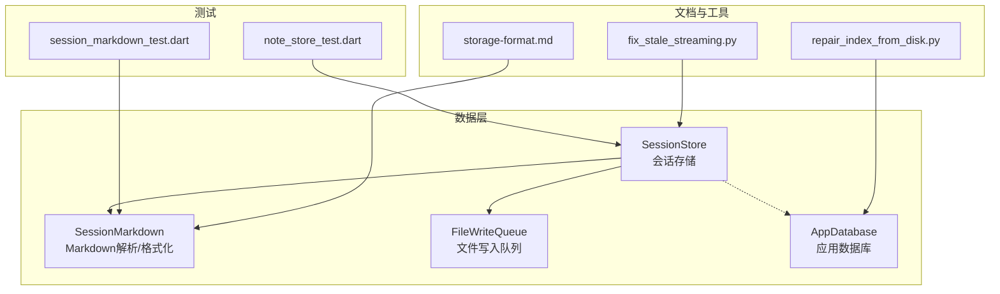
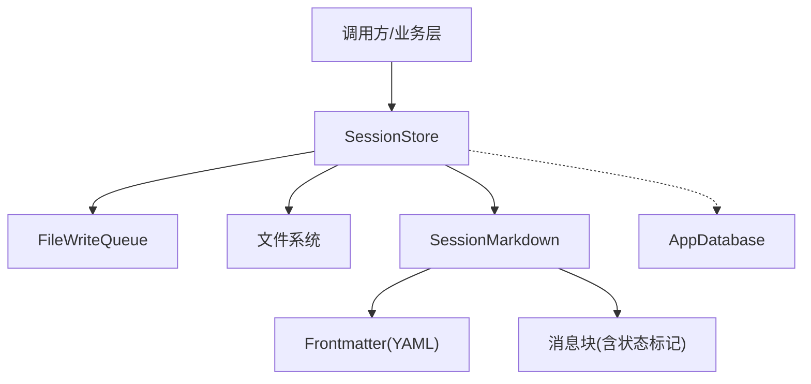
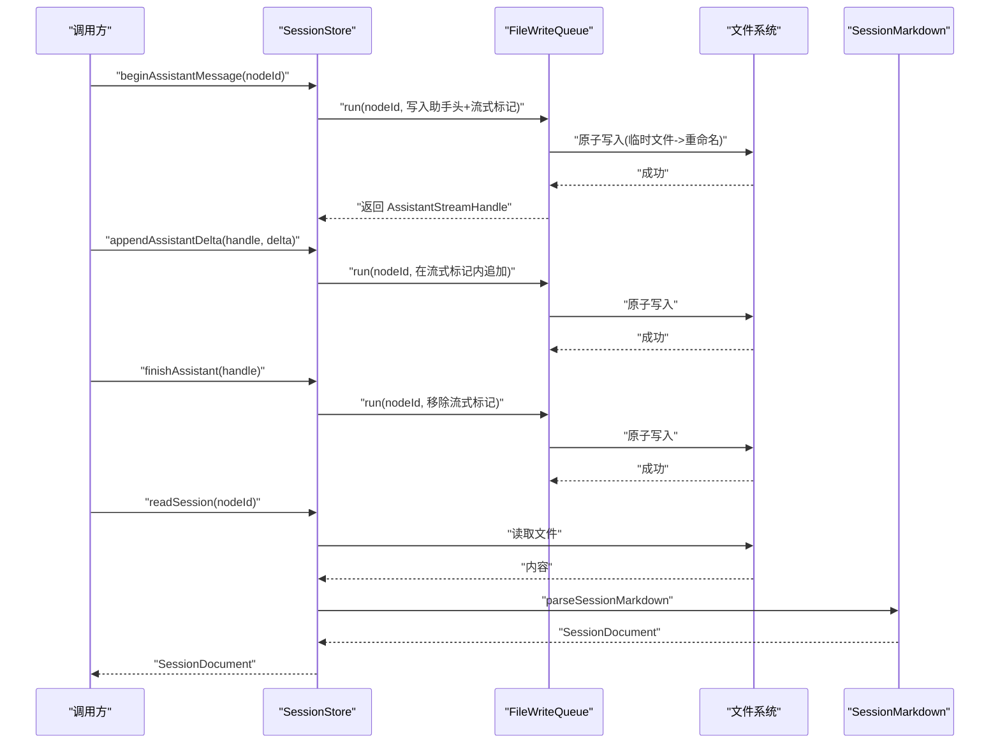
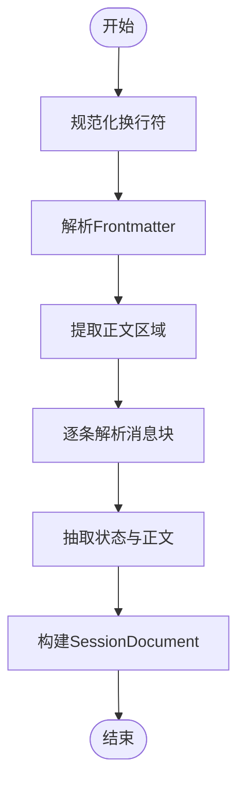
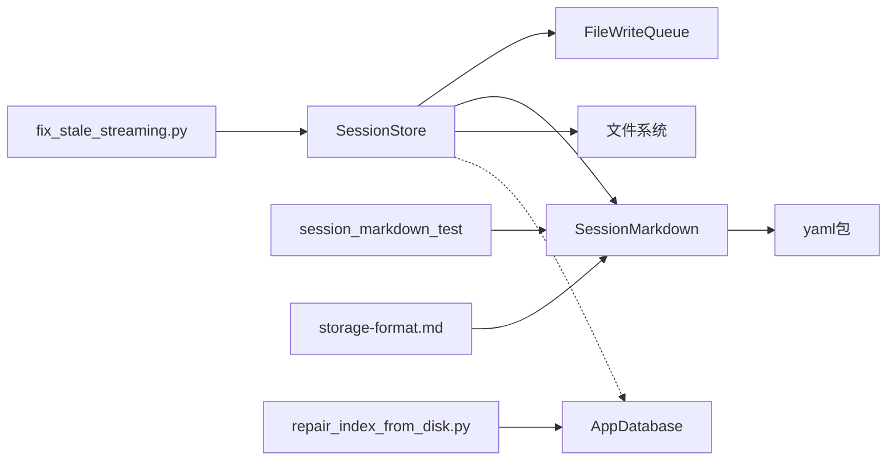

# 会话存储系统

<cite>
**本文引用的文件**
- [session_store.dart](file://lib/data/stores/session_store.dart)
- [session_markdown.dart](file://lib/data/services/session_markdown.dart)
- [file_write_queue.dart](file://lib/data/services/file_write_queue.dart)
- [app_database.dart](file://lib/data/services/app_database.dart)
- [session_markdown_test.dart](file://test/data/services/session_markdown_test.dart)
- [note_store_test.dart](file://test/data/stores/note_store_test.dart)
- [storage-format.md](file://docs/storage-format.md)
- [fix_stale_streaming.py](file://tools/fix_stale_streaming.py)
- [repair_index_from_disk.py](file://tools/repair_index_from_disk.py)
</cite>

## 目录
1. [简介](#简介)
2. [项目结构](#项目结构)
3. [核心组件](#核心组件)
4. [架构总览](#架构总览)
5. [详细组件分析](#详细组件分析)
6. [依赖关系分析](#依赖关系分析)
7. [性能考量](#性能考量)
8. [故障排查指南](#故障排查指南)
9. [结论](#结论)
10. [附录](#附录)

## 简介
本文件面向会话存储系统，系统以 Markdown 作为会话文件格式，采用原子写入与队列化并发控制保障一致性；通过解析器将 Markdown 转换为结构化的会话文档对象，支持用户、助手、系统三类角色的消息；提供流式会话的增量写入、断点续传与错误恢复能力；并通过数据库服务维护索引与元数据。本文档从架构、数据模型、读写流程、索引与备份修复工具等维度进行系统化说明，并给出扩展与优化建议。

## 项目结构
- 数据层核心文件位于 lib/data 下：
  - stores：会话与节点等存储实现
  - services：会话 Markdown 解析、文件写入队列、应用数据库等服务
- 测试位于 test/data 下，覆盖会话 Markdown 解析与笔记存储等场景
- 文档位于 docs 下，包含存储格式规范
- 工具位于 tools 下，提供修复过时流式状态与从磁盘修复索引的脚本

图表来源
- [session_store.dart:1-205](file://lib/data/stores/session_store.dart#L1-L205)
- [session_markdown.dart:1-223](file://lib/data/services/session_markdown.dart#L1-L223)
- [file_write_queue.dart](file://lib/data/services/file_write_queue.dart)
- [app_database.dart](file://lib/data/services/app_database.dart)
- [session_markdown_test.dart](file://test/data/services/session_markdown_test.dart)
- [note_store_test.dart](file://test/data/stores/note_store_test.dart)
- [storage-format.md](file://docs/storage-format.md)
- [fix_stale_streaming.py](file://tools/fix_stale_streaming.py)
- [repair_index_from_disk.py](file://tools/repair_index_from_disk.py)

章节来源
- [session_store.dart:1-205](file://lib/data/stores/session_store.dart#L1-L205)
- [session_markdown.dart:1-223](file://lib/data/services/session_markdown.dart#L1-L223)
- [storage-format.md](file://docs/storage-format.md)

## 核心组件
- SessionStore：会话文件的读取、追加消息、开始/追加/结束助手消息（流式）、失败标记与原子写入封装
- SessionMarkdown：Markdown 会话格式解析与格式化，定义消息头、状态与消息体抽取逻辑
- FileWriteQueue：按节点串行化文件写入，避免并发写冲突
- AppDatabase：应用数据库服务（索引与元数据管理）
- 工具：修复过时流式状态、从磁盘修复索引

章节来源
- [session_store.dart:8-205](file://lib/data/stores/session_store.dart#L8-L205)
- [session_markdown.dart:4-223](file://lib/data/services/session_markdown.dart#L4-L223)
- [file_write_queue.dart](file://lib/data/services/file_write_queue.dart)
- [app_database.dart](file://lib/data/services/app_database.dart)

## 架构总览
会话存储系统围绕“文件 + 解析器 + 队列 + 数据库”的组合展开：
- 文件系统：每个节点对应一个会话文件，使用原子写入保证一致性
- 解析器：负责 frontmatter 与消息块的双向转换
- 并发控制：通过写入队列确保同一节点的写入串行化
- 数据库：维护索引与元数据，支持检索与修复

图表来源
- [session_store.dart:8-205](file://lib/data/stores/session_store.dart#L8-L205)
- [session_markdown.dart:49-61](file://lib/data/services/session_markdown.dart#L49-L61)
- [file_write_queue.dart](file://lib/data/services/file_write_queue.dart)
- [app_database.dart](file://lib/data/services/app_database.dart)

## 详细组件分析

### SessionStore：会话文件读写与流式处理
- 读取：根据节点 ID 获取文件路径，若不存在返回空会话文档；存在则读取全文并解析为结构化对象
- 追加消息：用户/助手消息分别追加，自动格式化消息头并进行原子写入
- 流式助手消息：
  - 开始：在文件末尾写入助手消息头与流式标记
  - 追加：在流式标记内增量写入，保持流式状态
  - 结束：移除流式标记，落盘完成
  - 失败：在流式标记内写入错误标记，便于后续修复
- 原子写入：先写临时文件，再重命名替换，避免部分写入
- 并发控制：同一节点串行执行写入任务，避免竞态

图表来源
- [session_store.dart:84-131](file://lib/data/stores/session_store.dart#L84-L131)
- [session_store.dart:199-204](file://lib/data/stores/session_store.dart#L199-L204)
- [session_markdown.dart:49-61](file://lib/data/services/session_markdown.dart#L49-L61)

章节来源
- [session_store.dart:17-40](file://lib/data/stores/session_store.dart#L17-L40)
- [session_store.dart:42-64](file://lib/data/stores/session_store.dart#L42-L64)
- [session_store.dart:66-82](file://lib/data/stores/session_store.dart#L66-L82)
- [session_store.dart:84-98](file://lib/data/stores/session_store.dart#L84-L98)
- [session_store.dart:100-131](file://lib/data/stores/session_store.dart#L100-L131)
- [session_store.dart:199-204](file://lib/data/stores/session_store.dart#L199-L204)

### SessionMarkdown：Markdown 会话格式规范与解析
- 消息头格式：由角色、UTC 时间戳、消息 ID 组成的二级标题
- Frontmatter：使用 YAML 片段包裹，解析为键值映射
- 消息体状态：
  - 结束：默认状态
  - 流式：消息体末尾有流式标记
  - 错误：消息体末尾有错误标记，包含错误码
- 转录生成：将消息体按角色转录为纯文本对话

图表来源
- [session_markdown.dart:49-61](file://lib/data/services/session_markdown.dart#L49-L61)
- [session_markdown.dart:63-88](file://lib/data/services/session_markdown.dart#L63-L88)
- [session_markdown.dart:106-157](file://lib/data/services/session_markdown.dart#L106-L157)
- [session_markdown.dart:159-184](file://lib/data/services/session_markdown.dart#L159-L184)

章节来源
- [session_markdown.dart:4-42](file://lib/data/services/session_markdown.dart#L4-L42)
- [session_markdown.dart:44-47](file://lib/data/services/session_markdown.dart#L44-L47)
- [session_markdown.dart:49-61](file://lib/data/services/session_markdown.dart#L49-L61)
- [session_markdown.dart:106-184](file://lib/data/services/session_markdown.dart#L106-L184)
- [session_markdown_test.dart](file://test/data/services/session_markdown_test.dart)

### 文件系统与原子写入
- 原子写入策略：先写临时文件，再重命名替换原文件，避免部分写入与并发读到不一致内容
- 临时文件命名：在原文件名后追加临时后缀
- 适用范围：所有需要落盘的写入操作均通过该策略保证一致性

章节来源
- [session_store.dart:199-204](file://lib/data/stores/session_store.dart#L199-L204)

### 并发控制与队列
- FileWriteQueue：按节点 ID 将写入任务排队，确保同一节点写入串行化
- 作用：避免多线程或多协程同时写入同一文件导致的数据竞争与损坏

章节来源
- [session_store.dart:13](file://lib/data/stores/session_store.dart#L13)
- [file_write_queue.dart](file://lib/data/services/file_write_queue.dart)

### 数据库与索引（AppDatabase）
- 索引职责：维护会话元数据与搜索索引，支持快速检索与统计
- 元数据：可能包含节点 ID、会话摘要、时间戳、状态等
- 修复工具：提供从磁盘重建索引的脚本，用于修复索引异常

章节来源
- [app_database.dart](file://lib/data/services/app_database.dart)
- [repair_index_from_disk.py](file://tools/repair_index_from_disk.py)

### 存储格式规范（Markdown）
- Frontmatter：使用 YAML 片段，解析为键值映射
- 消息块：以二级标题标识角色、时间戳、消息 ID；正文为自由文本
- 状态标记：
  - 流式：消息体末尾的流式标记
  - 错误：消息体末尾的错误标记，包含错误码
- 转录：按角色输出对话文本

章节来源
- [storage-format.md](file://docs/storage-format.md)
- [session_markdown.dart:44-47](file://lib/data/services/session_markdown.dart#L44-L47)
- [session_markdown.dart:159-184](file://lib/data/services/session_markdown.dart#L159-L184)

## 依赖关系分析
- SessionStore 依赖：
  - FileWriteQueue：保证写入顺序
  - SessionMarkdown：解析与格式化
  - 文件系统：读写文件
  - AppDatabase：索引与元数据（间接）
- SessionMarkdown 依赖：
  - yaml 包：解析 YAML frontmatter
- 测试与文档：
  - 单元测试验证解析行为
  - 文档定义格式规范
  - 工具脚本辅助修复

图表来源
- [session_store.dart:8-205](file://lib/data/stores/session_store.dart#L8-L205)
- [session_markdown.dart:1-2](file://lib/data/services/session_markdown.dart#L1-L2)
- [session_markdown_test.dart](file://test/data/services/session_markdown_test.dart)
- [storage-format.md](file://docs/storage-format.md)
- [fix_stale_streaming.py](file://tools/fix_stale_streaming.py)
- [repair_index_from_disk.py](file://tools/repair_index_from_disk.py)

章节来源
- [session_store.dart:8-205](file://lib/data/stores/session_store.dart#L8-L205)
- [session_markdown.dart:1-223](file://lib/data/services/session_markdown.dart#L1-L223)

## 性能考量
- 原子写入成本：每次写入涉及两次系统调用（写临时文件 + 重命名），适合小到中等规模增量写入
- 并发控制：FileWriteQueue 串行化同一节点写入，避免锁竞争，但可能成为热点瓶颈
- 解析复杂度：解析器线性扫描正文，时间复杂度 O(n)，空间复杂度 O(n)
- 建议：
  - 对于高并发节点，可考虑分片或拆分文件
  - 批量写入时合并多次增量写入，减少临时文件数量
  - 对大文件采用懒加载与分页读取策略

## 故障排查指南
- 流式会话未完成：
  - 现象：文件末尾残留流式标记
  - 处理：使用修复脚本清理过时流式状态
- 索引异常：
  - 现象：检索不到或统计不准确
  - 处理：使用从磁盘修复索引脚本重建索引
- 文件损坏或部分写入：
  - 现象：读取失败或解析异常
  - 处理：检查临时文件是否遗留；确认原子写入是否成功；必要时回滚至上一版本

章节来源
- [fix_stale_streaming.py](file://tools/fix_stale_streaming.py)
- [repair_index_from_disk.py](file://tools/repair_index_from_disk.py)

## 结论
会话存储系统以简洁可靠的 Markdown 格式为核心，结合原子写入与队列化并发控制，实现了对会话文件的稳定读写与流式处理。解析器提供清晰的 frontmatter 与消息块语义，数据库服务支撑索引与元数据管理。通过工具链可有效修复流式状态与索引问题。对于扩展与优化，可在保持现有格式与一致性前提下，引入更高效的索引策略与批量写入机制。

## 附录

### 会话文件读写操作清单
- 创建：首次写入时自动创建文件
- 更新：追加消息、流式增量写入、结束/失败标记
- 删除：删除对应节点的会话文件
- 备份：建议在写入前复制原文件为备份

章节来源
- [session_store.dart:17-40](file://lib/data/stores/session_store.dart#L17-L40)
- [session_store.dart:150-168](file://lib/data/stores/session_store.dart#L150-L168)
- [session_store.dart:199-204](file://lib/data/stores/session_store.dart#L199-L204)

### 扩展与自定义指南
- 扩展存储功能：
  - 新增文件格式：在解析器侧增加新格式的解析/格式化函数，并在读写入口处选择性调用
  - 参考路径：[session_markdown.dart:49-61](file://lib/data/services/session_markdown.dart#L49-L61)
- 添加新的文件格式支持：
  - 在解析器中新增格式识别与转换逻辑，保持与现有消息模型兼容
  - 参考路径：[session_markdown.dart:106-157](file://lib/data/services/session_markdown.dart#L106-L157)
- 自定义索引策略：
  - 在数据库服务中扩展索引字段与查询接口，结合工具脚本进行重建
  - 参考路径：[app_database.dart](file://lib/data/services/app_database.dart)