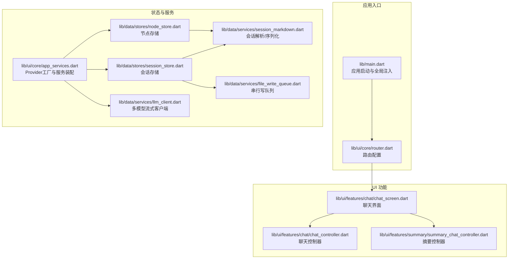
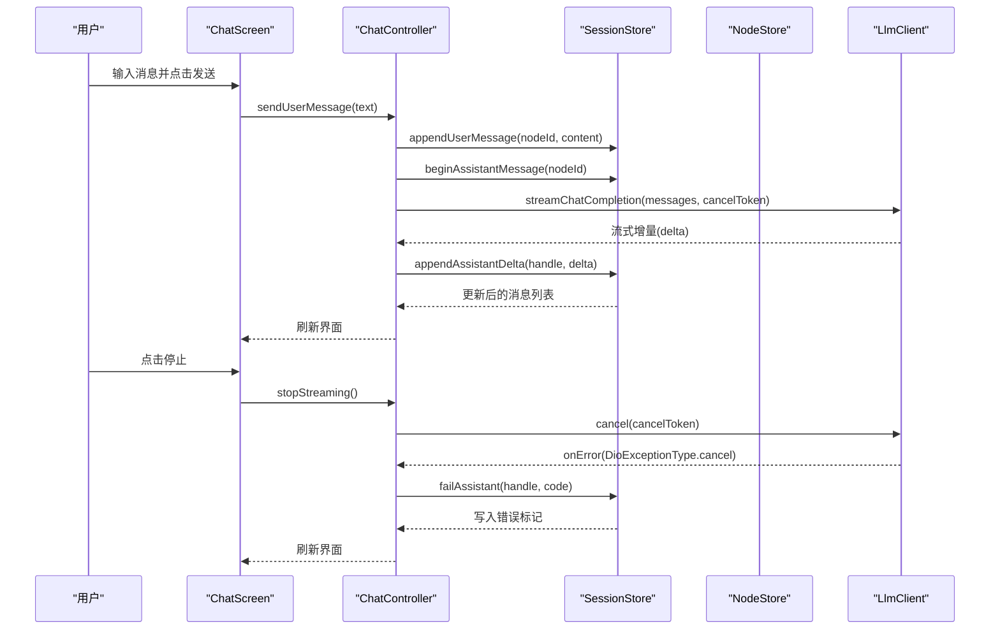
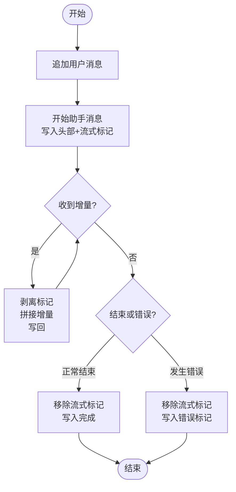
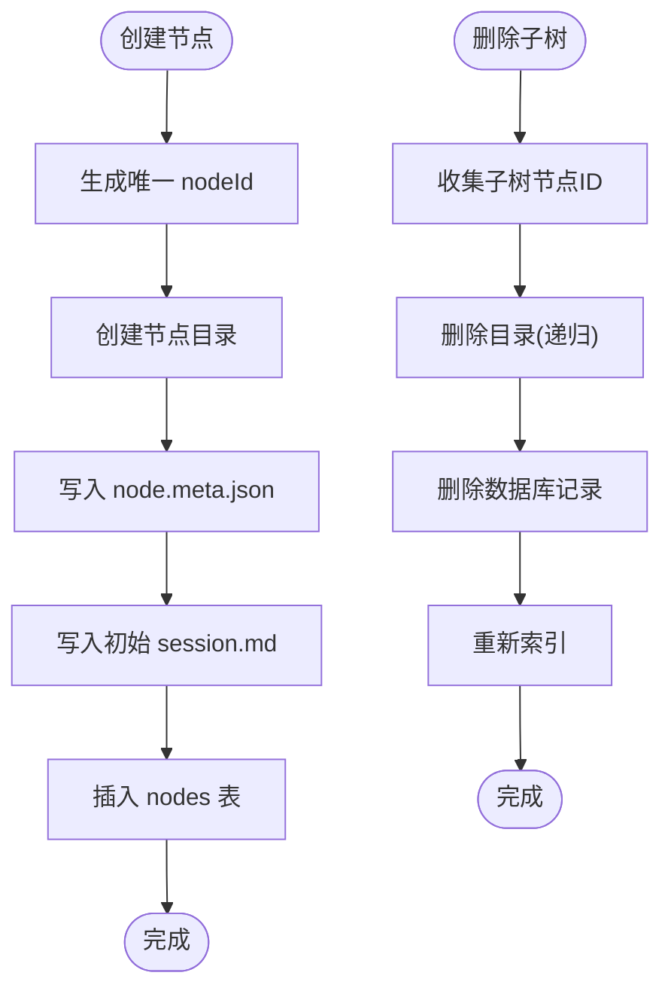
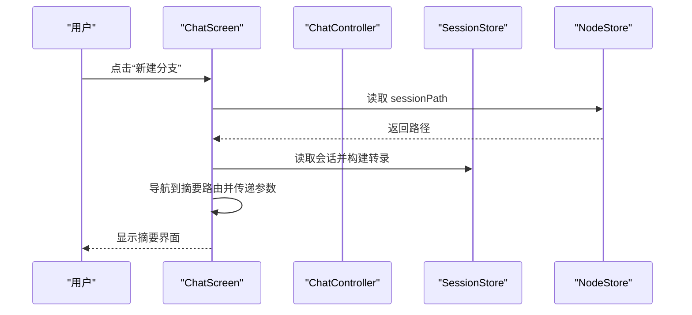
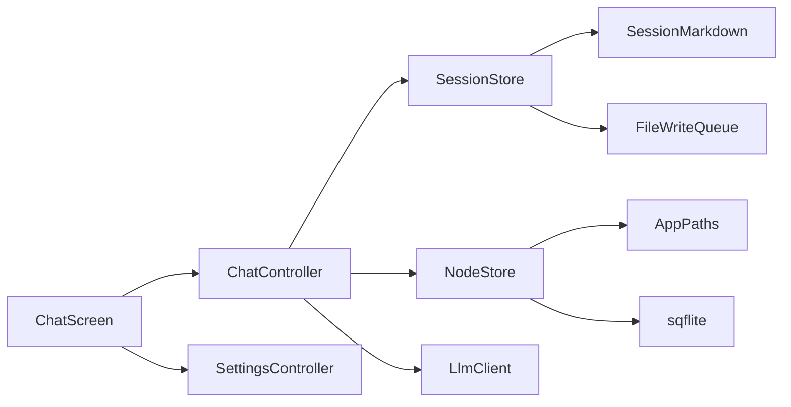

# 对话管理系统

<cite>
**本文引用的文件**
- [lib/main.dart](file://lib/main.dart)
- [pubspec.yaml](file://pubspec.yaml)
- [lib/ui/core/router.dart](file://lib/ui/core/router.dart)
- [lib/ui/core/app_services.dart](file://lib/ui/core/app_services.dart)
- [lib/ui/features/chat/chat_screen.dart](file://lib/ui/features/chat/chat_screen.dart)
- [lib/ui/features/chat/chat_controller.dart](file://lib/ui/features/chat/chat_controller.dart)
- [lib/ui/features/summary/summary_chat_controller.dart](file://lib/ui/features/summary/summary_chat_controller.dart)
- [lib/data/stores/session_store.dart](file://lib/data/stores/session_store.dart)
- [lib/data/stores/node_store.dart](file://lib/data/stores/node_store.dart)
- [lib/data/services/session_markdown.dart](file://lib/data/services/session_markdown.dart)
- [lib/data/services/file_write_queue.dart](file://lib/data/services/file_write_queue.dart)
- [lib/data/services/llm_client.dart](file://lib/data/services/llm_client.dart)
- [lib/data/models/node_meta.dart](file://lib/data/models/node_meta.dart)
- [lib/domain/node.dart](file://lib/domain/node.dart)
- [tools/migrate_to_tree.py](file://tools/migrate_to_tree.py)
- [tools/print_db_tree.py](file://tools/print_db_tree.py)
- [tools/repair_index_from_disk.py](file://tools/repair_index_from_disk.py)
- [tools/fix_stale_streaming.py](file://tools/fix_stale_streaming.py)
- [tools/host_log_server.py](file://tools/host_log_server.py)
- [docs/design.md](file://docs/design.md)
- [docs/storage-format.md](file://docs/storage-format.md)
- [docs/branch-summary-flow.md](file://docs/branch-summary-flow.md)
- [docs/progress-notes-feature.md](file://docs/progress-notes-feature.md)
</cite>

## 目录
1. [简介](#简介)
2. [项目结构](#项目结构)
3. [核心组件](#核心组件)
4. [架构总览](#架构总览)
5. [详细组件分析](#详细组件分析)
6. [依赖关系分析](#依赖关系分析)
7. [性能考量](#性能考量)
8. [故障排查指南](#故障排查指南)
9. [结论](#结论)
10. [附录](#附录)

## 简介
本项目是一个基于 Flutter 的树形对话管理系统，围绕“主题（Theme）—节点（Node）—会话（Session）”的层次结构组织对话内容。系统支持：
- 树形结构的对话分支与上下文管理
- Markdown 会话格式的读写与解析
- 流式对话的实时响应、中断与错误恢复
- 本地数据库索引与文件系统双轨存储
- 上下文长度估算与提示词窗口控制
- 路由驱动的聊天界面与摘要分支功能

该系统既适合初学者快速上手，也为高级开发者提供了可扩展的架构与性能优化空间。

## 项目结构
项目采用按领域分层的组织方式：UI 层负责界面与交互；Domain 层定义实体与枚举；Data 层封装数据访问、存储与服务；工具脚本用于索引修复与日志辅助。

图表来源
- [lib/main.dart:15-59](file://lib/main.dart#L15-L59)
- [lib/ui/core/router.dart:18-87](file://lib/ui/core/router.dart#L18-L87)
- [lib/ui/core/app_services.dart:27-169](file://lib/ui/core/app_services.dart#L27-L169)
- [lib/ui/features/chat/chat_screen.dart:19-175](file://lib/ui/features/chat/chat_screen.dart#L19-L175)
- [lib/ui/features/chat/chat_controller.dart](file://lib/ui/features/chat/chat_controller.dart)
- [lib/ui/features/summary/summary_chat_controller.dart](file://lib/ui/features/summary/summary_chat_controller.dart)
- [lib/data/stores/session_store.dart:8-205](file://lib/data/stores/session_store.dart#L8-L205)
- [lib/data/stores/node_store.dart:12-414](file://lib/data/stores/node_store.dart#L12-L414)
- [lib/data/services/session_markdown.dart:49-223](file://lib/data/services/session_markdown.dart#L49-L223)
- [lib/data/services/file_write_queue.dart:1-12](file://lib/data/services/file_write_queue.dart#L1-L12)
- [lib/data/services/llm_client.dart:33-271](file://lib/data/services/llm_client.dart#L33-L271)

章节来源
- [lib/main.dart:15-95](file://lib/main.dart#L15-L95)
- [pubspec.yaml:30-49](file://pubspec.yaml#L30-L49)

## 核心组件
- 应用入口与全局注入
  - 启动时初始化路径、日志、错误回调，并通过 ProviderScope 注入全局 Provider，包括应用路径、日志器、语言环境等。
- 路由与页面
  - 使用 GoRouter 定义主壳层与分支导航，聊天页、摘要页、笔记页、设置页等。
- 会话存储（SessionStore）
  - 基于 Markdown 文件的会话读写，支持用户消息、助手消息、流式标记与错误标记；通过串行写队列保证并发安全。
- 节点存储（NodeStore）
  - 维护 SQLite 索引与磁盘目录的双轨一致性，支持从磁盘重建索引、创建/删除节点子树、解析 node.meta.json。
- 会话解析（session_markdown）
  - 解析 YAML Frontmatter，提取消息头与正文，识别流式与错误状态。
- 流式 LLM 客户端
  - 支持 OpenAI 兼容、Claude、Gemini 的 SSE 流式输出，抽取增量文本。
- 控制器与界面
  - ChatController 负责消息发送、流式接收、停止与状态更新；ChatScreen 提供输入框、列表渲染、上下文条与分支按钮。
  - 摘要控制器支持在当前会话基础上生成新的分支摘要。

章节来源
- [lib/main.dart:15-95](file://lib/main.dart#L15-L95)
- [lib/ui/core/router.dart:18-126](file://lib/ui/core/router.dart#L18-L126)
- [lib/ui/core/app_services.dart:27-169](file://lib/ui/core/app_services.dart#L27-L169)
- [lib/data/stores/session_store.dart:8-205](file://lib/data/stores/session_store.dart#L8-L205)
- [lib/data/stores/node_store.dart:12-414](file://lib/data/stores/node_store.dart#L12-L414)
- [lib/data/services/session_markdown.dart:49-223](file://lib/data/services/session_markdown.dart#L49-L223)
- [lib/ui/features/chat/chat_controller.dart](file://lib/ui/features/chat/chat_controller.dart)
- [lib/ui/features/chat/chat_screen.dart:19-175](file://lib/ui/features/chat/chat_screen.dart#L19-L175)
- [lib/ui/features/summary/summary_chat_controller.dart](file://lib/ui/features/summary/summary_chat_controller.dart)
- [lib/data/services/llm_client.dart:33-271](file://lib/data/services/llm_client.dart#L33-L271)

## 架构总览
系统以 Provider 驱动的状态管理为核心，结合路由与服务工厂，形成清晰的职责边界：
- UI 层仅负责展示与交互，不直接操作数据
- 控制器负责业务流程编排（发送消息、流式处理、状态切换）
- 存储层负责数据持久化与一致性维护
- 服务层负责外部接口（LLM、日志、设置）

图表来源
- [lib/ui/features/chat/chat_screen.dart:137-146](file://lib/ui/features/chat/chat_screen.dart#L137-L146)
- [lib/ui/features/chat/chat_controller.dart](file://lib/ui/features/chat/chat_controller.dart)
- [lib/data/stores/session_store.dart:84-148](file://lib/data/stores/session_store.dart#L84-L148)
- [lib/data/services/llm_client.dart:33-271](file://lib/data/services/llm_client.dart#L33-L271)

## 详细组件分析

### 会话存储与流式处理
- 设计要点
  - 会话以 Markdown 文件保存，Frontmatter 描述元信息，正文按消息块组织，每条消息以头部标识角色、时间戳与消息 ID。
  - 流式响应通过“流式标记”占位，增量文本在标记之间滚动写入；结束或出错时移除标记并写入最终状态。
  - 串行写队列确保同一节点的写入顺序，避免竞态。
- 关键流程
  - 发送用户消息：追加用户消息块
  - 开始助手消息：写入助手头部与流式标记
  - 追加增量：剥离标记后拼接增量再写回
  - 结束/失败：移除标记，写入完成或错误标记
- 错误恢复
  - 流中断时写入错误标记，控制器捕获网络异常并标记失败，随后刷新界面

图表来源
- [lib/data/stores/session_store.dart:42-148](file://lib/data/stores/session_store.dart#L42-L148)
- [lib/data/services/session_markdown.dart:106-184](file://lib/data/services/session_markdown.dart#L106-L184)
- [lib/data/services/file_write_queue.dart:1-12](file://lib/data/services/file_write_queue.dart#L1-L12)

章节来源
- [lib/data/stores/session_store.dart:8-205](file://lib/data/stores/session_store.dart#L8-L205)
- [lib/data/services/session_markdown.dart:49-223](file://lib/data/services/session_markdown.dart#L49-L223)
- [lib/data/services/file_write_queue.dart:1-12](file://lib/data/services/file_write_queue.dart#L1-L12)

### 节点与树形结构
- 设计要点
  - 节点以目录形式存储，根目录包含 node.meta.json 与 session.md；父节点为空时表示根节点。
  - NodeStore 维护 SQLite 索引，提供从磁盘重建索引、创建/删除节点子树、解析元信息等功能。
  - 会话路径可能因磁盘变更而“陈旧”，提供递归扫描修复路径并更新索引。
- 关键流程
  - 创建聊天节点：生成唯一 nodeId，创建目录，写入 node.meta.json 与初始 session.md，插入数据库
  - 删除节点子树：删除目录与数据库记录，并重新索引
  - 获取会话路径：优先走 DB，若不存在则递归扫描磁盘修复

图表来源
- [lib/data/stores/node_store.dart:112-204](file://lib/data/stores/node_store.dart#L112-L204)
- [lib/data/stores/node_store.dart:206-235](file://lib/data/stores/node_store.dart#L206-L235)
- [lib/data/stores/node_store.dart:18-59](file://lib/data/stores/node_store.dart#L18-L59)
- [lib/data/models/node_meta.dart:5-83](file://lib/data/models/node_meta.dart#L5-L83)
- [lib/domain/node.dart:1-30](file://lib/domain/node.dart#L1-L30)

章节来源
- [lib/data/stores/node_store.dart:12-414](file://lib/data/stores/node_store.dart#L12-L414)
- [lib/data/models/node_meta.dart:5-83](file://lib/data/models/node_meta.dart#L5-L83)
- [lib/domain/node.dart:1-30](file://lib/domain/node.dart#L1-L30)

### 聊天界面与交互流程
- 用户交互
  - 输入框支持发送与停止流式响应
  - 顶部菜单支持返回树视图、新建分支摘要、添加到笔记
  - 消息气泡支持选择文本并跳转到笔记选择界面
- 控制器与状态
  - ChatController 负责发送用户消息、启动/停止流式、刷新消息列表
  - ChatScreen 读取消息异步数据，渲染列表与上下文条，根据设置选择 LLM 提供商
- 分支摘要
  - 将当前会话转录为文本，作为新分支的上下文，进入摘要聊天流程

图表来源
- [lib/ui/features/chat/chat_screen.dart:63-110](file://lib/ui/features/chat/chat_screen.dart#L63-L110)
- [lib/ui/features/chat/chat_screen.dart:75-106](file://lib/ui/features/chat/chat_screen.dart#L75-L106)
- [lib/ui/features/summary/summary_chat_controller.dart](file://lib/ui/features/summary/summary_chat_controller.dart)

章节来源
- [lib/ui/features/chat/chat_screen.dart:19-175](file://lib/ui/features/chat/chat_screen.dart#L19-L175)
- [lib/ui/features/chat/chat_controller.dart](file://lib/ui/features/chat/chat_controller.dart)
- [lib/ui/features/summary/summary_chat_controller.dart](file://lib/ui/features/summary/summary_chat_controller.dart)

### LLM 流式客户端
- 多提供商适配
  - OpenAI 兼容：SSE /chat/completions，逐段解析 choices.delta.content
  - Claude：SSE /messages，系统消息拆分，逐段解析 data
  - Gemini：SSE /models/{model}:streamGenerateContent，逐段解析 data
- 中断机制
  - 使用 CancelToken 取消请求；当收到取消类型时忽略错误并结束
- 错误恢复
  - 捕获非取消异常，标记会话为错误状态，刷新界面

章节来源
- [lib/data/services/llm_client.dart:33-271](file://lib/data/services/llm_client.dart#L33-L271)

### 上下文管理与长度控制
- 上下文估算
  - ChatScreen 计算所有消息体的近似 token 数，结合 LLM 提供商的上下文窗口阈值绘制进度条
- 上下文长度控制
  - 当接近阈值时改变颜色提示，建议清理历史或生成摘要分支
- 祖先总结
  - 通过“分支摘要”功能将当前会话转录为新节点，形成更短的上下文路径

章节来源
- [lib/ui/features/chat/chat_screen.dart:177-219](file://lib/ui/features/chat/chat_screen.dart#L177-L219)

## 依赖关系分析
- 外部依赖
  - Flutter Riverpod：状态管理与 Provider
  - go_router：路由与导航
  - dio：HTTP 客户端，支持流式响应
  - sqflite：SQLite 数据库
  - path/path_provider：文件路径与目录操作
  - yaml：Frontmatter 解析
- 内部模块耦合
  - ChatScreen 依赖 ChatController 与 SettingsController
  - ChatController 依赖 SessionStore、NodeStore、LlmClient、AppLogger
  - SessionStore 依赖 SessionMarkdown 与 FileWriteQueue
  - NodeStore 依赖 AppPaths 与 SQLite

图表来源
- [lib/ui/features/chat/chat_screen.dart:19-175](file://lib/ui/features/chat/chat_screen.dart#L19-L175)
- [lib/ui/features/chat/chat_controller.dart](file://lib/ui/features/chat/chat_controller.dart)
- [lib/ui/core/app_services.dart:57-169](file://lib/ui/core/app_services.dart#L57-L169)
- [lib/data/stores/session_store.dart:8-205](file://lib/data/stores/session_store.dart#L8-L205)
- [lib/data/stores/node_store.dart:12-414](file://lib/data/stores/node_store.dart#L12-L414)
- [lib/data/services/session_markdown.dart:49-223](file://lib/data/services/session_markdown.dart#L49-L223)
- [lib/data/services/file_write_queue.dart:1-12](file://lib/data/services/file_write_queue.dart#L1-L12)

章节来源
- [pubspec.yaml:30-49](file://pubspec.yaml#L30-L49)
- [lib/ui/core/app_services.dart:57-169](file://lib/ui/core/app_services.dart#L57-L169)

## 性能考量
- 并发写入串行化
  - 使用 FileWriteQueue 以节点 ID 为键串行化写入，避免文件竞争与损坏
- 磁盘与索引一致性
  - NodeStore 在创建/删除节点后执行 reindex，确保 DB 与磁盘一致
- 流式写入原子性
  - 临时文件写入后重命名，保证写入原子性，减少部分写入风险
- 上下文长度估算
  - 通过近似 token 估算与阈值告警，降低超上下文窗口导致的失败概率
- 索引修复工具
  - 提供修复脚本，可在索引陈旧或丢失时从磁盘重建

章节来源
- [lib/data/services/file_write_queue.dart:1-12](file://lib/data/services/file_write_queue.dart#L1-L12)
- [lib/data/stores/node_store.dart:18-59](file://lib/data/stores/node_store.dart#L18-L59)
- [lib/data/stores/session_store.dart:199-205](file://lib/data/stores/session_store.dart#L199-L205)
- [lib/ui/features/chat/chat_screen.dart:177-219](file://lib/ui/features/chat/chat_screen.dart#L177-L219)
- [tools/repair_index_from_disk.py](file://tools/repair_index_from_disk.py)
- [tools/fix_stale_streaming.py](file://tools/fix_stale_streaming.py)

## 故障排查指南
- 会话路径找不到
  - 现象：抛出“未找到会话路径”错误
  - 排查：检查节点目录是否存在 node.meta.json 与 session.md；使用递归扫描修复路径并更新索引
- 流式写入卡住
  - 现象：助手消息末尾残留流式标记
  - 排查：运行修复脚本移除陈旧流式标记；确认 SessionStore 的标记剥离逻辑是否正确
- 网络中断导致流失败
  - 现象：流被取消，界面显示错误标记
  - 排查：检查 CancelToken 是否被正确取消；确认 LlmClient 的 onError 分支是否写入错误标记
- 日志定位
  - 使用远程日志 URL 初始化日志器，记录关键事件与错误堆栈，便于问题复现

章节来源
- [lib/ui/core/app_services.dart:164-167](file://lib/ui/core/app_services.dart#L164-L167)
- [lib/data/stores/session_store.dart:183-197](file://lib/data/stores/session_store.dart#L183-L197)
- [lib/ui/features/chat/chat_controller.dart](file://lib/ui/features/chat/chat_controller.dart)
- [lib/data/services/llm_client.dart:33-271](file://lib/data/services/llm_client.dart#L33-L271)
- [tools/host_log_server.py](file://tools/host_log_server.py)

## 结论
本系统以树形结构承载对话，通过 Markdown 会话与 SQLite 索引实现高效的数据组织与检索；借助流式 LLM 客户端与串行写队列，保障了实时响应与数据一致性。上下文长度估算与“分支摘要”功能帮助用户在长对话中保持可控的上下文窗口。对于初学者，建议从创建主题、节点与基本聊天开始；对于高级开发者，可关注索引修复、流式中断与错误恢复的工程化实践，以及在大规模场景下的性能优化策略。

## 附录
- 设计文档
  - [docs/design.md](file://docs/design.md)
  - [docs/storage-format.md](file://docs/storage-format.md)
  - [docs/branch-summary-flow.md](file://docs/branch-summary-flow.md)
  - [docs/progress-notes-feature.md](file://docs/progress-notes-feature.md)
- 工具脚本
  - [tools/migrate_to_tree.py](file://tools/migrate_to_tree.py)
  - [tools/print_db_tree.py](file://tools/print_db_tree.py)
  - [tools/repair_index_from_disk.py](file://tools/repair_index_from_disk.py)
  - [tools/fix_stale_streaming.py](file://tools/fix_stale_streaming.py)
  - [tools/host_log_server.py](file://tools/host_log_server.py)