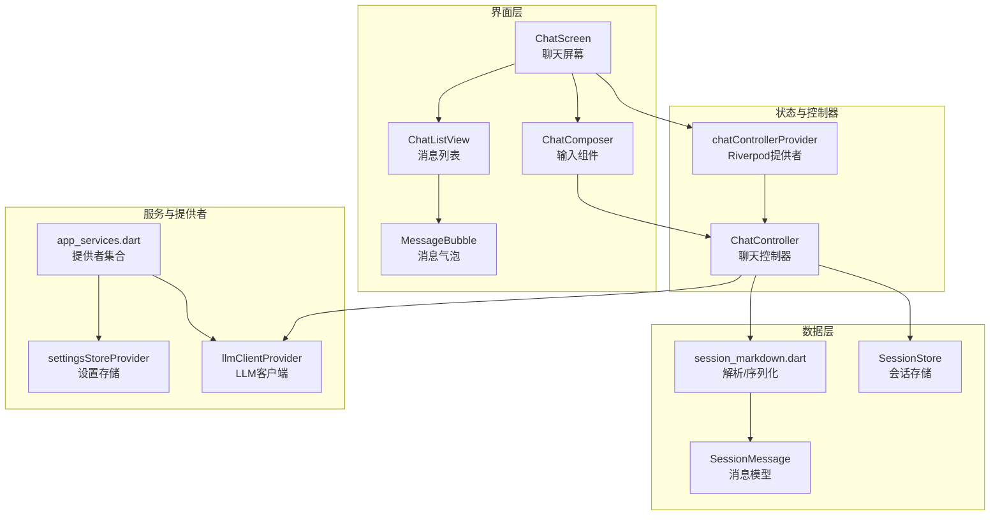
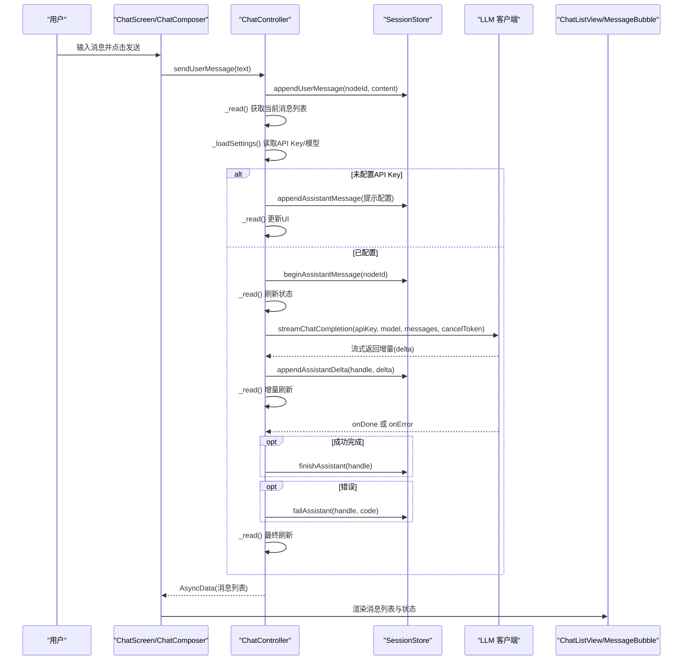
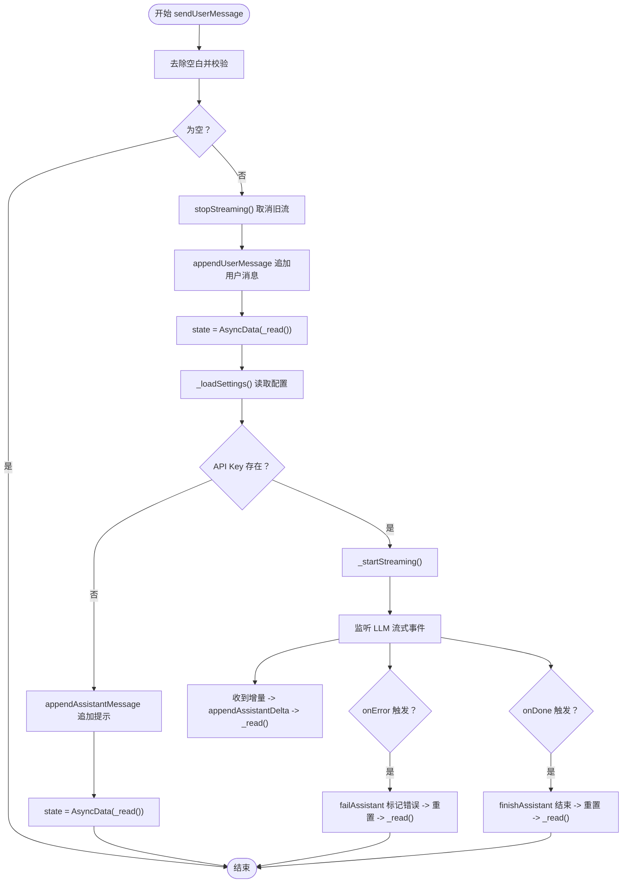
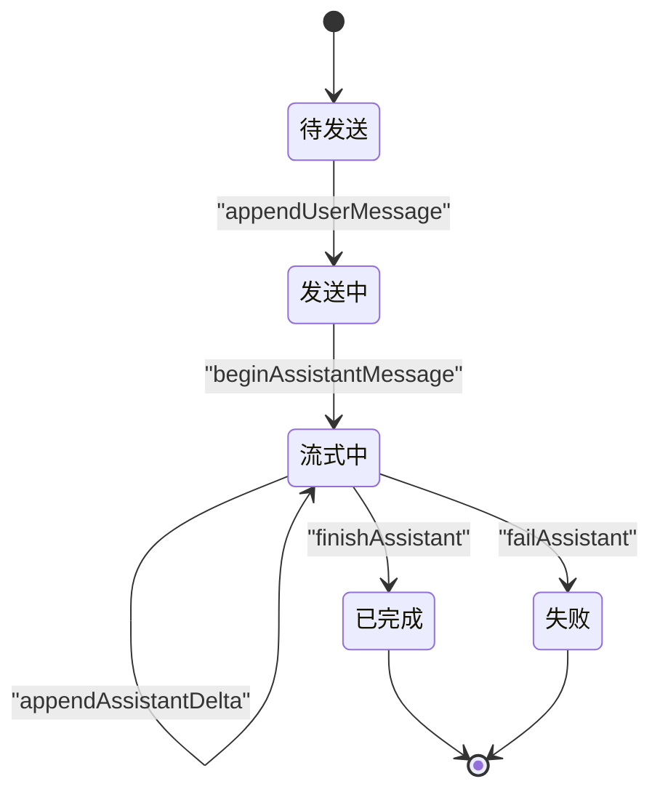
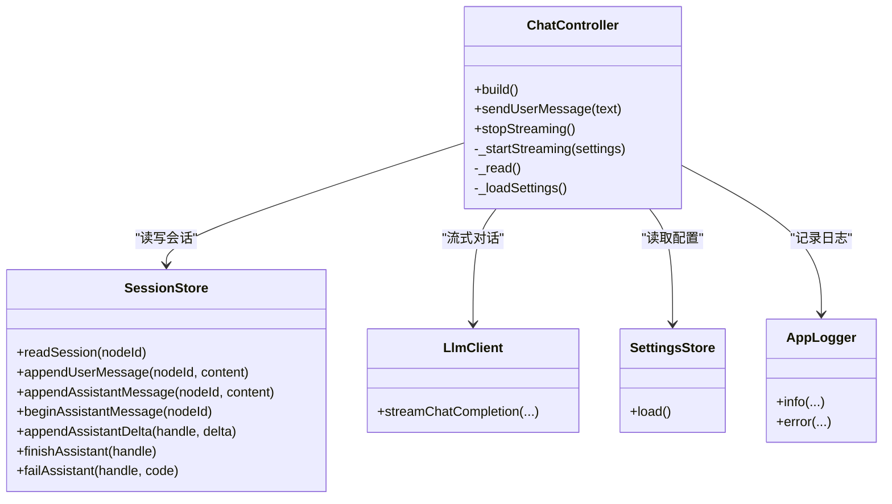
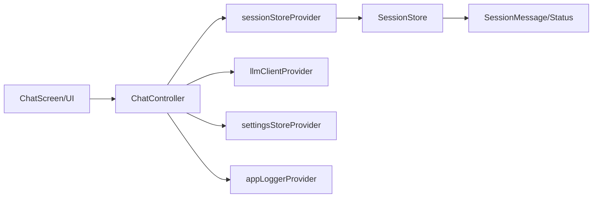

# 聊天控制器

<cite>
**本文引用的文件**
- [lib/ui/features/chat/chat_controller.dart](file://lib/ui/features/chat/chat_controller.dart)
- [lib/ui/features/chat/chat_screen.dart](file://lib/ui/features/chat/chat_screen.dart)
- [lib/ui/core/shared/chat_composer.dart](file://lib/ui/core/shared/chat_composer.dart)
- [lib/ui/core/shared/chat_list_view.dart](file://lib/ui/core/shared/chat_list_view.dart)
- [lib/data/services/session_markdown.dart](file://lib/data/services/session_markdown.dart)
- [lib/data/stores/session_store.dart](file://lib/data/stores/session_store.dart)
- [lib/ui/core/app_services.dart](file://lib/ui/core/app_services.dart)
- [lib/ui/core/shared/message_bubble.dart](file://lib/ui/core/shared/message_bubble.dart)
- [lib/ui/features/summary/summary_chat_controller.dart](file://lib/ui/features/summary/summary_chat_controller.dart)
- [lib/ui/features/settings/settings_controller.dart](file://lib/ui/features/settings/settings_controller.dart)
</cite>

## 目录
1. [简介](#简介)
2. [项目结构](#项目结构)
3. [核心组件](#核心组件)
4. [架构总览](#架构总览)
5. [详细组件分析](#详细组件分析)
6. [依赖关系分析](#依赖关系分析)
7. [性能考量](#性能考量)
8. [故障排查指南](#故障排查指南)
9. [结论](#结论)
10. [附录](#附录)

## 简介
本文件系统性地文档化聊天控制器 ChatController 的状态管理模式与生命周期管理，涵盖消息状态管理（pending/streaming/success/error）、流式响应处理、错误状态处理、与 Riverpod Provider 的集成机制、状态提供与更新策略，并给出面向初学者的使用说明与面向高级开发者的最佳实践与性能优化建议。读者将通过图示与分层讲解，理解从用户输入到流式输出、再到最终完成或错误的完整链路。

## 项目结构
聊天相关模块主要分布在以下位置：
- 控制器：lib/ui/features/chat/chat_controller.dart
- 屏幕与UI：lib/ui/features/chat/chat_screen.dart、lib/ui/core/shared/chat_composer.dart、lib/ui/core/shared/chat_list_view.dart、lib/ui/core/shared/message_bubble.dart
- 数据模型与解析：lib/data/services/session_markdown.dart
- 会话存储与原子写入：lib/data/stores/session_store.dart
- Riverpod 提供者：lib/ui/core/app_services.dart
- 摘要/总结控制器（对比参考）：lib/ui/features/summary/summary_chat_controller.dart
- 设置控制器（配置LLM参数）：lib/ui/features/settings/settings_controller.dart

图表来源
- [lib/ui/features/chat/chat_controller.dart:18-221](file://lib/ui/features/chat/chat_controller.dart#L18-L221)
- [lib/ui/features/chat/chat_screen.dart:19-175](file://lib/ui/features/chat/chat_screen.dart#L19-L175)
- [lib/ui/core/shared/chat_composer.dart:5-160](file://lib/ui/core/shared/chat_composer.dart#L5-L160)
- [lib/ui/core/shared/chat_list_view.dart:8-99](file://lib/ui/core/shared/chat_list_view.dart#L8-L99)
- [lib/ui/core/shared/message_bubble.dart:41-78](file://lib/ui/core/shared/message_bubble.dart#L41-L78)
- [lib/data/services/session_markdown.dart:4-42](file://lib/data/services/session_markdown.dart#L4-L42)
- [lib/data/stores/session_store.dart:8-169](file://lib/data/stores/session_store.dart#L8-L169)
- [lib/ui/core/app_services.dart:27-169](file://lib/ui/core/app_services.dart#L27-L169)

章节来源
- [lib/ui/features/chat/chat_controller.dart:18-221](file://lib/ui/features/chat/chat_controller.dart#L18-L221)
- [lib/ui/features/chat/chat_screen.dart:19-175](file://lib/ui/features/chat/chat_screen.dart#L19-L175)
- [lib/ui/core/shared/chat_composer.dart:5-160](file://lib/ui/core/shared/chat_composer.dart#L5-L160)
- [lib/ui/core/shared/chat_list_view.dart:8-99](file://lib/ui/core/shared/chat_list_view.dart#L8-L99)
- [lib/ui/core/shared/message_bubble.dart:41-78](file://lib/ui/core/shared/message_bubble.dart#L41-L78)
- [lib/data/services/session_markdown.dart:4-42](file://lib/data/services/session_markdown.dart#L4-L42)
- [lib/data/stores/session_store.dart:8-169](file://lib/data/stores/session_store.dart#L8-L169)
- [lib/ui/core/app_services.dart:27-169](file://lib/ui/core/app_services.dart#L27-L169)

## 核心组件
- ChatController：基于 AsyncNotifier<List<SessionMessage>> 的聊天控制器，负责消息发送、流式生成、状态更新与清理。
- SessionMessage 与 SessionMessageStatus：定义消息角色与状态（done/streaming/error），并由解析器从 Markdown 中识别状态标记。
- SessionStore：负责会话文件的原子写入、开始/追加/结束/失败标记等操作，支撑流式增量渲染。
- Riverpod 提供者：app_services.dart 中定义了 appPathsProvider、sessionStoreProvider、llmClientProvider、settingsStoreProvider 等，为控制器注入依赖。
- UI 组件：ChatScreen、ChatComposer、ChatListView、MessageBubble 将控制器状态与用户交互连接起来。

章节来源
- [lib/ui/features/chat/chat_controller.dart:18-221](file://lib/ui/features/chat/chat_controller.dart#L18-L221)
- [lib/data/services/session_markdown.dart:10-32](file://lib/data/services/session_markdown.dart#L10-L32)
- [lib/data/stores/session_store.dart:84-148](file://lib/data/stores/session_store.dart#L84-L148)
- [lib/ui/core/app_services.dart:77-169](file://lib/ui/core/app_services.dart#L77-L169)

## 架构总览
下图展示了从用户输入到流式响应完成或错误的端到端流程，以及与 Riverpod Provider 的集成点。

图表来源
- [lib/ui/features/chat/chat_controller.dart:111-215](file://lib/ui/features/chat/chat_controller.dart#L111-L215)
- [lib/data/stores/session_store.dart:42-148](file://lib/data/stores/session_store.dart#L42-L148)
- [lib/ui/features/chat/chat_screen.dart:137-146](file://lib/ui/features/chat/chat_screen.dart#L137-L146)
- [lib/ui/core/app_services.dart:77-169](file://lib/ui/core/app_services.dart#L77-L169)

## 详细组件分析

### ChatController 状态管理与生命周期
- 初始化与构建
  - 构建时注册 onDispose，确保在控制器释放时取消流订阅与取消令牌，避免资源泄漏。
  - 首次构建调用 _read() 读取当前会话消息列表，作为初始状态。
- 发送用户消息
  - 去除空白后校验，空消息直接返回。
  - 调用 stopStreaming() 取消正在进行的流式生成，保证状态一致性。
  - 追加用户消息到会话文件，立即刷新状态。
  - 加载设置，若未配置 API Key，则追加提示消息并返回；否则进入流式生成阶段。
- 流式生成
  - 开始新一次生成前，递增 _streamGeneration 并取消旧的 CancelToken，防止竞态。
  - 调用 SessionStore.beginAssistantMessage 创建占位消息并开启“流式中”标记。
  - 构造历史消息数组（role/content），调用 LLM 客户端的流式接口。
  - 监听流事件：
    - 接收增量：调用 SessionStore.appendAssistantDelta 写入增量，随后 _read() 刷新 UI。
    - onError：非取消异常记录日志，调用 SessionStore.failAssistant 标记错误，重置句柄与令牌，刷新 UI。
    - onDone：调用 SessionStore.finishAssistant 结束流式标记，重置句柄与令牌，刷新 UI。
- 停止流式
  - 标记停止请求，递增 _streamGeneration，清空句柄与令牌，取消订阅。
  - 若存在句柄，调用 SessionStore.finishAssistant；否则调用 finishStreamingMessage。
  - 刷新状态并记录日志。
- 错误处理
  - 控制器内部捕获异常并转为 AsyncError，同时记录日志。
  - 流式 onError 中区分取消与网络错误，仅对网络错误进行 failAssistant 标记。

图表来源
- [lib/ui/features/chat/chat_controller.dart:111-215](file://lib/ui/features/chat/chat_controller.dart#L111-L215)
- [lib/data/stores/session_store.dart:42-148](file://lib/data/stores/session_store.dart#L42-L148)

章节来源
- [lib/ui/features/chat/chat_controller.dart:42-215](file://lib/ui/features/chat/chat_controller.dart#L42-L215)
- [lib/data/stores/session_store.dart:42-148](file://lib/data/stores/session_store.dart#L42-L148)

### 消息状态枚举与状态转换逻辑
- SessionMessageStatus
  - done：普通完成消息。
  - streaming：流式生成中的消息，文件末尾带有“流式中”标记。
  - error：流式生成失败的消息，文件末尾带有“错误码”标记。
- 状态转换
  - 用户消息：appendUserMessage -> done。
  - 助手消息：beginAssistantMessage -> streaming -> (appendAssistantDelta)* -> finishAssistant -> done；或 onError -> failAssistant -> error。
- 解析与渲染
  - session_markdown.dart 解析时根据文件末尾标记识别状态与错误码。
  - message_bubble.dart 根据状态显示“流式中/错误(含错误码)”等提示。

图表来源
- [lib/data/services/session_markdown.dart:10-32](file://lib/data/services/session_markdown.dart#L10-L32)
- [lib/data/stores/session_store.dart:84-148](file://lib/data/stores/session_store.dart#L84-L148)
- [lib/ui/core/shared/message_bubble.dart:61-65](file://lib/ui/core/shared/message_bubble.dart#L61-L65)

章节来源
- [lib/data/services/session_markdown.dart:10-32](file://lib/data/services/session_markdown.dart#L10-L32)
- [lib/data/stores/session_store.dart:84-148](file://lib/data/stores/session_store.dart#L84-L148)
- [lib/ui/core/shared/message_bubble.dart:61-65](file://lib/ui/core/shared/message_bubble.dart#L61-L65)

### 与 Riverpod Provider 的集成机制
- 提供者注入
  - sessionStoreProvider：按节点 ID 查找会话文件路径并返回 SessionStore 实例。
  - llmClientProvider：根据当前 LLM Provider 返回对应客户端。
  - settingsStoreProvider：提供设置存储，用于读取 API Key、模型等。
  - appLoggerProvider：统一日志记录。
- 状态提供与更新
  - ChatController 使用 AsyncNotifier<List<SessionMessage>>，通过 state = AsyncData(...) 或 state = AsyncError(...) 更新 UI。
  - UI 侧通过 ref.watch(chatControllerProvider(args)) 订阅状态变化，支持 loading/data/error 分支渲染。
- 异步状态处理
  - 构建时异步获取 SessionStore/LlmClient/Settings 等依赖，确保初始化顺序正确。
  - onDispose 中清理流订阅与取消令牌，避免泄漏。

图表来源
- [lib/ui/features/chat/chat_controller.dart:18-221](file://lib/ui/features/chat/chat_controller.dart#L18-L221)
- [lib/data/stores/session_store.dart:8-169](file://lib/data/stores/session_store.dart#L8-L169)
- [lib/ui/core/app_services.dart:67-75](file://lib/ui/core/app_services.dart#L67-L75)
- [lib/ui/core/app_services.dart:77-169](file://lib/ui/core/app_services.dart#L77-L169)

章节来源
- [lib/ui/features/chat/chat_controller.dart:18-221](file://lib/ui/features/chat/chat_controller.dart#L18-L221)
- [lib/ui/core/app_services.dart:67-75](file://lib/ui/core/app_services.dart#L67-L75)
- [lib/ui/core/app_services.dart:77-169](file://lib/ui/core/app_services.dart#L77-L169)

### 生命周期管理（初始化/消息发送/流式接收/清理）
- 初始化：构建时注册 onDispose，读取初始消息列表。
- 消息发送：stopStreaming -> 追加用户消息 -> 读取并刷新 -> 加载设置 -> 条件启动流式。
- 流式接收：监听增量 -> 写入 -> 刷新 -> onDone/ onError -> 结束或标记错误 -> 刷新。
- 清理：onDispose 取消订阅与令牌；stopStreaming 时同样清理并结束流式标记。

章节来源
- [lib/ui/features/chat/chat_controller.dart:42-90](file://lib/ui/features/chat/chat_controller.dart#L42-L90)
- [lib/ui/features/chat/chat_controller.dart:111-215](file://lib/ui/features/chat/chat_controller.dart#L111-L215)

### UI 集成与交互
- ChatScreen
  - 通过 chatControllerProvider 订阅消息列表，使用 maybeWhen 判断是否处于流式中以禁用输入或显示停止按钮。
  - ChatComposer 作为输入组件，支持回车发送、Shift+回车换行、停止按钮调用 stopStreaming。
  - ChatListView 自动滚动至底部，支持用户滚动行为的记忆与恢复。
  - MessageBubble 根据消息角色与状态渲染不同样式与提示文本。
- 对比参考：摘要/总结控制器（summary_chat_controller.dart）采用临时会话文件与相似的流式处理模式，便于理解不同场景下的流式实现。

章节来源
- [lib/ui/features/chat/chat_screen.dart:39-175](file://lib/ui/features/chat/chat_screen.dart#L39-L175)
- [lib/ui/core/shared/chat_composer.dart:5-160](file://lib/ui/core/shared/chat_composer.dart#L5-L160)
- [lib/ui/core/shared/chat_list_view.dart:8-99](file://lib/ui/core/shared/chat_list_view.dart#L8-L99)
- [lib/ui/core/shared/message_bubble.dart:41-78](file://lib/ui/core/shared/message_bubble.dart#L41-L78)
- [lib/ui/features/summary/summary_chat_controller.dart:218-295](file://lib/ui/features/summary/summary_chat_controller.dart#L218-L295)

## 依赖关系分析
- 控制器依赖
  - AsyncNotifier<List<SessionMessage>>：提供异步状态容器。
  - Riverpod 提供者：sessionStoreProvider、llmClientProvider、settingsStoreProvider、appLoggerProvider。
- 数据依赖
  - SessionMessage/SessionMessageStatus：消息模型与状态。
  - SessionStore：原子写入、流式标记管理。
- UI 依赖
  - ChatScreen/ChatComposer/ChatListView/MessageBubble：状态驱动的渲染与交互。

图表来源
- [lib/ui/features/chat/chat_controller.dart:18-221](file://lib/ui/features/chat/chat_controller.dart#L18-L221)
- [lib/ui/core/app_services.dart:77-169](file://lib/ui/core/app_services.dart#L77-L169)
- [lib/data/stores/session_store.dart:8-169](file://lib/data/stores/session_store.dart#L8-L169)
- [lib/data/services/session_markdown.dart:16-42](file://lib/data/services/session_markdown.dart#L16-L42)

章节来源
- [lib/ui/features/chat/chat_controller.dart:18-221](file://lib/ui/features/chat/chat_controller.dart#L18-L221)
- [lib/ui/core/app_services.dart:77-169](file://lib/ui/core/app_services.dart#L77-L169)
- [lib/data/stores/session_store.dart:8-169](file://lib/data/stores/session_store.dart#L8-L169)
- [lib/data/services/session_markdown.dart:16-42](file://lib/data/services/session_markdown.dart#L16-L42)

## 性能考量
- 流式增量渲染
  - 使用 appendAssistantDelta 增量写入，避免一次性重写整个文件，降低 IO 压力。
  - 通过 _read() 在每次增量后刷新状态，保持 UI 响应性。
- 并发与竞态控制
  - _streamGeneration 与 CancelToken 协同，确保新请求覆盖旧请求，避免竞态。
  - FileWriteQueue 保障同一节点的写入串行化，避免并发写入冲突。
- UI 滚动与内存
  - ChatListView 自动滚动至底部，减少用户手动滚动负担；在用户向上滚动时暂停自动滚动，体验更佳。
- 日志与可观测性
  - 控制器内部使用 _trace 记录关键事件，结合 appLoggerProvider 输出到本地日志，便于定位问题。

章节来源
- [lib/ui/features/chat/chat_controller.dart:147-215](file://lib/ui/features/chat/chat_controller.dart#L147-L215)
- [lib/data/stores/session_store.dart:13-13](file://lib/data/stores/session_store.dart#L13-L13)
- [lib/ui/core/shared/chat_list_view.dart:22-99](file://lib/ui/core/shared/chat_list_view.dart#L22-L99)

## 故障排查指南
- 常见问题
  - 未配置 API Key：控制器会在发送后追加提示消息，检查设置控制器保存的 API Key 是否正确。
  - 网络中断或取消：onError 中区分取消与网络错误；取消为正常停止，网络错误会标记 error 并停止流。
  - 文件写入失败：SessionStore 使用原子写入（tmp + rename），若中途失败可重试；检查磁盘权限与空间。
  - UI 不刷新：确认 UI 通过 ref.watch(chatControllerProvider(...)) 订阅状态，且在 AsyncData 分支正确渲染。
- 日志定位
  - 控制器内部 _trace 与 appLoggerProvider 记录关键事件（如 stop_streaming、read_error、appendAssistantDelta 等），结合日志定位问题。
- 设置与配置
  - 通过 SettingsController 修改 LLM Provider、API Key、模型等，修改后状态会自动刷新。

章节来源
- [lib/ui/features/chat/chat_controller.dart:134-139](file://lib/ui/features/chat/chat_controller.dart#L134-L139)
- [lib/ui/features/chat/chat_controller.dart:186-200](file://lib/ui/features/chat/chat_controller.dart#L186-L200)
- [lib/data/stores/session_store.dart:199-204](file://lib/data/stores/session_store.dart#L199-L204)
- [lib/ui/core/app_services.dart:63-75](file://lib/ui/core/app_services.dart#L63-L75)
- [lib/ui/features/settings/settings_controller.dart:7-39](file://lib/ui/features/settings/settings_controller.dart#L7-L39)

## 结论
ChatController 通过 Riverpod 提供者注入 SessionStore、LLM 客户端与设置，实现了从消息发送到流式增量渲染的完整闭环。其状态机清晰地覆盖了 pending/streaming/success/error 四种状态，并在 UI 层以直观方式呈现。通过原子写入、串行队列与取消令牌等机制，系统在性能与可靠性之间取得平衡。对于扩展需求，可在不破坏现有状态机的前提下新增消息类型与自定义状态处理逻辑。

## 附录

### 扩展控制器功能的实践建议
- 新增消息类型
  - 在 SessionMessage 中扩展字段（如元数据），并在 session_markdown.dart 中解析与序列化。
  - 在 UI 侧增加对应的渲染组件与交互入口。
- 自定义状态处理
  - 在 ChatController 中增加状态分支（如 pending/success/error），在 onError/onDone 中根据业务规则切换状态。
  - 通过 SessionStore 新增对应的状态标记写入方法，并在解析器中识别新状态。
- 性能优化
  - 将高频状态刷新合并为批处理（如节流 _read() 调用）。
  - 对长历史消息进行分页或裁剪，避免一次性渲染过多节点。
  - 使用缓存策略减少重复解析与 IO。

### 使用示例（代码片段路径）
- 发送消息并触发流式生成
  - [lib/ui/features/chat/chat_controller.dart:111-134](file://lib/ui/features/chat/chat_controller.dart#L111-L134)
- 停止流式并结束标记
  - [lib/ui/features/chat/chat_controller.dart:55-90](file://lib/ui/features/chat/chat_controller.dart#L55-L90)
- 监听流式增量并刷新状态
  - [lib/ui/features/chat/chat_controller.dart:171-185](file://lib/ui/features/chat/chat_controller.dart#L171-L185)
- 错误处理与标记失败
  - [lib/ui/features/chat/chat_controller.dart:186-199](file://lib/ui/features/chat/chat_controller.dart#L186-L199)
- UI 订阅与渲染
  - [lib/ui/features/chat/chat_screen.dart:42-47](file://lib/ui/features/chat/chat_screen.dart#L42-L47)
  - [lib/ui/core/shared/chat_composer.dart:119-135](file://lib/ui/core/shared/chat_composer.dart#L119-L135)