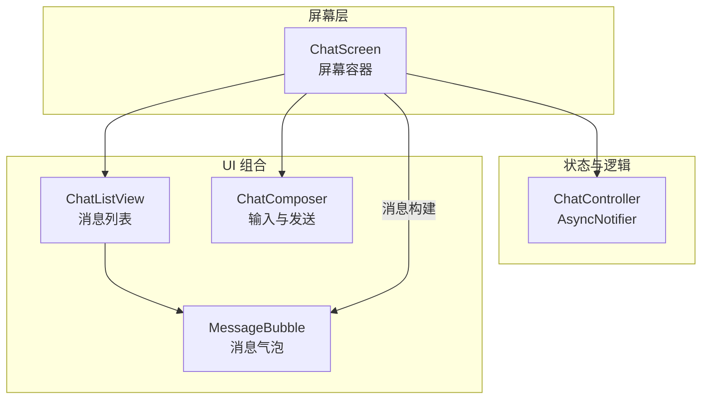
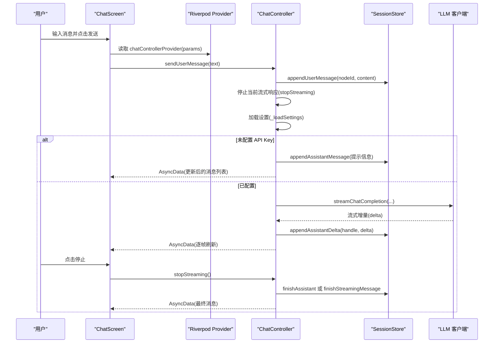
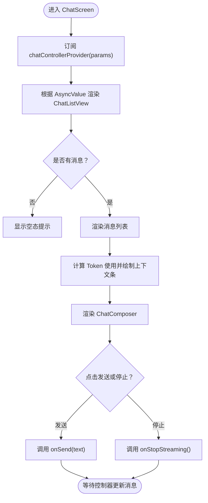
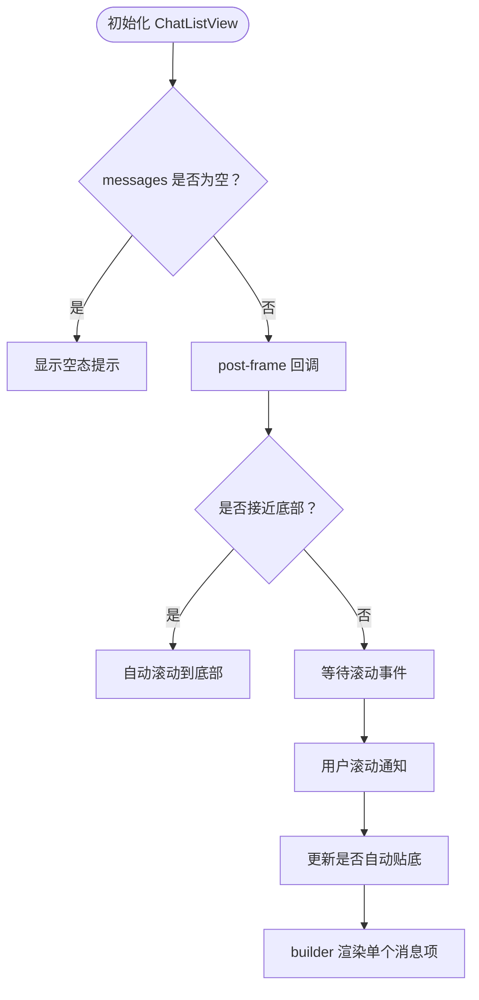
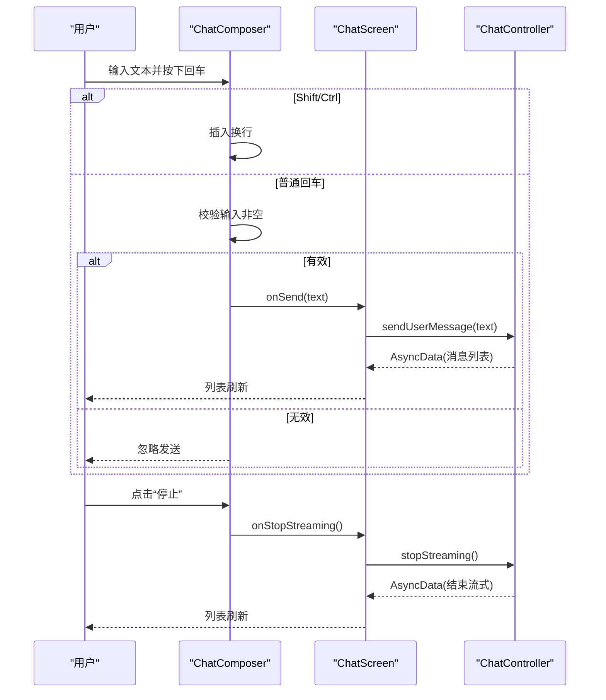
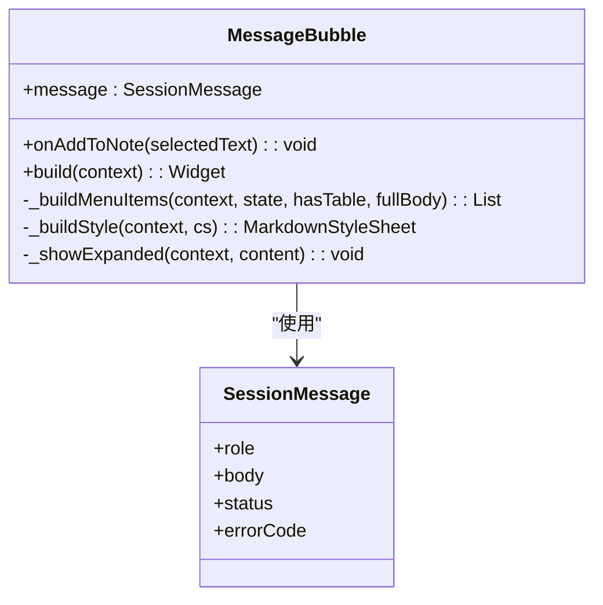
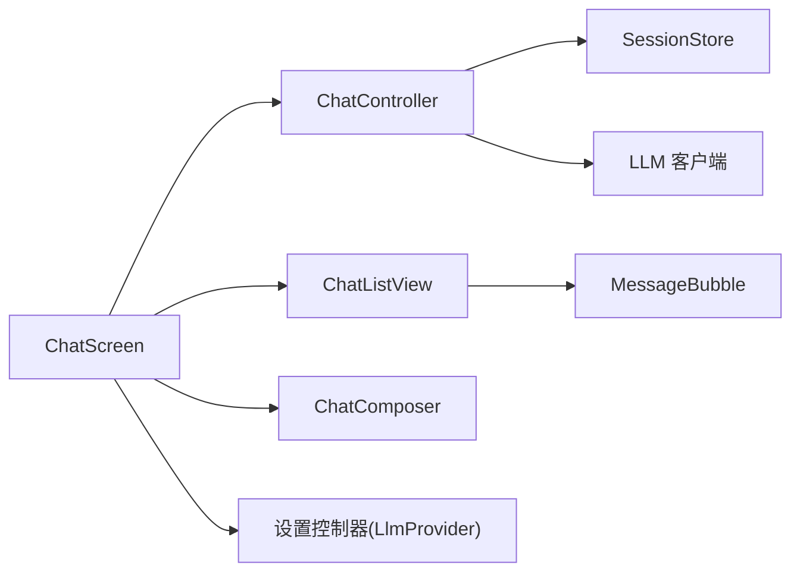

# 聊天界面组件

<cite>
**本文引用的文件**
- [lib/ui/features/chat/chat_screen.dart](file://lib/ui/features/chat/chat_screen.dart)
- [lib/ui/core/shared/chat_list_view.dart](file://lib/ui/core/shared/chat_list_view.dart)
- [lib/ui/core/shared/chat_composer.dart](file://lib/ui/core/shared/chat_composer.dart)
- [lib/ui/core/shared/message_bubble.dart](file://lib/ui/core/shared/message_bubble.dart)
- [lib/ui/features/chat/chat_controller.dart](file://lib/ui/features/chat/chat_controller.dart)
- [test/ui/core/shared/chat_composer_test.dart](file://test/ui/core/shared/chat_composer_test.dart)
- [test/ui/core/shared/chat_list_view_test.dart](file://test/ui/core/shared/chat_list_view_test.dart)
- [test/ui/core/shared/message_bubble_test.dart](file://test/ui/core/shared/message_bubble_test.dart)
</cite>

## 目录
1. [简介](#简介)
2. [项目结构](#项目结构)
3. [核心组件](#核心组件)
4. [架构总览](#架构总览)
5. [详细组件分析](#详细组件分析)
6. [依赖关系分析](#依赖关系分析)
7. [性能考量](#性能考量)
8. [故障排查指南](#故障排查指南)
9. [结论](#结论)
10. [附录](#附录)

## 简介
本文件面向初学者与高级开发者，系统性地文档化聊天界面组件，涵盖 ChatScreen 架构与用户交互流程、ChatListView 的消息渲染与滚动行为、ChatComposer 的输入与发送控制、MessageBubble 的样式与交互，以及上下文使用量指示器的设计。同时提供扩展与定制建议，帮助你在不破坏现有架构的前提下，安全地添加新消息类型、交互功能与视觉效果。

## 项目结构
聊天界面相关的核心文件位于以下路径：
- 屏幕级容器：lib/ui/features/chat/chat_screen.dart
- 控制器（Riverpod AsyncNotifier）：lib/ui/features/chat/chat_controller.dart
- 列表视图：lib/ui/core/shared/chat_list_view.dart
- 输入组合器：lib/ui/core/shared/chat_composer.dart
- 消息气泡：lib/ui/core/shared/message_bubble.dart
- 测试用例：test/ui/core/shared/chat_composer_test.dart、chat_list_view_test.dart、message_bubble_test.dart

图表来源
- [lib/ui/features/chat/chat_screen.dart:19-175](file://lib/ui/features/chat/chat_screen.dart#L19-L175)
- [lib/ui/features/chat/chat_controller.dart:18-243](file://lib/ui/features/chat/chat_controller.dart#L18-L243)
- [lib/ui/core/shared/chat_list_view.dart:8-99](file://lib/ui/core/shared/chat_list_view.dart#L8-L99)
- [lib/ui/core/shared/message_bubble.dart:41-215](file://lib/ui/core/shared/message_bubble.dart#L41-L215)
- [lib/ui/core/shared/chat_composer.dart:5-160](file://lib/ui/core/shared/chat_composer.dart#L5-L160)

章节来源
- [lib/ui/features/chat/chat_screen.dart:1-256](file://lib/ui/features/chat/chat_screen.dart#L1-L256)
- [lib/ui/features/chat/chat_controller.dart:1-243](file://lib/ui/features/chat/chat_controller.dart#L1-L243)
- [lib/ui/core/shared/chat_list_view.dart:1-99](file://lib/ui/core/shared/chat_list_view.dart#L1-L99)
- [lib/ui/core/shared/chat_composer.dart:1-160](file://lib/ui/core/shared/chat_composer.dart#L1-L160)
- [lib/ui/core/shared/message_bubble.dart:1-265](file://lib/ui/core/shared/message_bubble.dart#L1-L265)

## 核心组件
- ChatScreen：负责应用栏、消息列表、上下文使用量条、输入框与分支摘要跳转等；通过 Riverpod 订阅 ChatController 提供的消息流。
- ChatListView：基于 ListView.builder 的消息列表，支持自动贴底、滚动粘连与空态提示。
- ChatComposer：多行文本输入、回车发送、Shift+回车换行、发送/停止按钮联动、输入校验与错误恢复。
- MessageBubble：根据角色与状态渲染标题、Markdown 内容、表格内联/展开、选择菜单与“添加到笔记”等交互。
- ChatController：管理会话消息的读取、发送、流式响应、停止、错误处理与日志追踪。

章节来源
- [lib/ui/features/chat/chat_screen.dart:19-175](file://lib/ui/features/chat/chat_screen.dart#L19-L175)
- [lib/ui/core/shared/chat_list_view.dart:8-99](file://lib/ui/core/shared/chat_list_view.dart#L8-L99)
- [lib/ui/core/shared/chat_composer.dart:5-160](file://lib/ui/core/shared/chat_composer.dart#L5-L160)
- [lib/ui/core/shared/message_bubble.dart:41-215](file://lib/ui/core/shared/message_bubble.dart#L41-L215)
- [lib/ui/features/chat/chat_controller.dart:18-243](file://lib/ui/features/chat/chat_controller.dart#L18-L243)

## 架构总览
下图展示了从屏幕到控制器再到 LLM 客户端的调用链路，以及消息状态在 UI 中的呈现方式。

图表来源
- [lib/ui/features/chat/chat_screen.dart:137-146](file://lib/ui/features/chat/chat_screen.dart#L137-L146)
- [lib/ui/features/chat/chat_controller.dart:111-215](file://lib/ui/features/chat/chat_controller.dart#L111-L215)

章节来源
- [lib/ui/features/chat/chat_screen.dart:112-149](file://lib/ui/features/chat/chat_screen.dart#L112-L149)
- [lib/ui/features/chat/chat_controller.dart:111-215](file://lib/ui/features/chat/chat_controller.dart#L111-L215)

## 详细组件分析

### ChatScreen：屏幕容器与上下文使用量指示器
- 应用栏：返回、树视图导航、分支摘要入口；分支摘要入口根据会话内容生成摘要参数并跳转。
- 消息区域：通过 AsyncValue 渲染 ChatListView，并注入 MessageBubble；空态与错误态分别显示提示与加载指示。
- 上下文使用量条：根据消息体估算 Token 数，结合 LLM 提供商的上下文窗口计算比例，颜色随占用率变化；Tooltip 显示具体数值。
- 输入区：ChatComposer 接收提示文案、是否正在流式、发送回调与停止回调；根据 isStreaming 动态切换按钮文字与行为。

图表来源
- [lib/ui/features/chat/chat_screen.dart:40-149](file://lib/ui/features/chat/chat_screen.dart#L40-L149)
- [lib/ui/features/chat/chat_screen.dart:177-219](file://lib/ui/features/chat/chat_screen.dart#L177-L219)

章节来源
- [lib/ui/features/chat/chat_screen.dart:19-175](file://lib/ui/features/chat/chat_screen.dart#L19-L175)

### ChatListView：消息渲染、滚动行为与性能优化
- 渲染机制：ListView.builder，按需构建每个消息项，使用外部传入的 messageBuilder 生成 MessageBubble。
- 自动贴底：首次构建后，若处于底部附近则平滑滚动到底部；当用户主动向上滚动时暂停自动贴底，回到底部时重新启用。
- 性能优化：仅在需要时滚动至底部；对空消息列表显示友好提示；使用稳定的键控与最小化重建范围。

图表来源
- [lib/ui/core/shared/chat_list_view.dart:34-98](file://lib/ui/core/shared/chat_list_view.dart#L34-L98)

章节来源
- [lib/ui/core/shared/chat_list_view.dart:8-99](file://lib/ui/core/shared/chat_list_view.dart#L8-L99)

### ChatComposer：文本输入、发送按钮、停止流式响应与输入验证
- 输入行为：多行 TextField，禁用自动纠错与建议；支持 Shift/Ctrl+回车插入换行，普通回车发送；输入长度为纯空白时禁止发送。
- 发送流程：清空输入框，调用 onSend；成功后重新聚焦；异常时回填文本并弹出 SnackBar。
- 停止流式：当 isStreaming 为真时按钮显示“停止”，调用 onStopStreaming；异常时弹出 SnackBar。
- 可用性：enabled=false 时按钮禁用；默认自动聚焦输入框。

图表来源
- [lib/ui/core/shared/chat_composer.dart:46-135](file://lib/ui/core/shared/chat_composer.dart#L46-L135)
- [lib/ui/features/chat/chat_screen.dart:137-146](file://lib/ui/features/chat/chat_screen.dart#L137-L146)
- [lib/ui/features/chat/chat_controller.dart:111-140](file://lib/ui/features/chat/chat_controller.dart#L111-L140)

章节来源
- [lib/ui/core/shared/chat_composer.dart:5-160](file://lib/ui/core/shared/chat_composer.dart#L5-L160)
- [test/ui/core/shared/chat_composer_test.dart:65-133](file://test/ui/core/shared/chat_composer_test.dart#L65-L133)

### MessageBubble：消息样式、交互功能与自定义选项
- 角色与标题：根据 SessionRole 显示 user/assistant/system 标题；done 状态不显示状态文本，其他状态显示对应状态描述。
- 颜色与布局：用户消息使用主容器色，助手消息使用高表层色；整体采用卡片与内边距，最大宽度适配长表格。
- Markdown 渲染：支持段落、代码、代码块、表格等；表格检测与内联/展开两种模式；展开视图支持缩放与垂直滚动。
- 选择菜单：支持复制、剪切、粘贴、全选等；当提供 onAddToNote 且存在选中文本时，增加“添加到笔记”菜单项；表格存在时可展开查看。
- 表格增强：检测连续的表头与分隔行，自动识别表格；横向滚动以适配宽表；展开视图提升可读性。

图表来源
- [lib/ui/core/shared/message_bubble.dart:41-215](file://lib/ui/core/shared/message_bubble.dart#L41-L215)

章节来源
- [lib/ui/core/shared/message_bubble.dart:41-265](file://lib/ui/core/shared/message_bubble.dart#L41-L265)
- [test/ui/core/shared/message_bubble_test.dart:42-144](file://test/ui/core/shared/message_bubble_test.dart#L42-L144)

### 上下文使用量指示器：ContextUsageBar
- 计算方式：遍历所有消息体估算 Token 数，累加得到已用；结合 LLM 提供商的上下文窗口计算占比。
- 视觉反馈：根据占比阈值切换颜色（低/中/高），顶部细条形展示使用进度；Tooltip 显示具体数值。
- 数据来源：messages 列表与 LlmProvider 的上下文窗口与格式化能力。

章节来源
- [lib/ui/features/chat/chat_screen.dart:177-219](file://lib/ui/features/chat/chat_screen.dart#L177-L219)

## 依赖关系分析
- ChatScreen 依赖 ChatController 提供的消息流，通过 Riverpod 的 autoDispose.family 注册；同时依赖设置控制器获取 LLM 提供商信息。
- ChatListView 依赖外部传入的 messageBuilder，解耦消息渲染细节，便于复用 MessageBubble。
- ChatComposer 依赖外部回调 onSend 与 onStopStreaming，实现输入与发送控制的解耦。
- MessageBubble 依赖 Markdown 渲染与主题样式，内部封装表格检测与展开逻辑。
- ChatController 依赖 SessionStore 与 LLM 客户端，负责消息的增删改查与流式处理。

图表来源
- [lib/ui/features/chat/chat_screen.dart:42-136](file://lib/ui/features/chat/chat_screen.dart#L42-L136)
- [lib/ui/features/chat/chat_controller.dart:147-215](file://lib/ui/features/chat/chat_controller.dart#L147-L215)

章节来源
- [lib/ui/features/chat/chat_screen.dart:1-256](file://lib/ui/features/chat/chat_screen.dart#L1-L256)
- [lib/ui/features/chat/chat_controller.dart:1-243](file://lib/ui/features/chat/chat_controller.dart#L1-L243)

## 性能考量
- 列表渲染
  - 使用 ListView.builder 按需渲染，避免一次性构建大量子项。
  - 仅在接近底部时执行自动滚动，减少不必要的动画与重绘。
- 流式响应
  - ChatController 通过流式监听增量，逐帧更新 UI，避免阻塞主线程。
  - 支持取消令牌与停止请求，防止旧流覆盖新流。
- 输入与交互
  - ChatComposer 在发送前进行空值校验，避免无意义的网络请求。
  - 错误恢复：发送失败时回填文本并提示，保证用户体验连续性。
- 主题与样式
  - MessageBubble 的 MarkdownStyleSheet 复用主题，减少重复样式对象创建。

章节来源
- [lib/ui/core/shared/chat_list_view.dart:74-98](file://lib/ui/core/shared/chat_list_view.dart#L74-L98)
- [lib/ui/core/shared/chat_composer.dart:119-135](file://lib/ui/core/shared/chat_composer.dart#L119-L135)
- [lib/ui/features/chat/chat_controller.dart:170-215](file://lib/ui/features/chat/chat_controller.dart#L170-L215)
- [lib/ui/core/shared/message_bubble.dart:187-206](file://lib/ui/core/shared/message_bubble.dart#L187-L206)

## 故障排查指南
- 发送按钮不可用
  - 检查 enabled 参数是否为 false；确认 isStreaming 状态是否正确传递。
- 发送后无响应
  - 确认 onSend 回调是否被触发；检查 ChatController 的 sendUserMessage 是否抛出异常。
- 停止流式无效
  - 确认 onStopStreaming 回调是否被调用；检查 ChatController 的 stopStreaming 是否成功取消流与完成消息。
- 表格无法展开
  - 确认消息内容是否满足表格识别规则；检查 ContextMenu 是否包含“展开表格”项。
- 上下文条颜色不变
  - 检查消息体 Token 估算是否正常；确认 LlmProvider 的上下文窗口与格式化函数可用。

章节来源
- [lib/ui/core/shared/chat_composer.dart:105-144](file://lib/ui/core/shared/chat_composer.dart#L105-L144)
- [lib/ui/features/chat/chat_controller.dart:55-90](file://lib/ui/features/chat/chat_controller.dart#L55-L90)
- [lib/ui/core/shared/message_bubble.dart:172-182](file://lib/ui/core/shared/message_bubble.dart#L172-L182)
- [lib/ui/features/chat/chat_screen.dart:185-194](file://lib/ui/features/chat/chat_screen.dart#L185-L194)

## 结论
该聊天界面组件以清晰的职责分离与可插拔设计实现了完整的消息展示、输入与流式响应能力。通过 Riverpod 管理状态、MessageBubble 封装渲染与交互、ChatListView 优化滚动体验、ChatComposer 统一输入行为，形成高内聚、低耦合的架构。对于初学者，建议从 ChatScreen 的集成与 MessageBubble 的基础样式入手；对于高级开发者，可在 ChatController 扩展更多消息类型、在 MessageBubble 增强交互与在 ChatListView 优化滚动策略。

## 附录

### 扩展消息类型的实践路径
- 新增消息类型
  - 在数据层定义新的 SessionMessage 字段或枚举值。
  - 在 MessageBubble 中新增条件渲染与样式映射。
  - 在 ChatListView 的 messageBuilder 中为新类型提供专用渲染。
- 新增交互功能
  - 在 MessageBubble 的上下文菜单中添加新按钮项，绑定回调。
  - 在 ChatScreen 中扩展 onAddToNote 或新增回调，接入笔记系统。
- 自定义视觉效果
  - 通过 MarkdownStyleSheet 调整字体、颜色与表格样式。
  - 使用主题色方案统一卡片与文本风格。

章节来源
- [lib/ui/core/shared/message_bubble.dart:143-185](file://lib/ui/core/shared/message_bubble.dart#L143-L185)
- [lib/ui/features/chat/chat_screen.dart:116-122](file://lib/ui/features/chat/chat_screen.dart#L116-L122)