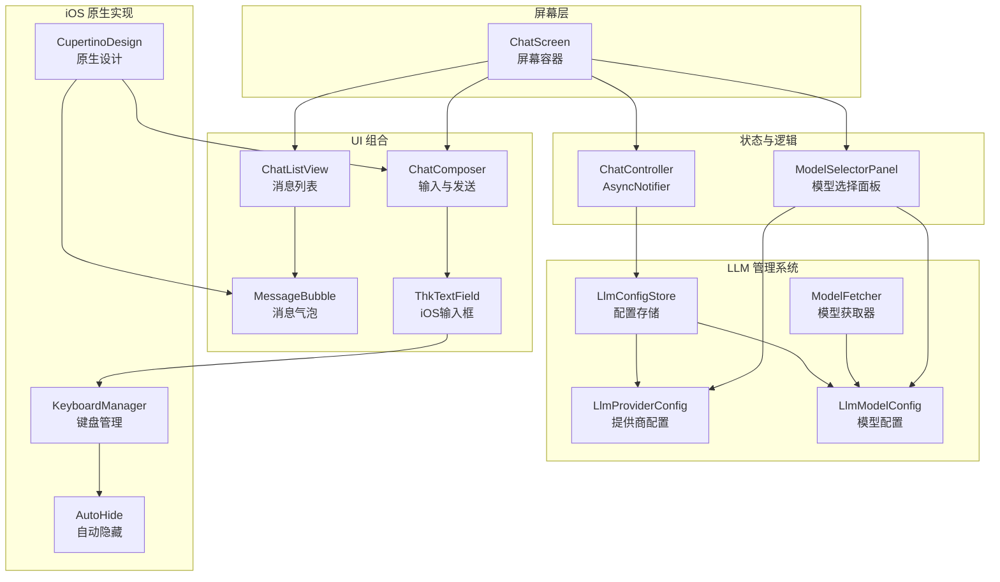
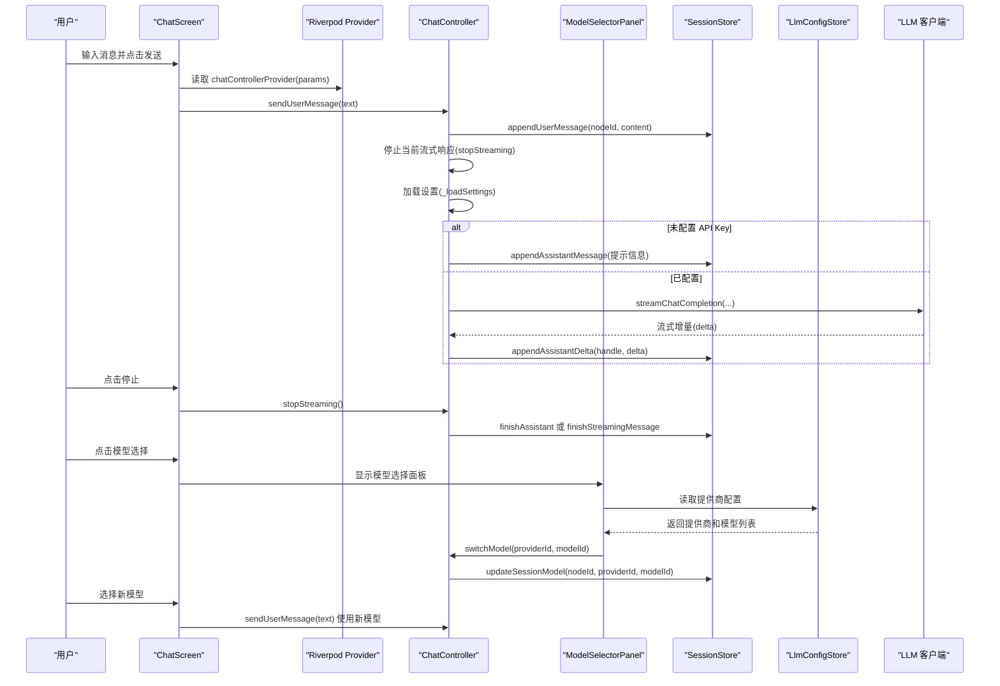
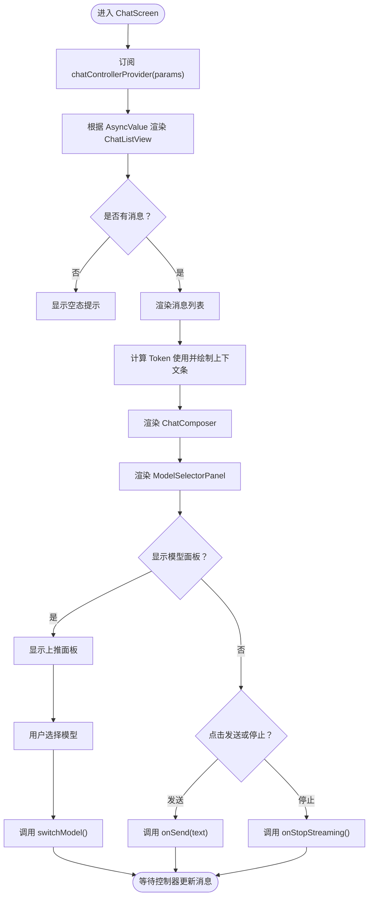
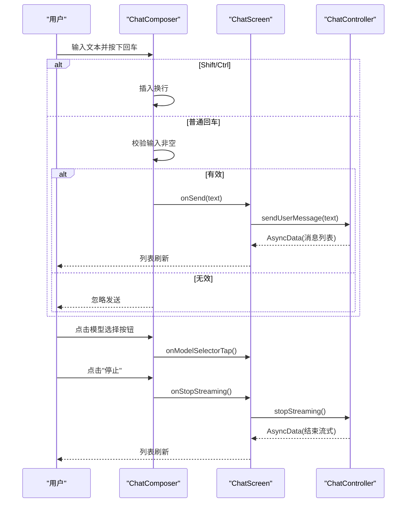
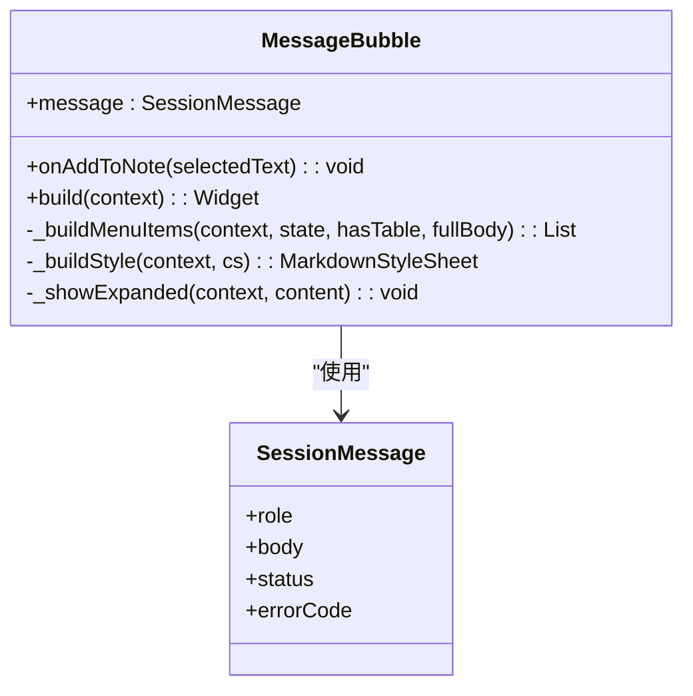
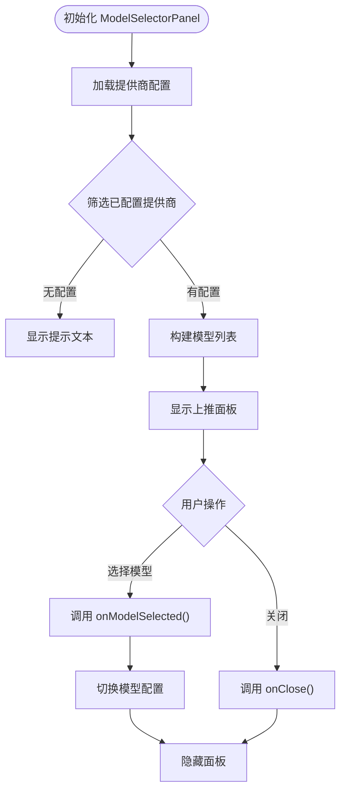
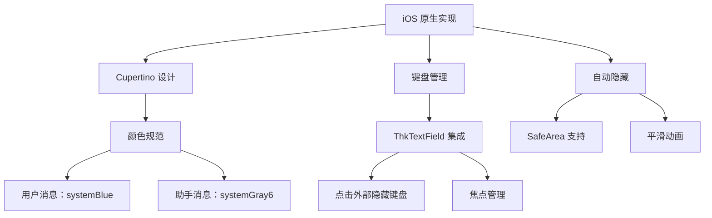
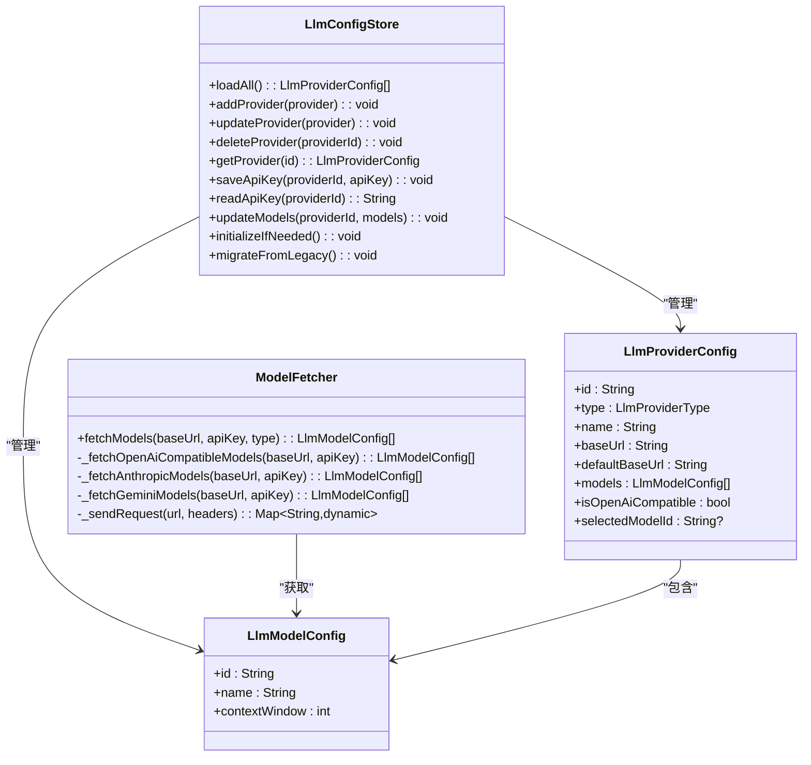
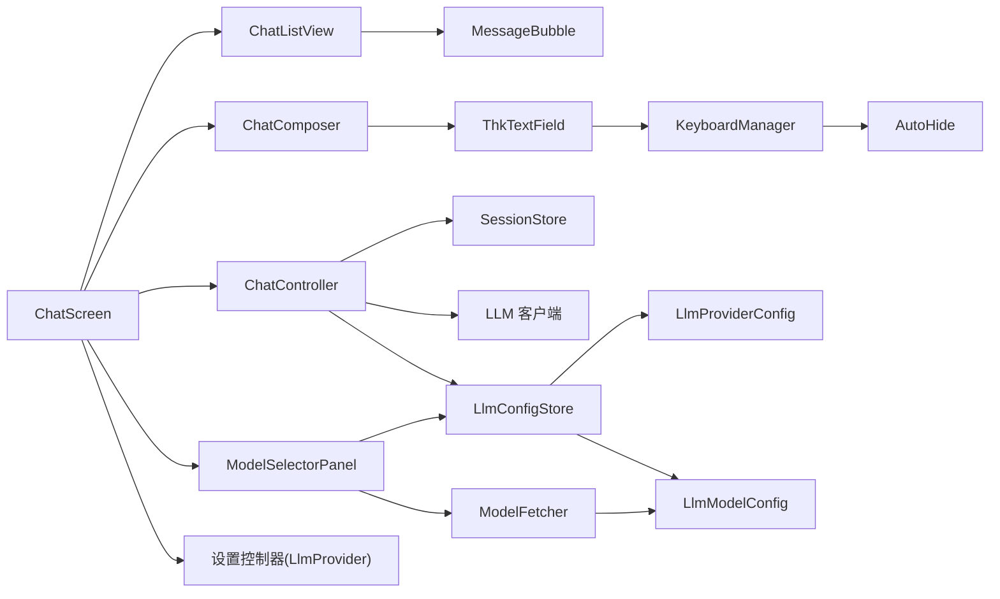

# 聊天界面组件

<cite>
**本文引用的文件**
- [lib/ui/features/chat/chat_screen.dart](file://lib/ui/features/chat/chat_screen.dart)
- [lib/ui/features/chat/chat_controller.dart](file://lib/ui/features/chat/chat_controller.dart)
- [lib/ui/features/chat/widgets/model_selector_panel.dart](file://lib/ui/features/chat/widgets/model_selector_panel.dart)
- [lib/ui/core/shared/chat_list_view.dart](file://lib/ui/core/shared/chat_list_view.dart)
- [lib/ui/core/shared/chat_composer.dart](file://lib/ui/core/shared/chat_composer.dart)
- [lib/ui/core/shared/message_bubble.dart](file://lib/ui/core/shared/message_bubble.dart)
- [lib/ui/core/widgets/thk_text_field.dart](file://lib/ui/core/widgets/thk_text_field.dart)
- [lib/data/models/llm_provider_config.dart](file://lib/data/models/llm_provider_config.dart)
- [lib/data/models/llm_model_config.dart](file://lib/data/models/llm_model_config.dart)
- [lib/data/models/preset_providers.dart](file://lib/data/models/preset_providers.dart)
- [lib/data/services/model_fetcher.dart](file://lib/data/services/model_fetcher.dart)
- [lib/data/stores/llm_config_store.dart](file://lib/data/stores/llm_config_store.dart)
- [lib/ui/features/llm/llm_providers_screen.dart](file://lib/ui/features/llm/llm_providers_screen.dart)
- [docs/ios-migration-plan.md](file://docs/ios-migration-plan.md)
- [test/ui/core/shared/chat_composer_test.dart](file://test/ui/core/shared/chat_composer_test.dart)
- [test/ui/core/shared/chat_list_view_test.dart](file://test/ui/core/shared/chat_list_view_test.dart)
- [test/ui/core/shared/message_bubble_test.dart](file://test/ui/core/shared/message_bubble_test.dart)
</cite>

## 更新摘要
**变更内容**
- 新增 iOS 原生聊天组件实现细节，包括 ChatComposer 和 MessageBubble 的 Cupertino 风格设计
- 更新键盘管理与自动隐藏功能的实现机制
- 新增 ThkTextField iOS 风格输入框的集成方案
- 完善 iOS 迁移计划中的组件定制要求

## 目录
1. [简介](#简介)
2. [项目结构](#项目结构)
3. [核心组件](#核心组件)
4. [架构总览](#架构总览)
5. [详细组件分析](#详细组件分析)
6. [iOS 原生实现细节](#ios-原生实现细节)
7. [LLM 提供商管理系统](#llm-提供商管理系统)
8. [依赖关系分析](#依赖关系分析)
9. [性能考量](#性能考量)
10. [故障排查指南](#故障排查指南)
11. [结论](#结论)
12. [附录](#附录)

## 简介
本文件面向初学者与高级开发者，系统性地文档化聊天界面组件，涵盖 ChatScreen 架构与用户交互流程、ChatListView 的消息渲染与滚动行为、ChatComposer 的输入与发送控制、MessageBubble 的样式与交互，以及新增的模型选择面板和 LLM 提供商管理系统。文档还详细介绍了上下文使用量指示器的设计、实时模型可用性信息集成，以及对话级模型配置管理。

**重大更新**：本次现代化改造引入了全新的 iOS 原生聊天组件实现，包括：
- **Cupertino 风格 ChatComposer**：基于 CupertinoTextField 的原生输入框，支持键盘管理与自动隐藏
- **iOS 原生 MessageBubble**：采用系统蓝色与灰色主题，圆角设计符合 iOS HIG
- **ThkTextField 集成**：提供点击外部自动隐藏键盘的 iOS 风格输入框
- **完整的 iOS 迁移计划**：从 Material Design 迁移到 Cupertino Design 的详细实施方案

## 项目结构
聊天界面相关的核心文件位于以下路径：
- 屏幕级容器：lib/ui/features/chat/chat_screen.dart
- 控制器（Riverpod AsyncNotifier）：lib/ui/features/chat/chat_controller.dart
- 模型选择面板：lib/ui/features/chat/widgets/model_selector_panel.dart
- 列表视图：lib/ui/core/shared/chat_list_view.dart
- 输入组合器：lib/ui/core/shared/chat_composer.dart
- 消息气泡：lib/ui/core/shared/message_bubble.dart
- iOS 风格输入框：lib/ui/core/widgets/thk_text_field.dart
- LLM 提供商配置：lib/data/models/llm_provider_config.dart
- LLM 模型配置：lib/data/models/llm_model_config.dart
- 预置提供商：lib/data/models/preset_providers.dart
- 模型获取器：lib/data/services/model_fetcher.dart
- 配置存储：lib/data/stores/llm_config_store.dart
- 提供商管理界面：lib/ui/features/llm/llm_providers_screen.dart
- iOS 迁移计划：docs/ios-migration-plan.md
- 测试用例：test/ui/core/shared/chat_composer_test.dart、chat_list_view_test.dart、message_bubble_test.dart

**图表来源**
- [lib/ui/features/chat/chat_screen.dart:19-175](file://lib/ui/features/chat/chat_screen.dart#L19-L175)
- [lib/ui/features/chat/chat_controller.dart:18-243](file://lib/ui/features/chat/chat_controller.dart#L18-L243)
- [lib/ui/features/chat/widgets/model_selector_panel.dart:8-133](file://lib/ui/features/chat/widgets/model_selector_panel.dart#L8-L133)
- [lib/ui/core/shared/chat_list_view.dart:8-99](file://lib/ui/core/shared/chat_list_view.dart#L8-L99)
- [lib/ui/core/shared/chat_composer.dart:5-160](file://lib/ui/core/shared/chat_composer.dart#L5-L160)
- [lib/ui/core/shared/message_bubble.dart:41-215](file://lib/ui/core/shared/message_bubble.dart#L41-L215)
- [lib/ui/core/widgets/thk_text_field.dart:1-151](file://lib/ui/core/widgets/thk_text_field.dart#L1-L151)
- [docs/ios-migration-plan.md:192-215](file://docs/ios-migration-plan.md#L192-L215)

**章节来源**
- [lib/ui/features/chat/chat_screen.dart:1-353](file://lib/ui/features/chat/chat_screen.dart#L1-L353)
- [lib/ui/features/chat/chat_controller.dart:1-352](file://lib/ui/features/chat/chat_controller.dart#L1-L352)
- [lib/ui/features/chat/widgets/model_selector_panel.dart:1-234](file://lib/ui/features/chat/widgets/model_selector_panel.dart#L1-L234)
- [lib/ui/core/shared/chat_list_view.dart:1-99](file://lib/ui/core/shared/chat_list_view.dart#L1-L99)
- [lib/ui/core/shared/chat_composer.dart:1-200](file://lib/ui/core/shared/chat_composer.dart#L1-L200)
- [lib/ui/core/shared/message_bubble.dart:1-294](file://lib/ui/core/shared/message_bubble.dart#L1-L294)
- [lib/ui/core/widgets/thk_text_field.dart:1-151](file://lib/ui/core/widgets/thk_text_field.dart#L1-L151)
- [docs/ios-migration-plan.md:1-266](file://docs/ios-migration-plan.md#L1-L266)

## 核心组件
- **ChatScreen**：负责应用栏、消息列表、上下文使用量条、输入框、分支摘要跳转和新增的模型选择面板；通过 Riverpod 订阅 ChatController 提供的消息流。
- **ChatListView**：基于 ListView.builder 的消息列表，支持自动贴底、滚动粘连与空态提示。
- **ChatComposer**：多行文本输入、回车发送、Shift+回车换行、发送/停止按钮联动、输入校验与错误恢复，支持模型选择按钮。**iOS 版本采用 CupertinoTextField，支持键盘管理与自动隐藏**。
- **MessageBubble**：根据角色与状态渲染标题、Markdown 内容、表格内联/展开、选择菜单与"添加到笔记"等交互。**iOS 版本使用系统蓝色与灰色主题，圆角设计符合 iOS HIG**。
- **ThkTextField**：iOS 风格文本输入框，基于 CupertinoTextField，支持点击外部自动隐藏键盘、圆角边框等 iOS 风格效果。
- **ChatController**：管理会话消息的读取、发送、流式响应、停止、错误处理与日志追踪，支持对话级模型配置。
- **ModelSelectorPanel**：新增的模型选择面板，采用腾讯风格上推布局，支持实时模型可用性信息显示。
- **LLM 提供商管理系统**：包括提供商配置、模型配置、配置存储、模型获取器和提供商管理界面。

**章节来源**
- [lib/ui/features/chat/chat_screen.dart:19-175](file://lib/ui/features/chat/chat_screen.dart#L19-L175)
- [lib/ui/core/shared/chat_list_view.dart:8-99](file://lib/ui/core/shared/chat_list_view.dart#L8-L99)
- [lib/ui/core/shared/chat_composer.dart:5-200](file://lib/ui/core/shared/chat_composer.dart#L5-L200)
- [lib/ui/core/shared/message_bubble.dart:41-294](file://lib/ui/core/shared/message_bubble.dart#L41-L294)
- [lib/ui/core/widgets/thk_text_field.dart:1-151](file://lib/ui/core/widgets/thk_text_field.dart#L1-L151)
- [lib/ui/features/chat/chat_controller.dart:18-243](file://lib/ui/features/chat/chat_controller.dart#L18-L243)
- [lib/ui/features/chat/widgets/model_selector_panel.dart:8-133](file://lib/ui/features/chat/widgets/model_selector_panel.dart#L8-L133)

## 架构总览
下图展示了从屏幕到控制器再到 LLM 客户端的调用链路，以及消息状态在 UI 中的呈现方式，包括新增的模型选择面板和提供商管理系统。

**图表来源**
- [lib/ui/features/chat/chat_screen.dart:137-146](file://lib/ui/features/chat/chat_screen.dart#L137-L146)
- [lib/ui/features/chat/chat_controller.dart:111-215](file://lib/ui/features/chat/chat_controller.dart#L111-L215)
- [lib/ui/features/chat/widgets/model_selector_panel.dart:29-114](file://lib/ui/features/chat/widgets/model_selector_panel.dart#L29-L114)

**章节来源**
- [lib/ui/features/chat/chat_screen.dart:112-149](file://lib/ui/features/chat/chat_screen.dart#L112-L149)
- [lib/ui/features/chat/chat_controller.dart:111-215](file://lib/ui/features/chat/chat_controller.dart#L111-L215)

## 详细组件分析

### ChatScreen：屏幕容器与上下文使用量指示器
- **应用栏**：返回、树视图导航、分支摘要入口；分支摘要入口根据会话内容生成摘要参数并跳转。
- **消息区域**：通过 AsyncValue 渲染 ChatListView，并注入 MessageBubble；空态与错误态分别显示提示与加载指示。
- **上下文使用量条**：根据消息体估算 Token 数，结合 LLM 提供商的上下文窗口计算比例，颜色随占用率变化；Tooltip 显示具体数值。
- **输入区**：ChatComposer 接收提示文案、是否正在流式、发送回调、停止回调和模型选择回调；根据 isStreaming 动态切换按钮文字与行为。
- **模型选择面板**：新增的腾讯风格上推布局，面板出现时对话内容上推；支持实时模型可用性信息显示。

**图表来源**
- [lib/ui/features/chat/chat_screen.dart:40-149](file://lib/ui/features/chat/chat_screen.dart#L40-L149)
- [lib/ui/features/chat/chat_screen.dart:177-219](file://lib/ui/features/chat/chat_screen.dart#L177-L219)
- [lib/ui/features/chat/chat_screen.dart:232-246](file://lib/ui/features/chat/chat_screen.dart#L232-L246)

**章节来源**
- [lib/ui/features/chat/chat_screen.dart:19-175](file://lib/ui/features/chat/chat_screen.dart#L19-L175)

### ChatListView：消息渲染、滚动行为与性能优化
- **渲染机制**：ListView.builder，按需构建每个消息项，使用外部传入的 messageBuilder 生成 MessageBubble。
- **自动贴底**：首次构建后，若处于底部附近则平滑滚动到底部；当用户主动向上滚动时暂停自动贴底，回到底部时重新启用。
- **性能优化**：仅在需要时滚动至底部；对空消息列表显示友好提示；使用稳定的键控与最小化重建范围。

**图表来源**
- [lib/ui/core/shared/chat_list_view.dart:34-98](file://lib/ui/core/shared/chat_list_view.dart#L34-L98)

**章节来源**
- [lib/ui/core/shared/chat_list_view.dart:8-99](file://lib/ui/core/shared/chat_list_view.dart#L8-L99)

### ChatComposer：文本输入、发送按钮、停止流式响应与输入验证
- **输入行为**：多行 TextField，禁用自动纠错与建议；支持 Shift/Ctrl+回车插入换行，普通回车发送；输入长度为纯空白时禁止发送。
- **发送流程**：清空输入框，调用 onSend；成功后重新聚焦；异常时回填文本并弹出 SnackBar。
- **停止流式**：当 isStreaming 为真时按钮显示"停止"，调用 onStopStreaming；异常时弹出 SnackBar。
- **模型选择**：新增 onModelSelectorTap 回调，支持点击模型选择按钮；enabled=false 时按钮禁用；默认自动聚焦输入框。
- **iOS 原生实现**：采用 CupertinoTextField，支持键盘管理与自动隐藏功能。

**图表来源**
- [lib/ui/core/shared/chat_composer.dart:46-135](file://lib/ui/core/shared/chat_composer.dart#L46-L135)
- [lib/ui/features/chat/chat_screen.dart:137-146](file://lib/ui/features/chat/chat_screen.dart#L137-L146)
- [lib/ui/features/chat/chat_controller.dart:111-140](file://lib/ui/features/chat/chat_controller.dart#L111-L140)

**章节来源**
- [lib/ui/core/shared/chat_composer.dart:5-200](file://lib/ui/core/shared/chat_composer.dart#L5-L200)
- [test/ui/core/shared/chat_composer_test.dart:65-133](file://test/ui/core/shared/chat_composer_test.dart#L65-L133)

### MessageBubble：消息样式、交互功能与自定义选项
- **角色与标题**：根据 SessionRole 显示 user/assistant/system 标题；done 状态不显示状态文本，其他状态显示对应状态描述。
- **颜色与布局**：用户消息使用主容器色，助手消息使用高表层色；整体采用卡片与内边距，最大宽度适配长表格。
- **Markdown 渲染**：支持段落、代码、代码块、表格等；表格检测与内联/展开两种模式；展开视图支持缩放与垂直滚动。
- **选择菜单**：支持复制、剪切、粘贴、全选等；当提供 onAddToNote 且存在选中文本时，增加"添加到笔记"菜单项；表格存在时可展开查看。
- **表格增强**：检测连续的表头与分隔行，自动识别表格；横向滚动以适配宽表；展开视图提升可读性。
- **iOS 原生设计**：用户消息使用系统蓝色，助手消息使用系统灰色6，圆角半径符合 iOS HIG。

**图表来源**
- [lib/ui/core/shared/message_bubble.dart:41-215](file://lib/ui/core/shared/message_bubble.dart#L41-L215)

**章节来源**
- [lib/ui/core/shared/message_bubble.dart:41-294](file://lib/ui/core/shared/message_bubble.dart#L41-L294)
- [test/ui/core/shared/message_bubble_test.dart:42-144](file://test/ui/core/shared/message_bubble_test.dart#L42-L144)

### 上下文使用量指示器：ContextUsageBar
- **计算方式**：遍历所有消息体估算 Token 数，累加得到已用；结合 LLM 提供商的上下文窗口计算占比。
- **视觉反馈**：根据占比阈值切换颜色（低/中/高），顶部细条形展示使用进度；Tooltip 显示具体数值。
- **数据来源**：messages 列表与 LlmProvider 的上下文窗口与格式化能力。

**章节来源**
- [lib/ui/features/chat/chat_screen.dart:177-219](file://lib/ui/features/chat/chat_screen.dart#L177-L219)

### ModelSelectorPanel：模型选择面板
- **界面设计**：采用腾讯风格上推布局，面板出现时对话内容上推；支持最大高度限制（屏幕高度的35%）。
- **实时模型显示**：只显示已配置好的提供商（有模型列表或有已选中的模型）；支持提供商分组显示。
- **交互功能**：点击模型项触发 onModelSelected 回调；支持关闭按钮；当前选中模型高亮显示。
- **错误处理**：加载中显示进度指示器，错误时显示错误信息，无配置时显示提示文本。

**图表来源**
- [lib/ui/features/chat/widgets/model_selector_panel.dart:29-114](file://lib/ui/features/chat/widgets/model_selector_panel.dart#L29-L114)
- [lib/ui/features/chat/widgets/model_selector_panel.dart:117-177](file://lib/ui/features/chat/widgets/model_selector_panel.dart#L117-L177)

**章节来源**
- [lib/ui/features/chat/widgets/model_selector_panel.dart:8-234](file://lib/ui/features/chat/widgets/model_selector_panel.dart#L8-L234)

## iOS 原生实现细节

### Cupertino 风格设计
- **ChatComposer iOS 实现**：采用 CupertinoTextField 替代标准 TextField，提供原生 iOS 输入体验
- **MessageBubble iOS 设计**：用户消息使用系统蓝色（systemBlue），助手消息使用系统灰色6（systemGrey6），符合 iOS HIG 设计规范
- **圆角设计**：MessageBubble 采用 12 圆角半径，符合 iOS 消息气泡设计标准
- **气泡样式**：iOS 默认不绘制气泡尾巴，简化视觉层次

### 键盘管理与自动隐藏
- **ThkTextField 集成**：提供点击外部自动隐藏键盘的功能，提升 iOS 用户体验
- **焦点管理**：通过 FocusNode 和 KeyboardManager 实现精确的键盘控制
- **SafeArea 支持**：确保在刘海屏和底部安全区域内的正确显示

### iOS 迁移计划实施
- **组件定制要求**：按照 iOS 迁移计划，ChatComposer 输入框将更换为 ThkTextField，发送按钮更换为 CupertinoButton.filled
- **颜色规范**：MessageBubble 颜色规范为 user 使用 systemBlue，assistant 使用 systemGray6
- **圆角标准**：MessageBubble 圆角半径调整为 18，符合 iOS HIG
- **气泡设计**：iOS 默认不绘制气泡尾巴，保持简洁设计

**图表来源**
- [lib/ui/core/shared/chat_composer.dart:81-102](file://lib/ui/core/shared/chat_composer.dart#L81-L102)
- [lib/ui/core/shared/message_bubble.dart:68-70](file://lib/ui/core/shared/message_bubble.dart#L68-L70)
- [lib/ui/core/widgets/thk_text_field.dart:114-149](file://lib/ui/core/widgets/thk_text_field.dart#L114-L149)
- [docs/ios-migration-plan.md:192-215](file://docs/ios-migration-plan.md#L192-L215)

**章节来源**
- [lib/ui/core/shared/chat_composer.dart:1-200](file://lib/ui/core/shared/chat_composer.dart#L1-L200)
- [lib/ui/core/shared/message_bubble.dart:1-294](file://lib/ui/core/shared/message_bubble.dart#L1-L294)
- [lib/ui/core/widgets/thk_text_field.dart:1-151](file://lib/ui/core/widgets/thk_text_field.dart#L1-L151)
- [docs/ios-migration-plan.md:192-215](file://docs/ios-migration-plan.md#L192-L215)

## LLM 提供商管理系统

### LlmProviderConfig：提供商配置
- **核心属性**：唯一ID、提供商类型、显示名称、API基础URL、默认URL、模型列表、OpenAI兼容标志、选中模型ID。
- **序列化支持**：支持JSON序列化和反序列化，便于持久化存储。
- **类型枚举**：支持多种提供商类型（OpenAI、Anthropic、Gemini、DeepSeek、Kimi、Minimax、MIMO、Custom）。

### LlmModelConfig：模型配置
- **核心属性**：模型ID、显示名称、上下文窗口大小（tokens）。
- **序列化支持**：支持JSON序列化和反序列化。
- **默认值**：上下文窗口默认值为1亿（_defaultContextWindow）。

### LlmConfigStore：配置存储
- **存储机制**：独立的JSON文件存储提供商配置，API Key通过 flutter_secure_storage 单独加密存储。
- **初始化**：支持预置提供商初始化（幂等），确保首次启动时的配置完整性。
- **迁移支持**：从旧配置格式迁移到新格式，支持API Key和模型配置的迁移。
- **模型管理**：支持动态更新提供商的模型列表。

### ModelFetcher：模型获取器
- **实时获取**：支持从各提供商API实时获取可用模型列表。
- **多提供商支持**：支持 OpenAI 兼容接口、Anthropic、Gemini 等不同提供商的API。
- **智能过滤**：自动过滤非聊天模型（embedding、whisper、tts、dall-e等关键词）。
- **错误处理**：统一处理网络错误、认证错误和解析错误。

### 预置提供商系统
- **固定ID**：每个预置提供商使用固定的、确定性的ID（`preset_`前缀+type name）。
- **初始化逻辑**：确保迁移和初始化逻辑可以幂等执行。
- **支持提供商**：OpenAI、Anthropic、Gemini、DeepSeek、Kimi、Minimax、MIMO。

**图表来源**
- [lib/data/stores/llm_config_store.dart:17-139](file://lib/data/stores/llm_config_store.dart#L17-L139)
- [lib/data/services/model_fetcher.dart:18-240](file://lib/data/services/model_fetcher.dart#L18-L240)
- [lib/data/models/llm_provider_config.dart:36-107](file://lib/data/models/llm_provider_config.dart#L36-L107)
- [lib/data/models/llm_model_config.dart:1-39](file://lib/data/models/llm_model_config.dart#L1-L39)

**章节来源**
- [lib/data/models/llm_provider_config.dart:1-108](file://lib/data/models/llm_provider_config.dart#L1-L108)
- [lib/data/models/llm_model_config.dart:1-39](file://lib/data/models/llm_model_config.dart#L1-L39)
- [lib/data/models/preset_providers.dart:1-67](file://lib/data/models/preset_providers.dart#L1-L67)
- [lib/data/services/model_fetcher.dart:1-240](file://lib/data/services/model_fetcher.dart#L1-L240)
- [lib/data/stores/llm_config_store.dart:1-139](file://lib/data/stores/llm_config_store.dart#L1-L139)

## 依赖关系分析
- **ChatScreen** 依赖 ChatController 提供的消息流，通过 Riverpod 的 autoDispose.family 注册；同时依赖设置控制器获取 LLM 提供商信息。
- **ChatListView** 依赖外部传入的 messageBuilder，解耦消息渲染细节，便于复用 MessageBubble。
- **ChatComposer** 依赖外部回调 onSend 与 onStopStreaming，实现输入与发送控制的解耦，支持模型选择回调。**iOS 版本依赖 ThkTextField 进行键盘管理**。
- **MessageBubble** 依赖 Markdown 渲染与主题样式，内部封装表格检测与展开逻辑。**iOS 版本使用 CupertinoColors 主题**。
- **ThkTextField** 作为 iOS 风格输入框，提供点击外部自动隐藏键盘功能。
- **ChatController** 依赖 SessionStore 与 LLM 客户端，负责消息的增删改查与流式处理，支持对话级模型配置。
- **ModelSelectorPanel** 依赖 llmProvidersProvider 提供的实时提供商配置，支持模型选择与切换。
- **LLM 提供商管理系统** 形成完整的配置管理闭环，包括配置存储、模型获取、迁移支持等功能。

**图表来源**
- [lib/ui/features/chat/chat_screen.dart:42-136](file://lib/ui/features/chat/chat_screen.dart#L42-L136)
- [lib/ui/features/chat/chat_controller.dart:147-215](file://lib/ui/features/chat/chat_controller.dart#L147-L215)
- [lib/ui/features/chat/widgets/model_selector_panel.dart:26-114](file://lib/ui/features/chat/widgets/model_selector_panel.dart#L26-L114)
- [lib/ui/core/shared/chat_composer.dart:1-200](file://lib/ui/core/shared/chat_composer.dart#L1-L200)
- [lib/ui/core/shared/message_bubble.dart:1-294](file://lib/ui/core/shared/message_bubble.dart#L1-L294)
- [lib/ui/core/widgets/thk_text_field.dart:1-151](file://lib/ui/core/widgets/thk_text_field.dart#L1-L151)

**章节来源**
- [lib/ui/features/chat/chat_screen.dart:1-353](file://lib/ui/features/chat/chat_screen.dart#L1-L353)
- [lib/ui/features/chat/chat_controller.dart:1-352](file://lib/ui/features/chat/chat_controller.dart#L1-L352)
- [lib/ui/features/chat/widgets/model_selector_panel.dart:1-234](file://lib/ui/features/chat/widgets/model_selector_panel.dart#L1-L234)

## 性能考量
- **列表渲染**
  - 使用 ListView.builder 按需渲染，避免一次性构建大量子项。
  - 仅在接近底部时执行自动滚动，减少不必要的动画与重绘。
- **流式响应**
  - ChatController 通过流式监听增量，逐帧更新 UI，避免阻塞主线程。
  - 支持取消令牌与停止请求，防止旧流覆盖新流。
- **输入与交互**
  - ChatComposer 在发送前进行空值校验，避免无意义的网络请求。
  - 错误恢复：发送失败时回填文本并提示，保证用户体验连续性。
  - **iOS 优化**：ThkTextField 的点击外部隐藏键盘功能减少不必要的键盘显示。
- **主题与样式**
  - MessageBubble 的 MarkdownStyleSheet 复用主题，减少重复样式对象创建。
  - **Cupertino 颜色缓存**：使用 resolveFrom(context) 方法缓存颜色值，提升渲染性能。
- **模型选择面板**
  - 使用最大高度限制（屏幕高度的35%），避免过度占用屏幕空间。
  - 仅显示已配置的提供商，减少不必要的渲染开销。
- **LLM 配置管理**
  - LlmConfigStore 缓存配置数据，避免频繁的文件读写操作。
  - ModelFetcher 统一处理网络请求，包含超时和错误处理机制。

**章节来源**
- [lib/ui/core/shared/chat_list_view.dart:74-98](file://lib/ui/core/shared/chat_list_view.dart#L74-L98)
- [lib/ui/core/shared/chat_composer.dart:119-135](file://lib/ui/core/shared/chat_composer.dart#L119-L135)
- [lib/ui/features/chat/chat_controller.dart:170-215](file://lib/ui/features/chat/chat_controller.dart#L170-L215)
- [lib/ui/core/shared/message_bubble.dart:187-206](file://lib/ui/core/shared/message_bubble.dart#L187-L206)
- [lib/ui/features/chat/widgets/model_selector_panel.dart:54-57](file://lib/ui/features/chat/widgets/model_selector_panel.dart#L54-L57)
- [lib/data/stores/llm_config_store.dart:22-48](file://lib/data/stores/llm_config_store.dart#L22-L48)

## 故障排查指南
- **发送按钮不可用**
  - 检查 enabled 参数是否为 false；确认 isStreaming 状态是否正确传递。
- **发送后无响应**
  - 确认 onSend 回调是否被触发；检查 ChatController 的 sendUserMessage 是否抛出异常。
- **停止流式无效**
  - 确认 onStopStreaming 回调是否被调用；检查 ChatController 的 stopStreaming 是否成功取消流与完成消息。
- **表格无法展开**
  - 确认消息内容是否满足表格识别规则；检查 ContextMenu 是否包含"展开表格"项。
- **上下文条颜色不变**
  - 检查消息体 Token 估算是否正常；确认 LlmProvider 的上下文窗口与格式化函数可用。
- **模型选择面板无响应**
  - 检查 llmProvidersProvider 是否正确加载；确认 onModelSelected 回调是否被调用。
- **模型切换失败**
  - 确认提供商ID和模型ID是否有效；检查 LlmConfigStore 的 updateSessionModel 是否成功。
- **API Key 读取失败**
  - 检查 flutter_secure_storage 是否正常工作；确认迁移过程是否完成。
- **模型获取失败**
  - 检查网络连接和API Key有效性；确认提供商URL是否正确。
- **iOS 输入框问题**
  - 检查 ThkTextField 是否正确集成；确认键盘管理功能是否正常。
- **消息气泡颜色异常**
  - 确认 CupertinoColors 是否正确解析；检查主题配置是否生效。
- **键盘自动隐藏失效**
  - 检查点击外部隐藏逻辑；确认 FocusScope 是否正确处理焦点转移。

**章节来源**
- [lib/ui/core/shared/chat_composer.dart:105-144](file://lib/ui/core/shared/chat_composer.dart#L105-L144)
- [lib/ui/features/chat/chat_controller.dart:55-90](file://lib/ui/features/chat/chat_controller.dart#L55-L90)
- [lib/ui/core/shared/message_bubble.dart:172-182](file://lib/ui/core/shared/message_bubble.dart#L172-L182)
- [lib/ui/features/chat/chat_screen.dart:185-194](file://lib/ui/features/chat/chat_screen.dart#L185-L194)
- [lib/ui/features/chat/widgets/model_selector_panel.dart:111-113](file://lib/ui/features/chat/widgets/model_selector_panel.dart#L111-L113)
- [lib/data/stores/llm_config_store.dart:102-115](file://lib/data/stores/llm_config_store.dart#L102-L115)
- [lib/data/services/model_fetcher.dart:209-230](file://lib/data/services/model_fetcher.dart#L209-L230)

## 结论
该聊天界面组件以清晰的职责分离与可插拔设计实现了完整的消息展示、输入与流式响应能力。通过 Riverpod 管理状态、MessageBubble 封装渲染与交互、ChatListView 优化滚动体验、ChatComposer 统一输入行为，形成了高内聚、低耦合的架构。

**重大更新**：本次现代化改造引入了全新的 iOS 原生聊天组件实现，包括：
- **Cupertino 风格 ChatComposer**：基于 CupertinoTextField 的原生输入框，支持键盘管理与自动隐藏
- **iOS 原生 MessageBubble**：采用系统蓝色与灰色主题，圆角设计符合 iOS HIG
- **ThkTextField 集成**：提供点击外部自动隐藏键盘的 iOS 风格输入框
- **完整的 iOS 迁移计划**：从 Material Design 迁移到 Cupertino Design 的详细实施方案
- **模型选择面板**：提供腾讯风格上推布局，支持实时模型可用性信息显示
- **LLM 提供商管理**：支持多提供商配置、模型列表获取、API Key安全存储
- **对话级模型配置**：每个对话可独立配置提供商和模型
- **预置提供商系统**：包含迁移和初始化逻辑，确保配置完整性

对于初学者，建议从 ChatScreen 的集成与 MessageBubble 的基础样式入手；对于高级开发者，可在 ChatController 扩展更多消息类型、在 MessageBubble 增强交互、在 ChatListView 优化滚动策略，或在 LLM 提供商管理系统中扩展新的提供商类型。

## 附录

### 扩展消息类型的实践路径
- **新增消息类型**
  - 在数据层定义新的 SessionMessage 字段或枚举值。
  - 在 MessageBubble 中新增条件渲染与样式映射。
  - 在 ChatListView 的 messageBuilder 中为新类型提供专用渲染。
- **新增交互功能**
  - 在 MessageBubble 的上下文菜单中添加新按钮项，绑定回调。
  - 在 ChatScreen 中扩展 onAddToNote 或新增回调，接入笔记系统。
- **自定义视觉效果**
  - 通过 MarkdownStyleSheet 调整字体、颜色与表格样式。
  - 使用主题色方案统一卡片与文本风格。

### LLM 提供商扩展指南
- **添加新的提供商类型**
  - 在 LlmProviderType 中添加新类型枚举值。
  - 在 createPresetProviders 中添加预置提供商配置。
  - 在 ModelFetcher 中添加对应的模型获取逻辑。
- **自定义模型获取逻辑**
  - 扩展 ModelFetcher 的 fetchModels 方法，添加新的API解析逻辑。
  - 实现相应的 _fetchXxxModels 私有方法。
- **集成新的模型配置**
  - 在 LlmModelConfig 中处理新的字段映射。
  - 更新 LlmProviderConfig 的序列化逻辑。

### 模型选择面板定制
- **界面定制**
  - 修改 ModelSelectorPanel 的样式和布局。
  - 调整最大高度限制和动画效果。
- **交互增强**
  - 添加模型搜索和过滤功能。
  - 实现模型详情展示和预览功能。
- **性能优化**
  - 实现模型列表的懒加载和分页。
  - 添加模型缓存机制。

### iOS 原生组件定制指南
- **ChatComposer iOS 定制**
  - 修改 CupertinoTextField 的样式和行为。
  - 自定义键盘快捷键处理逻辑。
  - 集成触觉反馈和动画效果。
- **MessageBubble iOS 定制**
  - 调整圆角半径和阴影效果。
  - 自定义 Markdown 渲染样式。
  - 实现自定义上下文菜单项。
- **ThkTextField iOS 定制**
  - 修改输入框的外观和交互。
  - 自定义清除按钮和前缀/后缀图标。
  - 集成输入验证和格式化功能。

**章节来源**
- [lib/ui/core/shared/message_bubble.dart:143-185](file://lib/ui/core/shared/message_bubble.dart#L143-L185)
- [lib/ui/features/chat/chat_screen.dart:116-122](file://lib/ui/features/chat/chat_screen.dart#L116-L122)
- [lib/data/models/llm_provider_config.dart:3-34](file://lib/data/models/llm_provider_config.dart#L3-L34)
- [lib/data/services/model_fetcher.dart:39-53](file://lib/data/services/model_fetcher.dart#L39-L53)
- [lib/ui/features/chat/widgets/model_selector_panel.dart:54-57](file://lib/ui/features/chat/widgets/model_selector_panel.dart#L54-L57)
- [lib/ui/core/shared/chat_composer.dart:81-102](file://lib/ui/core/shared/chat_composer.dart#L81-L102)
- [lib/ui/core/shared/message_bubble.dart:68-70](file://lib/ui/core/shared/message_bubble.dart#L68-L70)
- [lib/ui/core/widgets/thk_text_field.dart:114-149](file://lib/ui/core/widgets/thk_text_field.dart#L114-L149)
- [docs/ios-migration-plan.md:192-215](file://docs/ios-migration-plan.md#L192-L215)