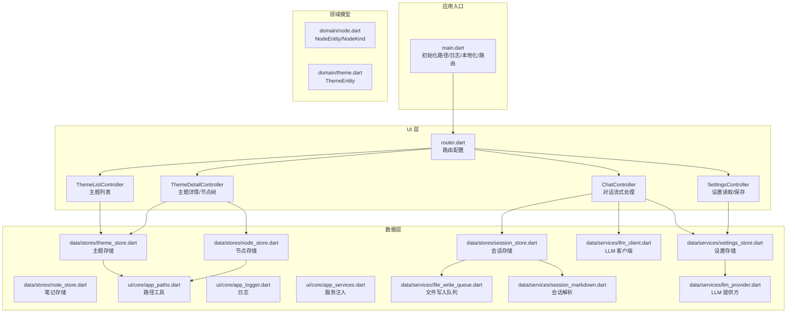
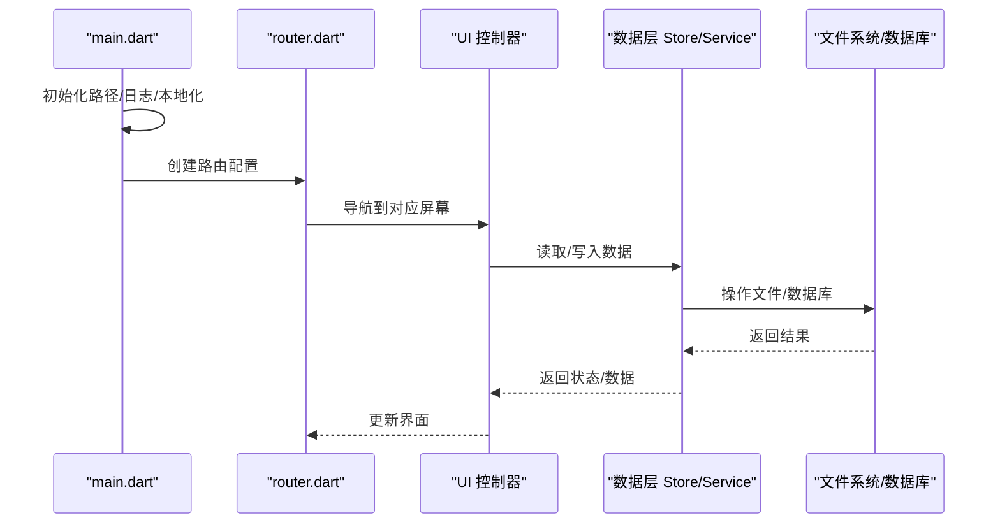
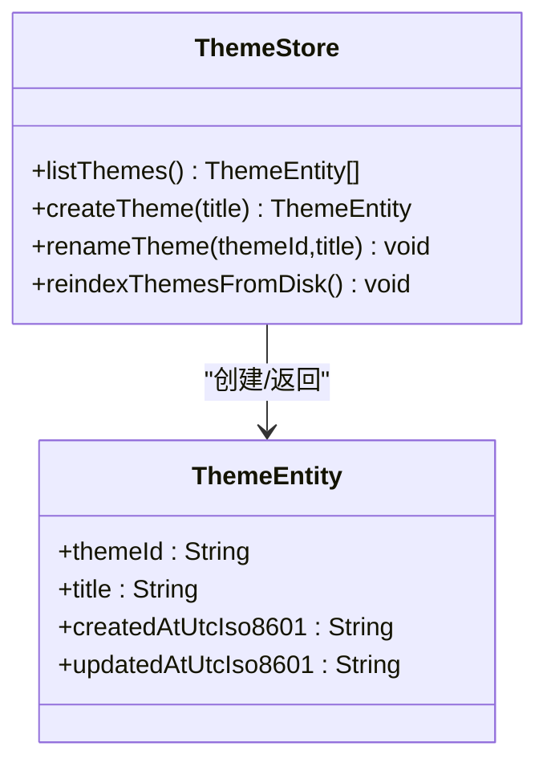
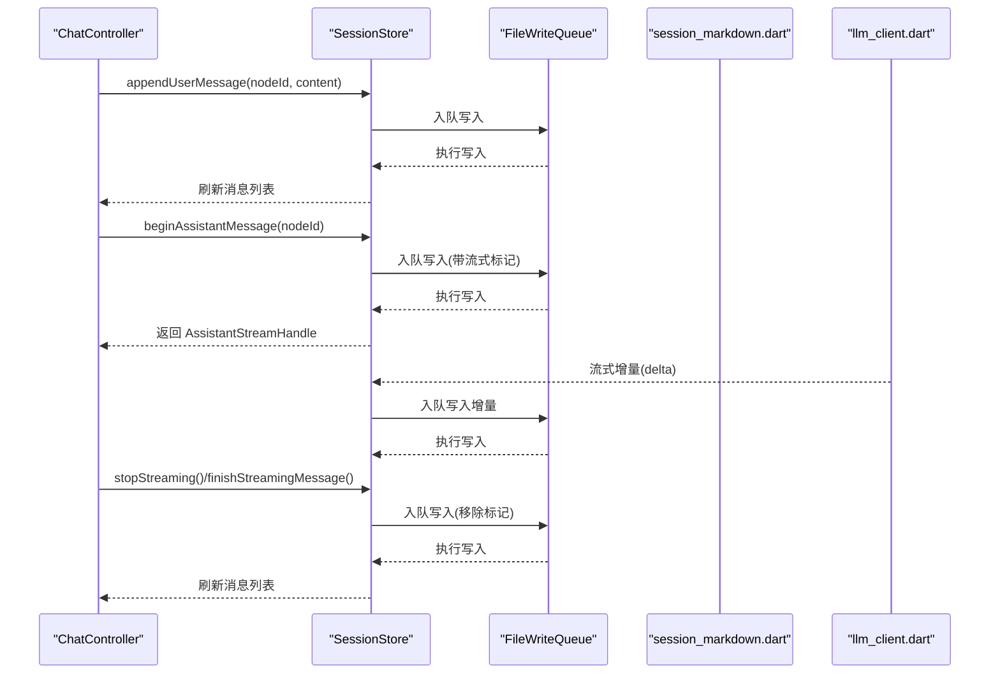
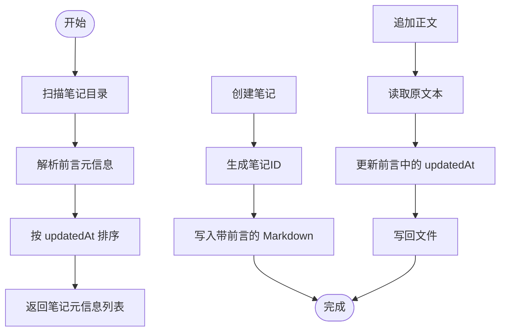
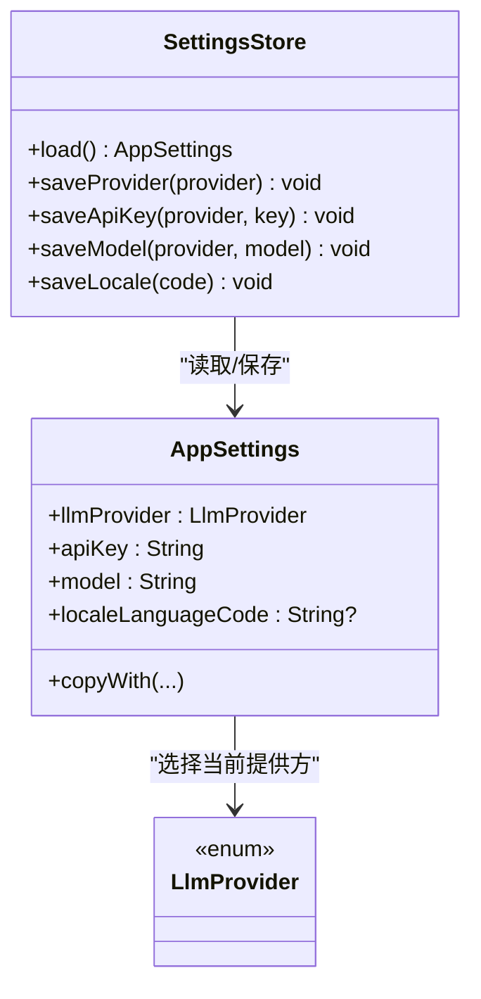
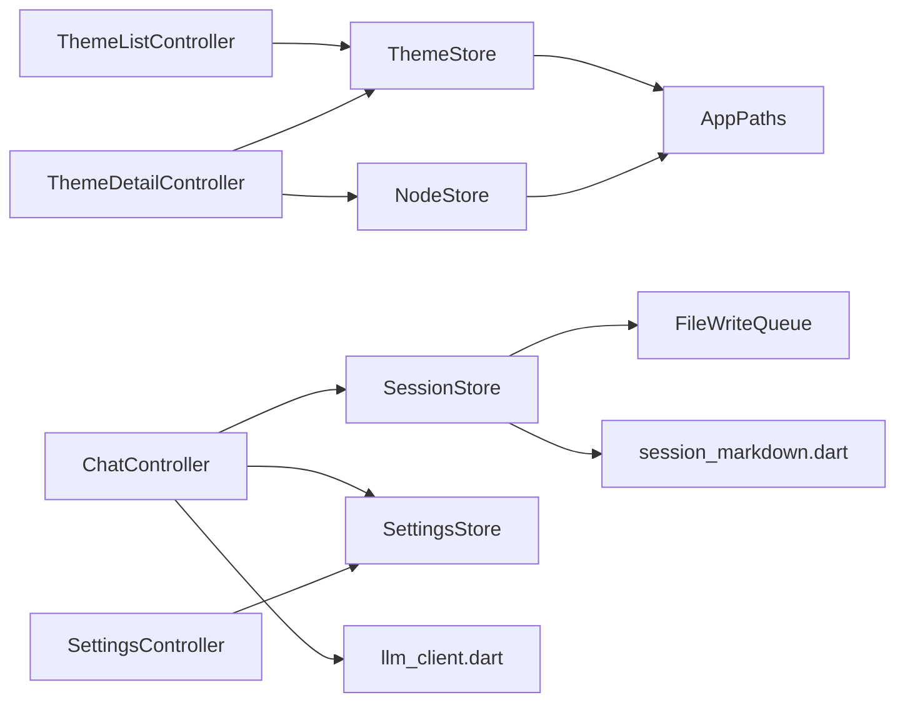

# 核心功能模块

<cite>
**本文引用的文件**
- [lib/main.dart](file://lib/main.dart)
- [lib/domain/node.dart](file://lib/domain/node.dart)
- [lib/domain/theme.dart](file://lib/domain/theme.dart)
- [lib/data/stores/node_store.dart](file://lib/data/stores/node_store.dart)
- [lib/data/stores/theme_store.dart](file://lib/data/stores/theme_store.dart)
- [lib/data/stores/note_store.dart](file://lib/data/stores/note_store.dart)
- [lib/data/stores/session_store.dart](file://lib/data/stores/session_store.dart)
- [lib/ui/features/themes/theme_list_controller.dart](file://lib/ui/features/themes/theme_list_controller.dart)
- [lib/ui/features/themes/theme_detail_controller.dart](file://lib/ui/features/themes/theme_detail_controller.dart)
- [lib/ui/features/chat/chat_controller.dart](file://lib/ui/features/chat/chat_controller.dart)
- [lib/ui/features/settings/settings_controller.dart](file://lib/ui/features/settings/settings_controller.dart)
- [lib/data/services/settings_store.dart](file://lib/data/services/settings_store.dart)
- [lib/ui/core/router.dart](file://lib/ui/core/router.dart)
- [lib/ui/core/app_paths.dart](file://lib/ui/core/app_paths.dart)
- [lib/ui/core/app_services.dart](file://lib/ui/core/app_services.dart)
- [lib/ui/core/app_logger.dart](file://lib/ui/core/app_logger.dart)
- [lib/data/services/session_markdown.dart](file://lib/data/services/session_markdown.dart)
- [lib/data/services/file_write_queue.dart](file://lib/data/services/file_write_queue.dart)
- [lib/data/services/llm_client.dart](file://lib/data/services/llm_client.dart)
- [lib/data/services/llm_provider.dart](file://lib/data/services/llm_provider.dart)
- [lib/data/models/node_meta.dart](file://lib/data/models/node_meta.dart)
- [lib/data/models/theme_meta.dart](file://lib/data/models/theme_meta.dart)
- [test/data/stores/note_store_test.dart](file://test/data/stores/note_store_test.dart)
- [test/data/services/session_markdown_test.dart](file://test/data/services/session_markdown_test.dart)
- [test/ui/features/themes/theme_list_screen_test.dart](file://test/ui/features/themes/theme_list_screen_test.dart)
- [test/ui/core/shared/chat_composer_test.dart](file://test/ui/core/shared/chat_composer_test.dart)
- [test/ui/core/shared/chat_list_view_test.dart](file://test/ui/core/shared/chat_list_view_test.dart)
- [test/ui/core/shared/message_bubble_test.dart](file://test/ui/core/shared/message_bubble_test.dart)
- [test/domain/ids_test.dart](file://test/domain/ids_test.dart)
</cite>

## 目录
1. [简介](#简介)
2. [项目结构](#项目结构)
3. [核心组件](#核心组件)
4. [架构总览](#架构总览)
5. [详细组件分析](#详细组件分析)
6. [依赖分析](#依赖分析)
7. [性能考虑](#性能考虑)
8. [故障排查指南](#故障排查指南)
9. [结论](#结论)
10. [附录](#附录)

## 简介
本文件面向 ThkTree 的四大核心功能模块：主题管理系统、对话管理系统、笔记系统、设置管理系统。文档从架构与数据流角度出发，逐项阐述各模块的业务逻辑、用户交互流程、数据处理机制、模块间协作关系与数据共享方式，并给出使用场景、配置选项与自定义能力，辅以图示帮助初学者理解概念与工作原理，同时为高级开发者提供实现细节与扩展建议。

## 项目结构
ThkTree 采用分层清晰的组织方式：
- 应用入口与路由：在应用入口初始化路径、日志、本地化与全局 Provider 覆盖；通过路由驱动 UI 层。
- 领域模型：定义节点与主题的基础实体类型，统一跨层的数据契约。
- 数据层：包含存储（Store）与服务（Service），负责持久化、索引重建、文件写入队列、会话解析等。
- UI 层：基于 Riverpod 的控制器（AsyncNotifier/Notifier）管理状态，屏幕组件消费状态并触发数据层操作。

**图表来源**
- [lib/main.dart:15-59](file://lib/main.dart#L15-L59)
- [lib/ui/core/router.dart](file://lib/ui/core/router.dart)
- [lib/ui/features/themes/theme_list_controller.dart:5-27](file://lib/ui/features/themes/theme_list_controller.dart#L5-L27)
- [lib/ui/features/themes/theme_detail_controller.dart:19-87](file://lib/ui/features/themes/theme_detail_controller.dart#L19-L87)
- [lib/ui/features/chat/chat_controller.dart:18-221](file://lib/ui/features/chat/chat_controller.dart#L18-L221)
- [lib/ui/features/settings/settings_controller.dart:7-57](file://lib/ui/features/settings/settings_controller.dart#L7-L57)
- [lib/data/stores/theme_store.dart:11-140](file://lib/data/stores/theme_store.dart#L11-L140)
- [lib/data/stores/node_store.dart:12-375](file://lib/data/stores/node_store.dart#L12-L375)
- [lib/data/stores/note_store.dart:53-203](file://lib/data/stores/note_store.dart#L53-L203)
- [lib/data/stores/session_store.dart:8-176](file://lib/data/stores/session_store.dart#L8-L176)
- [lib/data/services/settings_store.dart:106-184](file://lib/data/services/settings_store.dart#L106-L184)
- [lib/ui/core/app_paths.dart](file://lib/ui/core/app_paths.dart)
- [lib/ui/core/app_logger.dart](file://lib/ui/core/app_logger.dart)
- [lib/ui/core/app_services.dart](file://lib/ui/core/app_services.dart)
- [lib/data/services/llm_client.dart](file://lib/data/services/llm_client.dart)
- [lib/data/services/llm_provider.dart](file://lib/data/services/llm_provider.dart)
- [lib/data/services/file_write_queue.dart](file://lib/data/services/file_write_queue.dart)
- [lib/data/services/session_markdown.dart](file://lib/data/services/session_markdown.dart)

**章节来源**
- [lib/main.dart:15-59](file://lib/main.dart#L15-L59)
- [lib/ui/core/router.dart](file://lib/ui/core/router.dart)

## 核心组件
本节概述四大核心功能模块的职责与边界：
- 主题管理系统：负责主题的创建、重索引、重命名与主题内节点的索引同步。
- 对话管理系统：负责会话文件的读写、消息追加、流式输出、错误标记与完成收尾。
- 笔记系统：负责笔记元信息解析、笔记正文读写与增量更新。
- 设置管理系统：负责 LLM 提供方、模型与 API Key 的持久化与本地化语言设置。

**章节来源**
- [lib/data/stores/theme_store.dart:17-139](file://lib/data/stores/theme_store.dart#L17-L139)
- [lib/data/stores/node_store.dart:86-235](file://lib/data/stores/node_store.dart#L86-L235)
- [lib/data/stores/session_store.dart:17-176](file://lib/data/stores/session_store.dart#L17-L176)
- [lib/data/stores/note_store.dart:58-136](file://lib/data/stores/note_store.dart#L58-L136)
- [lib/data/services/settings_store.dart:117-183](file://lib/data/services/settings_store.dart#L117-L183)

## 架构总览
ThkTree 的运行时由入口初始化与 Provider 注入开始，随后 UI 控制器通过服务注入访问数据层，数据层协调存储与文件系统，最终形成稳定的读写闭环。

**图表来源**
- [lib/main.dart:15-59](file://lib/main.dart#L15-L59)
- [lib/ui/core/router.dart](file://lib/ui/core/router.dart)
- [lib/ui/core/app_services.dart](file://lib/ui/core/app_services.dart)

## 详细组件分析

### 主题管理系统
- 业务逻辑
  - 列表展示：按更新时间倒序列出主题。
  - 创建主题：生成唯一主题 ID，创建主题目录与元信息文件，写入数据库。
  - 重索引：扫描主题根目录，重建主题表索引，忽略损坏或缺失元信息的主题。
  - 重命名：更新主题元信息与数据库记录的时间戳。
- 用户交互流程
  - 主题列表页：点击“新建”触发创建；下拉刷新触发重索引。
  - 主题详情页：可创建根节点或子节点，支持删除节点树并自动重索引。
- 数据处理机制
  - 元信息文件：主题与节点均使用 JSON/YAML 前言（frontmatter）描述元数据。
  - 数据库：主题表与节点表分别维护主题与节点的元信息与相对路径。
  - 路径解析：通过 AppPaths 在绝对路径与相对路径之间转换，保证跨平台一致性。
- 模块协作
  - UI 控制器调用主题存储进行索引与查询；主题存储再与文件系统交互。
  - 主题详情控制器在加载时先重索引主题，再对当前主题执行节点重索引。
- 使用场景与自定义
  - 场景：多主题知识管理、父子节点组织、批量导入导出。
  - 自定义：可通过扩展元信息字段适配不同 schema；路径策略可替换 AppPaths 实现。

**图表来源**
- [lib/data/stores/theme_store.dart:17-139](file://lib/data/stores/theme_store.dart#L17-L139)
- [lib/domain/theme.dart:1-15](file://lib/domain/theme.dart#L1-L15)

**章节来源**
- [lib/data/stores/theme_store.dart:17-139](file://lib/data/stores/theme_store.dart#L17-L139)
- [lib/ui/features/themes/theme_list_controller.dart:5-27](file://lib/ui/features/themes/theme_list_controller.dart#L5-L27)
- [lib/ui/features/themes/theme_detail_controller.dart:29-44](file://lib/ui/features/themes/theme_detail_controller.dart#L29-L44)

### 对话管理系统
- 业务逻辑
  - 会话读取：解析会话 Markdown 文件，提取消息与状态，支持空文件返回空会话。
  - 追加消息：用户消息直接写入；助手消息以“流式占位符”开始，后续增量追加。
  - 流式处理：通过文件写入队列串行化同一节点的写入，避免并发冲突；结束时移除占位符并落盘。
  - 错误处理：网络异常时写入错误标记，允许用户继续对话。
- 用户交互流程
  - 输入框发送消息后，立即写入用户消息并启动流式助手回复。
  - 支持中途停止流式输出，清理占位符并刷新界面。
- 数据处理机制
  - 文件写入：使用临时文件+原子重命名确保写入安全。
  - 会话解析：将 Markdown 片段解析为消息对象，识别流式状态。
  - 写入队列：同一节点的消息写入串行化，保障一致性。
- 模块协作
  - ChatController 作为 UI 状态源，依赖 SessionStore、LLM 客户端与设置存储。
  - SessionStore 依赖文件写入队列与会话解析服务。
- 使用场景与自定义
  - 场景：多轮对话、流式输出、错误恢复、历史回放。
  - 自定义：可扩展消息格式、占位符策略与错误提示文案。

**图表来源**
- [lib/ui/features/chat/chat_controller.dart:111-215](file://lib/ui/features/chat/chat_controller.dart#L111-L215)
- [lib/data/stores/session_store.dart:42-176](file://lib/data/stores/session_store.dart#L42-L176)
- [lib/data/services/file_write_queue.dart](file://lib/data/services/file_write_queue.dart)
- [lib/data/services/session_markdown.dart](file://lib/data/services/session_markdown.dart)
- [lib/data/services/llm_client.dart](file://lib/data/services/llm_client.dart)

**章节来源**
- [lib/ui/features/chat/chat_controller.dart:18-221](file://lib/ui/features/chat/chat_controller.dart#L18-L221)
- [lib/data/stores/session_store.dart:17-176](file://lib/data/stores/session_store.dart#L17-L176)

### 笔记系统
- 业务逻辑
  - 列表：扫描笔记目录，解析每个 Markdown 的前言元信息，按更新时间排序。
  - 创建：生成唯一笔记 ID，写入带前言的 Markdown 文件。
  - 读写：支持读取正文与增量追加正文，自动更新 updatedAt。
- 数据处理机制
  - 前言解析：使用简单 YAML 解析器提取键值，容错处理非法格式。
  - 原子写入：正文更新时保留前言并仅更新时间戳，确保一致性。
- 使用场景与自定义
  - 场景：知识沉淀、跨设备同步、版本追踪。
  - 自定义：可扩展前言 schema 与元信息字段。

**图表来源**
- [lib/data/stores/note_store.dart:58-136](file://lib/data/stores/note_store.dart#L58-L136)

**章节来源**
- [lib/data/stores/note_store.dart:53-203](file://lib/data/stores/note_store.dart#L53-L203)

### 设置管理系统
- 业务逻辑
  - 加载设置：从安全存储读取 LLM 提供方、模型与 API Key，以及本地化语言。
  - 保存设置：支持切换提供方、更新 API Key、更新模型与本地化语言。
  - 本地化：通过 LocaleNotifier 动态更新应用语言。
- 数据处理机制
  - 安全存储：敏感信息（API Key）存入安全存储，非敏感信息（提供方、模型、语言）也统一持久化。
  - 设置聚合：AppSettings 将当前提供方映射到对应的 API Key 与模型。
- 使用场景与自定义
  - 场景：多账户切换、多模型对比、国际化支持。
  - 自定义：新增 LLM 提供方时需扩展枚举与默认模型。

**图表来源**
- [lib/data/services/settings_store.dart:106-184](file://lib/data/services/settings_store.dart#L106-L184)
- [lib/ui/features/settings/settings_controller.dart:7-57](file://lib/ui/features/settings/settings_controller.dart#L7-L57)

**章节来源**
- [lib/data/services/settings_store.dart:106-184](file://lib/data/services/settings_store.dart#L106-L184)
- [lib/ui/features/settings/settings_controller.dart:7-57](file://lib/ui/features/settings/settings_controller.dart#L7-L57)

## 依赖分析
- 组件耦合
  - UI 控制器通过 Provider 依赖数据层，降低 UI 与数据层耦合度。
  - 数据层内部通过 AppPaths、日志、服务注入解耦文件系统与外部服务。
- 外部依赖
  - Flutter 生态：Riverpod、Flutter Secure Storage、Path 工具等。
  - LLM 客户端：通过抽象接口与具体实现解耦。
- 循环依赖
  - 未发现直接循环依赖；Provider 注入链路清晰。

**图表来源**
- [lib/ui/features/themes/theme_list_controller.dart:5-27](file://lib/ui/features/themes/theme_list_controller.dart#L5-L27)
- [lib/ui/features/themes/theme_detail_controller.dart:19-87](file://lib/ui/features/themes/theme_detail_controller.dart#L19-L87)
- [lib/ui/features/chat/chat_controller.dart:18-221](file://lib/ui/features/chat/chat_controller.dart#L18-L221)
- [lib/ui/features/settings/settings_controller.dart:7-57](file://lib/ui/features/settings/settings_controller.dart#L7-L57)
- [lib/data/stores/theme_store.dart:11-140](file://lib/data/stores/theme_store.dart#L11-L140)
- [lib/data/stores/node_store.dart:12-375](file://lib/data/stores/node_store.dart#L12-L375)
- [lib/data/stores/session_store.dart:8-176](file://lib/data/stores/session_store.dart#L8-L176)
- [lib/data/services/settings_store.dart:106-184](file://lib/data/services/settings_store.dart#L106-L184)
- [lib/ui/core/app_paths.dart](file://lib/ui/core/app_paths.dart)
- [lib/data/services/file_write_queue.dart](file://lib/data/services/file_write_queue.dart)
- [lib/data/services/session_markdown.dart](file://lib/data/services/session_markdown.dart)
- [lib/data/services/llm_client.dart](file://lib/data/services/llm_client.dart)

**章节来源**
- [lib/ui/core/app_services.dart](file://lib/ui/core/app_services.dart)

## 性能考虑
- 文件写入串行化：通过写入队列确保同一节点的写入顺序，避免竞争条件，但可能带来延迟。建议在 UI 层合并短消息批量化写入。
- 数据库事务：主题与节点的重索引使用事务批量写入，减少碎片与提升一致性。
- I/O 优化：原子写入与临时文件策略降低部分失败风险；建议在高并发场景下增加去抖动与背压控制。
- 会话解析：解析大文件时建议分块读取与缓存热点内容，避免重复解析。
- 本地化与日志：本地化切换与远程日志上报应异步执行，避免阻塞主线程。

## 故障排查指南
- 会话流式未结束
  - 现象：助手消息末尾残留流式标记。
  - 排查：确认调用结束方法；检查写入队列是否被中断；查看错误回调是否写入了错误标记。
  - 参考
    - [lib/data/stores/session_store.dart:66-82](file://lib/data/stores/session_store.dart#L66-L82)
    - [lib/data/stores/session_store.dart:100-131](file://lib/data/stores/session_store.dart#L100-L131)
- 节点目录不匹配
  - 现象：重索引后节点缺失或重复。
  - 排查：核对 node.meta.json 的主题 ID 与节点 ID 是否正确；检查路径转换是否一致。
  - 参考
    - [lib/data/stores/node_store.dart:290-303](file://lib/data/stores/node_store.dart#L290-L303)
    - [lib/data/stores/node_store.dart:305-353](file://lib/data/stores/node_store.dart#L305-L353)
- 设置未生效
  - 现象：切换提供方或模型后未更新。
  - 排查：确认设置保存成功；检查 AppSettings 的映射逻辑；验证本地化切换通知。
  - 参考
    - [lib/data/services/settings_store.dart:158-183](file://lib/data/services/settings_store.dart#L158-L183)
    - [lib/ui/features/settings/settings_controller.dart:14-38](file://lib/ui/features/settings/settings_controller.dart#L14-L38)
- 单元测试参考
  - 笔记存储
    - [test/data/stores/note_store_test.dart](file://test/data/stores/note_store_test.dart)
  - 会话解析
    - [test/data/services/session_markdown_test.dart](file://test/data/services/session_markdown_test.dart)
  - 主题列表 UI
    - [test/ui/features/themes/theme_list_screen_test.dart](file://test/ui/features/themes/theme_list_screen_test.dart)
  - 聊天组件
    - [test/ui/core/shared/chat_composer_test.dart](file://test/ui/core/shared/chat_composer_test.dart)
    - [test/ui/core/shared/chat_list_view_test.dart](file://test/ui/core/shared/chat_list_view_test.dart)
    - [test/ui/core/shared/message_bubble_test.dart](file://test/ui/core/shared/message_bubble_test.dart)
  - ID 生成
    - [test/domain/ids_test.dart](file://test/domain/ids_test.dart)

**章节来源**
- [lib/data/stores/session_store.dart:66-131](file://lib/data/stores/session_store.dart#L66-L131)
- [lib/data/stores/node_store.dart:290-353](file://lib/data/stores/node_store.dart#L290-L353)
- [lib/data/services/settings_store.dart:158-183](file://lib/data/services/settings_store.dart#L158-L183)
- [lib/ui/features/settings/settings_controller.dart:14-38](file://lib/ui/features/settings/settings_controller.dart#L14-L38)

## 结论
ThkTree 的四大核心模块围绕“主题—节点—会话—设置”的主轴协同工作：主题与节点提供结构化的知识组织，会话支撑实时对话体验，笔记提供静态沉淀能力，设置则贯穿全局的可配置性与本地化。通过 Provider 注入、文件写入队列与数据库事务，系统在易用性与可靠性之间取得平衡。建议在后续迭代中进一步完善流式写入的背压策略、会话解析的性能与稳定性，以及提供更丰富的元信息扩展能力。

## 附录
- 最佳实践
  - UI 状态：优先使用 AsyncNotifier 管理异步状态，配合 ProviderScope 精准覆盖。
  - 数据一致性：对关键写入使用原子写入与事务，避免部分写入导致的数据不一致。
  - 可观测性：结合 AppLogger 记录关键事件与错误堆栈，便于问题定位。
  - 可测试性：为控制器与服务编写单元测试，覆盖正常路径与异常分支。
- 扩展建议
  - 新增 LLM 提供方：扩展枚举与默认模型，完善设置页面与映射逻辑。
  - 元信息扩展：在主题与节点元信息中引入更多字段，支持富标签、分类与搜索。
  - 同步与备份：引入云同步或本地备份策略，保障数据安全。