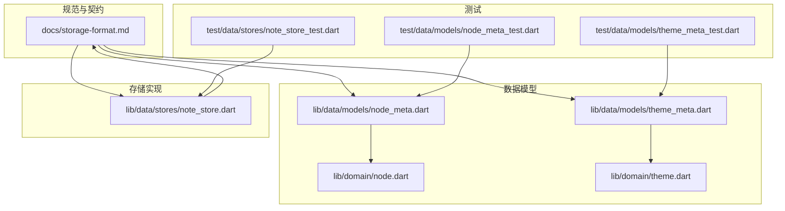
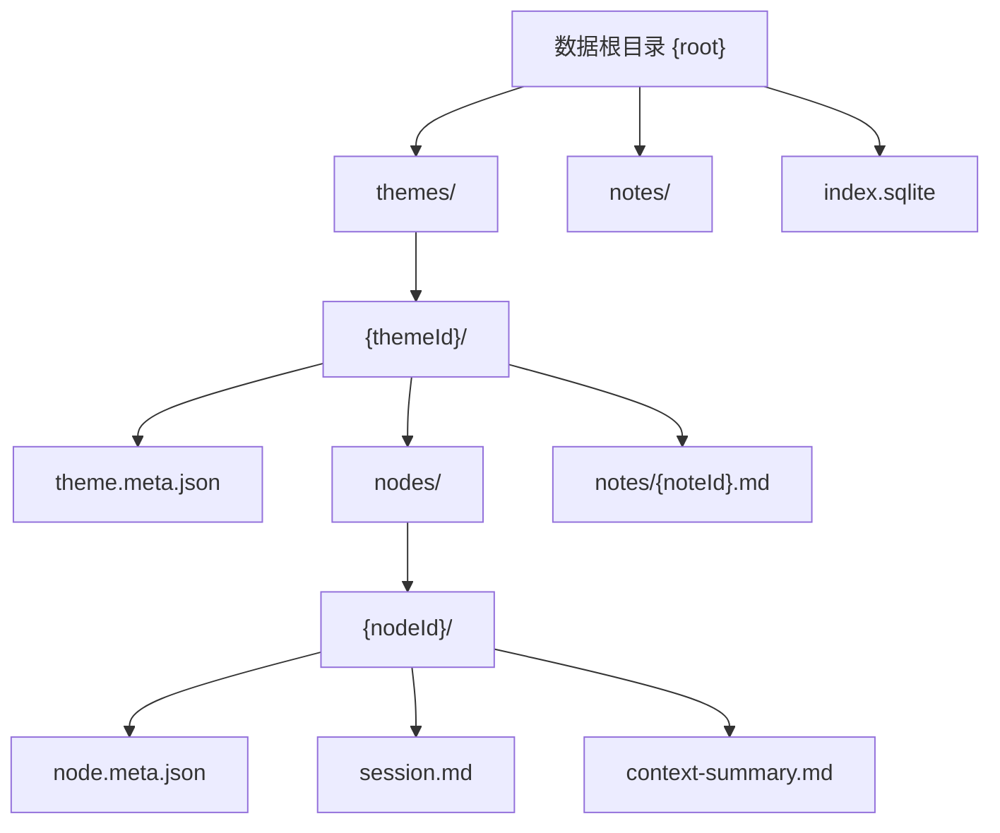
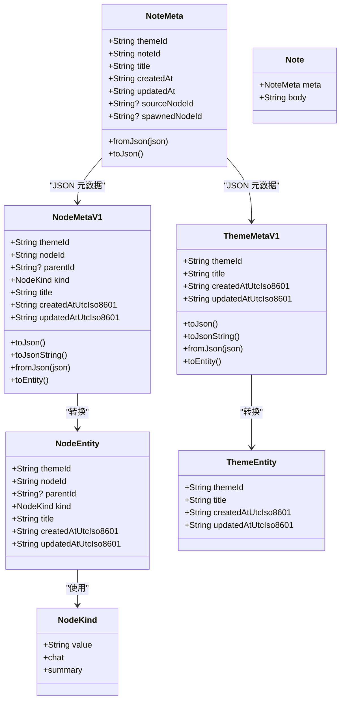
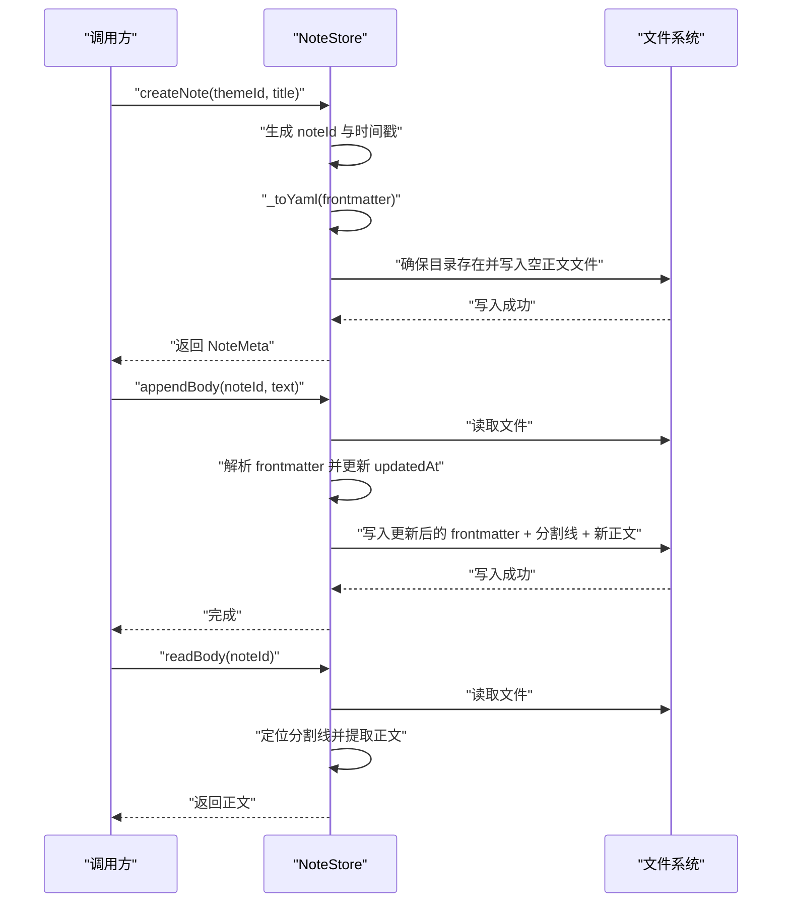
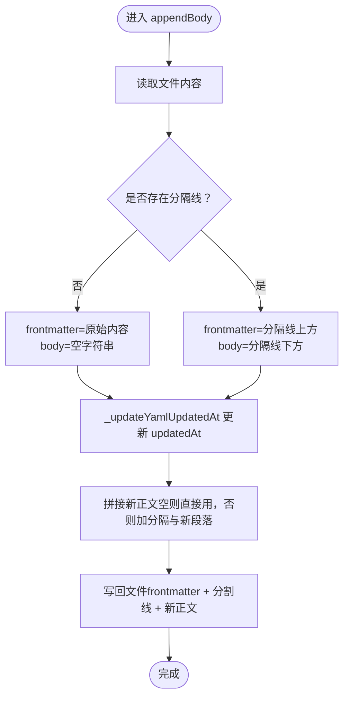
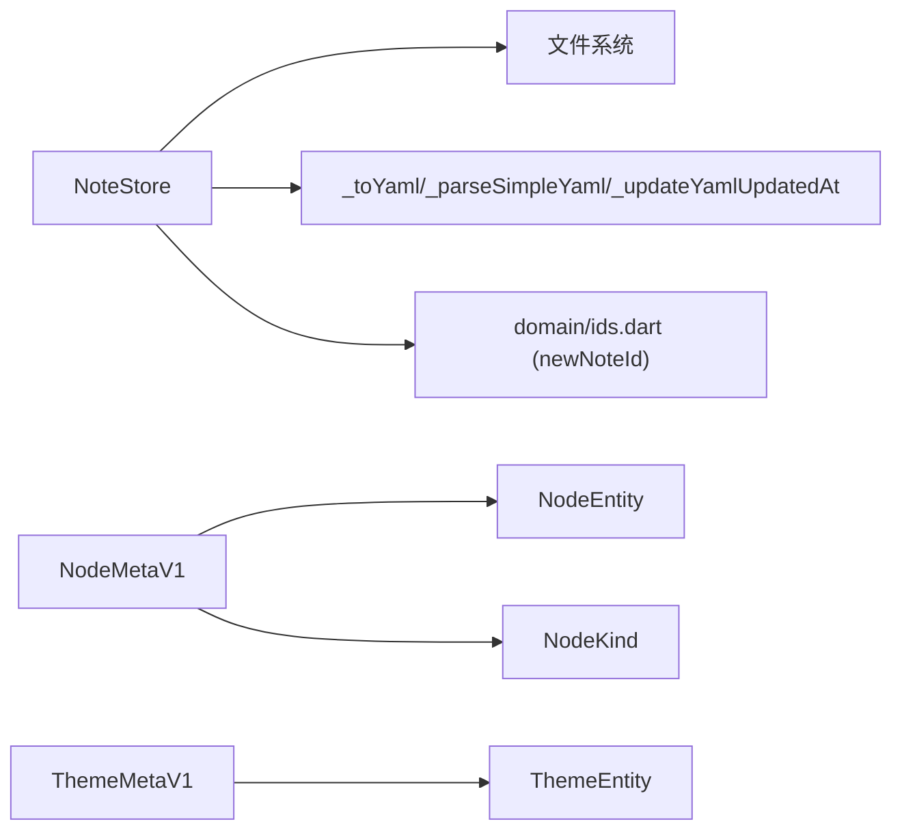

# 笔记存储

<cite>
**本文引用的文件**
- [storage-format.md](file://docs/storage-format.md)
- [note_store.dart](file://lib/data/stores/note_store.dart)
- [node_meta.dart](file://lib/data/models/node_meta.dart)
- [theme_meta.dart](file://lib/data/models/theme_meta.dart)
- [node.dart](file://lib/domain/node.dart)
- [theme.dart](file://lib/domain/theme.dart)
- [node_meta_test.dart](file://test/data/models/node_meta_test.dart)
- [theme_meta_test.dart](file://test/data/models/theme_meta_test.dart)
- [note_store_test.dart](file://test/data/stores/note_store_test.dart)
</cite>

## 目录
1. [简介](#简介)
2. [项目结构](#项目结构)
3. [核心组件](#核心组件)
4. [架构总览](#架构总览)
5. [组件详解](#组件详解)
6. [依赖关系分析](#依赖关系分析)
7. [性能考量](#性能考量)
8. [故障排查指南](#故障排查指南)
9. [结论](#结论)
10. [附录](#附录)

## 简介
本文件面向“笔记存储系统”的使用者与维护者，系统性阐述数据模型设计、存储格式契约、文件系统与目录结构管理、笔记元数据与正文的读写流程，以及如何扩展存储后端与实现备份恢复。文档同时兼顾初学者对基本概念的理解与高级开发者的性能与安全关注。

## 项目结构
- 存储契约与规范：以文档形式定义磁盘布局、元数据格式、Markdown 正文结构、原子写入与索引策略等。
- 数据模型层：提供 NodeMetaV1、ThemeMetaV1 等版本化的元数据模型，负责 JSON 序列化/反序列化与实体转换。
- 领域模型层：NodeKind、NodeEntity、ThemeEntity 等领域对象，承载业务语义。
- 存储实现层：NoteStore 提供笔记文件的创建、读取、写入与追加能力，基于文件系统与 YAML frontmatter。
- 测试层：针对 NoteStore 与元数据模型进行行为验证，确保读写正确性与错误处理。

图表来源
- [storage-format.md:1-350](file://docs/storage-format.md#L1-L350)
- [note_store.dart:1-203](file://lib/data/stores/note_store.dart#L1-L203)
- [node_meta.dart:1-83](file://lib/data/models/node_meta.dart#L1-L83)
- [theme_meta.dart:1-61](file://lib/data/models/theme_meta.dart#L1-L61)
- [node.dart:1-30](file://lib/domain/node.dart#L1-L30)
- [theme.dart:1-15](file://lib/domain/theme.dart#L1-L15)
- [node_meta_test.dart:1-113](file://test/data/models/node_meta_test.dart#L1-L113)
- [theme_meta_test.dart:1-79](file://test/data/models/theme_meta_test.dart#L1-L79)
- [note_store_test.dart:1-50](file://test/data/stores/note_store_test.dart#L1-L50)

章节来源
- [storage-format.md:1-350](file://docs/storage-format.md#L1-L350)
- [note_store.dart:1-203](file://lib/data/stores/note_store.dart#L1-L203)

## 核心组件
- NoteStore：负责笔记文件的创建、列出、读取正文、写入正文与追加正文。内部通过 YAML frontmatter 管理元数据，正文以“前言区 + 分割线 + 正文体”的结构组织。
- NodeMetaV1 / ThemeMetaV1：版本化元数据模型，提供 JSON 结构与实体转换，包含 schema、主题/节点/笔记标识、类型、标题、时间戳等字段。
- NodeEntity / ThemeEntity：领域实体，承载业务语义与不变属性。
- NodeKind：节点类型枚举，限定 chat 与 summary 两种类型。

章节来源
- [note_store.dart:53-151](file://lib/data/stores/note_store.dart#L53-L151)
- [node_meta.dart:5-81](file://lib/data/models/node_meta.dart#L5-L81)
- [theme_meta.dart:5-59](file://lib/data/models/theme_meta.dart#L5-L59)
- [node.dart:1-30](file://lib/domain/node.dart#L1-L30)
- [theme.dart:1-15](file://lib/domain/theme.dart#L1-L15)

## 架构总览
笔记存储遵循“磁盘为真相源、SQLite 仅作索引”的原则。Markdown 文件是正文真相源；SQLite 可重建，不作为唯一真相源。写入采用原子替换策略，保证崩溃/断电后的可解析性。目录结构严格约束主题、节点与笔记的文件位置。

图表来源
- [storage-format.md:14-31](file://docs/storage-format.md#L14-L31)

章节来源
- [storage-format.md:5-11](file://docs/storage-format.md#L5-L11)
- [storage-format.md:14-31](file://docs/storage-format.md#L14-L31)

## 组件详解

### Note 实体与数据模型
- NoteMeta：封装笔记元数据，包含主题标识、笔记标识、标题、创建/更新时间、可选的来源节点与派生节点。
- Note：组合 NoteMeta 与正文字符串。
- NodeMetaV1 / ThemeMetaV1：提供 schema 版本化 JSON 结构，包含字段校验与实体转换方法。
- NodeKind / NodeEntity / ThemeEntity：领域模型，约束节点类型与主题实体。

图表来源
- [note_store.dart:6-51](file://lib/data/stores/note_store.dart#L6-L51)
- [node_meta.dart:5-81](file://lib/data/models/node_meta.dart#L5-L81)
- [theme_meta.dart:5-59](file://lib/data/models/theme_meta.dart#L5-L59)
- [node.dart:1-30](file://lib/domain/node.dart#L1-L30)
- [theme.dart:1-15](file://lib/domain/theme.dart#L1-L15)

章节来源
- [note_store.dart:6-51](file://lib/data/stores/note_store.dart#L6-L51)
- [node_meta.dart:5-81](file://lib/data/models/node_meta.dart#L5-L81)
- [theme_meta.dart:5-59](file://lib/data/models/theme_meta.dart#L5-L59)
- [node.dart:1-30](file://lib/domain/node.dart#L1-L30)
- [theme.dart:1-15](file://lib/domain/theme.dart#L1-L15)

### NoteStore 的实现机制
- 目录与文件命名
  - 笔记文件位于 themes/{themeId}/notes/{noteId}.md。
  - 使用 ULID 风格的全局唯一标识，便于排序与检索。
- 原子写入
  - 采用“写入同目录临时文件后 rename 替换”的原子替换策略，避免部分写入。
- frontmatter 与正文
  - frontmatter 使用 YAML，以“---”包裹；正文以“\n---\n”与 frontmatter 分离。
- 关键方法
  - listNoteMetas：扫描 .md 文件，解析 frontmatter，按 updatedAt 降序返回。
  - readBody：提取 frontmatter 之后的正文部分。
  - createNote：生成 noteId 与时间戳，写入空正文文件。
  - writeBody：替换整个正文并更新 updatedAt。
  - appendBody：在现有正文后追加新段落并更新 updatedAt。
- YAML 工具函数
  - _toYaml：将 Map 渲染为 YAML 字符串。
  - _updateYamlUpdatedAt：更新 frontmatter 中的 updatedAt。
  - _parseSimpleYaml：解析简单 YAML 行为，支持字符串与 null。
  - _escapeYaml：转义双引号。

图表来源
- [note_store.dart:81-136](file://lib/data/stores/note_store.dart#L81-L136)
- [note_store.dart:153-200](file://lib/data/stores/note_store.dart#L153-L200)

章节来源
- [note_store.dart:53-151](file://lib/data/stores/note_store.dart#L53-L151)
- [note_store.dart:153-203](file://lib/data/stores/note_store.dart#L153-L203)

### 笔记元数据的存储格式
- 文件位置与命名
  - 笔记文件：themes/{themeId}/notes/{noteId}.md
- frontmatter 结构（note/v1）
  - schema：固定值
  - themeId / noteId：必填
  - title：必填
  - createdAt / updatedAt：必填，UTC ISO8601
  - sourceNodeId / spawnedNodeId：可选
- JSON 元数据模型
  - NodeMetaV1 / ThemeMetaV1：提供 schema 版本化 JSON，包含字段校验与实体转换。
  - NodeKind：限定节点类型为 chat 或 summary。

章节来源
- [storage-format.md:261-290](file://docs/storage-format.md#L261-L290)
- [node_meta.dart:24-68](file://lib/data/models/node_meta.dart#L24-L68)
- [theme_meta.dart:18-49](file://lib/data/models/theme_meta.dart#L18-L49)
- [node.dart:1-8](file://lib/domain/node.dart#L1-L8)

### 笔记文件的读写操作
- 读取正文
  - 定位“\n---\n”分隔线，取其后部分作为正文。
- 写入正文
  - writeBody：替换整个正文并更新 updatedAt。
- 追加正文
  - appendBody：在现有正文后追加“\n\n---\n”分隔与新段落，并更新 updatedAt。
- frontmatter 更新
  - 通过 _updateYamlUpdatedAt 修改 updatedAt 字段，保持 YAML 结构稳定。

图表来源
- [note_store.dart:118-136](file://lib/data/stores/note_store.dart#L118-L136)
- [note_store.dart:169-180](file://lib/data/stores/note_store.dart#L169-L180)

章节来源
- [note_store.dart:74-136](file://lib/data/stores/note_store.dart#L74-L136)

### 验证与测试要点
- NoteStore 行为测试
  - 创建笔记后追加两段正文，读取应包含分隔与合并后的正文。
  - 写入正文会替换整段正文。
- 元数据模型测试
  - NodeMetaV1/ThemeMetaV1 的 roundtrip 与错误输入（缺失字段、未知类型、错误 schema）均被正确抛错。
  - toEntity 转换正确映射字段。

章节来源
- [note_store_test.dart:22-47](file://test/data/stores/note_store_test.dart#L22-L47)
- [node_meta_test.dart:6-90](file://test/data/models/node_meta_test.dart#L6-L90)
- [theme_meta_test.dart:24-60](file://test/data/models/theme_meta_test.dart#L24-L60)

## 依赖关系分析
- NoteStore 依赖
  - 文件系统：读写 .md 文件、目录创建。
  - YAML 工具：frontmatter 的渲染、解析与更新。
  - ID 生成：newNoteId（来自 domain/ids.dart，NoteStore 中导入）。
- 元数据模型依赖
  - NodeMetaV1/ThemeMetaV1 依赖 NodeKind/NodeEntity/ThemeEntity 进行实体转换。
- 测试依赖
  - NoteStoreTest 依赖 NoteStore。
  - 元数据模型测试依赖对应模型。

图表来源
- [note_store.dart:1-6](file://lib/data/stores/note_store.dart#L1-L6)
- [node_meta.dart:1-3](file://lib/data/models/node_meta.dart#L1-L3)
- [theme_meta.dart:1-3](file://lib/data/models/theme_meta.dart#L1-L3)
- [node.dart:1-8](file://lib/domain/node.dart#L1-L8)
- [theme.dart:1-15](file://lib/domain/theme.dart#L1-L15)

章节来源
- [note_store.dart:1-6](file://lib/data/stores/note_store.dart#L1-L6)
- [node_meta.dart:1-3](file://lib/data/models/node_meta.dart#L1-L3)
- [theme_meta.dart:1-3](file://lib/data/models/theme_meta.dart#L1-L3)

## 性能考量
- 列表与排序
  - listNoteMetas 对扫描结果按 updatedAt 降序排序，适合按最近编辑时间展示。
- I/O 与解析
  - 读取与写入均为整文件操作，frontmatter 解析为轻量字符串处理，适合小中型笔记。
- 索引与搜索
  - 推荐使用 SQLite FTS5 建立全文索引，或降级为 LIKE，查询时先定位再回磁盘展示正文。
- 原子写入
  - 通过临时文件 + rename 降低并发写入冲突风险，提升可靠性。

[本节为通用性能建议，无需特定文件引用]

## 故障排查指南
- frontmatter 缺失或格式错误
  - 现象：解析失败或返回空元数据。
  - 处理：检查 frontmatter 是否以“---”包裹，字段是否完整。
- 写入中断导致的不一致
  - 现象：文件处于中间态。
  - 处理：采用原子写入策略，确保写入临时文件后 rename 替换。
- 时间戳未更新
  - 现象：列表排序异常。
  - 处理：确认每次写入/追加后更新 updatedAt。
- 元数据 schema 不匹配
  - 现象：反序列化抛出格式异常。
  - 处理：核对 schema 版本与字段类型，必要时执行迁移。

章节来源
- [note_store.dart:140-150](file://lib/data/stores/note_store.dart#L140-L150)
- [storage-format.md:66-70](file://docs/storage-format.md#L66-L70)

## 结论
本系统以“磁盘为真相源、SQLite 为索引”的架构清晰地分离了持久化与检索职责。NoteStore 通过 YAML frontmatter 管理元数据，结合严格的目录与命名约定，实现了可靠的笔记读写与扩展性。配合完善的测试与错误处理，既满足初学者快速上手，也为高级开发者提供了优化与加固的空间。

[本节为总结性内容，无需特定文件引用]

## 附录

### 扩展存储后端与实现备份恢复
- 扩展存储后端
  - 抽象接口：定义统一的笔记读写接口（如 create/read/write/append/list），在新后端实现中对接数据库或云存储。
  - 原子写入：沿用“临时文件 + rename”策略，或在数据库事务中保证一致性。
  - 元数据兼容：保持 note/v1 schema 与字段不变，确保迁移与兼容。
- 备份与恢复
  - 备份：导出磁盘上的 .md 文件与 index.sqlite（可选）。
  - 恢复：将备份文件还原至相同目录结构，必要时重建 SQLite 索引。
  - 校验：通过 listNoteMetas 与 readBody 验证恢复完整性。

[本节为概念性指导，无需特定文件引用]