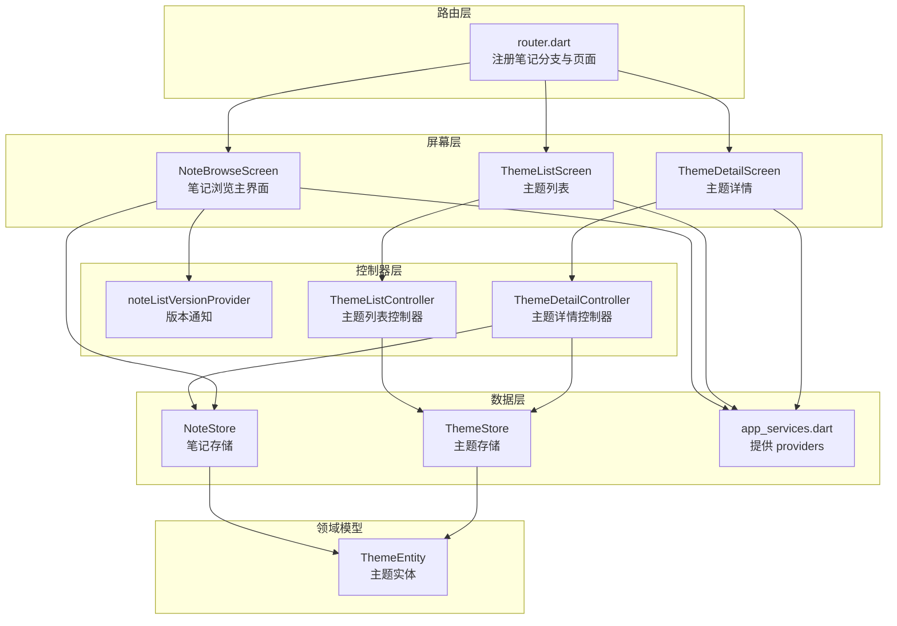
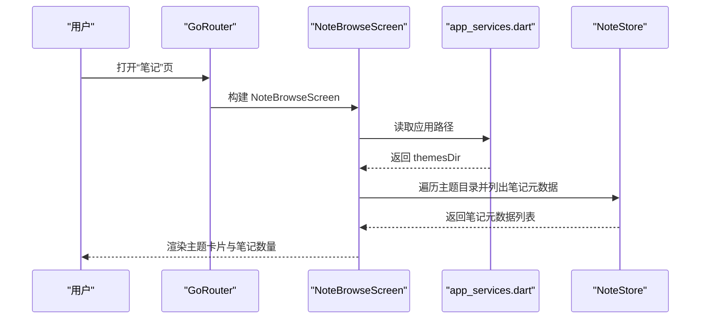
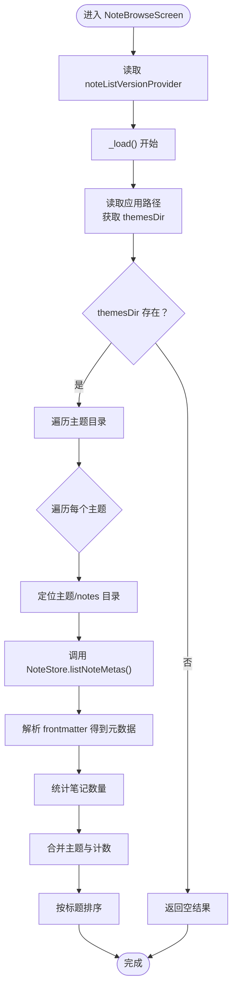
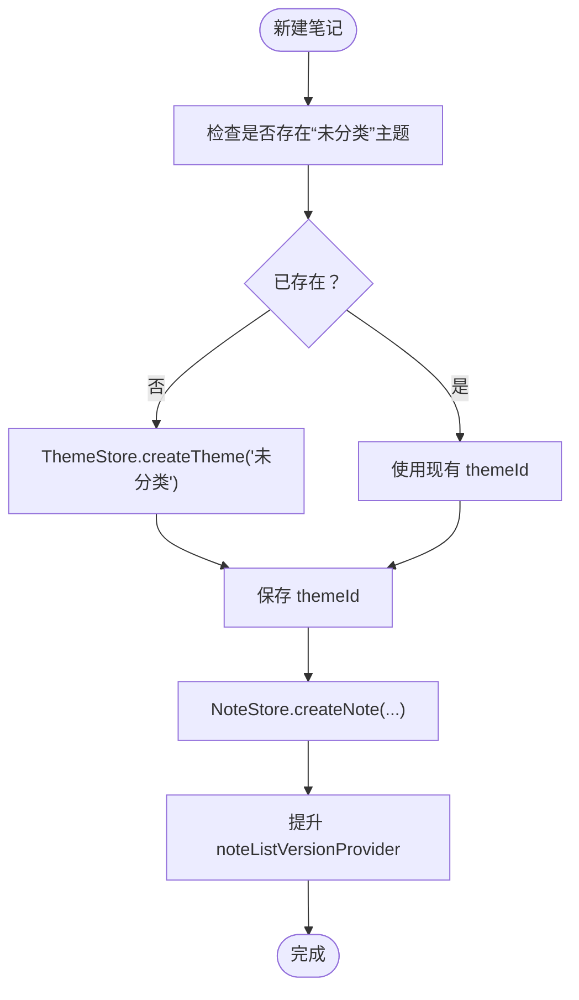
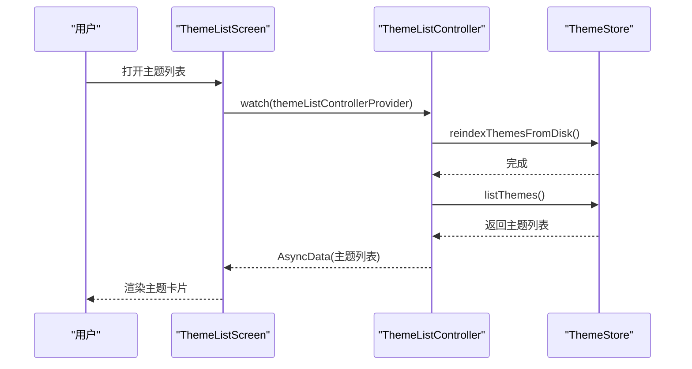
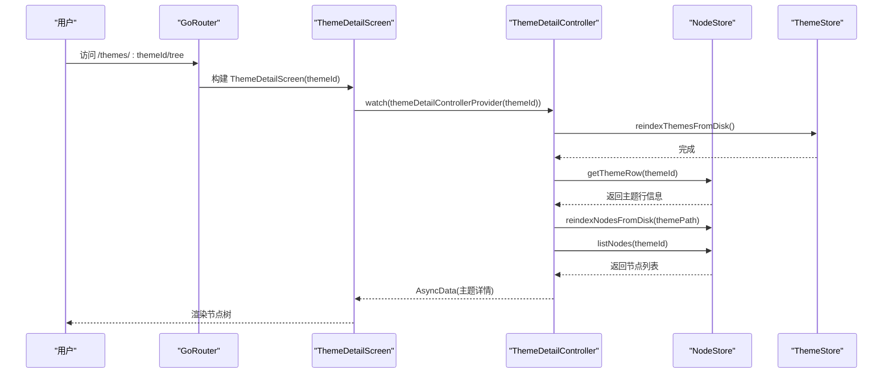
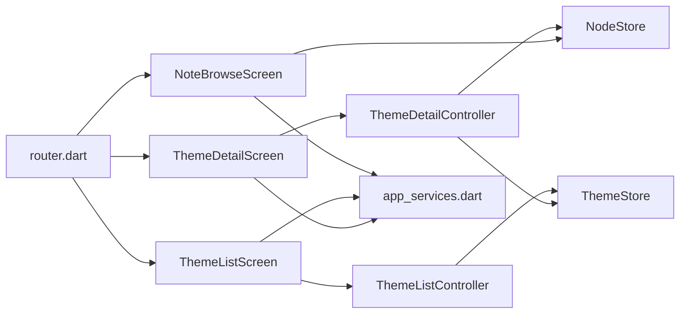

# 笔记浏览

<cite>
**本文引用的文件**
- [lib/ui/features/notes/note_browse_screen.dart](file://lib/ui/features/notes/note_browse_screen.dart)
- [lib/ui/features/themes/theme_list_screen.dart](file://lib/ui/features/themes/theme_list_screen.dart)
- [lib/ui/features/themes/theme_list_controller.dart](file://lib/ui/features/themes/theme_list_controller.dart)
- [lib/ui/features/themes/theme_detail_screen.dart](file://lib/ui/features/themes/theme_detail_screen.dart)
- [lib/ui/features/themes/theme_detail_controller.dart](file://lib/ui/features/themes/theme_detail_controller.dart)
- [lib/ui/core/router.dart](file://lib/ui/core/router.dart)
- [lib/ui/core/app_services.dart](file://lib/ui/core/app_services.dart)
- [lib/data/stores/note_store.dart](file://lib/data/stores/note_store.dart)
- [lib/domain/theme.dart](file://lib/domain/theme.dart)
- [test/ui/features/themes/theme_list_screen_test.dart](file://test/ui/features/themes/theme_list_screen_test.dart)
</cite>

## 目录
1. [简介](#简介)
2. [项目结构](#项目结构)
3. [核心组件](#核心组件)
4. [架构总览](#架构总览)
5. [详细组件分析](#详细组件分析)
6. [依赖关系分析](#依赖关系分析)
7. [性能考虑](#性能考虑)
8. [故障排查指南](#故障排查指南)
9. [结论](#结论)
10. [附录：扩展与最佳实践](#附录扩展与最佳实践)

## 简介
本文件面向“笔记浏览”功能，系统性阐述主题分类展示、笔记列表渲染与主题导航机制；详解主题笔记加载流程（异步数据获取、错误处理、状态管理）；文档化 UI 组件（主题卡片、笔记数量统计、点击跳转）；解释“未分类”主题的自动创建与管理；并提供可扩展的主题分类能力与自定义笔记展示样式的建议。同时给出初学者使用指引与高级开发者的性能优化与内存管理实践。

## 项目结构
围绕笔记浏览的关键目录与文件如下：
- 路由层：统一在路由中注册“笔记”分支与页面入口
- 屏幕层：笔记浏览主界面、主题列表、主题详情
- 控制器层：Riverpod 控制器负责异步状态与数据加载
- 数据层：NoteStore 提供笔记元数据读写与列表
- 领域模型：ThemeEntity 描述主题实体

图表来源
- [lib/ui/core/router.dart:18-87](file://lib/ui/core/router.dart#L18-L87)
- [lib/ui/features/notes/note_browse_screen.dart:11-134](file://lib/ui/features/notes/note_browse_screen.dart#L11-L134)
- [lib/ui/features/themes/theme_list_screen.dart:8-88](file://lib/ui/features/themes/theme_list_screen.dart#L8-L88)
- [lib/ui/features/themes/theme_detail_screen.dart:23-57](file://lib/ui/features/themes/theme_detail_screen.dart#L23-L57)
- [lib/ui/features/themes/theme_list_controller.dart:5-27](file://lib/ui/features/themes/theme_list_controller.dart#L5-L27)
- [lib/ui/features/themes/theme_detail_controller.dart:19-87](file://lib/ui/features/themes/theme_detail_controller.dart#L19-L87)
- [lib/ui/core/app_services.dart:25-61](file://lib/ui/core/app_services.dart#L25-L61)
- [lib/data/stores/note_store.dart:53-72](file://lib/data/stores/note_store.dart#L53-L72)
- [lib/domain/theme.dart:1-15](file://lib/domain/theme.dart#L1-L15)

章节来源
- [lib/ui/core/router.dart:18-87](file://lib/ui/core/router.dart#L18-L87)
- [lib/ui/features/notes/note_browse_screen.dart:11-134](file://lib/ui/features/notes/note_browse_screen.dart#L11-L134)
- [lib/ui/features/themes/theme_list_screen.dart:8-88](file://lib/ui/features/themes/theme_list_screen.dart#L8-L88)
- [lib/ui/features/themes/theme_detail_screen.dart:23-57](file://lib/ui/features/themes/theme_detail_screen.dart#L23-L57)
- [lib/ui/features/themes/theme_list_controller.dart:5-27](file://lib/ui/features/themes/theme_list_controller.dart#L5-L27)
- [lib/ui/features/themes/theme_detail_controller.dart:19-87](file://lib/ui/features/themes/theme_detail_controller.dart#L19-L87)
- [lib/ui/core/app_services.dart:25-61](file://lib/ui/core/app_services.dart#L25-L61)
- [lib/data/stores/note_store.dart:53-72](file://lib/data/stores/note_store.dart#L53-L72)
- [lib/domain/theme.dart:1-15](file://lib/domain/theme.dart#L1-L15)

## 核心组件
- 笔记浏览主界面（NoteBrowseScreen）
  - 负责扫描主题目录、统计每个主题下的笔记数量、渲染主题卡片列表、支持下拉刷新与新建笔记入口
  - 通过应用路径 provider 获取主题根目录，遍历子目录中的 notes 子目录，使用 NoteStore 列出笔记元数据
  - 支持“未分类”主题的自动创建与查找，确保新笔记有落点
- 主题列表（ThemeListScreen）
  - 基于 AsyncNotifier 的主题列表控制器，负责从磁盘重建索引并列出主题
  - 提供新建主题与手动重建索引的能力
- 主题详情（ThemeDetailScreen）
  - 展示某个主题下的节点树，支持返回与刷新
  - 通过主题详情控制器加载主题标题、路径与节点列表
- 控制器与状态
  - ThemeListController：异步构建主题列表，支持重建索引与创建主题
  - ThemeDetailController：异步构建主题详情，支持刷新、创建根节点与子节点、删除子树
  - noteListVersionProvider：用于触发笔记列表刷新的版本号通知
- 数据层
  - NoteStore：提供 listNoteMetas、createNote、readBody、writeBody、appendBody 等能力
  - ThemeStore：提供主题索引重建、主题列表、主题创建等能力
- 领域模型
  - ThemeEntity：描述主题标识、标题、创建与更新时间

章节来源
- [lib/ui/features/notes/note_browse_screen.dart:11-134](file://lib/ui/features/notes/note_browse_screen.dart#L11-L134)
- [lib/ui/features/themes/theme_list_screen.dart:8-88](file://lib/ui/features/themes/theme_list_screen.dart#L8-L88)
- [lib/ui/features/themes/theme_detail_screen.dart:23-57](file://lib/ui/features/themes/theme_detail_screen.dart#L23-L57)
- [lib/ui/features/themes/theme_list_controller.dart:5-27](file://lib/ui/features/themes/theme_list_controller.dart#L5-L27)
- [lib/ui/features/themes/theme_detail_controller.dart:19-87](file://lib/ui/features/themes/theme_detail_controller.dart#L19-L87)
- [lib/ui/core/app_services.dart:18-25](file://lib/ui/core/app_services.dart#L18-L25)
- [lib/data/stores/note_store.dart:53-138](file://lib/data/stores/note_store.dart#L53-L138)
- [lib/domain/theme.dart:1-15](file://lib/domain/theme.dart#L1-L15)

## 架构总览
笔记浏览采用“路由 + 屏幕 + 控制器 + 数据层”的分层设计，配合 Riverpod 进行状态管理与依赖注入。路由负责页面导航与参数传递；屏幕负责 UI 渲染与交互；控制器负责异步数据加载与状态变更；数据层负责文件系统与数据库访问。

图表来源
- [lib/ui/core/router.dart:66-70](file://lib/ui/core/router.dart#L66-L70)
- [lib/ui/features/notes/note_browse_screen.dart:154-186](file://lib/ui/features/notes/note_browse_screen.dart#L154-L186)
- [lib/ui/core/app_services.dart:27-31](file://lib/ui/core/app_services.dart#L27-L31)
- [lib/data/stores/note_store.dart:58-72](file://lib/data/stores/note_store.dart#L58-L72)

## 详细组件分析

### 笔记浏览主界面（NoteBrowseScreen）
- 功能要点
  - 初始化时读取 noteListVersionProvider，监听版本变化以触发刷新
  - 异步加载主题与笔记：扫描 themesDir 下的每个主题目录，读取其 notes 子目录中的 .md 文件，解析 frontmatter 得到笔记元数据，统计数量
  - 支持下拉刷新与错误提示；空状态友好提示
  - 点击主题卡片跳转至主题笔记列表（当前仓库未包含该页面源码，但 NoteBrowseScreen 已提供跳转逻辑）
  - 新建笔记入口：弹窗输入标题后，确保“未分类”主题存在，再在该主题下创建笔记，并提升版本号触发刷新
- 关键流程（加载主题与笔记）

图表来源
- [lib/ui/features/notes/note_browse_screen.dart:31-50](file://lib/ui/features/notes/note_browse_screen.dart#L31-L50)
- [lib/ui/features/notes/note_browse_screen.dart:154-186](file://lib/ui/features/notes/note_browse_screen.dart#L154-L186)
- [lib/data/stores/note_store.dart:58-72](file://lib/data/stores/note_store.dart#L58-L72)

- 未分类主题的自动创建与管理
  - 若主题目录中存在带有特定标题的 meta 文件，则复用该主题 ID
  - 否则通过 ThemeStore 创建一个标题为“未分类”的主题，并返回其 themeId
  - 新建笔记时直接写入该主题的 notes 目录，并提升版本号

图表来源
- [lib/ui/features/notes/note_browse_screen.dart:188-226](file://lib/ui/features/notes/note_browse_screen.dart#L188-L226)
- [lib/ui/core/app_services.dart:51-55](file://lib/ui/core/app_services.dart#L51-L55)

章节来源
- [lib/ui/features/notes/note_browse_screen.dart:11-134](file://lib/ui/features/notes/note_browse_screen.dart#L11-L134)
- [lib/ui/features/notes/note_browse_screen.dart:154-186](file://lib/ui/features/notes/note_browse_screen.dart#L154-L186)
- [lib/ui/features/notes/note_browse_screen.dart:188-226](file://lib/ui/features/notes/note_browse_screen.dart#L188-L226)
- [lib/data/stores/note_store.dart:58-106](file://lib/data/stores/note_store.dart#L58-L106)
- [lib/ui/core/app_services.dart:51-55](file://lib/ui/core/app_services.dart#L51-L55)

### 主题列表（ThemeListScreen）
- 功能要点
  - 使用 AsyncNotifier 加载主题列表，支持重建索引与新建主题
  - 列表项点击跳转至主题详情页
  - 提供设置入口与同步按钮
- 控制器行为
  - 构建时先重建主题索引，再列出主题
  - 提供 reindex 与 createTheme 方法，更新状态

图表来源
- [lib/ui/features/themes/theme_list_screen.dart:14-14](file://lib/ui/features/themes/theme_list_screen.dart#L14-L14)
- [lib/ui/features/themes/theme_list_controller.dart:7-11](file://lib/ui/features/themes/theme_list_controller.dart#L7-L11)
- [lib/ui/core/app_services.dart:51-55](file://lib/ui/core/app_services.dart#L51-L55)

章节来源
- [lib/ui/features/themes/theme_list_screen.dart:8-88](file://lib/ui/features/themes/theme_list_screen.dart#L8-L88)
- [lib/ui/features/themes/theme_list_controller.dart:5-27](file://lib/ui/features/themes/theme_list_controller.dart#L5-L27)

### 主题详情（ThemeDetailScreen）
- 功能要点
  - 通过路由参数接收 themeId，加载主题标题、路径与节点列表
  - 支持返回与刷新；当节点为空时提示空树
- 控制器行为
  - 构建时重建主题索引，查询主题行信息，重建节点索引，列出节点
  - 提供 refresh、createRootChatNode、createChildChatNode、deleteNodeSubtree 等操作

图表来源
- [lib/ui/core/router.dart:32-37](file://lib/ui/core/router.dart#L32-L37)
- [lib/ui/features/themes/theme_detail_screen.dart:27-27](file://lib/ui/features/themes/theme_detail_screen.dart#L27-L27)
- [lib/ui/features/themes/theme_detail_controller.dart:29-44](file://lib/ui/features/themes/theme_detail_controller.dart#L29-L44)
- [lib/ui/core/app_services.dart:57-61](file://lib/ui/core/app_services.dart#L57-L61)

章节来源
- [lib/ui/features/themes/theme_detail_screen.dart:23-57](file://lib/ui/features/themes/theme_detail_screen.dart#L23-L57)
- [lib/ui/features/themes/theme_detail_controller.dart:19-87](file://lib/ui/features/themes/theme_detail_controller.dart#L19-L87)

### UI 组件与交互
- 主题卡片显示
  - 使用 ListTile 显示主题标题与笔记数量；在调试模式下可显示 themeId
  - 右侧箭头图标提示可点击跳转
- 点击跳转
  - NoteBrowseScreen 中点击主题卡片跳转至主题笔记列表（当前仓库未包含该页面源码，但已提供跳转逻辑）
  - ThemeListScreen 中点击主题卡片跳转至主题详情页
- 错误与加载状态
  - NoteBrowseScreen 支持 loading、error、empty 三种状态
  - ThemeListScreen 支持 loading、error、data 三种状态

章节来源
- [lib/ui/features/notes/note_browse_screen.dart:109-133](file://lib/ui/features/notes/note_browse_screen.dart#L109-L133)
- [lib/ui/features/themes/theme_list_screen.dart:40-72](file://lib/ui/features/themes/theme_list_screen.dart#L40-L72)

## 依赖关系分析
- 路由与屏幕
  - 路由在笔记分支中注册 NoteBrowseScreen；主题分支注册 ThemeListScreen 与 ThemeDetailScreen
- 控制器与 providers
  - ThemeListController 与 ThemeDetailController 通过 themeStoreProvider 与 nodeStoreProvider 获取存储实例
  - noteListVersionProvider 用于触发笔记列表刷新
- 数据层
  - NoteStore 依赖文件系统进行笔记元数据与正文的读写
  - ThemeStore 依赖数据库与应用路径进行主题索引与列表管理

图表来源
- [lib/ui/core/router.dart:66-87](file://lib/ui/core/router.dart#L66-L87)
- [lib/ui/features/themes/theme_list_controller.dart:8-10](file://lib/ui/features/themes/theme_list_controller.dart#L8-L10)
- [lib/ui/features/themes/theme_detail_controller.dart:30-37](file://lib/ui/features/themes/theme_detail_controller.dart#L30-L37)
- [lib/ui/core/app_services.dart:51-61](file://lib/ui/core/app_services.dart#L51-L61)

章节来源
- [lib/ui/core/router.dart:18-87](file://lib/ui/core/router.dart#L18-L87)
- [lib/ui/features/themes/theme_list_controller.dart:5-27](file://lib/ui/features/themes/theme_list_controller.dart#L5-L27)
- [lib/ui/features/themes/theme_detail_controller.dart:19-87](file://lib/ui/features/themes/theme_detail_controller.dart#L19-L87)
- [lib/ui/core/app_services.dart:25-61](file://lib/ui/core/app_services.dart#L25-L61)

## 性能考虑
- 列表渲染优化
  - 使用 ListView.separated 减少不必要的子树重建
  - 在宽屏设备上限制最大宽度，避免过度横向拉伸
- 异步加载与状态管理
  - 使用 AsyncNotifier 与 FutureProvider 将 IO 操作与 UI 解耦，避免阻塞主线程
  - 对于频繁刷新场景，使用 noteListVersionProvider 触发局部刷新，减少全量重载
- 文件系统扫描
  - NoteStore 在 listNoteMetas 中仅处理 .md 文件并解析 frontmatter，避免无关文件 IO
  - 主题扫描时跳过隐藏目录（以点开头），降低无效遍历
- 内存管理
  - 控制器使用 auto-dispose 的 family provider，避免无界缓存
  - 页面销毁时及时停止不必要的订阅与回调

[本节为通用性能建议，不直接分析具体文件，故无章节来源]

## 故障排查指南
- 笔记列表为空
  - 检查 themesDir 是否存在且可读
  - 确认各主题目录下存在 notes 子目录与 .md 文件
  - 查看 NoteStore.listNoteMetas 是否抛出异常导致中断
- 无法创建“未分类”主题
  - 检查 ThemeStore.createTheme 是否成功返回 themeId
  - 确认 meta 文件内容格式正确（JSON）
- 主题详情空白
  - 确认主题索引与节点索引均已重建
  - 检查节点列表是否为空或排序逻辑是否异常
- 刷新无效
  - 确认 noteListVersionProvider.bump() 是否被调用
  - 检查屏幕是否监听了版本变化并在下一帧回调中重新加载

章节来源
- [lib/ui/features/notes/note_browse_screen.dart:31-50](file://lib/ui/features/notes/note_browse_screen.dart#L31-L50)
- [lib/ui/features/notes/note_browse_screen.dart:188-226](file://lib/ui/features/notes/note_browse_screen.dart#L188-L226)
- [lib/ui/features/themes/theme_detail_controller.dart:29-44](file://lib/ui/features/themes/theme_detail_controller.dart#L29-L44)
- [lib/ui/core/router.dart:102-104](file://lib/ui/core/router.dart#L102-L104)

## 结论
笔记浏览功能通过清晰的分层架构与 Riverpod 状态管理，实现了主题分类展示、笔记列表渲染与主题导航的完整闭环。异步加载、错误处理与状态管理保证了良好的用户体验；“未分类”主题的自动创建机制简化了新手使用成本。对于高级开发者，可通过版本化刷新、IO 限流与缓存策略进一步优化性能与内存占用。

[本节为总结性内容，不直接分析具体文件，故无章节来源]

## 附录：扩展与最佳实践
- 扩展主题分类功能
  - 在 ThemeStore 中增加更多索引字段（如标签、权重、可见性），并在 ThemeListController 中暴露相应查询接口
  - 在 NoteBrowseScreen 中新增筛选器（按主题标签、创建时间范围等），结合 NoteStore 的过滤能力
- 自定义笔记展示样式
  - 在 NoteBrowseScreen 的主题卡片中添加徽标（如未读标记、重要标记）、摘要预览、最近编辑时间等
  - 为不同主题配置不同的颜色方案或图标，增强视觉区分度
- 初学者使用方法
  - 打开应用后，点击底部导航“笔记”进入浏览页
  - 点击“+”新建笔记，输入标题后自动归档到“未分类”主题
  - 在主题卡片右侧箭头进入主题详情，查看该主题下的节点树
- 高级开发者最佳实践
  - 使用 noteListVersionProvider 实现细粒度刷新，避免全量重建
  - 对 NoteStore 的 listNoteMetas 增加本地缓存与增量更新策略
  - 在 ThemeDetailController 中对节点树进行懒加载与分页展示，减少首屏压力
  - 对文件系统 IO 进行并发控制与超时处理，防止卡顿

[本节为概念性建议，不直接分析具体文件，故无章节来源]