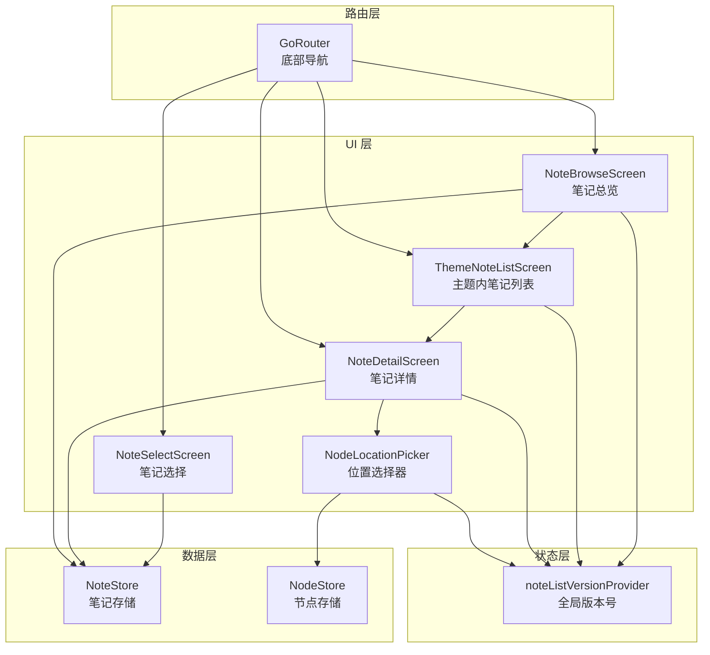
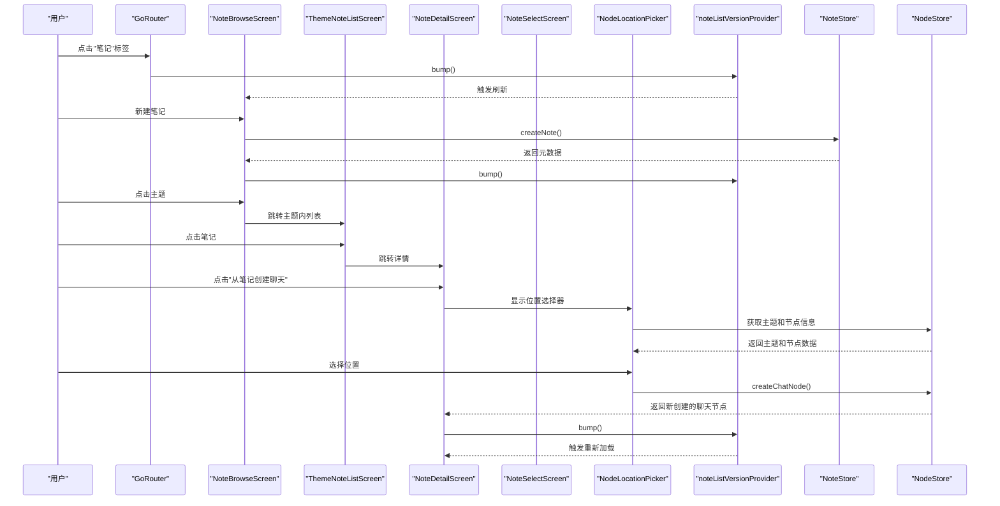
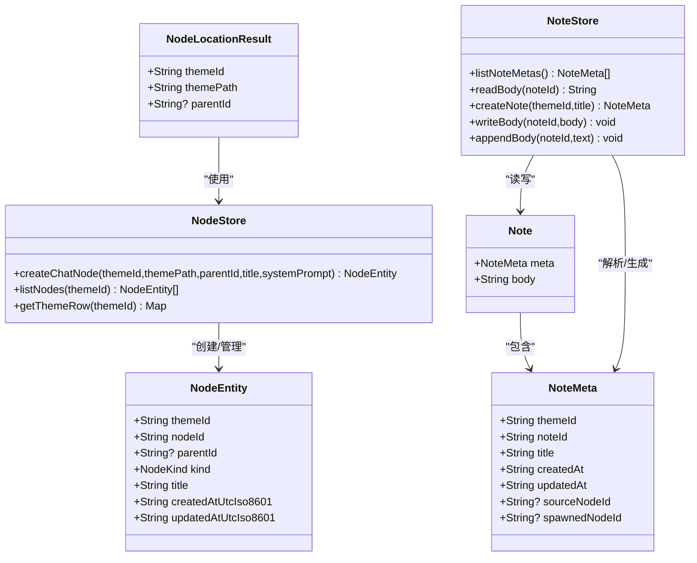
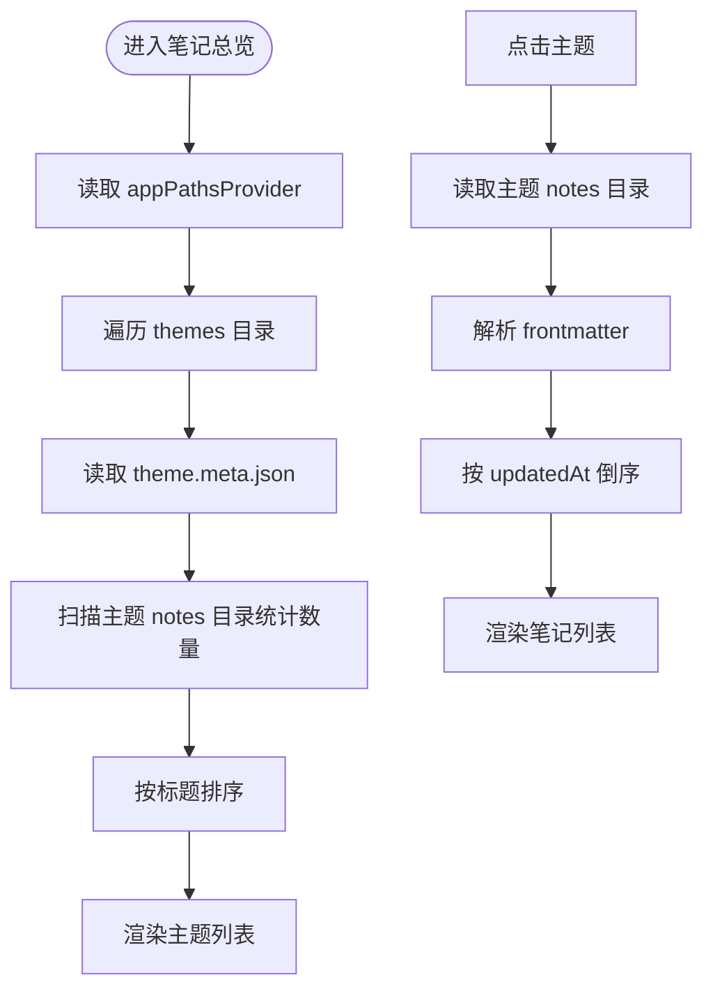
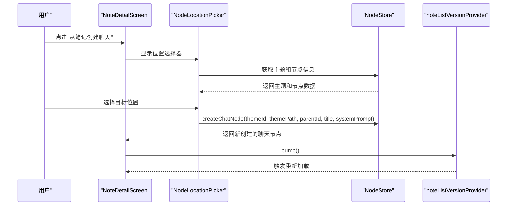
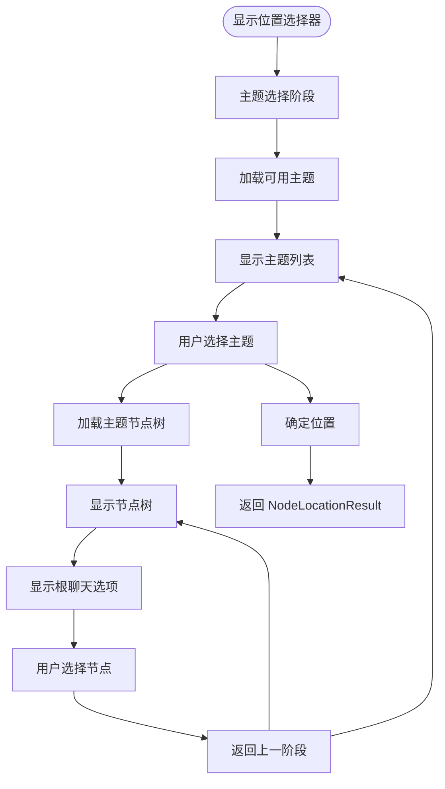
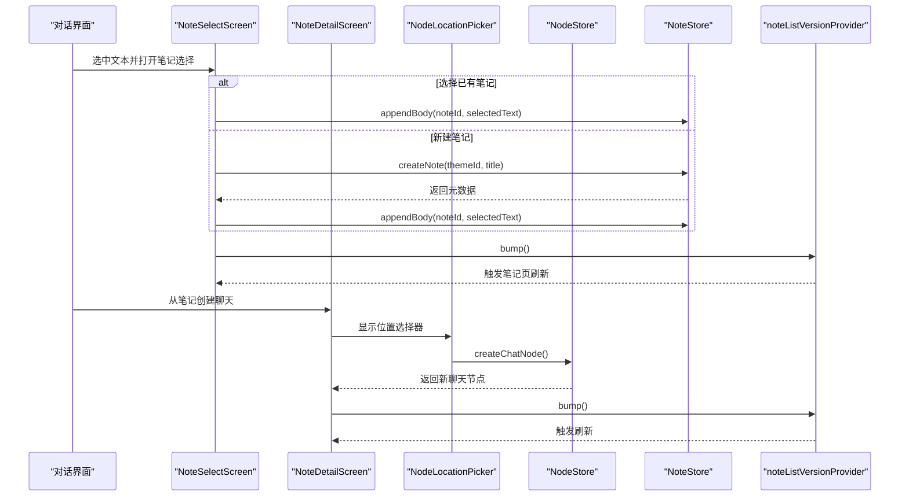
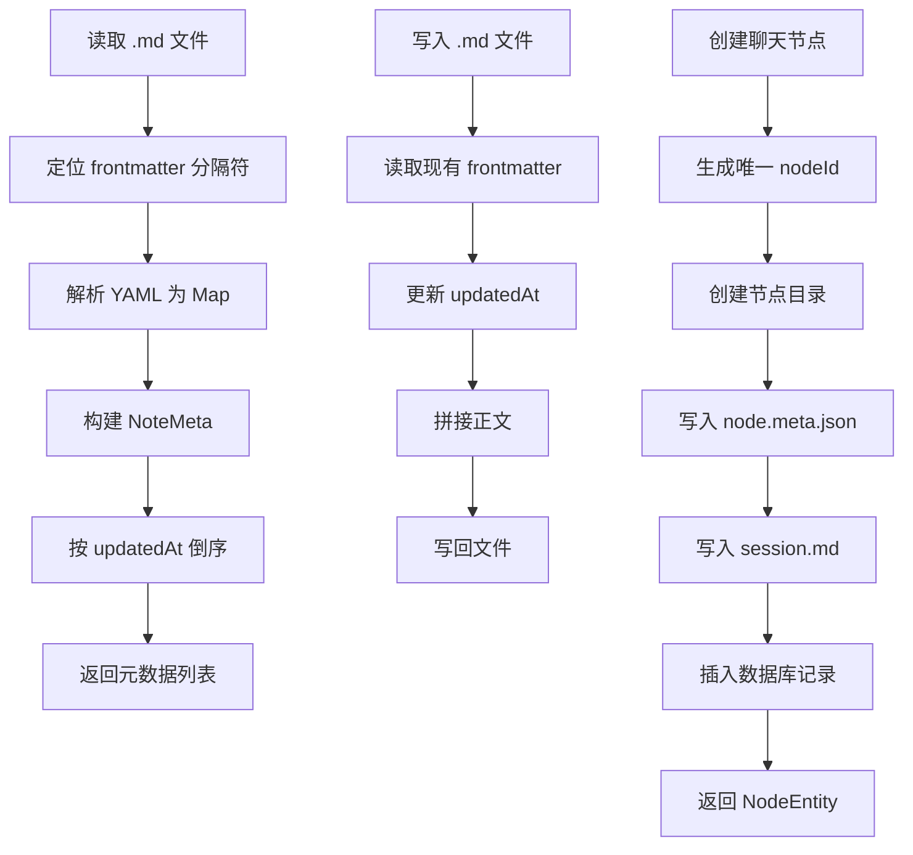
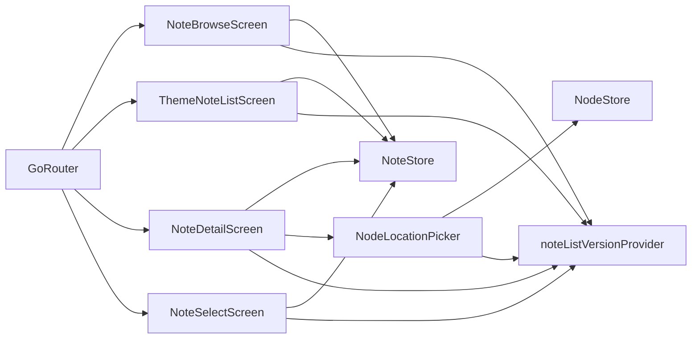

# 笔记系统

<cite>
**本文引用的文件**
- [lib/main.dart](file://lib/main.dart)
- [lib/ui/core/router.dart](file://lib/ui/core/router.dart)
- [lib/ui/core/app_services.dart](file://lib/ui/core/app_services.dart)
- [lib/ui/features/notes/note_browse_screen.dart](file://lib/ui/features/notes/note_browse_screen.dart)
- [lib/ui/features/notes/note_detail_screen.dart](file://lib/ui/features/notes/note_detail_screen.dart)
- [lib/ui/features/notes/note_select_screen.dart](file://lib/ui/features/notes/note_select_screen.dart)
- [lib/ui/features/notes/node_location_picker.dart](file://lib/ui/features/notes/node_location_picker.dart)
- [lib/data/stores/note_store.dart](file://lib/data/stores/note_store.dart)
- [lib/data/stores/node_store.dart](file://lib/data/stores/node_store.dart)
- [lib/data/models/node_meta.dart](file://lib/data/models/node_meta.dart)
- [lib/data/models/theme_meta.dart](file://lib/data/models/theme_meta.dart)
- [lib/domain/node.dart](file://lib/domain/node.dart)
- [lib/domain/theme.dart](file://lib/domain/theme.dart)
- [docs/design.md](file://docs/design.md)
- [docs/storage-format.md](file://docs/storage-format.md)
- [docs/progress-notes-feature.md](file://docs/progress-notes-feature.md)
</cite>

## 更新摘要
**所做更改**
- 新增位置选择器功能，支持空间化笔记组织
- 增强笔记与对话的关联关系，支持在特定节点下创建聊天
- 更新笔记编辑页面，新增从笔记创建聊天的功能
- 新增节点树导航和主题选择功能
- 扩展笔记系统以支持更复杂的组织结构

## 目录
1. [简介](#简介)
2. [项目结构](#项目结构)
3. [核心组件](#核心组件)
4. [架构总览](#架构总览)
5. [组件详解](#组件详解)
6. [依赖关系分析](#依赖关系分析)
7. [性能考量](#性能考量)
8. [故障排查指南](#故障排查指南)
9. [结论](#结论)
10. [附录](#附录)

## 简介
本文件系统性地文档化了笔记功能的设计与实现，涵盖概念、创建流程、管理机制、浏览与编辑页面、与对话的关联关系、数据模型与文件结构、预览组件与自定义选项，并提供扩展与集成新编辑器的指导。面向初学者给出使用方法与最佳实践，面向高级开发者提供性能优化与扩展开发建议。

**更新** 本版本新增了位置选择器功能，支持空间化笔记组织，用户可以在主题内的节点树中选择具体位置来创建或关联笔记，增强了笔记系统的组织能力和用户体验。

## 项目结构
笔记系统位于 UI 与数据层之间，采用清晰的分层：
- UI 层：浏览页、主题内笔记列表、笔记详情、笔记选择页、位置选择器
- 数据层：笔记存储 NoteStore、节点存储 NodeStore（负责文件读写、元数据解析）
- 状态层：Riverpod 提供的 noteListVersionProvider 作为全局版本号，驱动 UI 刷新
- 路由层：GoRouter 集成底部导航，笔记页位于独立分支
- 设计与存储契约：design.md 与 storage-format.md 定义了写入并发、索引策略、reindex 与笔记文件结构等

**图表来源**
- [lib/ui/features/notes/note_browse_screen.dart:11-134](file://lib/ui/features/notes/note_browse_screen.dart#L11-L134)
- [lib/ui/features/notes/note_detail_screen.dart:9-163](file://lib/ui/features/notes/note_detail_screen.dart#L9-L163)
- [lib/ui/features/notes/note_select_screen.dart:10-87](file://lib/ui/features/notes/note_select_screen.dart#L10-L87)
- [lib/ui/features/notes/node_location_picker.dart:1-269](file://lib/ui/features/notes/node_location_picker.dart#L1-L269)
- [lib/ui/core/router.dart:18-87](file://lib/ui/core/router.dart#L18-L87)
- [lib/ui/core/app_services.dart:18-25](file://lib/ui/core/app_services.dart#L18-L25)
- [lib/data/stores/note_store.dart:53-151](file://lib/data/stores/note_store.dart#L53-L151)
- [lib/data/stores/node_store.dart:112-233](file://lib/data/stores/node_store.dart#L112-L233)

**章节来源**
- [lib/ui/core/router.dart:18-87](file://lib/ui/core/router.dart#L18-L87)
- [lib/ui/core/app_services.dart:18-25](file://lib/ui/core/app_services.dart#L18-L25)
- [lib/ui/features/notes/note_browse_screen.dart:11-134](file://lib/ui/features/notes/note_browse_screen.dart#L11-L134)
- [lib/ui/features/notes/note_detail_screen.dart:9-163](file://lib/ui/features/notes/note_detail_screen.dart#L9-L163)
- [lib/ui/features/notes/note_select_screen.dart:10-87](file://lib/ui/features/notes/note_select_screen.dart#L10-L87)
- [lib/ui/features/notes/node_location_picker.dart:1-269](file://lib/ui/features/notes/node_location_picker.dart#L1-L269)
- [lib/data/stores/note_store.dart:53-151](file://lib/data/stores/note_store.dart#L53-L151)
- [lib/data/stores/node_store.dart:112-233](file://lib/data/stores/node_store.dart#L112-L233)

## 核心组件
- NoteStore：负责笔记文件的创建、读取、追加与覆盖写入，解析 YAML frontmatter，维护 updatedAt 并按更新时间倒序返回元数据列表。
- NodeStore：负责节点的创建、读取和管理，支持在主题内的节点树中创建聊天节点，提供父子关系管理。
- NodeLocationPicker：位置选择器组件，支持主题选择和节点树导航，允许用户选择笔记的放置位置。
- NoteBrowseScreen：按主题分组展示笔记，支持新建笔记、下拉刷新。
- ThemeNoteListScreen：展示指定主题内的笔记列表，点击进入详情。
- NoteDetailScreen：支持编辑/只读切换，保存时覆盖写入并触发全局版本号 bump。新增从笔记创建聊天的功能。
- NoteSelectScreen：在对话中选中文本后弹出，列出现有笔记或创建新笔记并追加文本。
- noteListVersionProvider：全局版本号，写入操作后 bump，底部导航切换时也 bump，驱动 UI 异步刷新。

**章节来源**
- [lib/data/stores/note_store.dart:53-151](file://lib/data/stores/note_store.dart#L53-L151)
- [lib/data/stores/node_store.dart:112-233](file://lib/data/stores/node_store.dart#L112-L233)
- [lib/ui/features/notes/node_location_picker.dart:8-32](file://lib/ui/features/notes/node_location_picker.dart#L8-L32)
- [lib/ui/features/notes/note_browse_screen.dart:154-186](file://lib/ui/features/notes/note_browse_screen.dart#L154-L186)
- [lib/ui/features/notes/note_detail_screen.dart:23-91](file://lib/ui/features/notes/note_detail_screen.dart#L23-L91)
- [lib/ui/features/notes/note_detail_screen.dart:83-124](file://lib/ui/features/notes/note_detail_screen.dart#L83-L124)
- [lib/ui/features/notes/note_select_screen.dart:26-45](file://lib/ui/features/notes/note_select_screen.dart#L26-L45)
- [lib/ui/core/app_services.dart:18-25](file://lib/ui/core/app_services.dart#L18-L25)

## 架构总览
笔记系统遵循"磁盘文件为真相源"的设计，UI 通过 NoteStore 与文件系统交互，Riverpod 管理状态与刷新机制。路由层将笔记页置于独立分支，底部导航切换时触发版本号 bump，确保页面常驻场景下的数据一致性。

**更新** 新增位置选择器功能，用户可以通过 NodeLocationPicker 在主题的节点树中选择具体位置来创建或关联笔记，支持根聊天和子节点聊天的创建。

**图表来源**
- [lib/ui/core/router.dart:89-125](file://lib/ui/core/router.dart#L89-L125)
- [lib/ui/core/app_services.dart:18-25](file://lib/ui/core/app_services.dart#L18-L25)
- [lib/ui/features/notes/note_browse_screen.dart:213-226](file://lib/ui/features/notes/note_browse_screen.dart#L213-L226)
- [lib/ui/features/notes/note_detail_screen.dart:69-79](file://lib/ui/features/notes/note_detail_screen.dart#L69-L79)
- [lib/ui/features/notes/note_detail_screen.dart:83-124](file://lib/ui/features/notes/note_detail_screen.dart#L83-L124)
- [lib/ui/features/notes/node_location_picker.dart:20-32](file://lib/ui/features/notes/node_location_picker.dart#L20-L32)
- [lib/data/stores/note_store.dart:81-106](file://lib/data/stores/note_store.dart#L81-L106)
- [lib/data/stores/node_store.dart:112-205](file://lib/data/stores/node_store.dart#L112-L205)

**章节来源**
- [lib/ui/core/router.dart:89-125](file://lib/ui/core/router.dart#L89-L125)
- [lib/ui/core/app_services.dart:18-25](file://lib/ui/core/app_services.dart#L18-L25)
- [lib/ui/features/notes/note_browse_screen.dart:213-226](file://lib/ui/features/notes/note_browse_screen.dart#L213-L226)
- [lib/ui/features/notes/note_detail_screen.dart:69-79](file://lib/ui/features/notes/note_detail_screen.dart#L69-L79)
- [lib/ui/features/notes/note_detail_screen.dart:83-124](file://lib/ui/features/notes/note_detail_screen.dart#L83-L124)
- [lib/ui/features/notes/node_location_picker.dart:20-32](file://lib/ui/features/notes/node_location_picker.dart#L20-L32)
- [lib/data/stores/note_store.dart:81-106](file://lib/data/stores/note_store.dart#L81-L106)
- [lib/data/stores/node_store.dart:112-205](file://lib/data/stores/node_store.dart#L112-L205)

## 组件详解

### 笔记概念与数据模型
- 笔记以 Markdown 文件为真相源，文件顶部为 YAML frontmatter，包含 schema、noteId、themeId、createdAt、updatedAt、sourceNodeId、spawnedNodeId 等字段。
- 笔记元数据 NoteMeta 仅包含 frontmatter 字段，Note 包含元数据与正文。
- 存储路径：{root}/themes/{themeId}/notes/{noteId}.md
- 节点模型：NodeEntity 表示树形结构中的节点，包含 themeId、nodeId、parentId、kind、title 等字段，支持聊天和摘要两种类型。

**图表来源**
- [lib/data/stores/note_store.dart:6-44](file://lib/data/stores/note_store.dart#L6-L44)
- [lib/data/stores/note_store.dart:46-51](file://lib/data/stores/note_store.dart#L46-L51)
- [lib/data/stores/note_store.dart:53-151](file://lib/data/stores/note_store.dart#L53-L151)
- [lib/data/stores/node_store.dart:112-205](file://lib/data/stores/node_store.dart#L112-L205)
- [lib/data/models/node_meta.dart:5-83](file://lib/data/models/node_meta.dart#L5-L83)
- [lib/domain/node.dart:10-28](file://lib/domain/node.dart#L10-L28)
- [lib/ui/features/notes/node_location_picker.dart:8-18](file://lib/ui/features/notes/node_location_picker.dart#L8-L18)

**章节来源**
- [docs/storage-format.md:261-290](file://docs/storage-format.md#L261-L290)
- [lib/data/stores/note_store.dart:6-44](file://lib/data/stores/note_store.dart#L6-L44)
- [lib/data/stores/note_store.dart:46-51](file://lib/data/stores/note_store.dart#L46-L51)
- [lib/data/models/node_meta.dart:5-83](file://lib/data/models/node_meta.dart#L5-L83)
- [lib/domain/node.dart:10-28](file://lib/domain/node.dart#L10-L28)

### 笔记浏览页面实现
- 笔记总览：遍历 themes/*/theme.meta.json 读取主题标题，统计每个主题下笔记数量，按标题排序展示。
- 主题内列表：读取主题 notes 目录下的 .md 文件，解析 frontmatter，按 updatedAt 倒序展示。
- 刷新机制：watch noteListVersionProvider，版本变化时异步加载；支持下拉刷新。

**图表来源**
- [lib/ui/features/notes/note_browse_screen.dart:154-186](file://lib/ui/features/notes/note_browse_screen.dart#L154-L186)
- [lib/data/stores/note_store.dart:58-72](file://lib/data/stores/note_store.dart#L58-L72)

**章节来源**
- [lib/ui/features/notes/note_browse_screen.dart:154-186](file://lib/ui/features/notes/note_browse_screen.dart#L154-L186)
- [lib/ui/features/notes/note_detail_screen.dart:194-213](file://lib/ui/features/notes/note_detail_screen.dart#L194-L213)
- [lib/data/stores/note_store.dart:58-72](file://lib/data/stores/note_store.dart#L58-L72)

### 笔记编辑页面交互逻辑
- 编辑/只读切换：AppBar 右侧编辑按钮控制，编辑时使用多行 TextField，保存时调用 writeBody 覆盖写入并更新 updatedAt。
- 刷新策略：watch noteListVersionProvider，版本变化时异步重新读取正文；支持下拉刷新。
- 预览：非编辑模式使用 SelectableText 展示正文。
- **新增功能**：从笔记创建聊天，通过 NodeLocationPicker 选择位置，在选定的主题节点下创建新的聊天节点。

**图表来源**
- [lib/ui/features/notes/note_detail_screen.dart:83-124](file://lib/ui/features/notes/note_detail_screen.dart#L83-L124)
- [lib/ui/features/notes/node_location_picker.dart:20-32](file://lib/ui/features/notes/node_location_picker.dart#L20-L32)
- [lib/data/stores/node_store.dart:112-205](file://lib/data/stores/node_store.dart#L112-L205)

**章节来源**
- [lib/ui/features/notes/note_detail_screen.dart:69-79](file://lib/ui/features/notes/note_detail_screen.dart#L69-L79)
- [lib/ui/features/notes/note_detail_screen.dart:83-124](file://lib/ui/features/notes/note_detail_screen.dart#L83-L124)
- [lib/data/stores/note_store.dart:108-116](file://lib/data/stores/note_store.dart#L108-L116)

### 位置选择器功能
- **主题选择阶段**：显示所有可用主题，用户选择目标主题。
- **节点树导航阶段**：显示所选主题的节点树结构，支持层级展开。
- **位置确定**：用户可以选择特定节点作为父节点，或选择根聊天位置。
- **结果返回**：返回 NodeLocationResult，包含 themeId、themePath 和 parentId。

**图表来源**
- [lib/ui/features/notes/node_location_picker.dart:65-120](file://lib/ui/features/notes/node_location_picker.dart#L65-L120)
- [lib/ui/features/notes/node_location_picker.dart:189-241](file://lib/ui/features/notes/node_location_picker.dart#L189-L241)

**章节来源**
- [lib/ui/features/notes/node_location_picker.dart:65-120](file://lib/ui/features/notes/node_location_picker.dart#L65-L120)
- [lib/ui/features/notes/node_location_picker.dart:189-241](file://lib/ui/features/notes/node_location_picker.dart#L189-L241)

### 笔记与对话的关联关系与数据同步
- 关联字段：笔记 frontmatter 支持 sourceNodeId（来源节点）与 spawnedNodeId（衍生节点，如从笔记发起对话后写入）。
- 数据同步策略：
  - 从对话中"添加到笔记"：NoteSelectScreen 调用 NoteStore.appendBody 追加文本，随后 bump 版本号。
  - 新建笔记并追加：NoteBrowseScreen 创建笔记后，同样 bump 版本号。
  - 底部导航切换：_MainShell.onDestinationSelected 触发 bump，确保笔记页刷新。
  - **新增功能**：从笔记创建聊天，通过 NodeLocationPicker 选择位置，在选定的主题节点下创建新的聊天节点。
- 存储契约：storage-format.md 明确笔记文件结构与 frontmatter 字段，确保跨模块一致性。

**图表来源**
- [lib/ui/features/notes/note_select_screen.dart:89-112](file://lib/ui/features/notes/note_select_screen.dart#L89-L112)
- [lib/ui/features/notes/note_browse_screen.dart:213-226](file://lib/ui/features/notes/note_browse_screen.dart#L213-L226)
- [lib/ui/core/router.dart:101-104](file://lib/ui/core/router.dart#L101-L104)
- [lib/ui/features/notes/note_detail_screen.dart:83-124](file://lib/ui/features/notes/note_detail_screen.dart#L83-L124)
- [lib/ui/features/notes/node_location_picker.dart:20-32](file://lib/ui/features/notes/node_location_picker.dart#L20-L32)
- [lib/data/stores/node_store.dart:112-205](file://lib/data/stores/node_store.dart#L112-L205)
- [docs/storage-format.md:270-290](file://docs/storage-format.md#L270-L290)

**章节来源**
- [lib/ui/features/notes/note_select_screen.dart:89-112](file://lib/ui/features/notes/note_select_screen.dart#L89-L112)
- [lib/ui/features/notes/note_browse_screen.dart:213-226](file://lib/ui/features/notes/note_browse_screen.dart#L213-L226)
- [lib/ui/core/router.dart:101-104](file://lib/ui/core/router.dart#L101-L104)
- [lib/ui/features/notes/note_detail_screen.dart:83-124](file://lib/ui/features/notes/note_detail_screen.dart#L83-L124)
- [lib/ui/features/notes/node_location_picker.dart:20-32](file://lib/ui/features/notes/node_location_picker.dart#L20-L32)
- [docs/storage-format.md:270-290](file://docs/storage-format.md#L270-L290)

### 笔记存储的数据模型与文件结构
- 文件结构：顶部 YAML frontmatter + 正文（Markdown），frontmatter 包含 schema、noteId、themeId、createdAt、updatedAt、sourceNodeId、spawnedNodeId。
- 解析与写入：NoteStore._parseFrontmatter 与 _updateYamlUpdatedAt 确保 frontmatter 的正确解析与更新。
- 排序与过滤：listNoteMetas 按 updatedAt 倒序返回，UI 层可进一步扩展搜索与过滤。
- **节点存储**：NodeStore 提供 createChatNode 方法，支持在主题的节点树中创建聊天节点，维护父子关系和层级结构。

**图表来源**
- [lib/data/stores/note_store.dart:140-151](file://lib/data/stores/note_store.dart#L140-L151)
- [lib/data/stores/note_store.dart:169-180](file://lib/data/stores/note_store.dart#L169-L180)
- [lib/data/stores/note_store.dart:58-72](file://lib/data/stores/note_store.dart#L58-L72)
- [lib/data/stores/node_store.dart:112-205](file://lib/data/stores/node_store.dart#L112-L205)

**章节来源**
- [docs/storage-format.md:261-290](file://docs/storage-format.md#L261-L290)
- [lib/data/stores/note_store.dart:140-180](file://lib/data/stores/note_store.dart#L140-L180)
- [lib/data/stores/node_store.dart:112-205](file://lib/data/stores/node_store.dart#L112-L205)

### 笔记预览组件与自定义选项
- 预览组件：NoteDetailScreen 在非编辑态使用 SelectableText 展示正文，支持长按选择与复制。
- 自定义选项：
  - 可扩展为 Markdown 渲染组件（如 Markdown widget），在预览态渲染富文本。
  - 可增加只读/编辑态切换的快捷键或手势。
  - 可在 AppBar 增加更多工具按钮（如导出、分享、格式化、从笔记创建聊天）。

**章节来源**
- [lib/ui/features/notes/note_detail_screen.dart:155-162](file://lib/ui/features/notes/note_detail_screen.dart#L155-L162)

### 扩展与集成新编辑器的示例路径
- 新增富文本编辑器：在 NoteDetailScreen 的编辑态替换 TextField 为富文本编辑控件，保存时将渲染后的 Markdown 写入 NoteStore.writeBody。
- 新增搜索/过滤：在 ThemeNoteListScreen 与 NoteBrowseScreen 中扩展输入框，调用 NoteStore.listNoteMetas 后在内存中过滤 title 或 body（注意：当前实现按 updatedAt 倒序，可扩展为带条件查询）。
- 新增格式化工具：在 AppBar 增加菜单项，调用编辑器提供的格式化函数，然后写回。
- **新增位置选择器**：通过 NodeLocationPicker 提供的空间化组织能力，用户可以将笔记关联到特定的节点位置，支持更精细的内容管理。

**章节来源**
- [lib/ui/features/notes/note_detail_screen.dart:113-132](file://lib/ui/features/notes/note_detail_screen.dart#L113-L132)
- [lib/ui/features/notes/note_browse_screen.dart:154-186](file://lib/ui/features/notes/note_browse_screen.dart#L154-L186)
- [lib/data/stores/note_store.dart:58-72](file://lib/data/stores/note_store.dart#L58-L72)
- [lib/ui/features/notes/node_location_picker.dart:20-32](file://lib/ui/features/notes/node_location_picker.dart#L20-L32)

## 依赖关系分析
- UI 依赖 NoteStore 进行文件读写，依赖 noteListVersionProvider 进行刷新控制。
- 路由层依赖 GoRouter 管理导航与底部标签页。
- **新增依赖**：NoteDetailScreen 依赖 NodeLocationPicker 进行位置选择，NodeLocationPicker 依赖 NodeStore 进行节点数据管理。
- 设计文档与存储契约约束了文件结构与并发写入策略，确保跨模块一致性。

**图表来源**
- [lib/ui/core/router.dart:18-87](file://lib/ui/core/router.dart#L18-L87)
- [lib/ui/features/notes/note_browse_screen.dart:11-134](file://lib/ui/features/notes/note_browse_screen.dart#L11-L134)
- [lib/ui/features/notes/note_detail_screen.dart:9-163](file://lib/ui/features/notes/note_detail_screen.dart#L9-L163)
- [lib/ui/features/notes/note_select_screen.dart:10-87](file://lib/ui/features/notes/note_select_screen.dart#L10-L87)
- [lib/ui/features/notes/node_location_picker.dart:1-269](file://lib/ui/features/notes/node_location_picker.dart#L1-L269)
- [lib/ui/core/app_services.dart:18-25](file://lib/ui/core/app_services.dart#L18-L25)
- [lib/data/stores/note_store.dart:53-151](file://lib/data/stores/note_store.dart#L53-L151)
- [lib/data/stores/node_store.dart:112-233](file://lib/data/stores/node_store.dart#L112-L233)

**章节来源**
- [lib/ui/core/router.dart:18-87](file://lib/ui/core/router.dart#L18-L87)
- [lib/ui/core/app_services.dart:18-25](file://lib/ui/core/app_services.dart#L18-L25)
- [lib/data/stores/note_store.dart:53-151](file://lib/data/stores/note_store.dart#L53-L151)
- [lib/data/stores/node_store.dart:112-233](file://lib/data/stores/node_store.dart#L112-L233)

## 性能考量
- 刷新机制：采用全局版本号 + tab 切换触发，避免在 initState 中监听导致的不稳定；使用 _ScrollableWrap 包裹确保 RefreshIndicator 可用。
- I/O 优化：NoteStore 读写均基于文件系统，frontmatter 解析与更新采用字符串拼接，复杂场景可考虑缓存最近访问的笔记元数据。
- 列表渲染：ListView.separated 与固定高度包装提升滚动性能；按 updatedAt 倒序减少 UI 排序成本。
- 并发与一致性：storage-format.md 约束单写者与原子写，避免竞态；design.md 的流式写入与错误态处理保障崩溃后可解析。
- **位置选择器性能**：NodeLocationPicker 使用分阶段加载，先加载主题列表，再按需加载节点树，减少一次性渲染压力。

**章节来源**
- [docs/progress-notes-feature.md:52-82](file://docs/progress-notes-feature.md#L52-L82)
- [docs/storage-format.md:66-70](file://docs/storage-format.md#L66-L70)
- [lib/ui/features/notes/note_detail_screen.dart:133-162](file://lib/ui/features/notes/note_detail_screen.dart#L133-L162)
- [lib/ui/features/notes/note_browse_screen.dart:238-285](file://lib/ui/features/notes/note_browse_screen.dart#L238-L285)
- [lib/ui/features/notes/node_location_picker.dart:65-120](file://lib/ui/features/notes/node_location_picker.dart#L65-L120)

## 故障排查指南
- 笔记列表不刷新：确认是否在写入后调用 ref.read(noteListVersionProvider.notifier).bump()，以及底部导航切换是否触发 bump。
- 下拉刷新无效：检查 RefreshIndicator 子组件是否为可滚动列表，确保使用 _ScrollableWrap 包裹。
- 页面数据为空：确认 appPathsProvider 是否 await 完成，避免在未就绪时读取。
- 编辑保存后未更新：确认 writeBody 后是否 bump，并在 build 中 watch 版本号进行异步加载。
- **位置选择器问题**：确认 NodeStore 的 listThemes 和 listNodes 方法正常工作，检查主题和节点数据的加载状态。
- **从笔记创建聊天失败**：检查 NodeLocationPicker 的返回值，确认 NodeStore.createChatNode 的参数正确传递。

**章节来源**
- [docs/progress-notes-feature.md:52-113](file://docs/progress-notes-feature.md#L52-L113)
- [lib/ui/core/app_services.dart:18-25](file://lib/ui/core/app_services.dart#L18-L25)
- [lib/ui/features/notes/note_detail_screen.dart:82-91](file://lib/ui/features/notes/note_detail_screen.dart#L82-L91)
- [lib/ui/features/notes/node_location_picker.dart:65-120](file://lib/ui/features/notes/node_location_picker.dart#L65-L120)

## 结论
笔记系统以简洁的文件结构与明确的状态刷新机制实现了稳定的浏览与编辑体验。通过 Riverpod 的全局版本号与路由层的标签切换触发，解决了页面常驻场景下的数据一致性问题。**新增的位置选择器功能**进一步增强了系统的组织能力，支持空间化的笔记管理，用户可以在主题的节点树中精确定位笔记的放置位置。未来可扩展搜索/过滤、富文本编辑与更多格式化工具，同时保持与存储契约的一致性。

## 附录
- 使用方法与最佳实践
  - 新建笔记：在笔记总览页点击"新建笔记"，输入标题后自动创建并返回元数据。
  - 添加到笔记：在对话中选中文本，打开笔记选择页，选择已有笔记追加或新建后追加。
  - 编辑与保存：在笔记详情页点击编辑按钮，修改文本后保存，系统自动更新 updatedAt 并刷新。
  - **从笔记创建聊天**：在笔记详情页点击"从笔记创建聊天"图标，通过位置选择器选择目标位置，创建新的聊天节点。
  - 刷新技巧：切换到其他标签页再切回笔记页，或使用下拉刷新，确保看到最新内容。
  - **空间化组织**：利用位置选择器在主题节点树中组织笔记，支持根聊天和子节点聊天的创建。
- 开发扩展建议
  - 新增富文本编辑器：替换编辑态的 TextField，保存时写入 Markdown。
  - 新增搜索/过滤：在现有列表渲染基础上增加过滤逻辑。
  - 性能优化：对频繁访问的笔记元数据进行缓存，减少 frontmatter 解析次数。
  - **位置选择器扩展**：可以添加更多筛选选项，如按节点类型过滤，或支持多级节点选择。
  - **节点树导航优化**：可以实现节点树的懒加载，只在展开时加载子节点数据。

**章节来源**
- [docs/progress-notes-feature.md:11-113](file://docs/progress-notes-feature.md#L11-L113)
- [lib/ui/features/notes/note_browse_screen.dart:213-226](file://lib/ui/features/notes/note_browse_screen.dart#L213-L226)
- [lib/ui/features/notes/note_detail_screen.dart:69-79](file://lib/ui/features/notes/note_detail_screen.dart#L69-L79)
- [lib/ui/features/notes/note_detail_screen.dart:83-124](file://lib/ui/features/notes/note_detail_screen.dart#L83-L124)
- [lib/ui/features/notes/note_select_screen.dart:89-112](file://lib/ui/features/notes/note_select_screen.dart#L89-L112)
- [lib/ui/features/notes/node_location_picker.dart:20-32](file://lib/ui/features/notes/node_location_picker.dart#L20-L32)