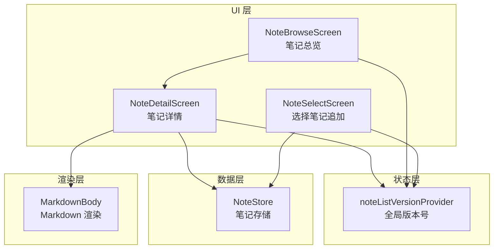
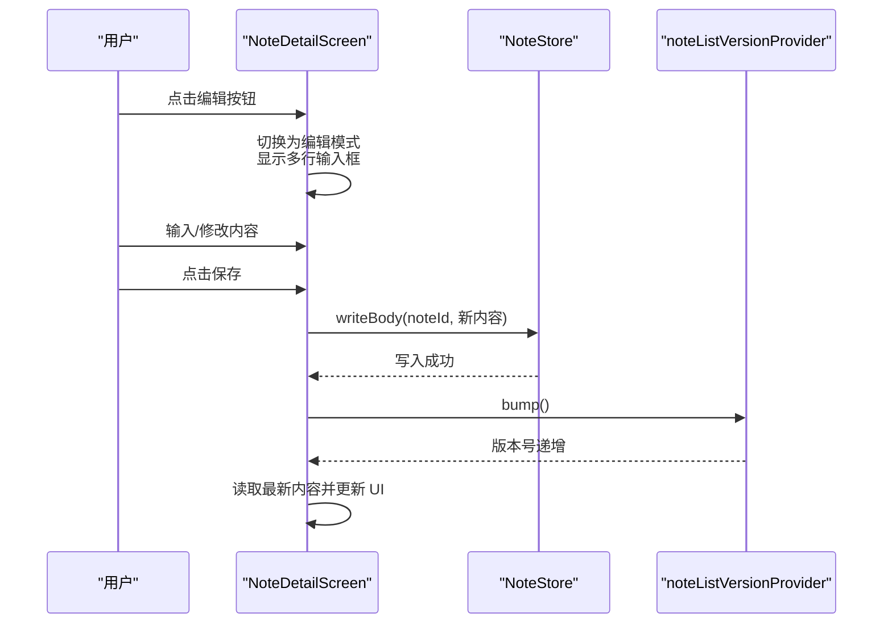
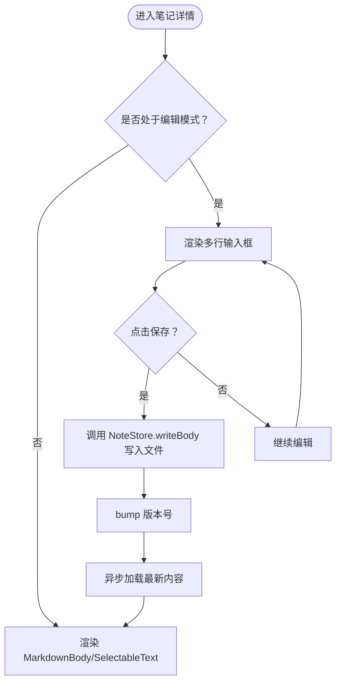
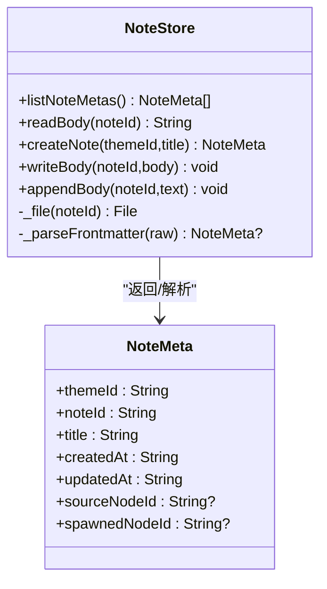
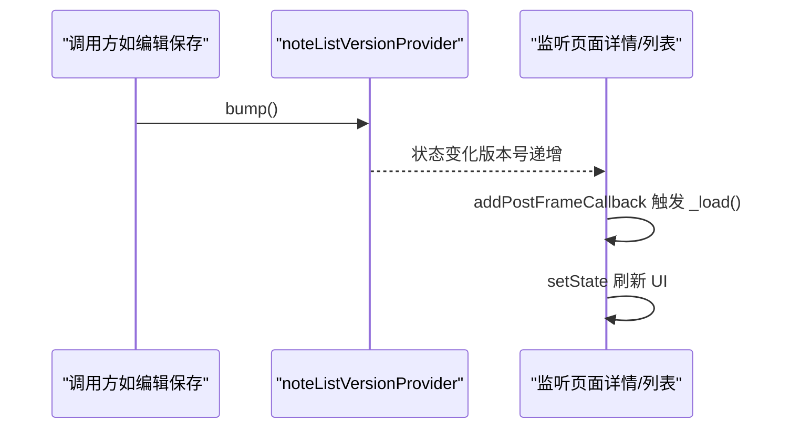
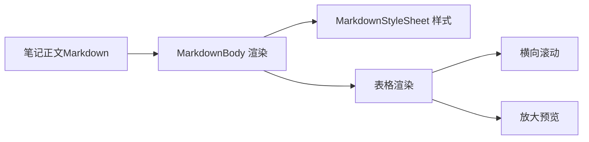
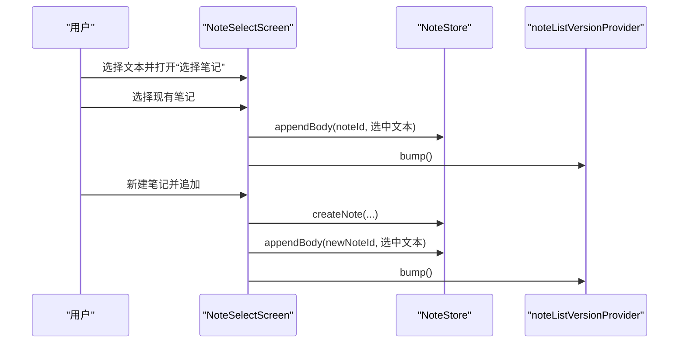
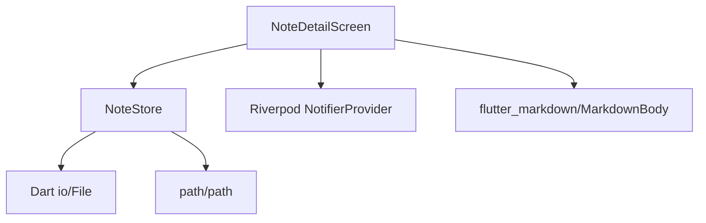

# 笔记编辑

<cite>
**本文引用的文件**
- [note_detail_screen.dart](file://lib/ui/features/notes/note_detail_screen.dart)
- [note_browse_screen.dart](file://lib/ui/features/notes/note_browse_screen.dart)
- [note_select_screen.dart](file://lib/ui/features/notes/note_select_screen.dart)
- [note_store.dart](file://lib/data/stores/note_store.dart)
- [app_services.dart](file://lib/ui/core/app_services.dart)
- [message_bubble.dart](file://lib/ui/core/shared/message_bubble.dart)
- [progress-notes-feature.md](file://docs/progress-notes-feature.md)
- [design.md](file://docs/design.md)
- [pubspec.yaml](file://pubspec.yaml)
- [note_store_test.dart](file://test/data/stores/note_store_test.dart)
- [message_bubble_test.dart](file://test/ui/core/shared/message_bubble_test.dart)
</cite>

## 目录
1. [简介](#简介)
2. [项目结构](#项目结构)
3. [核心组件](#核心组件)
4. [架构总览](#架构总览)
5. [详细组件分析](#详细组件分析)
6. [依赖分析](#依赖分析)
7. [性能考虑](#性能考虑)
8. [故障排查指南](#故障排查指南)
9. [结论](#结论)
10. [附录](#附录)

## 简介
本文件面向“笔记编辑”功能，系统性梳理 ThkTree 中笔记内容的编辑、保存、预览与状态管理实现。当前实现以纯文本 Markdown 文件为载体，采用轻量的富文本编辑器替代方案：在编辑模式使用多行文本输入框，在预览模式使用 Markdown 渲染组件进行渲染。文档同时给出富文本编辑器集成建议、自定义编辑功能扩展思路以及性能优化实践，帮助初学者快速上手，也为高级开发者提供扩展与优化参考。

## 项目结构
笔记编辑相关代码主要分布在以下模块：
- UI 层：笔记浏览、笔记详情、笔记选择（追加到笔记）等屏幕组件
- 数据层：笔记存储与读写（NoteStore）
- 状态层：全局版本号通知（Riverpod Notifier）
- 渲染层：Markdown 渲染组件（flutter_markdown）

图表来源
- [note_detail_screen.dart:1-305](file://lib/ui/features/notes/note_detail_screen.dart#L1-L305)
- [note_browse_screen.dart:1-270](file://lib/ui/features/notes/note_browse_screen.dart#L1-L270)
- [note_select_screen.dart:1-144](file://lib/ui/features/notes/note_select_screen.dart#L1-L144)
- [note_store.dart:1-167](file://lib/data/stores/note_store.dart#L1-L167)
- [app_services.dart:18-25](file://lib/ui/core/app_services.dart#L18-L25)

章节来源
- [note_detail_screen.dart:1-305](file://lib/ui/features/notes/note_detail_screen.dart#L1-L305)
- [note_browse_screen.dart:1-270](file://lib/ui/features/notes/note_browse_screen.dart#L1-L270)
- [note_select_screen.dart:1-144](file://lib/ui/features/notes/note_select_screen.dart#L1-L144)
- [note_store.dart:1-167](file://lib/data/stores/note_store.dart#L1-L167)
- [app_services.dart:18-25](file://lib/ui/core/app_services.dart#L18-L25)

## 核心组件
- 笔记详情页（NoteDetailScreen）：支持编辑/只读切换、手动保存、下拉刷新、版本号驱动的自动刷新
- 笔记存储（NoteStore）：负责笔记文件的读取、写入、追加、元数据解析
- 全局版本号（noteListVersionProvider）：写操作后 bump，触发笔记列表与详情页异步刷新
- Markdown 渲染（MarkdownBody）：在预览模式渲染 Markdown 内容，支持表格、代码块等基础语法
- 笔记选择页（NoteSelectScreen）：将选中文本追加到现有笔记或新建笔记并追加

章节来源
- [note_detail_screen.dart:9-162](file://lib/ui/features/notes/note_detail_screen.dart#L9-L162)
- [note_store.dart:53-136](file://lib/data/stores/note_store.dart#L53-L136)
- [app_services.dart:18-25](file://lib/ui/core/app_services.dart#L18-L25)
- [message_bubble.dart:110-140](file://lib/ui/core/shared/message_bubble.dart#L110-L140)
- [note_select_screen.dart:89-112](file://lib/ui/features/notes/note_select_screen.dart#L89-L112)

## 架构总览
笔记编辑采用“文件系统 + Riverpod 状态”的轻量架构：
- 编辑模式：使用多行 TextField 输入，保存时调用 NoteStore.writeBody 覆盖文件，并通过 bump 版本号通知其他页面刷新
- 预览模式：使用 MarkdownBody 渲染 Markdown 文本，支持基础语法高亮与表格渲染
- 刷新机制：通过全局版本号驱动，避免长驻页面重复读取磁盘，提升性能

图表来源
- [note_detail_screen.dart:69-79](file://lib/ui/features/notes/note_detail_screen.dart#L69-L79)
- [note_store.dart:108-116](file://lib/data/stores/note_store.dart#L108-L116)
- [app_services.dart:18-25](file://lib/ui/core/app_services.dart#L18-L25)

## 详细组件分析

### 笔记详情页（NoteDetailScreen）
- 编辑/只读切换：AppBar 右侧编辑图标，点击后进入编辑模式，显示多行输入框；再次点击保存并退出编辑
- 手动保存：保存时调用 NoteStore.writeBody 覆盖文件，并触发版本号 bump
- 下拉刷新：支持下拉刷新重新读取文件内容
- 自动刷新：监听全局版本号，当版本变化时异步加载最新内容
- 预览模式：无编辑状态时渲染 MarkdownBody（当前实现为 SelectableText，后续可替换为 MarkdownBody）

图表来源
- [note_detail_screen.dart:112-162](file://lib/ui/features/notes/note_detail_screen.dart#L112-L162)
- [note_detail_screen.dart:69-79](file://lib/ui/features/notes/note_detail_screen.dart#L69-L79)
- [note_store.dart:108-116](file://lib/data/stores/note_store.dart#L108-L116)
- [app_services.dart:18-25](file://lib/ui/core/app_services.dart#L18-L25)

章节来源
- [note_detail_screen.dart:9-162](file://lib/ui/features/notes/note_detail_screen.dart#L9-L162)
- [note_store_test.dart:36-47](file://test/data/stores/note_store_test.dart#L36-L47)

### 笔记存储（NoteStore）
- 读取正文：解析文件头部 YAML Frontmatter，返回正文部分
- 创建笔记：生成带 Frontmatter 的空文件
- 写入正文：读取原文件，更新 Frontmatter 的 updatedAt，写回正文
- 追加正文：在现有正文后追加“分隔线 + 新正文”，并更新 Frontmatter
- 列出元数据：遍历目录，解析每个文件的 Frontmatter，按更新时间排序

图表来源
- [note_store.dart:53-151](file://lib/data/stores/note_store.dart#L53-L151)

章节来源
- [note_store.dart:53-151](file://lib/data/stores/note_store.dart#L53-L151)
- [note_store_test.dart:22-47](file://test/data/stores/note_store_test.dart#L22-L47)

### 全局版本号（noteListVersionProvider）
- 类型：Riverpod Notifier<int>
- 作用：作为跨页面的刷新信号，写操作后 bump，触发监听页面异步加载
- 使用：在笔记详情页与笔记浏览页中 watch 并在版本变化时触发 _load

图表来源
- [app_services.dart:18-25](file://lib/ui/core/app_services.dart#L18-L25)
- [note_detail_screen.dart:82-91](file://lib/ui/features/notes/note_detail_screen.dart#L82-L91)
- [note_browse_screen.dart:52-62](file://lib/ui/features/notes/note_browse_screen.dart#L52-L62)

章节来源
- [app_services.dart:18-25](file://lib/ui/core/app_services.dart#L18-L25)
- [progress-notes-feature.md:52-82](file://docs/progress-notes-feature.md#L52-L82)

### Markdown 渲染与预览
- 预览组件：MarkdownBody（来自 flutter_markdown 包）用于渲染 Markdown 文本
- 表格支持：检测到表格时提供横向滚动与放大预览能力
- 样式定制：基于主题构建 MarkdownStyleSheet，支持代码块背景、表格边框与列宽等

图表来源
- [message_bubble.dart:110-140](file://lib/ui/core/shared/message_bubble.dart#L110-L140)
- [message_bubble.dart:187-206](file://lib/ui/core/shared/message_bubble.dart#L187-L206)
- [message_bubble_test.dart:116-144](file://test/ui/core/shared/message_bubble_test.dart#L116-L144)

章节来源
- [message_bubble.dart:110-140](file://lib/ui/core/shared/message_bubble.dart#L110-L140)
- [message_bubble_test.dart:116-144](file://test/ui/core/shared/message_bubble_test.dart#L116-L144)

### 笔记选择与追加（NoteSelectScreen）
- 将外部选中的文本追加到现有笔记或新建笔记并追加
- 追加后 bump 版本号，触发列表与详情页刷新

图表来源
- [note_select_screen.dart:89-112](file://lib/ui/features/notes/note_select_screen.dart#L89-L112)
- [note_store.dart:81-136](file://lib/data/stores/note_store.dart#L81-L136)
- [app_services.dart:18-25](file://lib/ui/core/app_services.dart#L18-L25)

章节来源
- [note_select_screen.dart:89-112](file://lib/ui/features/notes/note_select_screen.dart#L89-L112)
- [note_store.dart:81-136](file://lib/data/stores/note_store.dart#L81-L136)

## 依赖分析
- 第三方依赖：flutter_markdown 用于 Markdown 渲染
- 状态管理：Flutter Riverpod 提供 Notifier 与 Provider
- 文件系统：Dart io 与 path 库用于文件读写与路径拼接
- 存储契约：笔记文件采用 YAML Frontmatter + 正文的结构，Frontmatter 中包含 schema、主题 ID、笔记 ID、标题、创建/更新时间等元数据

图表来源
- [note_detail_screen.dart:1-7](file://lib/ui/features/notes/note_detail_screen.dart#L1-L7)
- [note_store.dart:1-4](file://lib/data/stores/note_store.dart#L1-L4)
- [pubspec.yaml:49](file://pubspec.yaml#L49)

章节来源
- [pubspec.yaml:30-50](file://pubspec.yaml#L30-L50)
- [note_detail_screen.dart:1-7](file://lib/ui/features/notes/note_detail_screen.dart#L1-L7)
- [note_store.dart:1-4](file://lib/data/stores/note_store.dart#L1-L4)

## 性能考虑
- 长驻页面刷新：采用全局版本号 + addPostFrameCallback 的异步刷新，避免重复读取磁盘与 setState 循环
- 可滚动容器：所有加载态/空态/错误态均包裹在可滚动列表中，确保下拉刷新手势始终可用
- 渲染优化：MarkdownBody 仅在预览模式渲染，编辑模式使用 TextField，减少不必要的渲染开销
- 文件写入：写入采用覆盖写（writeBody），避免频繁小写入；追加写（appendBody）用于批量合并

章节来源
- [progress-notes-feature.md:69-82](file://docs/progress-notes-feature.md#L69-L82)
- [note_detail_screen.dart:105-109](file://lib/ui/features/notes/note_detail_screen.dart#L105-L109)
- [note_store.dart:108-136](file://lib/data/stores/note_store.dart#L108-L136)

## 故障排查指南
- 无法保存：检查 NoteDetailScreen 的保存逻辑是否调用 NoteStore.writeBody，并确认 bump 是否触发
- 列表不刷新：确认写操作后是否调用 bump，监听页面是否在版本变化时触发 _load
- 内容为空：检查 NoteStore.readBody 是否正确解析 Frontmatter 与正文分隔符
- Markdown 渲染异常：确认 MarkdownBody 的 data 传入正确，样式表配置是否合理

章节来源
- [note_detail_screen.dart:69-79](file://lib/ui/features/notes/note_detail_screen.dart#L69-L79)
- [note_store.dart:74-79](file://lib/data/stores/note_store.dart#L74-L79)
- [message_bubble_test.dart:116-144](file://test/ui/core/shared/message_bubble_test.dart#L116-L144)

## 结论
当前笔记编辑功能以“文件系统 + 轻量 UI + Riverpod 状态”为核心，实现了基本的编辑、保存与预览能力。编辑模式采用多行输入框，预览模式采用 MarkdownBody 渲染，配合全局版本号实现跨页面刷新。对于富文本编辑器集成与更丰富的格式化选项，可在现有架构基础上扩展：以 NoteStore 为数据层，以 Riverpod 为状态层，以第三方编辑器为 UI 层，保持清晰的职责分离与可测试性。

## 附录

### 富文本编辑器集成与自定义编辑功能
- 集成思路
  - UI 层：引入第三方富文本编辑器（如 flutter_quill、flutter_tiptop 等），在编辑模式中替换 TextField
  - 数据层：NoteStore 保持不变，仍以 Markdown 文本为存储介质；编辑器输出 Markdown 文本，写入时调用 writeBody
  - 状态层：沿用 noteListVersionProvider，写入后 bump
- 自定义编辑功能
  - 快捷键：在编辑器中绑定常用快捷键（如加粗、斜体、标题、列表），映射到编辑器命令
  - 实时预览：在编辑器中嵌入 Markdown 预览面板，或在右侧显示 MarkdownBody 渲染结果
  - 语法高亮：结合 flutter_markdown 的 MarkdownStyleSheet，为代码块与表格提供样式
  - 撤销重做：利用编辑器自带的撤销栈，或在应用层维护轻量的撤销栈（基于 Markdown 版本号）

章节来源
- [note_detail_screen.dart:112-132](file://lib/ui/features/notes/note_detail_screen.dart#L112-L132)
- [note_store.dart:108-116](file://lib/data/stores/note_store.dart#L108-L116)
- [app_services.dart:18-25](file://lib/ui/core/app_services.dart#L18-L25)

### 初学者操作流程
- 新建笔记：在笔记总览页点击新建，输入标题后创建笔记
- 编辑笔记：进入笔记详情页，点击编辑按钮，输入内容后点击保存
- 追加文本：在其他界面选中文本，打开“选择笔记”追加到现有笔记或新建笔记
- 查看预览：退出编辑模式即可看到 Markdown 渲染效果

章节来源
- [note_browse_screen.dart:213-226](file://lib/ui/features/notes/note_browse_screen.dart#L213-L226)
- [note_detail_screen.dart:69-79](file://lib/ui/features/notes/note_detail_screen.dart#L69-L79)
- [note_select_screen.dart:89-112](file://lib/ui/features/notes/note_select_screen.dart#L89-L112)

### 高级开发者扩展与优化
- 扩展点
  - 编辑器：替换 TextField 为第三方富文本编辑器，保持 NoteStore 与 Riverpod 不变
  - 预览：在编辑器中嵌入 MarkdownBody 或独立预览面板
  - 键盘快捷键：在编辑器中注册快捷键，映射到编辑器命令
  - 撤销重做：在应用层维护轻量撤销栈，或使用编辑器自带撤销栈
- 性能优化
  - 写入批量化：合并多次小写入为一次写入，减少磁盘 IO
  - 渲染懒加载：预览模式仅在可见区域渲染，或延迟渲染大表格
  - 缓存：缓存最近编辑的笔记内容，避免频繁读取磁盘

章节来源
- [design.md:49-90](file://docs/design.md#L49-L90)
- [progress-notes-feature.md:69-82](file://docs/progress-notes-feature.md#L69-L82)