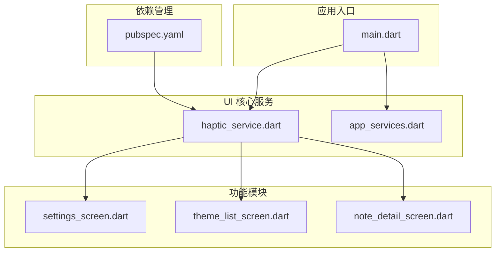
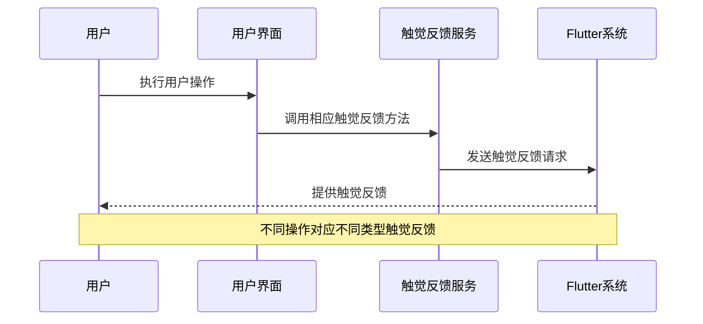
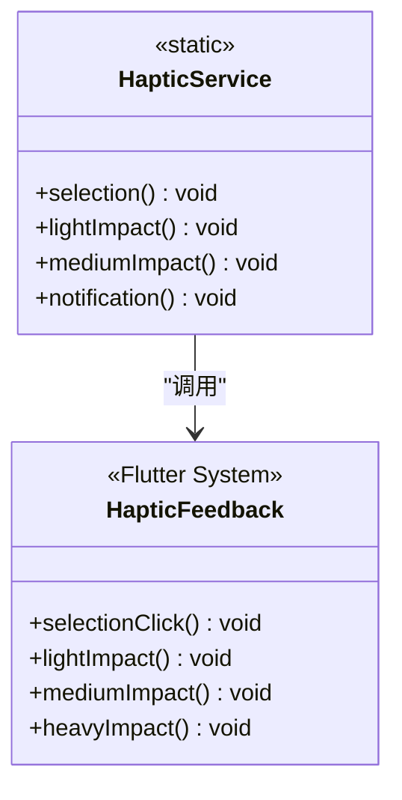
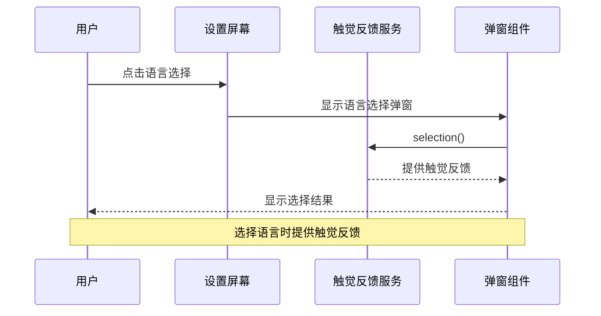
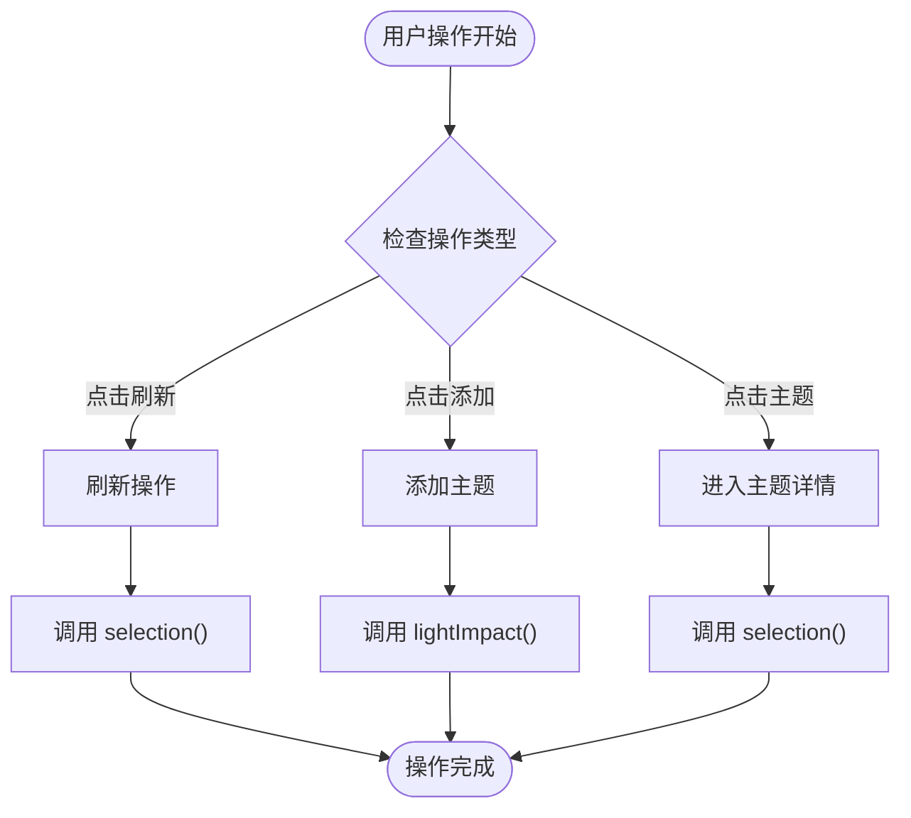
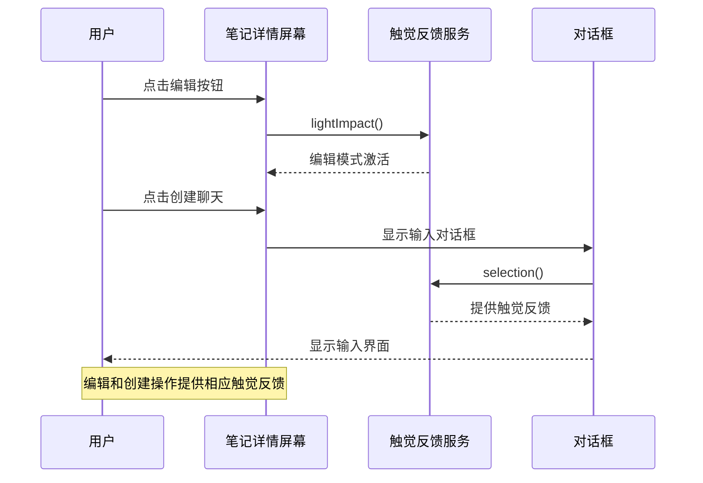
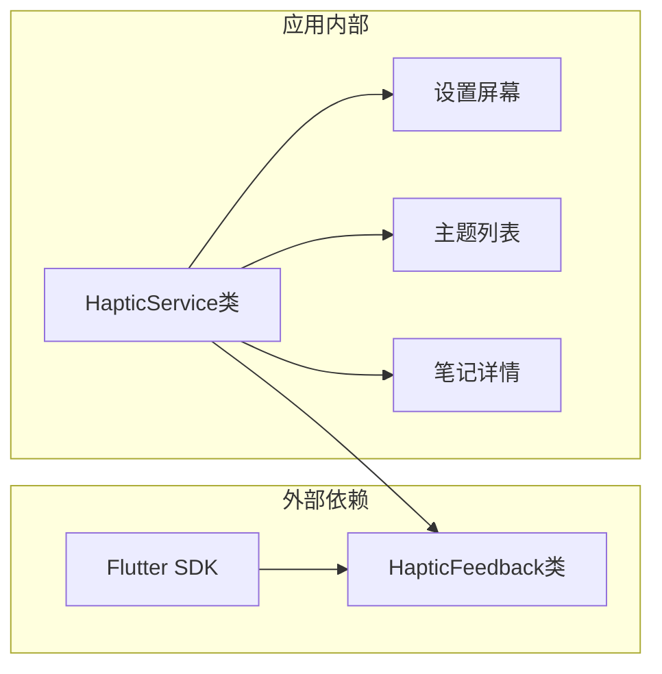

# 触觉反馈服务

<cite>
**本文档引用的文件**
- [haptic_service.dart](file://lib/ui/core/haptic_service.dart)
- [main.dart](file://lib/main.dart)
- [app_services.dart](file://lib/ui/core/app_services.dart)
- [settings_screen.dart](file://lib/ui/features/settings/settings_screen.dart)
- [theme_list_screen.dart](file://lib/ui/features/themes/theme_list_screen.dart)
- [note_detail_screen.dart](file://lib/ui/features/notes/note_detail_screen.dart)
- [pubspec.yaml](file://pubspec.yaml)
- [README.md](file://README.md)
</cite>

## 目录
1. [简介](#简介)
2. [项目结构](#项目结构)
3. [核心组件](#核心组件)
4. [架构概览](#架构概览)
5. [详细组件分析](#详细组件分析)
6. [依赖关系分析](#依赖关系分析)
7. [性能考虑](#性能考虑)
8. [故障排除指南](#故障排除指南)
9. [结论](#结论)

## 简介

触觉反馈服务是 ThkTree 应用程序中的一个重要功能模块，负责为用户界面提供触觉反馈体验。该服务基于 Flutter 的 HapticFeedback 类构建，为不同的用户交互场景提供相应的触觉反馈类型。

ThkTree 是一个基于 Flutter 的应用程序，采用 Riverpod 状态管理框架和 Cupertino 设计语言。触觉反馈服务作为应用用户体验的重要组成部分，通过提供即时的触觉反馈来增强用户的操作感知。

## 项目结构

ThkTree 项目采用模块化的组织结构，触觉反馈服务位于 UI 核心模块中：

**图表来源**
- [main.dart:16-60](file://lib/main.dart#L16-L60)
- [haptic_service.dart:1-16](file://lib/ui/core/haptic_service.dart#L1-L16)
- [pubspec.yaml:30-50](file://pubspec.yaml#L30-L50)

**章节来源**
- [main.dart:1-96](file://lib/main.dart#L1-L96)
- [pubspec.yaml:1-103](file://pubspec.yaml#L1-L103)

## 核心组件

触觉反馈服务的核心组件是一个简单的静态类，提供了四种不同类型的触觉反馈：

### HapticService 类

HapticService 类封装了 Flutter 的 HapticFeedback 功能，提供了四种预定义的触觉反馈类型：

| 触觉反馈类型 | 方法名 | 使用场景 | Flutter 对应方法 |
|------------|--------|----------|----------------|
| 选择点击 | selection() | 列表项选择、标签切换 | HapticFeedback.selectionClick() |
| 轻微影响 | lightImpact() | 操作确认、保存成功 | HapticFeedback.lightImpact() |
| 中等影响 | mediumImpact() | 重要操作、删除确认 | HapticFeedback.mediumImpact() |
| 通知 | notification() | 错误警告、失败状态 | HapticFeedback.heavyImpact() |

**章节来源**
- [haptic_service.dart:1-16](file://lib/ui/core/haptic_service.dart#L1-L16)

## 架构概览

触觉反馈服务在整个应用架构中的位置和交互关系如下：

**图表来源**
- [haptic_service.dart:3-15](file://lib/ui/core/haptic_service.dart#L3-L15)
- [settings_screen.dart:269-335](file://lib/ui/features/settings/settings_screen.dart#L269-L335)

## 详细组件分析

### 触觉反馈服务实现

触觉反馈服务采用静态方法设计模式，确保简单易用且无需实例化：

**图表来源**
- [haptic_service.dart:3-15](file://lib/ui/core/haptic_service.dart#L3-L15)

### 在设置屏幕中的应用

设置屏幕展示了触觉反馈服务在实际应用中的使用方式：

**图表来源**
- [settings_screen.dart:269-335](file://lib/ui/features/settings/settings_screen.dart#L269-L335)
- [haptic_service.dart:5](file://lib/ui/core/haptic_service.dart#L5)

### 在主题列表中的应用

主题列表屏幕展示了其他触觉反馈应用场景：

**图表来源**
- [theme_list_screen.dart:24-42](file://lib/ui/features/themes/theme_list_screen.dart#L24-L42)
- [haptic_service.dart:5-14](file://lib/ui/core/haptic_service.dart#L5-L14)

**章节来源**
- [settings_screen.dart:1-337](file://lib/ui/features/settings/settings_screen.dart#L1-L337)
- [theme_list_screen.dart:1-120](file://lib/ui/features/themes/theme_list_screen.dart#L1-L120)

### 在笔记详情中的应用

笔记详情屏幕展示了触觉反馈在复杂操作中的使用：

**图表来源**
- [note_detail_screen.dart:190-200](file://lib/ui/features/notes/note_detail_screen.dart#L190-L200)
- [note_detail_screen.dart:133-168](file://lib/ui/features/notes/note_detail_screen.dart#L133-L168)

**章节来源**
- [note_detail_screen.dart:1-391](file://lib/ui/features/notes/note_detail_screen.dart#L1-L391)

## 依赖关系分析

触觉反馈服务的依赖关系相对简单，主要依赖于 Flutter 的系统级触觉反馈功能：

**图表来源**
- [haptic_service.dart:1](file://lib/ui/core/haptic_service.dart#L1)
- [pubspec.yaml:31-33](file://pubspec.yaml#L31-L33)

**章节来源**
- [pubspec.yaml:30-50](file://pubspec.yaml#L30-L50)

## 性能考虑

触觉反馈服务具有以下性能特点：

### 轻量级实现
- 静态方法设计，无实例化开销
- 直接调用 Flutter 系统级 API
- 无内存分配和状态管理

### 响应性
- 触觉反馈立即执行
- 无异步等待时间
- 实时响应用户操作

### 资源消耗
- CPU 使用率极低
- 内存占用可忽略不计
- 不影响应用整体性能

## 故障排除指南

### 常见问题及解决方案

#### 触觉反馈不生效
**可能原因：**
- 设备不支持触觉反馈功能
- 系统设置禁用了触觉反馈
- Flutter 版本兼容性问题

**解决方法：**
- 检查设备的触觉反馈设置
- 验证 Flutter 版本兼容性
- 在不同设备上测试功能

#### 触觉反馈类型不正确
**可能原因：**
- 错误调用了触觉反馈方法
- 业务逻辑与触觉反馈类型不匹配

**解决方法：**
- 检查业务逻辑中触觉反馈的调用时机
- 确保使用正确的触觉反馈类型
- 参考触觉反馈类型对照表

**章节来源**
- [haptic_service.dart:1-16](file://lib/ui/core/haptic_service.dart#L1-L16)

## 结论

触觉反馈服务作为 ThkTree 应用程序的重要组成部分，通过提供即时的触觉反馈增强了用户的操作体验。该服务采用简洁的设计模式，实现了四种不同类型的触觉反馈，能够满足应用中各种用户交互场景的需求。

服务的主要优势包括：
- 简单易用的 API 设计
- 轻量级实现，无性能负担
- 良好的可维护性和扩展性
- 与 Flutter 生态系统的无缝集成

通过在设置屏幕、主题列表和笔记详情等关键界面中合理应用触觉反馈，用户能够获得更加直观和愉悦的操作体验。这种设计体现了现代移动应用对细节体验的关注，有助于提升整体用户满意度。