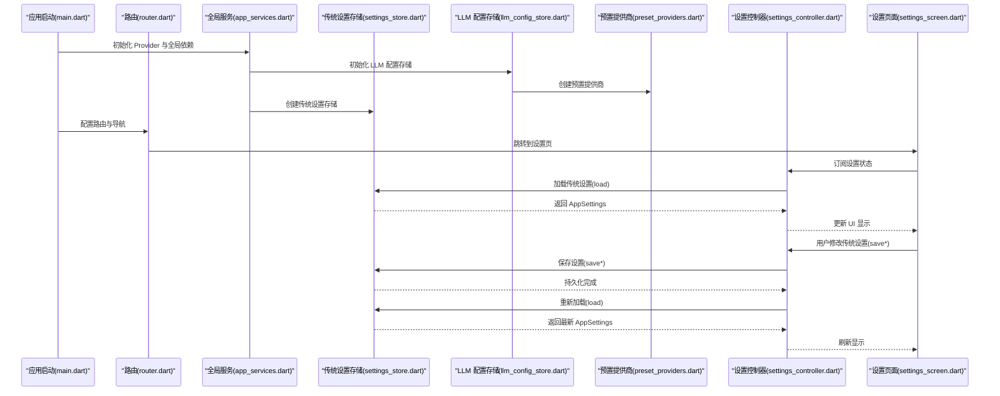
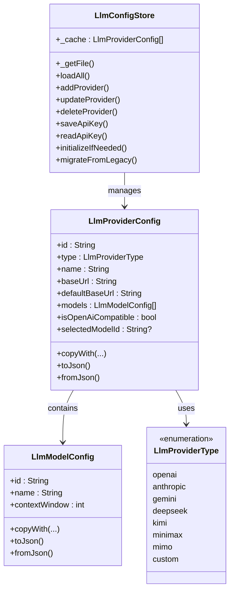
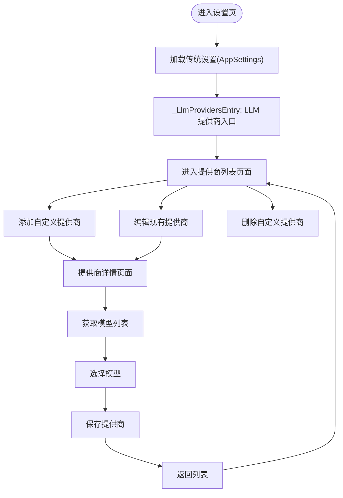
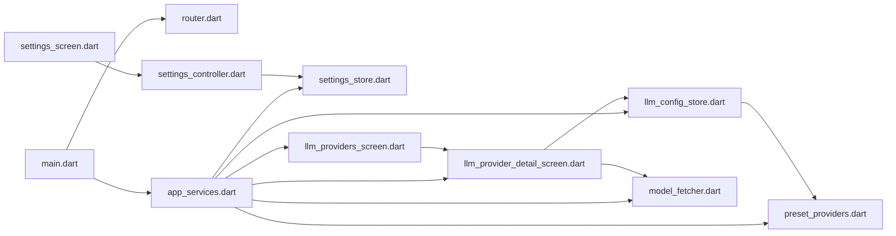

# 设置管理系统

<cite>
**本文引用的文件**
- [lib/main.dart](file://lib/main.dart)
- [lib/ui/core/router.dart](file://lib/ui/core/router.dart)
- [lib/ui/core/app_services.dart](file://lib/ui/core/app_services.dart)
- [lib/ui/core/app_paths.dart](file://lib/ui/core/app_paths.dart)
- [lib/ui/core/app_logger.dart](file://lib/ui/core/app_logger.dart)
- [lib/ui/features/settings/settings_screen.dart](file://lib/ui/features/settings/settings_screen.dart)
- [lib/ui/features/settings/settings_controller.dart](file://lib/ui/features/settings/settings_controller.dart)
- [lib/data/services/settings_store.dart](file://lib/data/services/settings_store.dart)
- [lib/data/services/llm_provider.dart](file://lib/data/services/llm_provider.dart)
- [lib/data/services/llm_client.dart](file://lib/data/services/llm_client.dart)
- [lib/ui/features/llm/llm_providers_screen.dart](file://lib/ui/features/llm/llm_providers_screen.dart)
- [lib/ui/features/llm/llm_provider_detail_screen.dart](file://lib/ui/features/llm/llm_provider_detail_screen.dart)
- [lib/data/models/llm_provider_config.dart](file://lib/data/models/llm_provider_config.dart)
- [lib/data/models/llm_model_config.dart](file://lib/data/models/llm_model_config.dart)
- [lib/data/stores/llm_config_store.dart](file://lib/data/stores/llm_config_store.dart)
- [lib/data/services/model_fetcher.dart](file://lib/data/services/model_fetcher.dart)
- [lib/data/models/preset_providers.dart](file://lib/data/models/preset_providers.dart)
- [pubspec.yaml](file://pubspec.yaml)
</cite>

## 更新摘要
**所做更改**
- 重构了 LLM 提供商配置系统，从单一枚举模式迁移到基于 LlmProviderConfig 的现代配置模型
- 新增了完整的预设提供商管理功能，支持预置提供商和自定义提供商的统一管理界面
- 实现了基于 JSON 文件的持久化存储和基于 flutter_secure_storage 的 API Key 加密存储
- 新增了模型获取、选择和验证功能，支持从提供商 API 动态获取可用模型列表
- 增强了设置页面的 LLM 提供商入口，提供更直观的配置体验
- 实现了向后兼容的配置迁移机制，确保从旧版本平滑升级

## 目录
1. [简介](#简介)
2. [项目结构](#项目结构)
3. [核心组件](#核心组件)
4. [架构总览](#架构总览)
5. [详细组件分析](#详细组件分析)
6. [依赖关系分析](#依赖关系分析)
7. [性能考量](#性能考量)
8. [故障排查指南](#故障排查指南)
9. [结论](#结论)
10. [附录：新增设置与扩展指南](#附录新增设置与扩展指南)

## 简介
本文件为 ThkTree 应用的"设置管理系统"提供一份系统化、可操作的技术文档。经过重大重构后，系统现已支持预设提供商和自定义提供商的统一管理，提供了更加灵活和强大的 LLM 配置能力。内容覆盖设置分类与配置项、设置页面的 UI 设计与交互流程、LLM 提供商配置（含 API 密钥管理、模型参数与连接测试）、安全存储与敏感信息保护、设置数据模型与存储结构、设置导入导出的实现思路、设置验证与错误处理机制，并给出面向初学者的使用指南与面向高级开发者的扩展与集成新提供商的开发指南。

## 项目结构
设置系统围绕"设置数据模型 + 存储层 + 控制器 + UI 展示"的分层组织，配合路由与全局服务提供器，形成响应式、可测试且易于扩展的体系。重构后的架构引入了全新的 LLM 提供商配置模型，支持预设和自定义提供商的统一管理。

```mermaid
graph TB
subgraph "应用入口"
MAIN["lib/main.dart<br/>应用启动与全局初始化"]
ROUTER["lib/ui/core/router.dart<br/>路由配置"]
end
subgraph "全局服务"
APPSERV["lib/ui/core/app_services.dart<br/>Provider 工厂与全局依赖"]
PATHS["lib/ui/core/app_paths.dart<br/>应用路径与目录结构"]
LOGGER["lib/ui/core/app_logger.dart<br/>日志与远程回填"]
end
subgraph "设置子系统"
SETSTORE["lib/data/services/settings_store.dart<br/>传统设置数据模型与安全存储"]
SETCTRL["lib/ui/features/settings/settings_controller.dart<br/>设置控制器Riverpod AsyncNotifier"]
SETUI["lib/ui/features/settings/settings_screen.dart<br/>设置页面 UI 与交互"]
LLMCONFIG["lib/data/stores/llm_config_store.dart<br/>LLM 提供商配置存储"]
PRESET["lib/data/models/preset_providers.dart<br/>预置提供商配置"]
MODELFETCH["lib/data/services/model_fetcher.dart<br/>模型获取与验证"]
END
subgraph "LLM 配置界面"
PROVLIST["lib/ui/features/llm/llm_providers_screen.dart<br/>提供商列表页面"]
PROVDETAIL["lib/ui/features/llm/llm_provider_detail_screen.dart<br/>提供商详情/编辑页面"]
PROVMODEL["lib/data/models/llm_provider_config.dart<br/>提供商配置模型"]
MODEL["lib/data/models/llm_model_config.dart<br/>模型配置模型"]
END
MAIN --> ROUTER
MAIN --> APPSERV
APPSERV --> PATHS
APPSERV --> LOGGER
APPSERV --> SETSTORE
APPSERV --> SETCTRL
APPSERV --> LLMCONFIG
APPSERV --> PROVLIST
APPSERV --> PROVDETAIL
SETUI --> SETCTRL
SETCTRL --> SETSTORE
PROVLIST --> PROVDETAIL
PROVDETAIL --> LLMCONFIG
PROVDETAIL --> MODELFETCH
LLMCONFIG --> PRESET
LLMCONFIG --> PROVMODEL
PROVMODEL --> MODEL
```

**图表来源**
- [lib/main.dart:15-59](file://lib/main.dart#L15-L59)
- [lib/ui/core/router.dart:18-87](file://lib/ui/core/router.dart#L18-L87)
- [lib/ui/core/app_services.dart:27-75](file://lib/ui/core/app_services.dart#L27-L75)
- [lib/ui/core/app_paths.dart:29-45](file://lib/ui/core/app_paths.dart#L29-L45)
- [lib/ui/core/app_logger.dart:63-83](file://lib/ui/core/app_logger.dart#L63-L83)
- [lib/data/services/settings_store.dart:106-184](file://lib/data/services/settings_store.dart#L106-L184)
- [lib/ui/features/settings/settings_controller.dart:7-39](file://lib/ui/features/settings/settings_controller.dart#L7-L39)
- [lib/ui/features/settings/settings_screen.dart:14-52](file://lib/ui/features/settings/settings_screen.dart#L14-L52)
- [lib/data/stores/llm_config_store.dart:17-234](file://lib/data/stores/llm_config_store.dart#L17-L234)
- [lib/data/models/preset_providers.dart:8-67](file://lib/data/models/preset_providers.dart#L8-L67)
- [lib/data/services/model_fetcher.dart:18-240](file://lib/data/services/model_fetcher.dart#L18-L240)
- [lib/ui/features/llm/llm_providers_screen.dart:10-123](file://lib/ui/features/llm/llm_providers_screen.dart#L10-L123)
- [lib/ui/features/llm/llm_provider_detail_screen.dart:13-397](file://lib/ui/features/llm/llm_provider_detail_screen.dart#L13-L397)
- [lib/data/models/llm_provider_config.dart:36-108](file://lib/data/models/llm_provider_config.dart#L36-L108)
- [lib/data/models/llm_model_config.dart:1-39](file://lib/data/models/llm_model_config.dart#L1-L39)

**章节来源**
- [lib/main.dart:15-59](file://lib/main.dart#L15-L59)
- [lib/ui/core/router.dart:18-87](file://lib/ui/core/router.dart#L18-L87)
- [lib/ui/core/app_services.dart:27-75](file://lib/ui/core/app_services.dart#L27-L75)

## 核心组件
- **传统设置系统**：保持原有的语言设置、日志配置等功能，继续使用 AppSettings 模型和 SettingsStore 存储
- **LLM 配置系统**：全新设计的基于 LlmProviderConfig 的提供商管理框架，支持预设和自定义提供商
- **预置提供商**：内置标准 LLM 提供商（OpenAI、Anthropic、Gemini、DeepSeek、KIMI、Minimax、MIMO）
- **自定义提供商**：允许用户创建和管理自己的 LLM 提供商实例
- **模型管理**：支持从提供商 API 动态获取和选择可用模型
- **安全存储**：分离的 JSON 文件存储提供商配置，API Key 通过 flutter_secure_storage 加密存储
- **配置迁移**：向后兼容机制，支持从旧版本配置格式平滑迁移

**章节来源**
- [lib/data/services/settings_store.dart:4-104](file://lib/data/services/settings_store.dart#L4-L104)
- [lib/data/stores/llm_config_store.dart:17-234](file://lib/data/stores/llm_config_store.dart#L17-L234)
- [lib/data/models/llm_provider_config.dart:36-108](file://lib/data/models/llm_provider_config.dart#L36-L108)
- [lib/data/models/preset_providers.dart:8-67](file://lib/data/models/preset_providers.dart#L8-L67)
- [lib/ui/features/llm/llm_providers_screen.dart:10-123](file://lib/ui/features/llm/llm_providers_screen.dart#L10-L123)
- [lib/ui/features/llm/llm_provider_detail_screen.dart:13-397](file://lib/ui/features/llm/llm_provider_detail_screen.dart#L13-L397)

## 架构总览
设置系统采用"传统设置 + LLM 配置"双轨制架构，既保持了原有设置功能的稳定性，又引入了现代化的 LLM 提供商管理能力。重构后的架构实现了更好的模块化和可扩展性。



**图表来源**
- [lib/main.dart:15-59](file://lib/main.dart#L15-L59)
- [lib/ui/core/router.dart:75-79](file://lib/ui/core/router.dart#L75-L79)
- [lib/ui/core/app_services.dart:63-75](file://lib/ui/core/app_services.dart#L63-L75)
- [lib/data/services/settings_store.dart:117-156](file://lib/data/services/settings_store.dart#L117-L156)
- [lib/ui/features/settings/settings_controller.dart:9-39](file://lib/ui/features/settings/settings_controller.dart#L9-L39)
- [lib/ui/features/settings/settings_screen.dart:21-51](file://lib/ui/features/settings/settings_screen.dart#L21-L51)
- [lib/data/stores/llm_config_store.dart:141-149](file://lib/data/stores/llm_config_store.dart#L141-L149)
- [lib/data/models/preset_providers.dart:8-67](file://lib/data/models/preset_providers.dart#L8-L67)

## 详细组件分析

### 传统设置系统
- **数据模型**：AppSettings 聚合当前提供商、各提供商 API Key、各提供商模型名、语言代码
- **存储策略**：基于 flutter_secure_storage 的键空间隔离，分别保存提供商、API Key、模型名与语言代码
- **控制器**：Riverpod AsyncNotifier 管理异步加载与更新，提供 saveProvider/saveApiKey/saveModel/saveLocale 方法

**章节来源**
- [lib/data/services/settings_store.dart:4-104](file://lib/data/services/settings_store.dart#L4-L104)
- [lib/data/services/settings_store.dart:106-184](file://lib/data/services/settings_store.dart#L106-L184)
- [lib/ui/features/settings/settings_controller.dart:7-39](file://lib/ui/features/settings/settings_controller.dart#L7-L39)

### LLM 配置系统重构
- **配置模型**：LlmProviderConfig 支持唯一 ID、类型、名称、基础 URL、默认 URL、模型列表、兼容性标记
- **提供商类型**：包含 openai、anthropic、gemini、deepseek、kimi、minimax、mimo、custom 八种类型
- **存储架构**：JSON 文件存储提供商配置，API Key 单独加密存储，支持预置和自定义提供商
- **迁移机制**：向后兼容旧版本配置，自动迁移 API Key、模型和当前提供商设置



**图表来源**
- [lib/data/models/llm_provider_config.dart:36-108](file://lib/data/models/llm_provider_config.dart#L36-L108)
- [lib/data/models/llm_model_config.dart:1-39](file://lib/data/models/llm_model_config.dart#L1-L39)
- [lib/data/stores/llm_config_store.dart:17-234](file://lib/data/stores/llm_config_store.dart#L17-L234)

**章节来源**
- [lib/data/models/llm_provider_config.dart:36-108](file://lib/data/models/llm_provider_config.dart#L36-L108)
- [lib/data/models/llm_model_config.dart:1-39](file://lib/data/models/llm_model_config.dart#L1-L39)
- [lib/data/stores/llm_config_store.dart:17-234](file://lib/data/stores/llm_config_store.dart#L17-L234)

### LLM 提供商管理界面
- **提供商列表**：展示所有预置和自定义提供商，支持添加、编辑、删除操作
- **详情编辑**：支持自定义提供商名称、基础 URL、API Key 输入，模型列表获取和选择
- **模型获取**：通过 ModelFetcher 从提供商 API 动态获取可用模型，支持过滤非聊天模型
- **自动保存**：预置提供商编辑时自动保存，自定义提供商需要手动保存



**图表来源**
- [lib/ui/features/settings/settings_screen.dart:209-236](file://lib/ui/features/settings/settings_screen.dart#L209-L236)
- [lib/ui/features/llm/llm_providers_screen.dart:10-123](file://lib/ui/features/llm/llm_providers_screen.dart#L10-L123)
- [lib/ui/features/llm/llm_provider_detail_screen.dart:13-397](file://lib/ui/features/llm/llm_provider_detail_screen.dart#L13-L397)

**章节来源**
- [lib/ui/features/settings/settings_screen.dart:209-236](file://lib/ui/features/settings/settings_screen.dart#L209-L236)
- [lib/ui/features/llm/llm_providers_screen.dart:10-123](file://lib/ui/features/llm/llm_providers_screen.dart#L10-L123)
- [lib/ui/features/llm/llm_provider_detail_screen.dart:13-397](file://lib/ui/features/llm/llm_provider_detail_screen.dart#L13-L397)

### 预置提供商与自定义提供商
- **预置提供商**：内置标准 LLM 提供商，使用固定 ID 格式（`preset_type`），包含官方默认 URL
- **自定义提供商**：用户可创建独立的提供商实例，使用 ULID 格式 ID（`custom_` 前缀）
- **兼容性**：通过 isOpenAiCompatible 标记区分 OpenAI 兼容和专用协议提供商
- **模型管理**：支持为每个提供商维护独立的模型列表和上下文窗口信息

**章节来源**
- [lib/data/models/preset_providers.dart:8-67](file://lib/data/models/preset_providers.dart#L8-L67)
- [lib/data/models/llm_provider_config.dart:36-108](file://lib/data/models/llm_provider_config.dart#L36-L108)
- [lib/data/stores/llm_config_store.dart:141-149](file://lib/data/stores/llm_config_store.dart#L141-L149)

### 模型获取与验证机制
- **统一接口**：ModelFetcher 根据提供商类型分发到对应 API 解析逻辑
- **OpenAI 兼容**：支持标准 `/models` 接口，自动过滤非聊天模型
- **Anthropic**：支持 `x-api-key` 和 `anthropic-version` 头部认证
- **Gemini**：支持 `key` 查询参数，过滤支持 `generateContent` 的模型
- **错误处理**：统一处理 401/403、HTTP 错误和网络超时

**章节来源**
- [lib/data/services/model_fetcher.dart:18-240](file://lib/data/services/model_fetcher.dart#L18-L240)

### 安全存储机制与敏感信息保护
- **分离存储**：提供商配置存储在 JSON 文件中，API Key 通过 flutter_secure_storage 加密存储
- **键空间设计**：API Key 使用 `llm_key_{providerId}` 格式，避免明文泄露
- **迁移安全**：向后兼容迁移过程中确保 API Key 不会丢失或暴露
- **访问控制**：iOS 平台使用 Keychain Accessibility 首次解锁访问级别

**章节来源**
- [lib/data/stores/llm_config_store.dart:86-115](file://lib/data/stores/llm_config_store.dart#L86-L115)
- [lib/data/stores/llm_config_store.dart:190-232](file://lib/data/stores/llm_config_store.dart#L190-L232)

### 设置导入导出（实现思路）
- **传统设置**：将 AppSettings 序列化为 JSON，包含提供商、API Key、模型、语言等字段
- **LLM 配置**：支持导出整个提供商配置数组，包含预置和自定义提供商的所有信息
- **导入机制**：解析 JSON 后调用相应的存储方法写入，自动处理 API Key 加密存储
- **兼容性**：导入时自动检测并迁移旧版本格式，确保向后兼容

**章节来源**
- [lib/data/stores/llm_config_store.dart:42-48](file://lib/data/stores/llm_config_store.dart#L42-L48)
- [lib/data/stores/llm_config_store.dart:190-232](file://lib/data/stores/llm_config_store.dart#L190-L232)

### 设置验证与错误处理机制
- **输入验证**：提供商名称、基础 URL 必填验证，API Key 长度和格式验证
- **模型过滤**：自动过滤 embedding、whisper、tts、dall-e 等非聊天模型
- **错误处理**：统一的异常捕获和用户友好的错误提示
- **状态管理**：使用 AsyncNotifier 管理加载、成功、错误三种状态

**章节来源**
- [lib/ui/features/llm/llm_provider_detail_screen.dart:274-334](file://lib/ui/features/llm/llm_provider_detail_screen.dart#L274-L334)
- [lib/data/services/model_fetcher.dart:209-230](file://lib/data/services/model_fetcher.dart#L209-L230)

## 依赖关系分析
重构后的设置系统形成了更加清晰的模块化架构，传统设置和 LLM 配置各自独立，同时通过全局服务进行协调。



**图表来源**
- [lib/main.dart:15-59](file://lib/main.dart#L15-L59)
- [lib/ui/core/router.dart:75-79](file://lib/ui/core/router.dart#L75-L79)
- [lib/ui/core/app_services.dart:63-75](file://lib/ui/core/app_services.dart#L63-L75)
- [lib/data/services/settings_store.dart:106-184](file://lib/data/services/settings_store.dart#L106-L184)
- [lib/ui/features/settings/settings_controller.dart:7-39](file://lib/ui/features/settings/settings_controller.dart#L7-L39)
- [lib/ui/features/settings/settings_screen.dart:14-52](file://lib/ui/features/settings/settings_screen.dart#L14-L52)
- [lib/data/stores/llm_config_store.dart:17-234](file://lib/data/stores/llm_config_store.dart#L17-L234)
- [lib/ui/features/llm/llm_providers_screen.dart:10-123](file://lib/ui/features/llm/llm_providers_screen.dart#L10-L123)
- [lib/ui/features/llm/llm_provider_detail_screen.dart:13-397](file://lib/ui/features/llm/llm_provider_detail_screen.dart#L13-L397)

**章节来源**
- [lib/main.dart:15-59](file://lib/main.dart#L15-L59)
- [lib/ui/core/router.dart:75-79](file://lib/ui/core/router.dart#L75-L79)
- [lib/ui/core/app_services.dart:63-75](file://lib/ui/core/app_services.dart#L63-L75)

## 性能考量
- **存储优化**：LLM 配置使用内存缓存减少文件 I/O 操作，支持缓存清除机制
- **网络请求**：ModelFetcher 使用超时控制和错误重试机制，避免阻塞主线程
- **UI 渲染**：分离的状态管理确保只有相关部分重新构建，提升响应速度
- **内存管理**：Provider 模式避免重复实例化，合理使用 dispose 释放资源

**章节来源**
- [lib/data/stores/llm_config_store.dart:22-48](file://lib/data/stores/llm_config_store.dart#L22-L48)
- [lib/data/services/model_fetcher.dart:19-25](file://lib/data/services/model_fetcher.dart#L19-L25)

## 故障排查指南
- **配置加载失败**：检查 JSON 文件是否存在和格式正确，确认 flutter_secure_storage 权限
- **API Key 无法保存**：验证加密存储权限，检查键空间命名是否正确
- **模型获取失败**：确认基础 URL 和 API Key 正确，检查网络连接和提供商状态
- **迁移问题**：查看迁移日志，确认 `llm_config_migrated` 标记键是否存在
- **预置提供商缺失**：检查 `initializeIfNeeded()` 是否正常执行，确认预置列表生成

**章节来源**
- [lib/data/stores/llm_config_store.dart:135-149](file://lib/data/stores/llm_config_store.dart#L135-L149)
- [lib/data/stores/llm_config_store.dart:190-232](file://lib/data/stores/llm_config_store.dart#L190-L232)
- [lib/ui/features/llm/llm_provider_detail_screen.dart:227-270](file://lib/ui/features/llm/llm_provider_detail_screen.dart#L227-L270)

## 结论
经过重大重构的设置管理系统实现了从单一提供商配置到多提供商统一管理的跨越。新架构不仅保持了原有设置功能的稳定性，还引入了现代化的 LLM 配置能力，支持预置和自定义提供商的灵活管理。通过分离存储、加密保护和向后兼容机制，系统在功能性和安全性之间取得了良好平衡，为未来的扩展奠定了坚实基础。

## 附录：新增设置与扩展指南

### 新增 LLM 提供商类型步骤
- **扩展枚举类型**：在 LlmProviderType 中添加新的提供商类型
- **更新预置配置**：在 createPresetProviders() 中添加对应的预置提供商配置
- **扩展存储逻辑**：在 LlmConfigStore 中处理新类型的特殊需求
- **更新 UI 界面**：在提供商列表和详情页面中适配新类型
- **测试验证**：确保新类型能够正确获取模型列表和进行配置

**章节来源**
- [lib/data/models/llm_provider_config.dart:4-34](file://lib/data/models/llm_provider_config.dart#L4-L34)
- [lib/data/models/preset_providers.dart:8-67](file://lib/data/models/preset_providers.dart#L8-L67)
- [lib/data/stores/llm_config_store.dart:17-234](file://lib/data/stores/llm_config_store.dart#L17-L234)

### 自定义验证规则
- **输入清理**：在保存前统一 trim，空字符串按需删除键
- **类型与格式**：对模型名、URL、令牌长度等进行简单校验
- **业务约束**：如提供商与模型的组合有效性，可在保存后触发一次最小化请求进行连通性验证
- **模型过滤**：自动过滤非聊天模型，确保用户体验

**章节来源**
- [lib/ui/features/llm/llm_provider_detail_screen.dart:274-334](file://lib/ui/features/llm/llm_provider_detail_screen.dart#L274-L334)
- [lib/data/services/model_fetcher.dart:232-238](file://lib/data/services/model_fetcher.dart#L232-L238)

### 集成新 LLM 提供商
- **在 LlmProviderType 中新增枚举值**，补充显示名、默认模型、基础 URL、兼容性标记
- **在 createPresetProviders() 中添加预置配置**，包含官方默认 URL
- **在 LlmConfigStore 中处理新类型**，实现对应的存储和迁移逻辑
- **在 LlmProvidersScreen 和 LlmProviderDetailScreen 中更新 UI**，适配新类型的特殊需求
- **测试连接和模型获取**，确保新提供商能够正常工作

**章节来源**
- [lib/data/models/llm_provider_config.dart:4-34](file://lib/data/models/llm_provider_config.dart#L4-L34)
- [lib/data/models/preset_providers.dart:8-67](file://lib/data/models/preset_providers.dart#L8-L67)
- [lib/ui/features/llm/llm_providers_screen.dart:10-123](file://lib/ui/features/llm/llm_providers_screen.dart#L10-L123)
- [lib/ui/features/llm/llm_provider_detail_screen.dart:13-397](file://lib/ui/features/llm/llm_provider_detail_screen.dart#L13-L397)

### 使用指南（初学者）
- **打开应用后**，通过底部导航进入设置页
- **语言设置**：选择系统默认、英文或中文，保存后立即生效
- **LLM 提供商管理**：点击"LLM 提供商"进入管理界面，支持添加、编辑、删除提供商
- **添加自定义提供商**：点击"+"按钮，填写提供商名称、基础 URL 和 API Key
- **获取模型列表**：在提供商详情页面点击"获取模型"，从 API 动态获取可用模型
- **选择模型**：勾选需要使用的模型，保存后即可用于聊天
- **日志查看**：可复制日志路径、查看日志尾部、查看远程日志状态

**章节来源**
- [lib/ui/features/settings/settings_screen.dart:209-236](file://lib/ui/features/settings/settings_screen.dart#L209-L236)
- [lib/ui/features/llm/llm_providers_screen.dart:21-47](file://lib/ui/features/llm/llm_providers_screen.dart#L21-L47)
- [lib/ui/features/llm/llm_provider_detail_screen.dart:113-223](file://lib/ui/features/llm/llm_provider_detail_screen.dart#L113-L223)

### 高级开发指南
- **扩展存储后端**：可实现其他存储方案（如 SQLite、Cloud Sync）
- **自定义验证器**：实现复杂的业务规则验证
- **配置导入导出**：支持多种格式的配置文件导入导出
- **监控和诊断**：添加配置使用统计和健康检查功能
- **国际化支持**：完善多语言支持，包括提供商名称和错误信息

**章节来源**
- [lib/data/stores/llm_config_store.dart:42-48](file://lib/data/stores/llm_config_store.dart#L42-L48)
- [lib/data/stores/llm_config_store.dart:190-232](file://lib/data/stores/llm_config_store.dart#L190-L232)