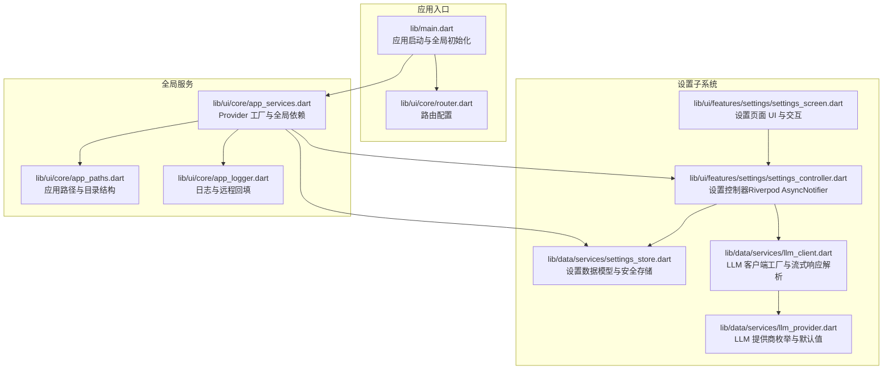
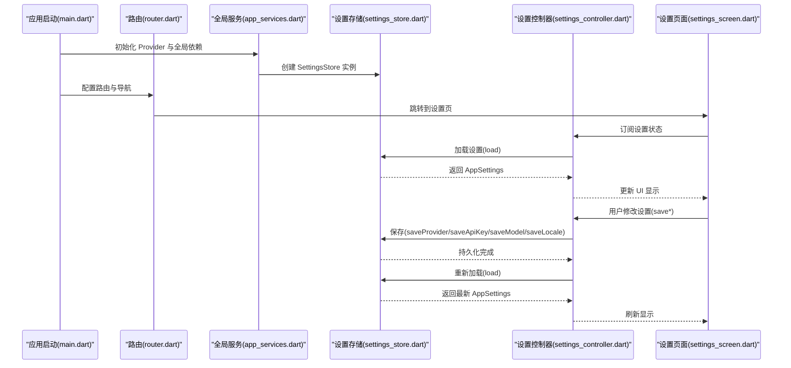
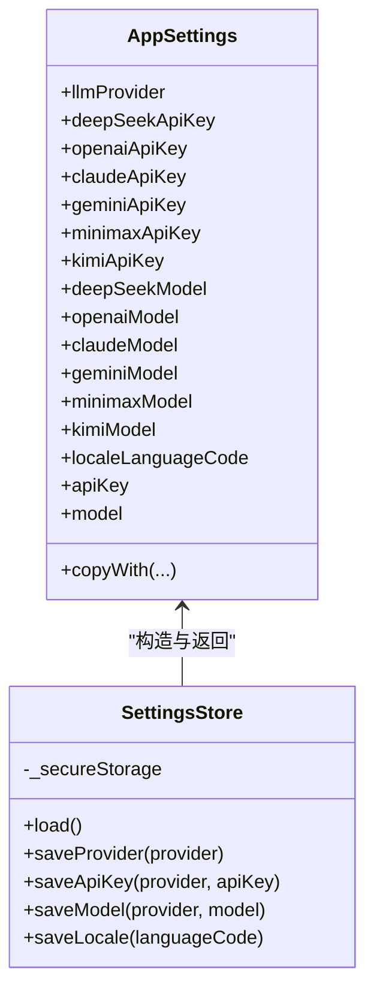
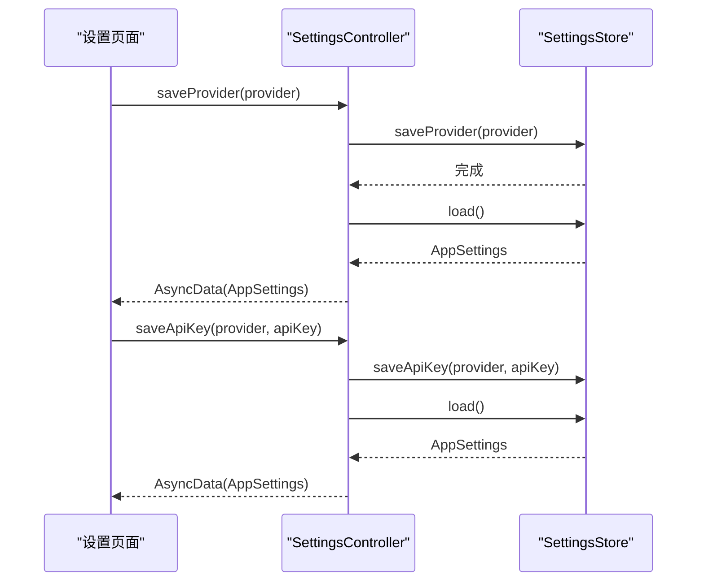
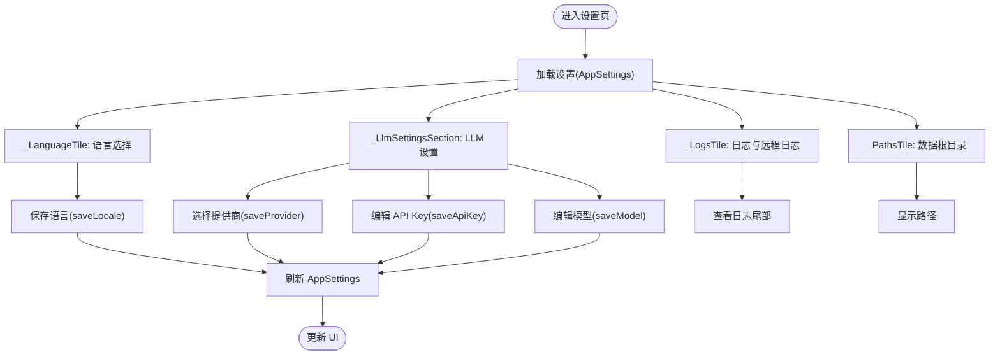
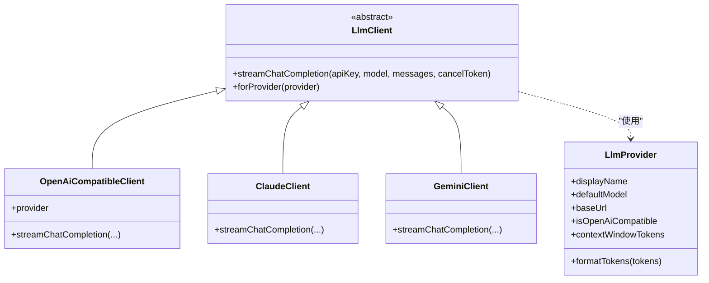
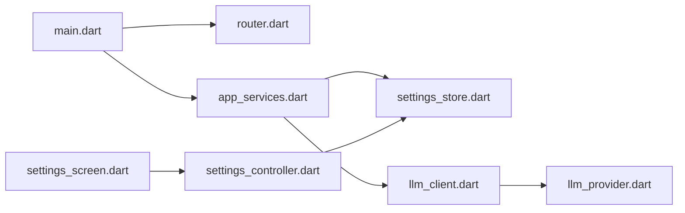

# 设置管理系统

<cite>
**本文引用的文件**
- [lib/main.dart](file://lib/main.dart)
- [lib/ui/core/router.dart](file://lib/ui/core/router.dart)
- [lib/ui/core/app_services.dart](file://lib/ui/core/app_services.dart)
- [lib/ui/core/app_paths.dart](file://lib/ui/core/app_paths.dart)
- [lib/ui/core/app_logger.dart](file://lib/ui/core/app_logger.dart)
- [lib/ui/features/settings/settings_screen.dart](file://lib/ui/features/settings/settings_screen.dart)
- [lib/ui/features/settings/settings_controller.dart](file://lib/ui/features/settings/settings_controller.dart)
- [lib/data/services/settings_store.dart](file://lib/data/services/settings_store.dart)
- [lib/data/services/llm_provider.dart](file://lib/data/services/llm_provider.dart)
- [lib/data/services/llm_client.dart](file://lib/data/services/llm_client.dart)
- [pubspec.yaml](file://pubspec.yaml)
</cite>

## 目录
1. [简介](#简介)
2. [项目结构](#项目结构)
3. [核心组件](#核心组件)
4. [架构总览](#架构总览)
5. [详细组件分析](#详细组件分析)
6. [依赖关系分析](#依赖关系分析)
7. [性能考量](#性能考量)
8. [故障排查指南](#故障排查指南)
9. [结论](#结论)
10. [附录：新增设置与扩展指南](#附录新增设置与扩展指南)

## 简介
本文件为 ThkTree 应用的“设置管理系统”提供一份系统化、可操作的技术文档。内容覆盖设置分类与配置项、设置页面的 UI 设计与交互流程、LLM 提供商配置（含 API 密钥管理、模型参数与连接测试）、安全存储与敏感信息保护、设置数据模型与存储结构、设置导入导出的实现思路、设置验证与错误处理机制，并给出面向初学者的使用指南与面向高级开发者的扩展与集成新提供商的开发指南。

## 项目结构
设置系统围绕“设置数据模型 + 存储层 + 控制器 + UI 展示”的分层组织，配合路由与全局服务提供器，形成响应式、可测试且易于扩展的体系。

图表来源
- [lib/main.dart:15-59](file://lib/main.dart#L15-L59)
- [lib/ui/core/router.dart:18-87](file://lib/ui/core/router.dart#L18-L87)
- [lib/ui/core/app_services.dart:27-75](file://lib/ui/core/app_services.dart#L27-L75)
- [lib/ui/core/app_paths.dart:29-45](file://lib/ui/core/app_paths.dart#L29-L45)
- [lib/ui/core/app_logger.dart:63-83](file://lib/ui/core/app_logger.dart#L63-L83)
- [lib/data/services/settings_store.dart:106-184](file://lib/data/services/settings_store.dart#L106-L184)
- [lib/ui/features/settings/settings_controller.dart:7-39](file://lib/ui/features/settings/settings_controller.dart#L7-L39)
- [lib/ui/features/settings/settings_screen.dart:14-52](file://lib/ui/features/settings/settings_screen.dart#L14-L52)
- [lib/data/services/llm_provider.dart:1-111](file://lib/data/services/llm_provider.dart#L1-L111)
- [lib/data/services/llm_client.dart:8-31](file://lib/data/services/llm_client.dart#L8-L31)

章节来源
- [lib/main.dart:15-59](file://lib/main.dart#L15-L59)
- [lib/ui/core/router.dart:18-87](file://lib/ui/core/router.dart#L18-L87)
- [lib/ui/core/app_services.dart:27-75](file://lib/ui/core/app_services.dart#L27-L75)

## 核心组件
- 设置数据模型与访问器：统一聚合 LLM 提供商、各提供商 API Key、各提供商模型名、语言等配置，并提供便捷的 apiKey/model 访问器。
- 安全存储：基于 flutter_secure_storage 的键空间隔离，分别保存提供商、API Key、模型名与语言代码。
- 设置控制器：基于 Riverpod AsyncNotifier，封装加载、保存提供商、API Key、模型与语言的异步状态。
- 设置页面：提供语言选择、LLM 提供商切换、API Key 输入、模型名输入、日志查看与路径展示等交互。
- LLM 提供商与客户端：提供多提供商枚举、默认模型、基础 URL、兼容性标记与流式响应解析；客户端按提供商类型自动选择实现。

章节来源
- [lib/data/services/settings_store.dart:4-104](file://lib/data/services/settings_store.dart#L4-L104)
- [lib/data/services/settings_store.dart:106-184](file://lib/data/services/settings_store.dart#L106-L184)
- [lib/ui/features/settings/settings_controller.dart:7-39](file://lib/ui/features/settings/settings_controller.dart#L7-L39)
- [lib/ui/features/settings/settings_screen.dart:14-52](file://lib/ui/features/settings/settings_screen.dart#L14-L52)
- [lib/data/services/llm_provider.dart:1-111](file://lib/data/services/llm_provider.dart#L1-L111)
- [lib/data/services/llm_client.dart:8-31](file://lib/data/services/llm_client.dart#L8-L31)

## 架构总览
设置系统采用“数据模型 + 存储 + 控制器 + UI”的清晰分层，配合全局 Provider 注入，实现从应用启动到页面渲染的完整链路。

图表来源
- [lib/main.dart:15-59](file://lib/main.dart#L15-L59)
- [lib/ui/core/router.dart:75-79](file://lib/ui/core/router.dart#L75-L79)
- [lib/ui/core/app_services.dart:63-75](file://lib/ui/core/app_services.dart#L63-L75)
- [lib/data/services/settings_store.dart:117-156](file://lib/data/services/settings_store.dart#L117-L156)
- [lib/ui/features/settings/settings_controller.dart:9-39](file://lib/ui/features/settings/settings_controller.dart#L9-L39)
- [lib/ui/features/settings/settings_screen.dart:21-51](file://lib/ui/features/settings/settings_screen.dart#L21-L51)

## 详细组件分析

### 设置数据模型与存储结构
- 数据模型：AppSettings 聚合当前提供商、各提供商 API Key、各提供商模型名、语言代码，并提供 apiKey/model 访问器，便于在业务层按当前提供商统一读取。
- 存储键空间：提供者键、各提供商 API Key 键、各提供商模型键、语言键，均通过静态方法生成，避免硬编码与重复。
- 加载策略：优先从安全存储读取，缺失时回退到默认值或空字符串；语言键为空时视为系统默认。
- 保存策略：对 API Key 与模型名进行 trim 处理；API Key 为空字符串时删除对应键，确保不残留明文；语言为空时删除键。

图表来源
- [lib/data/services/settings_store.dart:4-104](file://lib/data/services/settings_store.dart#L4-L104)
- [lib/data/services/settings_store.dart:106-184](file://lib/data/services/settings_store.dart#L106-L184)

章节来源
- [lib/data/services/settings_store.dart:4-104](file://lib/data/services/settings_store.dart#L4-L104)
- [lib/data/services/settings_store.dart:106-184](file://lib/data/services/settings_store.dart#L106-L184)

### 设置控制器与状态管理
- 使用 AsyncNotifier<AppSettings> 管理异步加载与更新，保证 UI 在加载、成功、错误三种状态下正确渲染。
- 提供 saveProvider/saveApiKey/saveModel/saveLocale 四个异步方法，内部调用 SettingsStore 并刷新状态。
- 语言变更时联动 localeProvider，触发全局主题与文案刷新。

图表来源
- [lib/ui/features/settings/settings_controller.dart:14-39](file://lib/ui/features/settings/settings_controller.dart#L14-L39)
- [lib/data/services/settings_store.dart:158-175](file://lib/data/services/settings_store.dart#L158-L175)

章节来源
- [lib/ui/features/settings/settings_controller.dart:7-39](file://lib/ui/features/settings/settings_controller.dart#L7-L39)

### 设置页面 UI 与交互逻辑
- 语言设置：支持系统默认、英文、中文三类选项，点击弹出对话框选择，保存后联动 localeProvider。
- LLM 设置：显示当前提供商与模型，点击进入编辑对话框；提供提供商列表选择，保存后立即生效。
- 日志与路径：展示日志文件路径、远程日志开关与地址、查看日志尾部内容；路径卡片展示数据根目录。
- 对话框输入：统一的文本输入弹窗，支持隐藏输入（API Key）与占位提示。

图表来源
- [lib/ui/features/settings/settings_screen.dart:14-52](file://lib/ui/features/settings/settings_screen.dart#L14-L52)
- [lib/ui/features/settings/settings_screen.dart:304-394](file://lib/ui/features/settings/settings_screen.dart#L304-L394)
- [lib/ui/features/settings/settings_screen.dart:162-247](file://lib/ui/features/settings/settings_screen.dart#L162-L247)
- [lib/ui/features/settings/settings_screen.dart:54-122](file://lib/ui/features/settings/settings_screen.dart#L54-L122)
- [lib/ui/features/settings/settings_screen.dart:249-262](file://lib/ui/features/settings/settings_screen.dart#L249-L262)

章节来源
- [lib/ui/features/settings/settings_screen.dart:14-52](file://lib/ui/features/settings/settings_screen.dart#L14-L52)
- [lib/ui/features/settings/settings_screen.dart:304-394](file://lib/ui/features/settings/settings_screen.dart#L304-L394)
- [lib/ui/features/settings/settings_screen.dart:162-247](file://lib/ui/features/settings/settings_screen.dart#L162-L247)
- [lib/ui/features/settings/settings_screen.dart:54-122](file://lib/ui/features/settings/settings_screen.dart#L54-L122)
- [lib/ui/features/settings/settings_screen.dart:249-262](file://lib/ui/features/settings/settings_screen.dart#L249-L262)

### LLM 提供商配置与连接测试
- 提供商枚举：包含 DeepSeek、OpenAI、Claude、Gemini、MiniMax、Kimi，提供显示名、默认模型、基础 URL、是否 OpenAI 兼容、上下文窗口等元信息。
- 客户端工厂：根据提供商类型返回对应客户端实现，OpenAI 兼容类统一处理 SSE 流式响应，Claude/Gemini 分别处理各自协议。
- 连接测试建议：可在现有 saveApiKey 后，发起一次最小化的流式请求（如单轮对话），捕获网络/鉴权错误并反馈给用户；当前仓库未内置连接测试按钮，但具备扩展能力。

图表来源
- [lib/data/services/llm_provider.dart:1-111](file://lib/data/services/llm_provider.dart#L1-L111)
- [lib/data/services/llm_client.dart:8-31](file://lib/data/services/llm_client.dart#L8-L31)
- [lib/data/services/llm_client.dart:33-101](file://lib/data/services/llm_client.dart#L33-L101)
- [lib/data/services/llm_client.dart:103-183](file://lib/data/services/llm_client.dart#L103-L183)
- [lib/data/services/llm_client.dart:185-253](file://lib/data/services/llm_client.dart#L185-L253)

章节来源
- [lib/data/services/llm_provider.dart:1-111](file://lib/data/services/llm_provider.dart#L1-L111)
- [lib/data/services/llm_client.dart:8-31](file://lib/data/services/llm_client.dart#L8-L31)
- [lib/data/services/llm_client.dart:33-101](file://lib/data/services/llm_client.dart#L33-L101)
- [lib/data/services/llm_client.dart:103-183](file://lib/data/services/llm_client.dart#L103-L183)
- [lib/data/services/llm_client.dart:185-253](file://lib/data/services/llm_client.dart#L185-L253)

### 安全存储机制与敏感信息保护
- 存储介质：使用 flutter_secure_storage，将敏感信息（API Key）写入系统安全容器。
- 键空间隔离：按提供商区分 API Key 与模型键，避免混杂；语言键独立存储。
- 清理策略：保存空字符串 API Key 时删除对应键，防止残留明文；语言为空时删除键。
- 敏感信息脱敏：日志记录中对 Bearer Token 做通用脱敏处理，降低泄露风险。

章节来源
- [lib/data/services/settings_store.dart:106-184](file://lib/data/services/settings_store.dart#L106-L184)
- [lib/ui/core/app_logger.dart:199-203](file://lib/ui/core/app_logger.dart#L199-L203)

### 设置导入导出（实现思路）
- 导出：将当前 AppSettings 序列化为 JSON，包含提供商、各提供商 API Key、各提供商模型、语言等字段，提供下载或复制功能。
- 导入：解析上传的 JSON，校验字段完整性与格式合法性，逐项调用 SettingsStore.save* 方法写入安全存储，随后刷新设置。
- 注意事项：导入前应提示用户确认覆盖风险；对 API Key 字段进行 trim 与空值处理；语言字段为空时视为系统默认。

（本节为概念性实现建议，不直接对应具体源码）

### 设置验证与错误处理机制
- 输入清理：保存 API Key 与模型名前进行 trim；空字符串 API Key 删除键。
- 异常上报：全局错误捕获与日志记录，结合远程日志回填，便于定位问题。
- UI 反馈：设置页面在加载失败时显示错误信息；语言与 LLM 设置变更后即时刷新。

章节来源
- [lib/data/services/settings_store.dart:162-175](file://lib/data/services/settings_store.dart#L162-L175)
- [lib/ui/features/settings/settings_screen.dart:31-35](file://lib/ui/features/settings/settings_screen.dart#L31-L35)
- [lib/ui/core/app_logger.dart:102-132](file://lib/ui/core/app_logger.dart#L102-L132)

## 依赖关系分析
- 应用启动阶段：main.dart 初始化路径、日志、安全存储与设置存储，注入 Provider，构建应用树。
- 路由与导航：router.dart 将设置页挂载到路由表，支持从主界面跳转。
- 全局服务：app_services.dart 统一管理 Provider，包括设置存储、LLM 客户端工厂、数据库、日志等。
- 设置子系统：settings_store.dart 与 settings_controller.dart 协作，settings_screen.dart 负责呈现与交互。

图表来源
- [lib/main.dart:15-59](file://lib/main.dart#L15-L59)
- [lib/ui/core/router.dart:75-79](file://lib/ui/core/router.dart#L75-L79)
- [lib/ui/core/app_services.dart:63-75](file://lib/ui/core/app_services.dart#L63-L75)
- [lib/data/services/settings_store.dart:106-184](file://lib/data/services/settings_store.dart#L106-L184)
- [lib/ui/features/settings/settings_controller.dart:7-39](file://lib/ui/features/settings/settings_controller.dart#L7-L39)
- [lib/ui/features/settings/settings_screen.dart:14-52](file://lib/ui/features/settings/settings_screen.dart#L14-L52)
- [lib/data/services/llm_client.dart:8-31](file://lib/data/services/llm_client.dart#L8-L31)
- [lib/data/services/llm_provider.dart:1-111](file://lib/data/services/llm_provider.dart#L1-L111)

章节来源
- [lib/main.dart:15-59](file://lib/main.dart#L15-L59)
- [lib/ui/core/router.dart:75-79](file://lib/ui/core/router.dart#L75-L79)
- [lib/ui/core/app_services.dart:63-75](file://lib/ui/core/app_services.dart#L63-L75)

## 性能考量
- 存储访问：SettingsStore 的读写均为轻量级键值操作，避免频繁 I/O；建议批量更新时减少多次 load。
- UI 渲染：AsyncNotifier 仅在状态变化时重建相关 Widget，避免不必要的重绘。
- 日志写入：AppLogger 使用队列与追加写入，远程发送采用短超时与非阻塞，降低主线程压力。
- LLM 流式响应：客户端按 SSE 分片解析，边接收边输出，提升交互体验。

（本节为一般性指导，不直接分析具体文件）

## 故障排查指南
- 设置无法保存或恢复：检查安全存储权限与键空间命名是否一致；确认保存 API Key 时未传入空字符串导致被删除。
- 语言切换无效：确认 localeProvider 是否被正确更新；检查本地化资源是否齐全。
- 日志不可见或远程日志失败：核对日志文件路径与远程 URL；查看日志尾部中的错误诊断条目。
- LLM 请求失败：确认当前提供商与模型是否匹配；检查 API Key 是否有效；尝试更换提供商或默认模型。

章节来源
- [lib/data/services/settings_store.dart:158-183](file://lib/data/services/settings_store.dart#L158-L183)
- [lib/ui/core/app_services.dart:33-49](file://lib/ui/core/app_services.dart#L33-L49)
- [lib/ui/core/app_logger.dart:134-153](file://lib/ui/core/app_logger.dart#L134-L153)
- [lib/data/services/llm_client.dart:38-100](file://lib/data/services/llm_client.dart#L38-L100)

## 结论
该设置管理系统以清晰的数据模型与安全存储为核心，结合 Riverpod 的响应式状态管理与 Material 风格的设置页面，实现了易用、可维护、可扩展的配置体系。通过标准化的提供商枚举与客户端工厂，系统具备良好的扩展性，便于后续接入更多 LLM 提供商与增强连接测试能力。

## 附录：新增设置与扩展指南

### 新增设置选项步骤
- 扩展数据模型：在 AppSettings 中增加字段与访问器，必要时提供 copyWith 扩展。
- 扩展存储层：在 SettingsStore 中新增键空间与 load/save 方法，遵循 trim 与空值删除策略。
- 扩展控制器：在 SettingsController 中新增 saveXxx 方法，调用存储层并刷新状态。
- 扩展 UI：在设置页面中新增 Tile 或 Section，绑定控制器方法。
- 注册 Provider：在 app_services.dart 中注册新的 Provider（如需全局使用）。

章节来源
- [lib/data/services/settings_store.dart:4-104](file://lib/data/services/settings_store.dart#L4-L104)
- [lib/data/services/settings_store.dart:106-184](file://lib/data/services/settings_store.dart#L106-L184)
- [lib/ui/features/settings/settings_controller.dart:7-39](file://lib/ui/features/settings/settings_controller.dart#L7-L39)
- [lib/ui/features/settings/settings_screen.dart:14-52](file://lib/ui/features/settings/settings_screen.dart#L14-L52)
- [lib/ui/core/app_services.dart:63-75](file://lib/ui/core/app_services.dart#L63-L75)

### 自定义验证规则
- 输入清理：在保存前统一 trim，空字符串按需删除键。
- 类型与格式：对模型名、URL、令牌长度等进行简单校验；对 API Key 进行长度与前缀校验。
- 业务约束：如提供商与模型的组合有效性，可在保存后触发一次最小化请求进行连通性验证。

章节来源
- [lib/data/services/settings_store.dart:162-175](file://lib/data/services/settings_store.dart#L162-L175)
- [lib/data/services/llm_client.dart:38-100](file://lib/data/services/llm_client.dart#L38-L100)

### 集成新 LLM 提供商
- 在 LlmProvider 中新增枚举值，补充显示名、默认模型、基础 URL、兼容性标记与上下文窗口。
- 在 LlmClient 工厂中新增分支，实现对应的流式响应解析。
- 在设置存储与控制器中新增对应键空间与保存逻辑。
- 在设置页面中新增提供商选择与模型编辑入口。

章节来源
- [lib/data/services/llm_provider.dart:1-111](file://lib/data/services/llm_provider.dart#L1-L111)
- [lib/data/services/llm_client.dart:8-31](file://lib/data/services/llm_client.dart#L8-L31)
- [lib/data/services/settings_store.dart:106-184](file://lib/data/services/settings_store.dart#L106-L184)
- [lib/ui/features/settings/settings_screen.dart:162-247](file://lib/ui/features/settings/settings_screen.dart#L162-L247)

### 使用指南（初学者）
- 打开应用后，通过底部导航进入设置页。
- 语言设置：选择系统默认、英文或中文，保存后立即生效。
- LLM 设置：选择提供商、输入 API Key、设置模型名，保存后即可用于聊天。
- 日志查看：可复制日志路径、查看日志尾部、查看远程日志状态。

章节来源
- [lib/ui/features/settings/settings_screen.dart:304-394](file://lib/ui/features/settings/settings_screen.dart#L304-L394)
- [lib/ui/features/settings/settings_screen.dart:162-247](file://lib/ui/features/settings/settings_screen.dart#L162-L247)
- [lib/ui/features/settings/settings_screen.dart:54-122](file://lib/ui/features/settings/settings_screen.dart#L54-L122)