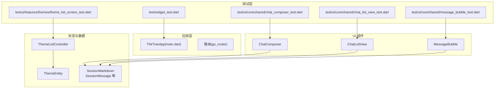
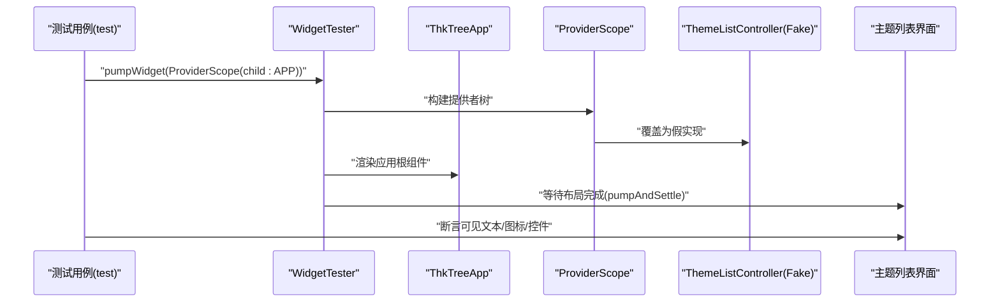
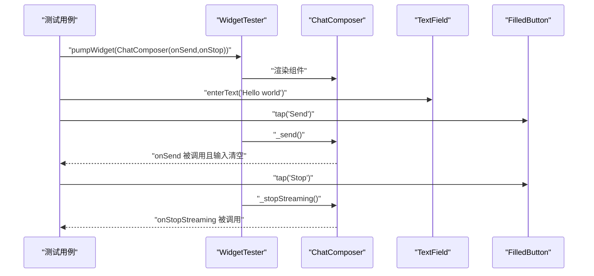
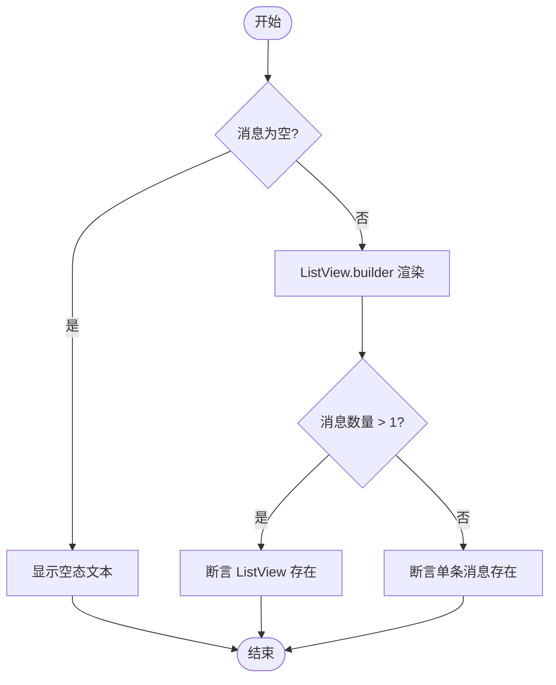
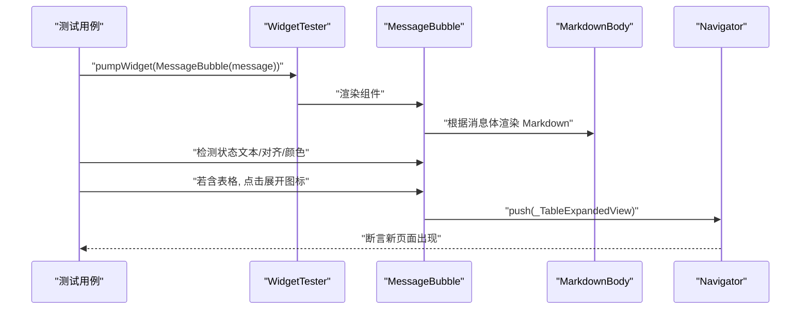
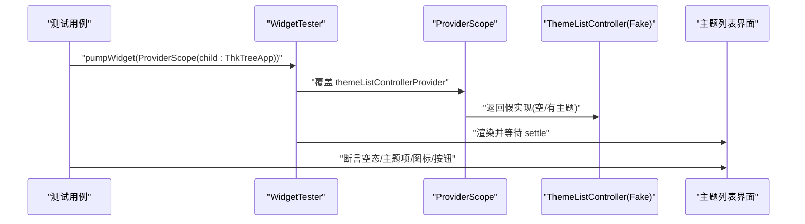
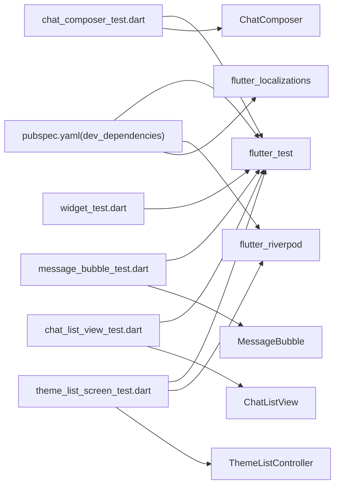

# UI 测试

<cite>
**本文引用的文件**
- [pubspec.yaml](file://pubspec.yaml)
- [analysis_options.yaml](file://analysis_options.yaml)
- [test/widget_test.dart](file://test/widget_test.dart)
- [test/ui/core/shared/chat_composer_test.dart](file://test/ui/core/shared/chat_composer_test.dart)
- [test/ui/core/shared/chat_list_view_test.dart](file://test/ui/core/shared/chat_list_view_test.dart)
- [test/ui/core/shared/message_bubble_test.dart](file://test/ui/core/shared/message_bubble_test.dart)
- [test/ui/features/themes/theme_list_screen_test.dart](file://test/ui/features/themes/theme_list_screen_test.dart)
- [lib/ui/core/shared/chat_composer.dart](file://lib/ui/core/shared/chat_composer.dart)
- [lib/ui/core/shared/chat_list_view.dart](file://lib/ui/core/shared/chat_list_view.dart)
- [lib/ui/core/shared/message_bubble.dart](file://lib/ui/core/shared/message_bubble.dart)
- [lib/ui/features/themes/theme_list_controller.dart](file://lib/ui/features/themes/theme_list_controller.dart)
- [lib/domain/theme.dart](file://lib/domain/theme.dart)
- [lib/data/services/session_markdown.dart](file://lib/data/services/session_markdown.dart)
</cite>

## 目录
1. [简介](#简介)
2. [项目结构](#项目结构)
3. [核心组件](#核心组件)
4. [架构总览](#架构总览)
5. [详细组件分析](#详细组件分析)
6. [依赖关系分析](#依赖关系分析)
7. [性能考量](#性能考量)
8. [故障排查指南](#故障排查指南)
9. [结论](#结论)
10. [附录](#附录)

## 简介
本文件面向 ThkTree 的 Flutter UI 测试，系统性梳理了组件测试、屏幕测试与交互测试的实施方法，重点覆盖以下方面：
- Widget 测试：组件渲染、事件处理、状态变化的验证策略
- 复杂交互：聊天界面的输入、消息显示与用户交互流程
- 测试工具与环境：基于 flutter_test 的测试组织、Riverpod 提供者覆盖与本地化配置
- 测试数据管理：通过构造函数参数与假实现（Fake）隔离外部依赖
- 最佳实践与性能：可维护性、稳定性与可读性的测试设计建议

## 项目结构
ThkTree 的测试目录采用按功能域分层组织，核心 UI 组件测试集中在 test/ui 下，配合 test/widget_test.dart 进行应用级启动验证。主题列表控制器通过 Riverpod 提供者注入，便于在测试中以假实现替换真实依赖。

图表来源
- [test/widget_test.dart:16-32](file://test/widget_test.dart#L16-L32)
- [test/ui/features/themes/theme_list_screen_test.dart:10-25](file://test/ui/features/themes/theme_list_screen_test.dart#L10-L25)
- [test/ui/core/shared/chat_composer_test.dart:36-42](file://test/ui/core/shared/chat_composer_test.dart#L36-L42)
- [test/ui/core/shared/chat_list_view_test.dart:38-42](file://test/ui/core/shared/chat_list_view_test.dart#L38-L42)
- [test/ui/core/shared/message_bubble_test.dart:42-51](file://test/ui/core/shared/message_bubble_test.dart#L42-L51)
- [lib/ui/features/themes/theme_list_controller.dart:5-24](file://lib/ui/features/themes/theme_list_controller.dart#L5-L24)
- [lib/domain/theme.dart:1-15](file://lib/domain/theme.dart#L1-L15)
- [lib/data/services/session_markdown.dart:4-32](file://lib/data/services/session_markdown.dart#L4-L32)

章节来源
- [test/widget_test.dart:16-32](file://test/widget_test.dart#L16-L32)
- [test/ui/features/themes/theme_list_screen_test.dart:10-25](file://test/ui/features/themes/theme_list_screen_test.dart#L10-L25)
- [test/ui/core/shared/chat_composer_test.dart:36-42](file://test/ui/core/shared/chat_composer_test.dart#L36-L42)
- [test/ui/core/shared/chat_list_view_test.dart:38-42](file://test/ui/core/shared/chat_list_view_test.dart#L38-L42)
- [test/ui/core/shared/message_bubble_test.dart:42-51](file://test/ui/core/shared/message_bubble_test.dart#L42-L51)

## 核心组件
本节聚焦于 UI 测试中涉及的关键组件及其职责：
- ChatComposer：负责输入框、发送/停止按钮、键盘快捷键与错误提示等交互逻辑
- ChatListView：负责消息列表渲染、空态显示、滚动行为与自动贴底
- MessageBubble：负责消息气泡渲染、Markdown 渲染、表格展开、上下文菜单与复制/添加到笔记等交互
- ThemeListController：负责主题列表的加载、创建与重建索引，配合 Riverpod 在测试中以假实现替代

章节来源
- [lib/ui/core/shared/chat_composer.dart:5-23](file://lib/ui/core/shared/chat_composer.dart#L5-L23)
- [lib/ui/core/shared/chat_list_view.dart:8-20](file://lib/ui/core/shared/chat_list_view.dart#L8-L20)
- [lib/ui/core/shared/message_bubble.dart:41-50](file://lib/ui/core/shared/message_bubble.dart#L41-L50)
- [lib/ui/features/themes/theme_list_controller.dart:5-24](file://lib/ui/features/themes/theme_list_controller.dart#L5-L24)

## 架构总览
下图展示了 UI 测试的典型调用链：测试通过 WidgetTester 渲染组件或应用，触发交互后断言 UI 变化与回调执行；在主题列表场景中，测试通过 ProviderScope 覆盖主题控制器为假实现，确保测试稳定且可重复。

图表来源
- [test/widget_test.dart:17-31](file://test/widget_test.dart#L17-L31)
- [test/ui/features/themes/theme_list_screen_test.dart:11-25](file://test/ui/features/themes/theme_list_screen_test.dart#L11-L25)
- [lib/ui/features/themes/theme_list_controller.dart:26-27](file://lib/ui/features/themes/theme_list_controller.dart#L26-L27)

## 详细组件分析

### ChatComposer 组件测试
该组件测试覆盖：
- 渲染：提示文本、发送/停止按钮切换、禁用状态
- 输入与提交：回车键处理（换行与发送）、多行输入限制
- 回调：发送成功后清空输入、失败时恢复文本并提示
- 停止流：点击停止按钮触发回调

图表来源
- [test/ui/core/shared/chat_composer_test.dart:65-78](file://test/ui/core/shared/chat_composer_test.dart#L65-L78)
- [test/ui/core/shared/chat_composer_test.dart:109-122](file://test/ui/core/shared/chat_composer_test.dart#L109-L122)
- [lib/ui/core/shared/chat_composer.dart:119-135](file://lib/ui/core/shared/chat_composer.dart#L119-L135)

章节来源
- [test/ui/core/shared/chat_composer_test.dart:36-42](file://test/ui/core/shared/chat_composer_test.dart#L36-L42)
- [test/ui/core/shared/chat_composer_test.dart:44-56](file://test/ui/core/shared/chat_composer_test.dart#L44-L56)
- [test/ui/core/shared/chat_composer_test.dart:58-63](file://test/ui/core/shared/chat_composer_test.dart#L58-L63)
- [test/ui/core/shared/chat_composer_test.dart:65-78](file://test/ui/core/shared/chat_composer_test.dart#L65-L78)
- [test/ui/core/shared/chat_composer_test.dart:80-92](file://test/ui/core/shared/chat_composer_test.dart#L80-L92)
- [test/ui/core/shared/chat_composer_test.dart:94-107](file://test/ui/core/shared/chat_composer_test.dart#L94-L107)
- [test/ui/core/shared/chat_composer_test.dart:109-122](file://test/ui/core/shared/chat_composer_test.dart#L109-L122)
- [test/ui/core/shared/chat_composer_test.dart:124-133](file://test/ui/core/shared/chat_composer_test.dart#L124-L133)
- [lib/ui/core/shared/chat_composer.dart:46-117](file://lib/ui/core/shared/chat_composer.dart#L46-L117)

### ChatListView 组件测试
该组件测试覆盖：
- 空态：无消息时显示“暂无消息”
- 渲染：通过 messageBuilder 渲染单条与多条消息
- 列表：大量消息时仍为 ListView

图表来源
- [test/ui/core/shared/chat_list_view_test.dart:38-42](file://test/ui/core/shared/chat_list_view_test.dart#L38-L42)
- [test/ui/core/shared/chat_list_view_test.dart:44-53](file://test/ui/core/shared/chat_list_view_test.dart#L44-L53)
- [test/ui/core/shared/chat_list_view_test.dart:55-60](file://test/ui/core/shared/chat_list_view_test.dart#L55-L60)
- [test/ui/core/shared/chat_list_view_test.dart:62-67](file://test/ui/core/shared/chat_list_view_test.dart#L62-L67)

章节来源
- [test/ui/core/shared/chat_list_view_test.dart:38-42](file://test/ui/core/shared/chat_list_view_test.dart#L38-L42)
- [test/ui/core/shared/chat_list_view_test.dart:44-53](file://test/ui/core/shared/chat_list_view_test.dart#L44-L53)
- [test/ui/core/shared/chat_list_view_test.dart:55-60](file://test/ui/core/shared/chat_list_view_test.dart#L55-L60)
- [test/ui/core/shared/chat_list_view_test.dart:62-67](file://test/ui/core/shared/chat_list_view_test.dart#L62-L67)
- [lib/ui/core/shared/chat_list_view.dart:35-98](file://lib/ui/core/shared/chat_list_view.dart#L35-L98)

### MessageBubble 组件测试
该组件测试覆盖：
- 角色对齐：用户消息右对齐，助手/系统消息左对齐
- 状态显示：流式状态、错误状态与未知错误提示
- Markdown：渲染加粗、空体裁剪与样式
- 表格扩展：检测表格并提供展开按钮，展开后进入新页面

图表来源
- [test/ui/core/shared/message_bubble_test.dart:42-51](file://test/ui/core/shared/message_bubble_test.dart#L42-L51)
- [test/ui/core/shared/message_bubble_test.dart:53-62](file://test/ui/core/shared/message_bubble_test.dart#L53-L62)
- [test/ui/core/shared/message_bubble_test.dart:64-70](file://test/ui/core/shared/message_bubble_test.dart#L64-L70)
- [test/ui/core/shared/message_bubble_test.dart:72-81](file://test/ui/core/shared/message_bubble_test.dart#L72-L81)
- [test/ui/core/shared/message_bubble_test.dart:83-102](file://test/ui/core/shared/message_bubble_test.dart#L83-L102)
- [test/ui/core/shared/message_bubble_test.dart:116-121](file://test/ui/core/shared/message_bubble_test.dart#L116-L121)
- [test/ui/core/shared/message_bubble_test.dart:123-136](file://test/ui/core/shared/message_bubble_test.dart#L123-L136)
- [lib/ui/core/shared/message_bubble.dart:52-141](file://lib/ui/core/shared/message_bubble.dart#L52-L141)

章节来源
- [test/ui/core/shared/message_bubble_test.dart:42-51](file://test/ui/core/shared/message_bubble_test.dart#L42-L51)
- [test/ui/core/shared/message_bubble_test.dart:53-62](file://test/ui/core/shared/message_bubble_test.dart#L53-L62)
- [test/ui/core/shared/message_bubble_test.dart:64-70](file://test/ui/core/shared/message_bubble_test.dart#L64-L70)
- [test/ui/core/shared/message_bubble_test.dart:72-81](file://test/ui/core/shared/message_bubble_test.dart#L72-L81)
- [test/ui/core/shared/message_bubble_test.dart:83-102](file://test/ui/core/shared/message_bubble_test.dart#L83-L102)
- [test/ui/core/shared/message_bubble_test.dart:116-121](file://test/ui/core/shared/message_bubble_test.dart#L116-L121)
- [test/ui/core/shared/message_bubble_test.dart:123-136](file://test/ui/core/shared/message_bubble_test.dart#L123-L136)
- [lib/ui/core/shared/message_bubble.dart:10-18](file://lib/ui/core/shared/message_bubble.dart#L10-L18)
- [lib/ui/core/shared/message_bubble.dart:208-214](file://lib/ui/core/shared/message_bubble.dart#L208-L214)

### 主题列表屏幕测试
该测试覆盖：
- 空态：无主题时显示“暂无主题”、设置与同步图标、悬浮按钮
- 有主题：渲染主题标题与 ID、右侧箭头
- 多主题：渲染多个主题项

图表来源
- [test/ui/features/themes/theme_list_screen_test.dart:10-25](file://test/ui/features/themes/theme_list_screen_test.dart#L10-L25)
- [test/ui/features/themes/theme_list_screen_test.dart:27-49](file://test/ui/features/themes/theme_list_screen_test.dart#L27-L49)
- [test/ui/features/themes/theme_list_screen_test.dart:51-78](file://test/ui/features/themes/theme_list_screen_test.dart#L51-L78)
- [lib/ui/features/themes/theme_list_controller.dart:26-27](file://lib/ui/features/themes/theme_list_controller.dart#L26-L27)

章节来源
- [test/ui/features/themes/theme_list_screen_test.dart:10-25](file://test/ui/features/themes/theme_list_screen_test.dart#L10-L25)
- [test/ui/features/themes/theme_list_screen_test.dart:27-49](file://test/ui/features/themes/theme_list_screen_test.dart#L27-L49)
- [test/ui/features/themes/theme_list_screen_test.dart:51-78](file://test/ui/features/themes/theme_list_screen_test.dart#L51-L78)
- [lib/ui/features/themes/theme_list_controller.dart:5-24](file://lib/ui/features/themes/theme_list_controller.dart#L5-L24)
- [lib/domain/theme.dart:1-15](file://lib/domain/theme.dart#L1-L15)

## 依赖关系分析
- 测试依赖：flutter_test、flutter_riverpod、flutter_localizations
- 组件依赖：Material 组件、Markdown 渲染、本地化资源
- 数据模型：SessionMessage、SessionRole、SessionMessageStatus 等

图表来源
- [pubspec.yaml:51-60](file://pubspec.yaml#L51-L60)
- [test/widget_test.dart:8-14](file://test/widget_test.dart#L8-L14)
- [test/ui/core/shared/chat_composer_test.dart:1-6](file://test/ui/core/shared/chat_composer_test.dart#L1-L6)
- [test/ui/core/shared/chat_list_view_test.dart:1-6](file://test/ui/core/shared/chat_list_view_test.dart#L1-L6)
- [test/ui/core/shared/message_bubble_test.dart:1-7](file://test/ui/core/shared/message_bubble_test.dart#L1-L7)
- [test/ui/features/themes/theme_list_screen_test.dart:1-6](file://test/ui/features/themes/theme_list_screen_test.dart#L1-L6)

章节来源
- [pubspec.yaml:51-60](file://pubspec.yaml#L51-L60)
- [analysis_options.yaml:10](file://analysis_options.yaml#L10)

## 性能考量
- 使用 pumpAndSettle：在复杂 UI 或动画场景后等待布局与动画完成，避免断言过早
- 合理拆分测试：将渲染、交互、状态三类断言分离，提升定位问题效率
- 控制消息规模：在 ChatListView 测试中生成固定数量的消息，避免过多渲染导致超时
- 避免真实 I/O：通过假实现与 Provider 覆盖，减少磁盘与网络依赖
- 本地化与资源：在测试中显式提供本地化委托与支持语言，确保文案一致

## 故障排查指南
常见问题与解决思路：
- 文案不匹配：检查本地化委托与支持语言是否正确配置
- 按钮不可点击：确认 enabled 参数与 isStreaming 状态影响
- 输入未清空：检查发送成功后的清空逻辑与异常分支
- 滚动行为异常：关注 ChatListView 的贴底与滚动监听逻辑
- 表格展开无效：确认消息体包含表格标记并正确触发导航

章节来源
- [test/ui/core/shared/chat_composer_test.dart:58-63](file://test/ui/core/shared/chat_composer_test.dart#L58-L63)
- [test/ui/core/shared/chat_composer_test.dart:124-133](file://test/ui/core/shared/chat_composer_test.dart#L124-L133)
- [lib/ui/core/shared/chat_list_view.dart:41-73](file://lib/ui/core/shared/chat_list_view.dart#L41-L73)
- [lib/ui/core/shared/message_bubble.dart:208-214](file://lib/ui/core/shared/message_bubble.dart#L208-L214)

## 结论
ThkTree 的 UI 测试体系以 flutter_test 为核心，结合 Riverpod 的提供者覆盖与本地化配置，实现了对关键 UI 组件与屏幕的稳定验证。通过拆分渲染、交互与状态三类断言，并以假实现隔离外部依赖，测试具备良好的可维护性与可读性。建议在后续迭代中持续补充复杂交互与边界条件的测试，进一步完善自动化测试矩阵。

## 附录
- 测试运行建议：优先运行单个测试文件，逐步扩展至全量测试
- 代码风格：遵循 analysis_options 中推荐规则，保持一致性
- 本地化：确保测试中提供完整的 localizationsDelegates 与 supportedLocales