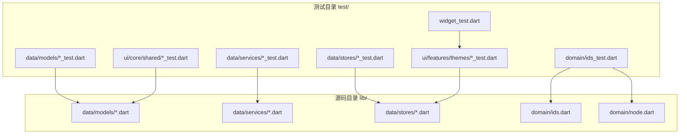
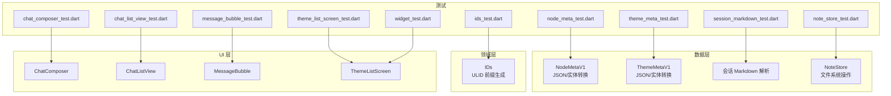
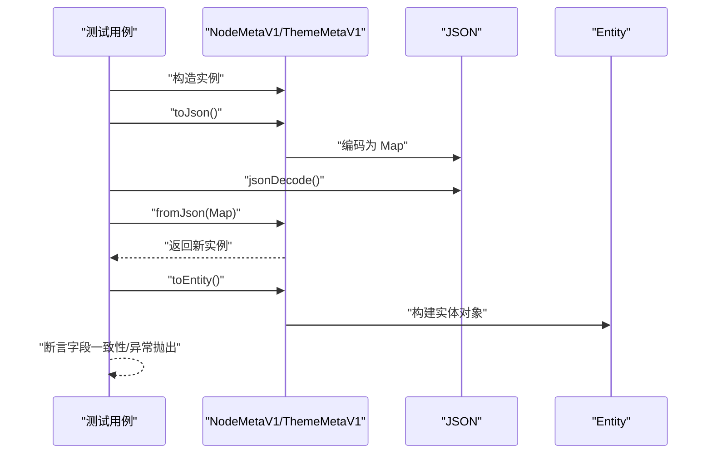
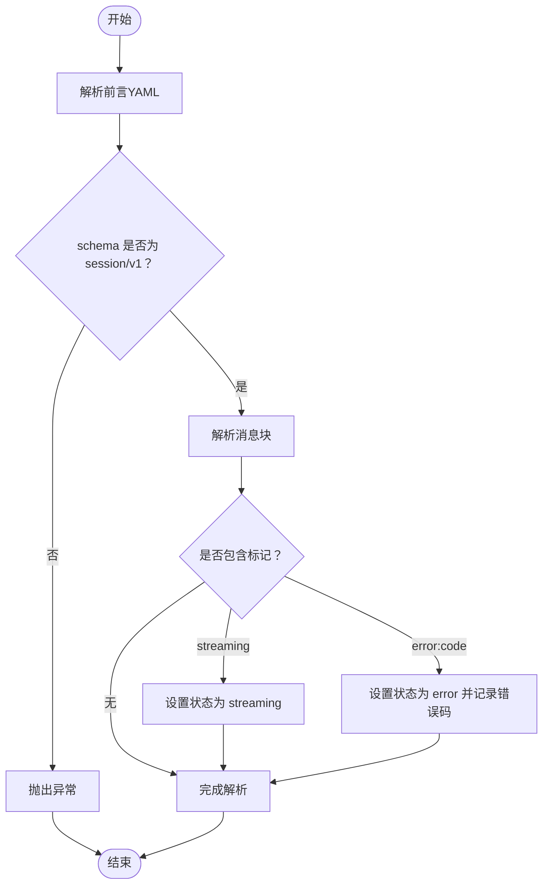
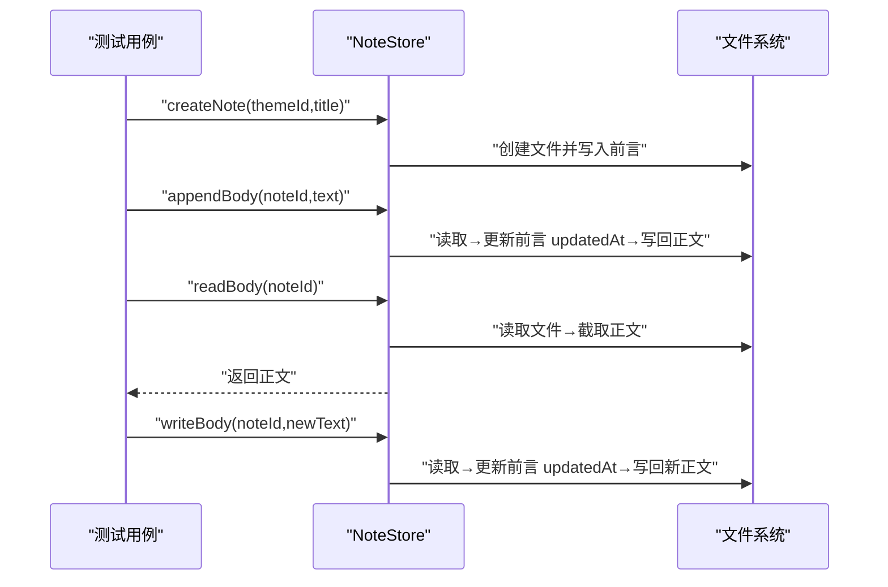
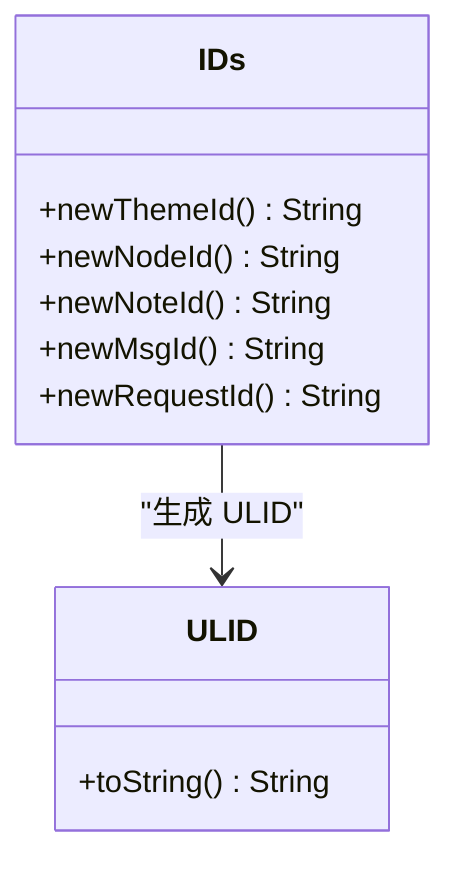
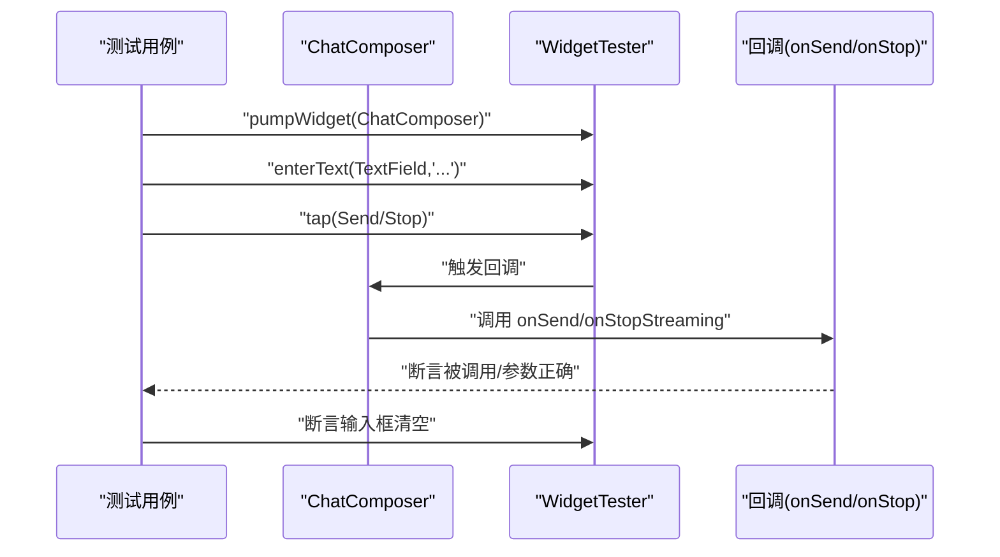
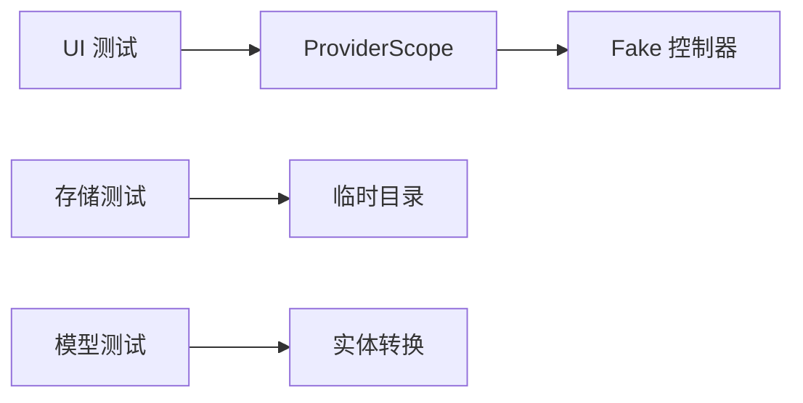

# 单元测试

<cite>
**本文引用的文件**
- [node_meta_test.dart](file://test/data/models/node_meta_test.dart)
- [theme_meta_test.dart](file://test/data/models/theme_meta_test.dart)
- [session_markdown_test.dart](file://test/data/services/session_markdown_test.dart)
- [note_store_test.dart](file://test/data/stores/note_store_test.dart)
- [ids_test.dart](file://test/domain/ids_test.dart)
- [chat_composer_test.dart](file://test/ui/core/shared/chat_composer_test.dart)
- [chat_list_view_test.dart](file://test/ui/core/shared/chat_list_view_test.dart)
- [message_bubble_test.dart](file://test/ui/core/shared/message_bubble_test.dart)
- [theme_list_screen_test.dart](file://test/ui/features/themes/theme_list_screen_test.dart)
- [widget_test.dart](file://test/widget_test.dart)
- [node_meta.dart](file://lib/data/models/node_meta.dart)
- [theme_meta.dart](file://lib/data/models/theme_meta.dart)
- [note_store.dart](file://lib/data/stores/note_store.dart)
- [ids.dart](file://lib/domain/ids.dart)
- [node.dart](file://lib/domain/node.dart)
</cite>

## 目录
1. [简介](#简介)
2. [项目结构](#项目结构)
3. [核心组件](#核心组件)
4. [架构总览](#架构总览)
5. [详细组件分析](#详细组件分析)
6. [依赖关系分析](#依赖关系分析)
7. [性能考量](#性能考量)
8. [故障排查指南](#故障排查指南)
9. [结论](#结论)
10. [附录](#附录)

## 简介
本文件系统化梳理 ThkTree 的单元测试实践，覆盖数据层（模型与存储）、领域层（标识符生成）与 UI 层（共享组件与特性页面），重点阐述：
- 数据模型测试：JSON 序列化/反序列化一致性、字段完整性、错误场景校验、实体转换正确性
- 存储层测试：文件系统操作、前端数据解析、写入与追加行为、目录隔离与清理
- 领域层测试：标识符前缀与格式约束
- UI 组件测试：渲染、交互、状态切换、本地化与第三方库集成
- 测试设计原则与规范、Mock/替身策略、断言最佳实践、覆盖率与有效性保障

## 项目结构
测试文件按功能域划分在 test 目录下，分别对应数据层、领域层与 UI 层：
- 数据层：models（模型）、services（服务）、stores（存储）
- 领域层：ids（标识符）
- UI 层：core/shared（共享组件）、features/themes（主题特性）

图表来源
- [node_meta_test.dart:1-113](file://test/data/models/node_meta_test.dart#L1-L113)
- [theme_meta_test.dart:1-79](file://test/data/models/theme_meta_test.dart#L1-L79)
- [session_markdown_test.dart:1-130](file://test/data/services/session_markdown_test.dart#L1-L130)
- [note_store_test.dart:1-50](file://test/data/stores/note_store_test.dart#L1-L50)
- [ids_test.dart:1-14](file://test/domain/ids_test.dart#L1-L14)
- [chat_composer_test.dart:1-136](file://test/ui/core/shared/chat_composer_test.dart#L1-L136)
- [chat_list_view_test.dart:1-70](file://test/ui/core/shared/chat_list_view_test.dart#L1-L70)
- [message_bubble_test.dart:1-146](file://test/ui/core/shared/message_bubble_test.dart#L1-L146)
- [theme_list_screen_test.dart:1-97](file://test/ui/features/themes/theme_list_screen_test.dart#L1-L97)
- [widget_test.dart:1-44](file://test/widget_test.dart#L1-L44)

章节来源
- [node_meta_test.dart:1-113](file://test/data/models/node_meta_test.dart#L1-L113)
- [theme_meta_test.dart:1-79](file://test/data/models/theme_meta_test.dart#L1-L79)
- [session_markdown_test.dart:1-130](file://test/data/services/session_markdown_test.dart#L1-L130)
- [note_store_test.dart:1-50](file://test/data/stores/note_store_test.dart#L1-L50)
- [ids_test.dart:1-14](file://test/domain/ids_test.dart#L1-L14)
- [chat_composer_test.dart:1-136](file://test/ui/core/shared/chat_composer_test.dart#L1-L136)
- [chat_list_view_test.dart:1-70](file://test/ui/core/shared/chat_list_view_test.dart#L1-L70)
- [message_bubble_test.dart:1-146](file://test/ui/core/shared/message_bubble_test.dart#L1-L146)
- [theme_list_screen_test.dart:1-97](file://test/ui/features/themes/theme_list_screen_test.dart#L1-L97)
- [widget_test.dart:1-44](file://test/widget_test.dart#L1-L44)

## 核心组件
- 数据模型（NodeMetaV1、ThemeMetaV1）：负责版本化元数据的 JSON 编解码与实体转换
- 会话 Markdown 解析器：解析前端数据块与消息体，识别流式与错误标记
- 笔记存储（NoteStore）：基于文件系统的笔记列表、读取、写入与追加
- 标识符生成（IDs）：统一生成带前缀的 ULID
- UI 共享组件：聊天输入框、消息列表、消息气泡
- 主题列表屏幕：集成 Riverpod 控制器与本地化

章节来源
- [node_meta_test.dart:1-113](file://test/data/models/node_meta_test.dart#L1-L113)
- [theme_meta_test.dart:1-79](file://test/data/models/theme_meta_test.dart#L1-L79)
- [session_markdown_test.dart:1-130](file://test/data/services/session_markdown_test.dart#L1-L130)
- [note_store_test.dart:1-50](file://test/data/stores/note_store_test.dart#L1-L50)
- [ids_test.dart:1-14](file://test/domain/ids_test.dart#L1-L14)
- [chat_composer_test.dart:1-136](file://test/ui/core/shared/chat_composer_test.dart#L1-L136)
- [chat_list_view_test.dart:1-70](file://test/ui/core/shared/chat_list_view_test.dart#L1-L70)
- [message_bubble_test.dart:1-146](file://test/ui/core/shared/message_bubble_test.dart#L1-L146)
- [theme_list_screen_test.dart:1-97](file://test/ui/features/themes/theme_list_screen_test.dart#L1-L97)
- [widget_test.dart:1-44](file://test/widget_test.dart#L1-L44)

## 架构总览
单元测试围绕“源码模块—测试模块”的一一映射展开，测试通过 Flutter Test 框架驱动，部分 UI 测试使用 ProviderScope 进行依赖替换。

图表来源
- [node_meta_test.dart:1-113](file://test/data/models/node_meta_test.dart#L1-L113)
- [theme_meta_test.dart:1-79](file://test/data/models/theme_meta_test.dart#L1-L79)
- [session_markdown_test.dart:1-130](file://test/data/services/session_markdown_test.dart#L1-L130)
- [note_store_test.dart:1-50](file://test/data/stores/note_store_test.dart#L1-L50)
- [ids_test.dart:1-14](file://test/domain/ids_test.dart#L1-L14)
- [chat_composer_test.dart:1-136](file://test/ui/core/shared/chat_composer_test.dart#L1-L136)
- [chat_list_view_test.dart:1-70](file://test/ui/core/shared/chat_list_view_test.dart#L1-L70)
- [message_bubble_test.dart:1-146](file://test/ui/core/shared/message_bubble_test.dart#L1-L146)
- [theme_list_screen_test.dart:1-97](file://test/ui/features/themes/theme_list_screen_test.dart#L1-L97)
- [widget_test.dart:1-44](file://test/widget_test.dart#L1-L44)

## 详细组件分析

### 数据模型测试：NodeMetaV1 与 ThemeMetaV1
- JSON 往返测试：验证序列化后反序列化的字段一致性，覆盖空父节点与非空父节点场景
- Schema 字段校验：toJson 输出必须包含 schema；fromJson 对错误 schema 抛出异常
- 字段缺失与类型错误：对缺失字段与错误类型抛出异常
- 枚举值校验：未知 kind 值应抛出异常
- 实体转换：toEntity 转换结果字段一致

图表来源
- [node_meta_test.dart:9-110](file://test/data/models/node_meta_test.dart#L9-L110)
- [theme_meta_test.dart:8-76](file://test/data/models/theme_meta_test.dart#L8-L76)
- [node_meta.dart:24-81](file://lib/data/models/node_meta.dart#L24-L81)
- [theme_meta.dart:18-60](file://lib/data/models/theme_meta.dart#L18-L60)

章节来源
- [node_meta_test.dart:1-113](file://test/data/models/node_meta_test.dart#L1-L113)
- [theme_meta_test.dart:1-79](file://test/data/models/theme_meta_test.dart#L1-L79)
- [node_meta.dart:1-83](file://lib/data/models/node_meta.dart#L1-L83)
- [theme_meta.dart:1-61](file://lib/data/models/theme_meta.dart#L1-L61)

### 服务层测试：会话 Markdown 解析
- 前言与消息解析：schema、主题/节点 ID、消息角色、时间戳、状态
- 流式与错误标记：识别 <!-- streaming --> 与 <!-- error: ... --> 并设置相应状态与错误码
- 容错性：非匹配标题不切分正文
- 消息 ID 大小写：接受小写 msg_ 前缀

图表来源
- [session_markdown_test.dart:5-129](file://test/data/services/session_markdown_test.dart#L5-L129)

章节来源
- [session_markdown_test.dart:1-130](file://test/data/services/session_markdown_test.dart#L1-L130)

### 存储层测试：NoteStore 文件操作
- 临时目录隔离：setUp 创建临时目录，tearDown 删除
- 追加写入：多次 appendBody 后读取，验证分隔符与顺序
- 写入替换：writeBody 替换整块正文
- 列表与排序：列出笔记元信息并按更新时间倒序

图表来源
- [note_store_test.dart:22-47](file://test/data/stores/note_store_test.dart#L22-L47)
- [note_store.dart:58-136](file://lib/data/stores/note_store.dart#L58-L136)

章节来源
- [note_store_test.dart:1-50](file://test/data/stores/note_store_test.dart#L1-L50)
- [note_store.dart:1-203](file://lib/data/stores/note_store.dart#L1-L203)

### 领域层测试：IDs 标识符生成
- 前缀校验：生成的标识符以 thm_/nd_/nt_/msg_/req_ 开头
- 依赖：基于 ULID 生成器，统一大写字符串

图表来源
- [ids_test.dart:5-11](file://test/domain/ids_test.dart#L5-L11)
- [ids.dart:1-10](file://lib/domain/ids.dart#L1-L10)

章节来源
- [ids_test.dart:1-14](file://test/domain/ids_test.dart#L1-L14)
- [ids.dart:1-10](file://lib/domain/ids.dart#L1-L10)
- [node.dart:1-30](file://lib/domain/node.dart#L1-L30)

### UI 组件测试：共享组件与特性页面
- ChatComposer：渲染提示文本、发送/停止按钮切换、禁用态、空文本与空白字符保护、清空输入
- ChatListView：空状态、单条与多条消息渲染、滚动容器
- MessageBubble：用户/助手/系统对齐、流式与错误状态展示、表格展开、Markdown 渲染
- ThemeListScreen：空主题与有主题两种场景、FAB 与导航图标存在性
- 本地化：通过 MaterialApp 提供本地化代理
- 依赖注入：ProviderScope 使用 Fake 替身控制器

图表来源
- [chat_composer_test.dart:65-133](file://test/ui/core/shared/chat_composer_test.dart#L65-L133)

章节来源
- [chat_composer_test.dart:1-136](file://test/ui/core/shared/chat_composer_test.dart#L1-L136)
- [chat_list_view_test.dart:1-70](file://test/ui/core/shared/chat_list_view_test.dart#L1-L70)
- [message_bubble_test.dart:1-146](file://test/ui/core/shared/message_bubble_test.dart#L1-L146)
- [theme_list_screen_test.dart:1-97](file://test/ui/features/themes/theme_list_screen_test.dart#L1-L97)
- [widget_test.dart:1-44](file://test/widget_test.dart#L1-L44)

## 依赖关系分析
- 测试与源码的直接映射：每个 *_test.dart 对应一个或多个源文件类/函数
- UI 测试对 Provider 的依赖替换：通过 ProviderScope.overrideWith 注入 Fake 控制器
- 文件系统依赖：NoteStore 依赖 Dart IO 与 path，测试通过临时目录隔离
- 本地化依赖：UI 测试通过 MaterialApp 提供本地化代理

图表来源
- [theme_list_screen_test.dart:12-42](file://test/ui/features/themes/theme_list_screen_test.dart#L12-L42)
- [note_store_test.dart:11-20](file://test/data/stores/note_store_test.dart#L11-L20)

章节来源
- [theme_list_screen_test.dart:1-97](file://test/ui/features/themes/theme_list_screen_test.dart#L1-L97)
- [note_store_test.dart:1-50](file://test/data/stores/note_store_test.dart#L1-L50)

## 性能考量
- 文件 I/O：NoteStore 的读写与追加涉及磁盘访问，测试中使用临时目录避免持久化开销
- JSON/YAML 解析：模型与存储层的解析逻辑较轻量，测试关注正确性而非吞吐
- UI 渲染：Widget 测试通过 pump/pumpAndSettle 控制渲染节奏，避免不必要的重绘

## 故障排查指南
- JSON 反序列化失败
  - 现象：fromJson 抛出 FormatException
  - 排查：检查 schema 字段、必需字段是否存在、枚举值是否合法
  - 参考路径：[node_meta_test.dart:62-90](file://test/data/models/node_meta_test.dart#L62-L90)、[theme_meta_test.dart:35-60](file://test/data/models/theme_meta_test.dart#L35-L60)
- Markdown 解析异常
  - 现象：消息未按预期拆分或状态未识别
  - 排查：确认前言格式、消息标题格式、标记语法
  - 参考路径：[session_markdown_test.dart:5-129](file://test/data/services/session_markdown_test.dart#L5-L129)
- 文件读写异常
  - 现象：readBody 返回空、writeBody/appendBody 结果不符合预期
  - 排查：确认文件存在、前言分隔符、时间戳更新
  - 参考路径：[note_store_test.dart:22-47](file://test/data/stores/note_store_test.dart#L22-L47)、[note_store.dart:74-136](file://lib/data/stores/note_store.dart#L74-L136)
- UI 交互未生效
  - 现象：按钮点击无响应、输入框未清空
  - 排查：确认 enabled 状态、回调是否传入、事件触发顺序
  - 参考路径：[chat_composer_test.dart:58-133](file://test/ui/core/shared/chat_composer_test.dart#L58-L133)

章节来源
- [node_meta_test.dart:62-90](file://test/data/models/node_meta_test.dart#L62-L90)
- [theme_meta_test.dart:35-60](file://test/data/models/theme_meta_test.dart#L35-L60)
- [session_markdown_test.dart:5-129](file://test/data/services/session_markdown_test.dart#L5-L129)
- [note_store_test.dart:22-47](file://test/data/stores/note_store_test.dart#L22-L47)
- [note_store.dart:74-136](file://lib/data/stores/note_store.dart#L74-L136)
- [chat_composer_test.dart:58-133](file://test/ui/core/shared/chat_composer_test.dart#L58-L133)

## 结论
ThkTree 的单元测试遵循“模型-服务-存储-领域-UI”分层覆盖策略，强调：
- 正确性优先：JSON 往返、字段完整性、异常路径
- 行为验证：文件系统操作、UI 交互、状态切换
- 可靠性保障：临时目录隔离、Provider 替身、本地化注入
建议持续补充边界与错误场景，保持测试与实现同步演进。

## 附录

### 测试设计原则与编写规范
- 命名清晰：用例描述具体行为与期望
- 固定输入：使用确定性数据（如固定时间戳、固定 ID 前缀）
- 边界与异常：覆盖缺失字段、非法类型、未知枚举、错误 schema
- 隔离与清理：文件测试使用临时目录并在 tearDown 删除
- 依赖替换：UI 测试通过 ProviderScope 注入 Fake 控制器
- 断言明确：优先断言结果而非实现细节

### 测试数据准备与模拟策略
- 模拟对象与替身
  - UI：使用 FakeThemeListController 替代真实控制器
  - 文件：使用 Directory.systemTemp 创建临时目录
- 第三方依赖
  - 本地化：通过 MaterialApp 提供本地化代理
  - UI 渲染：使用 WidgetTester 的 pump/pumpAndSettle 控制渲染

### 测试覆盖率与有效性
- 覆盖率工具：使用 Flutter 提供的 coverage 支持（在 CI 中运行并生成报告）
- 有效性保障：用例聚焦关键路径与异常分支，避免过度耦合实现细节
- 持续集成：在 PR 中强制执行 flutter test，并结合覆盖率阈值

### 断言最佳实践
- 明确断言目标：字段值、异常类型、UI 文本与控件存在性
- 使用语义化匹配：如 startsWith、hasLength、isA<T>()
- 分组组织：group 将相关用例归类，提升可读性