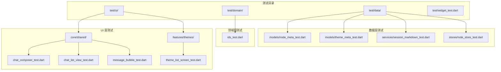
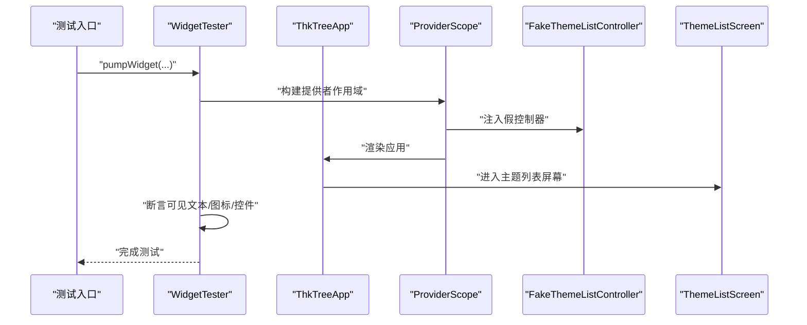
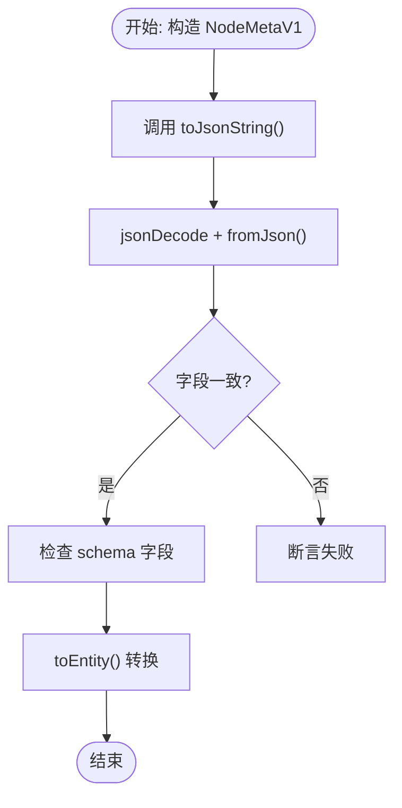
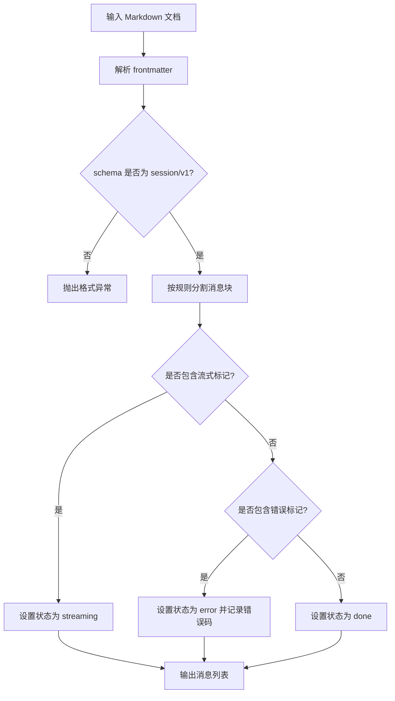
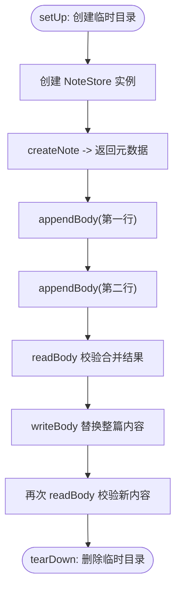
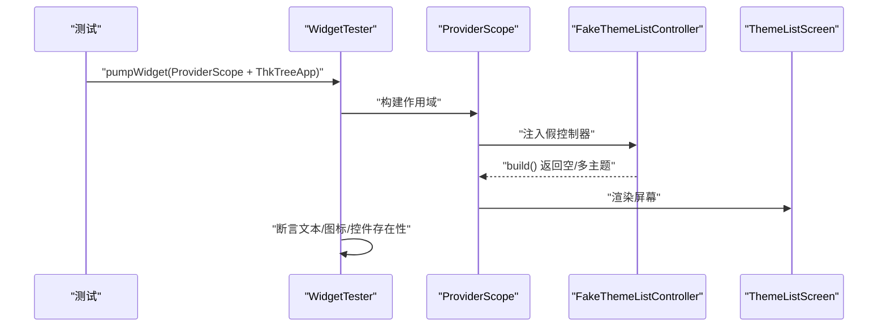
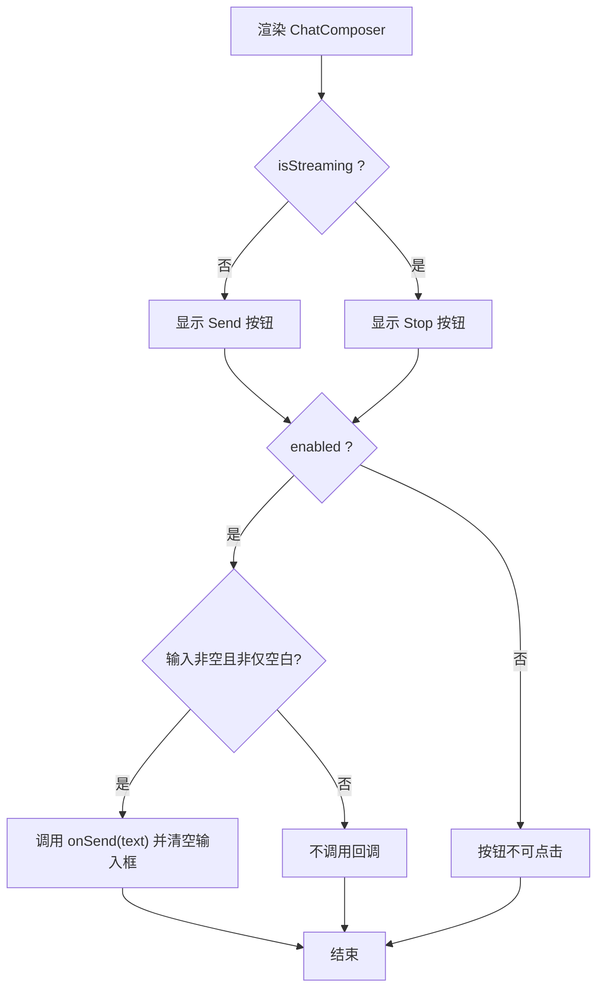
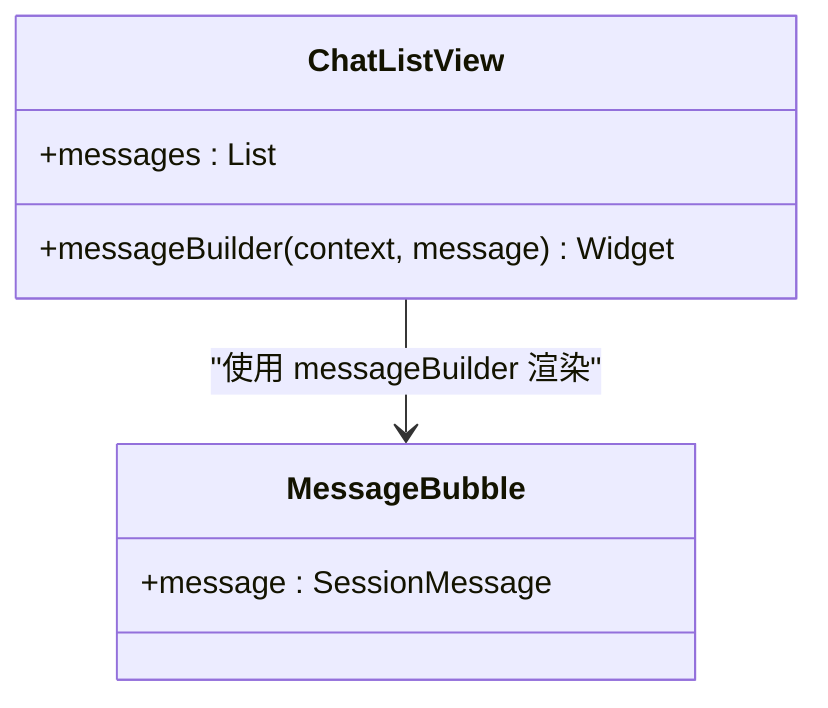
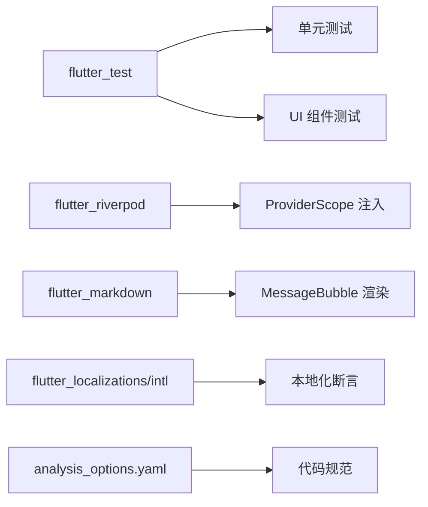

# 测试策略

<cite>
**本文引用的文件**
- [widget_test.dart](file://test/widget_test.dart)
- [pubspec.yaml](file://pubspec.yaml)
- [analysis_options.yaml](file://analysis_options.yaml)
- [node_meta_test.dart](file://test/data/models/node_meta_test.dart)
- [theme_meta_test.dart](file://test/data/models/theme_meta_test.dart)
- [session_markdown_test.dart](file://test/data/services/session_markdown_test.dart)
- [note_store_test.dart](file://test/data/stores/note_store_test.dart)
- [ids_test.dart](file://test/domain/ids_test.dart)
- [chat_composer_test.dart](file://test/ui/core/shared/chat_composer_test.dart)
- [chat_list_view_test.dart](file://test/ui/core/shared/chat_list_view_test.dart)
- [message_bubble_test.dart](file://test/ui/core/shared/message_bubble_test.dart)
- [theme_list_screen_test.dart](file://test/ui/features/themes/theme_list_screen_test.dart)
- [README.md](file://README.md)
</cite>

## 目录
1. [简介](#简介)
2. [项目结构](#项目结构)
3. [核心组件](#核心组件)
4. [架构总览](#架构总览)
5. [详细组件分析](#详细组件分析)
6. [依赖关系分析](#依赖关系分析)
7. [性能考量](#性能考量)
8. [故障排查指南](#故障排查指南)
9. [结论](#结论)
10. [附录](#附录)

## 简介
本文件系统化梳理 ThkTree 的测试策略与最佳实践，覆盖单元测试、UI 组件测试与集成测试的实施方法，并结合现有测试样例总结设计原则、数据准备与清理策略、覆盖率目标建议、持续集成与自动化流程建议，以及测试环境搭建要点。文档面向不同技术背景读者，力求以循序渐进的方式呈现。

## 项目结构
ThkTree 的测试组织遵循按“功能域/层次”划分：data 层（模型与服务）、domain 层（领域模型与 ID 工具）、ui 层（组件与屏幕）以及顶层的 widget 测试入口。测试框架采用 Flutter 标准测试套件，配合 Riverpod 进行状态注入与隔离。

图表来源
- [widget_test.dart:1-44](file://test/widget_test.dart#L1-L44)
- [node_meta_test.dart:1-113](file://test/data/models/node_meta_test.dart#L1-L113)
- [theme_meta_test.dart:1-79](file://test/data/models/theme_meta_test.dart#L1-L79)
- [session_markdown_test.dart:1-130](file://test/data/services/session_markdown_test.dart#L1-L130)
- [note_store_test.dart:1-50](file://test/data/stores/note_store_test.dart#L1-L50)
- [ids_test.dart:1-14](file://test/domain/ids_test.dart#L1-L14)
- [chat_composer_test.dart:1-136](file://test/ui/core/shared/chat_composer_test.dart#L1-L136)
- [chat_list_view_test.dart:1-70](file://test/ui/core/shared/chat_list_view_test.dart#L1-L70)
- [message_bubble_test.dart:1-146](file://test/ui/core/shared/message_bubble_test.dart#L1-L146)
- [theme_list_screen_test.dart:1-97](file://test/ui/features/themes/theme_list_screen_test.dart#L1-L97)

章节来源
- [README.md:1-18](file://README.md#L1-L18)
- [pubspec.yaml:51-60](file://pubspec.yaml#L51-L60)

## 核心组件
- 单元测试（Unit Tests）
  - 数据模型与序列化：NodeMetaV1、ThemeMetaV1 的 JSON 往返与字段校验。
  - 领域工具：ID 生成器前缀校验。
  - 服务解析：会话 Markdown 解析与消息状态识别。
  - 存储层：NoteStore 的文件读写与追加行为。
- UI 组件测试（Widget Tests）
  - 主题列表屏幕：空态与多主题渲染。
  - 聊天组件：输入框、发送/停止按钮、禁用状态、文本清理。
  - 消息列表与气泡：消息渲染、对齐、状态显示、表格展开。
- 集成测试（Integration Tests）
  - 应用启动到主题列表屏幕的端到端验证（通过 ProviderScope 注入假控制器）。

章节来源
- [node_meta_test.dart:1-113](file://test/data/models/node_meta_test.dart#L1-L113)
- [theme_meta_test.dart:1-79](file://test/data/models/theme_meta_test.dart#L1-L79)
- [session_markdown_test.dart:1-130](file://test/data/services/session_markdown_test.dart#L1-L130)
- [note_store_test.dart:1-50](file://test/data/stores/note_store_test.dart#L1-L50)
- [ids_test.dart:1-14](file://test/domain/ids_test.dart#L1-L14)
- [chat_composer_test.dart:1-136](file://test/ui/core/shared/chat_composer_test.dart#L1-L136)
- [chat_list_view_test.dart:1-70](file://test/ui/core/shared/chat_list_view_test.dart#L1-L70)
- [message_bubble_test.dart:1-146](file://test/ui/core/shared/message_bubble_test.dart#L1-L146)
- [theme_list_screen_test.dart:1-97](file://test/ui/features/themes/theme_list_screen_test.dart#L1-L97)
- [widget_test.dart:1-44](file://test/widget_test.dart#L1-L44)

## 架构总览
测试架构围绕 Flutter 测试工具链与 Riverpod 提供者注入构建，确保可测试性与隔离性。应用启动时通过 ProviderScope 注入假控制器，使 UI 测试不依赖真实后端或数据库。

图表来源
- [widget_test.dart:16-31](file://test/widget_test.dart#L16-L31)
- [theme_list_screen_test.dart:10-25](file://test/ui/features/themes/theme_list_screen_test.dart#L10-L25)

## 详细组件分析

### 数据模型与序列化测试
- NodeMetaV1
  - JSON 往返：校验所有字段在序列化/反序列化后保持一致。
  - schema 字段：toJson 输出包含正确的 schema 值。
  - 错误处理：错误 schema、缺失字段、未知 kind 均抛出格式异常。
  - 实体转换：toEntity 正确映射为实体对象。
- ThemeMetaV1
  - JSON 往返与 schema 校验同上。
  - 类型校验：错误字段类型触发格式异常。
  - 实体转换：toEntity 映射正确。

图表来源
- [node_meta_test.dart:9-29](file://test/data/models/node_meta_test.dart#L9-L29)

章节来源
- [node_meta_test.dart:1-113](file://test/data/models/node_meta_test.dart#L1-L113)
- [theme_meta_test.dart:1-79](file://test/data/models/theme_meta_test.dart#L1-L79)

### 服务解析测试（会话 Markdown）
- frontmatter 解析：schema、主题/节点 ID、标题、时间戳等字段提取。
- 消息解析：按规则识别用户/助手消息，保留正文。
- 流式标记：识别 streaming 状态。
- 错误标记：识别 error 状态及错误码。
- 容错性：非匹配的 ## 行不应误切分消息。
- 消息 ID 大小写：接受小写 msg_ 前缀。

图表来源
- [session_markdown_test.dart:5-33](file://test/data/services/session_markdown_test.dart#L5-L33)

章节来源
- [session_markdown_test.dart:1-130](file://test/data/services/session_markdown_test.dart#L1-L130)

### 存储层测试（NoteStore）
- 临时目录：setUp 创建临时目录，tearDown 清理。
- 追加写入：多次 appendBody 后读取合并结果。
- 写入替换：writeBody 替换整篇内容。

图表来源
- [note_store_test.dart:11-47](file://test/data/stores/note_store_test.dart#L11-L47)

章节来源
- [note_store_test.dart:1-50](file://test/data/stores/note_store_test.dart#L1-L50)

### 领域工具测试（ID 生成器）
- 前缀校验：各类 ID 生成器返回带期望前缀的标识符。

章节来源
- [ids_test.dart:1-14](file://test/domain/ids_test.dart#L1-L14)

### UI 组件测试

#### 主题列表屏幕测试
- 空态：无主题时显示提示与设置/同步/新建按钮。
- 多主题：渲染多个主题项与导航图标。

图表来源
- [theme_list_screen_test.dart:10-25](file://test/ui/features/themes/theme_list_screen_test.dart#L10-L25)

章节来源
- [theme_list_screen_test.dart:1-97](file://test/ui/features/themes/theme_list_screen_test.dart#L1-L97)

#### 聊天输入组件测试
- 输入框：提示文本与装饰。
- 发送/停止按钮：根据 isStreaming 切换。
- 禁用状态：enabled=false 时按钮不可点击。
- 发送行为：输入非空且非仅空白时回调 onSend；成功后清空输入框。
- 停止流式：isStreaming=true 时点击 Stop 触发 onStopStreaming。

图表来源
- [chat_composer_test.dart:36-78](file://test/ui/core/shared/chat_composer_test.dart#L36-L78)

章节来源
- [chat_composer_test.dart:1-136](file://test/ui/core/shared/chat_composer_test.dart#L1-L136)

#### 消息列表与气泡测试
- 列表：空态、单条、多条渲染，使用 messageBuilder 渲染消息。
- 气泡：
  - 对齐：user 右对齐，assistant/system 左对齐。
  - 状态：done 不显示状态文本，streaming 显示 streaming，error 显示 error:xxx。
  - Markdown：支持加粗等基础语法。
  - 表格：含表格时显示展开按钮，点击进入全屏查看。

图表来源
- [chat_list_view_test.dart:10-26](file://test/ui/core/shared/chat_list_view_test.dart#L10-L26)
- [message_bubble_test.dart:11-24](file://test/ui/core/shared/message_bubble_test.dart#L11-L24)

章节来源
- [chat_list_view_test.dart:1-70](file://test/ui/core/shared/chat_list_view_test.dart#L1-L70)
- [message_bubble_test.dart:1-146](file://test/ui/core/shared/message_bubble_test.dart#L1-L146)

### 集成测试（应用启动）
- 使用 ProviderScope 注入假控制器，验证应用启动后首屏为主题列表，包含标题、提示文本与设置图标。

章节来源
- [widget_test.dart:16-31](file://test/widget_test.dart#L16-L31)

## 依赖关系分析
- 测试框架与工具
  - flutter_test：标准 UI/组件测试。
  - flutter_lints：推荐代码规范与静态分析。
- 项目依赖与测试相关
  - flutter_riverpod：用于 ProviderScope 注入假控制器，实现 UI 测试隔离。
  - flutter_markdown：用于消息气泡中的 Markdown 渲染测试。
  - flutter_localizations/intl：用于本地化文本断言。
- 分析配置
  - analysis_options.yaml 引入 flutter_lints，统一项目内代码质量标准。

图表来源
- [pubspec.yaml:51-60](file://pubspec.yaml#L51-L60)
- [analysis_options.yaml:10-22](file://analysis_options.yaml#L10-L22)

章节来源
- [pubspec.yaml:51-60](file://pubspec.yaml#L51-L60)
- [analysis_options.yaml:10-22](file://analysis_options.yaml#L10-L22)

## 性能考量
- 测试执行效率
  - 使用 WidgetTester 的 pump/pumpAndSettle 控制渲染节奏，避免不必要的等待。
  - 在 UI 测试中优先使用假控制器，减少网络与 IO 开销。
- 存储层测试
  - 使用临时目录进行文件操作，避免污染持久存储；测试结束后及时删除。
- 断言粒度
  - 将复杂场景拆分为多个小断言，便于定位问题并提升可维护性。

## 故障排查指南
- JSON 解析异常
  - 现有测试覆盖了错误 schema、缺失字段、未知 kind、错误字段类型等场景，若出现异常，优先检查数据结构与 schema 版本一致性。
- Markdown 解析异常
  - 确认 frontmatter 与消息头格式符合约定；注意大小写与分隔符。
- 文件读写异常
  - 确保临时目录存在且具备读写权限；在 tearDown 中确认目录已被清理。
- UI 断言失败
  - 检查 ProviderScope 注入的假控制器是否返回预期数据；确认本地化资源已正确加载。

章节来源
- [node_meta_test.dart:62-90](file://test/data/models/node_meta_test.dart#L62-L90)
- [theme_meta_test.dart:35-60](file://test/data/models/theme_meta_test.dart#L35-L60)
- [session_markdown_test.dart:59-81](file://test/data/services/session_markdown_test.dart#L59-L81)
- [note_store_test.dart:16-20](file://test/data/stores/note_store_test.dart#L16-L20)
- [chat_composer_test.dart:58-63](file://test/ui/core/shared/chat_composer_test.dart#L58-L63)

## 结论
ThkTree 的测试体系以 Flutter 标准测试工具链为核心，结合 Riverpod 的提供者注入，实现了良好的可测试性与隔离性。现有测试覆盖数据模型、服务解析、存储层、UI 组件与应用集成的关键路径。建议在此基础上进一步完善覆盖率目标、引入持续集成流水线与自动化测试，并建立完善的测试数据准备与清理策略，以保障代码质量与交付稳定性。

## 附录

### 测试框架选择与配置
- 测试框架
  - flutter_test：用于 UI/组件测试与集成测试。
  - flutter_lints：统一代码风格与质量标准。
- 依赖声明
  - 在 dev_dependencies 中声明 flutter_test 与 flutter_lints。
- 分析选项
  - include flutter_lints 推荐规则集，可在 rules 中按需调整。

章节来源
- [pubspec.yaml:51-60](file://pubspec.yaml#L51-L60)
- [analysis_options.yaml:8-22](file://analysis_options.yaml#L8-L22)

### 测试用例设计原则
- 单元测试
  - 关注边界条件与异常路径（如错误 schema、缺失字段、未知枚举值）。
  - 使用最小化数据构造对象，确保可重复性。
- UI 组件测试
  - 通过 ProviderScope 注入假控制器，隔离外部依赖。
  - 覆盖交互路径（输入、点击、状态切换）与视觉断言（文本、图标、布局）。
- 集成测试
  - 从应用启动到关键屏幕，验证端到端流程。
  - 使用 pumpAndSettle 等工具确保渲染稳定。

### 测试覆盖率与持续集成建议
- 覆盖率目标
  - 建议核心模块（数据模型、服务解析、存储层）覆盖率不低于 80%，UI 组件不低于 70%。
- 持续集成
  - 在 CI 中执行 flutter test --coverage，收集覆盖率报告。
  - 配置 PR 校验：通过覆盖率阈值与静态分析后方可合并。
- 自动化流程
  - 测试命令：flutter test
  - 覆盖率导出：flutter test --coverage
  - 本地调试：flutter test -v

### 测试数据准备与清理策略
- 临时目录
  - 使用 Directory.systemTemp.createTemp 创建隔离目录，测试结束后删除。
- 假控制器
  - 通过 ProviderScope.overrideWith 注入，模拟业务逻辑返回值。
- 本地化资源
  - 在测试 Widget 中显式注册 localizationsDelegates 与 supportedLocales，确保文本断言可用。

章节来源
- [note_store_test.dart:11-20](file://test/data/stores/note_store_test.dart#L11-L20)
- [theme_list_screen_test.dart:11-18](file://test/ui/features/themes/theme_list_screen_test.dart#L11-L18)
- [chat_composer_test.dart:16-34](file://test/ui/core/shared/chat_composer_test.dart#L16-L34)