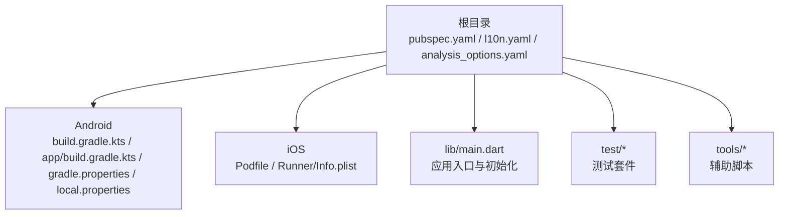
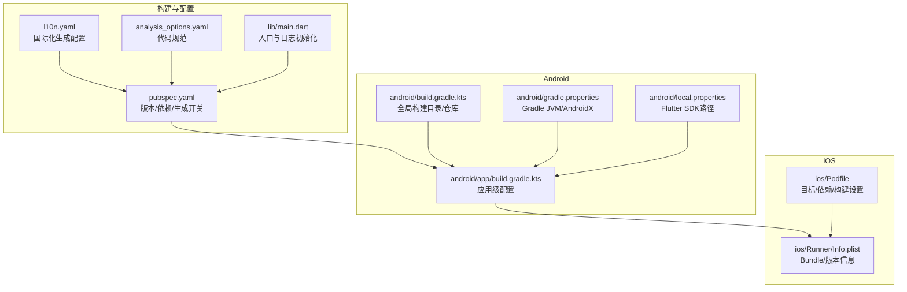
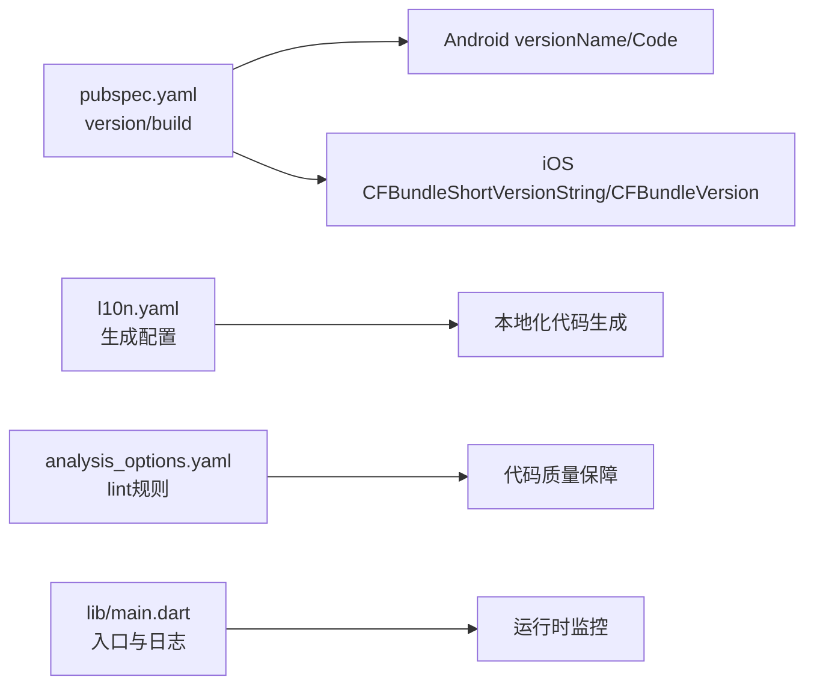

# 部署和发布

<cite>
**本文引用的文件**
- [pubspec.yaml](file://pubspec.yaml)
- [analysis_options.yaml](file://analysis_options.yaml)
- [l10n.yaml](file://l10n.yaml)
- [lib/main.dart](file://lib/main.dart)
- [android/build.gradle.kts](file://android/build.gradle.kts)
- [android/app/build.gradle.kts](file://android/app/build.gradle.kts)
- [android/gradle.properties](file://android/gradle.properties)
- [android/local.properties](file://android/local.properties)
- [ios/Podfile](file://ios/Podfile)
- [ios/Runner/Info.plist](file://ios/Runner/Info.plist)
</cite>

## 目录
1. [简介](#简介)
2. [项目结构](#项目结构)
3. [核心组件](#核心组件)
4. [架构总览](#架构总览)
5. [详细组件分析](#详细组件分析)
6. [依赖关系分析](#依赖关系分析)
7. [性能考虑](#性能考虑)
8. [故障排查指南](#故障排查指南)
9. [结论](#结论)
10. [附录](#附录)

## 简介
本文件面向 ThkTree 的部署与发布流程，覆盖构建配置（Android/iOS）、版本管理、代码签名、渠道发布、CI/CD 自动化、性能优化与包体控制、启动速度优化、版本升级策略与兼容性、以及发布后的监控与反馈收集。内容基于仓库中现有配置文件进行系统化梳理，帮助工程团队建立可重复、可审计、可扩展的发布流水线。

## 项目结构
ThkTree 是一个 Flutter 应用，采用标准的多平台工程组织方式：
- 根目录包含 Flutter 工程元数据与国际化配置
- android 子目录包含 Android 构建脚本与 Gradle 配置
- ios 子目录包含 iOS 构建脚本、CocoaPods 配置与 Info.plist
- lib 目录包含应用入口与业务逻辑
- test 目录包含单元与集成测试
- tools 目录包含辅助脚本

**图表来源**
- [pubspec.yaml:1-102](file://pubspec.yaml#L1-L102)
- [android/build.gradle.kts:1-25](file://android/build.gradle.kts#L1-L25)
- [android/app/build.gradle.kts:1-46](file://android/app/build.gradle.kts#L1-L46)
- [ios/Podfile:1-44](file://ios/Podfile#L1-L44)
- [ios/Runner/Info.plist:1-71](file://ios/Runner/Info.plist#L1-L71)
- [lib/main.dart:1-95](file://lib/main.dart#L1-L95)

**章节来源**
- [pubspec.yaml:1-102](file://pubspec.yaml#L1-L102)
- [android/build.gradle.kts:1-25](file://android/build.gradle.kts#L1-L25)
- [android/app/build.gradle.kts:1-46](file://android/app/build.gradle.kts#L1-L46)
- [ios/Podfile:1-44](file://ios/Podfile#L1-L44)
- [ios/Runner/Info.plist:1-71](file://ios/Runner/Info.plist#L1-L71)
- [lib/main.dart:1-95](file://lib/main.dart#L1-L95)

## 核心组件
- 版本与构建元数据：通过 pubspec.yaml 中的版本号与构建号控制发布版本；Android/iOS 分别使用 versionName/versionCode 与 CFBundleShortVersionString/CFBundleVersion 映射。
- 国际化生成：启用 flutter.generate 并配置 l10n.yaml，确保 ARB 资源编译为本地化代码。
- 分析与规范：analysis_options.yaml 引入 flutter_lints，统一代码质量基线。
- 应用入口与日志：lib/main.dart 初始化路径、远程日志、错误捕获与主题/路由配置，为发布后监控与诊断提供基础。

**章节来源**
- [pubspec.yaml:7-19](file://pubspec.yaml#L7-L19)
- [pubspec.yaml:66-102](file://pubspec.yaml#L66-L102)
- [l10n.yaml:1-5](file://l10n.yaml#L1-L5)
- [analysis_options.yaml:8-29](file://analysis_options.yaml#L8-L29)
- [lib/main.dart:15-59](file://lib/main.dart#L15-L59)

## 架构总览
下图展示从构建到发布的整体流程，涵盖版本号映射、平台配置、签名与打包、以及发布渠道分发。

**图表来源**
- [pubspec.yaml:1-102](file://pubspec.yaml#L1-L102)
- [l10n.yaml:1-5](file://l10n.yaml#L1-L5)
- [analysis_options.yaml:8-29](file://analysis_options.yaml#L8-L29)
- [lib/main.dart:15-59](file://lib/main.dart#L15-L59)
- [android/app/build.gradle.kts:1-46](file://android/app/build.gradle.kts#L1-L46)
- [android/build.gradle.kts:1-25](file://android/build.gradle.kts#L1-L25)
- [android/gradle.properties:1-7](file://android/gradle.properties#L1-L7)
- [android/local.properties:1-1](file://android/local.properties#L1-L1)
- [ios/Podfile:1-44](file://ios/Podfile#L1-L44)
- [ios/Runner/Info.plist:1-71](file://ios/Runner/Info.plist#L1-L71)

## 详细组件分析

### Android 构建与签名配置
- 应用级配置
  - 命名空间与 SDK 版本由 Flutter 插件注入，compileSdk/targetSdk/minSdk 与 Java/Kotlin 版本在默认配置中设定。
  - 默认使用 debug 签名配置用于 release 构建，需在 CI 或本地替换为正式签名。
- 全局构建目录
  - 将所有子工程构建目录统一指向项目根目录下的 build，便于缓存与清理。
- Gradle JVM 参数
  - 提升内存上限与 Metaspace/CodeCache 设置，有助于大型工程的构建稳定性。

建议
- 在 CI 中通过环境变量或密钥管理服务注入 keystore 与签名参数，避免硬编码。
- 使用 Gradle 构建变体区分调试/发布，生产发布使用 release 变体并开启混淆与资源压缩。

**章节来源**
- [android/app/build.gradle.kts:7-35](file://android/app/build.gradle.kts#L7-L35)
- [android/build.gradle.kts:8-25](file://android/build.gradle.kts#L8-L25)
- [android/gradle.properties:1-7](file://android/gradle.properties#L1-L7)

### iOS 构建与版本配置
- Podfile
  - 定义 Debug/Profile/Release 目标配置，启用 use_frameworks!，安装并配置 iOS 依赖。
  - post_install 钩子应用额外构建设置，确保与 Flutter 工具链一致。
- Info.plist
  - Bundle 标识、显示名称、版本号与构建号均来自 Flutter 环境变量，确保与 pubspec.yaml 对齐。

建议
- 在 CI 中通过 Xcode Archive/Export 流程导出 IPA，并结合符号表上传至崩溃分析平台。
- 使用 Fastlane 或 xcodebuild 包装脚本实现自动化签名与分发。

**章节来源**
- [ios/Podfile:1-44](file://ios/Podfile#L1-L44)
- [ios/Runner/Info.plist:21-26](file://ios/Runner/Info.plist#L21-L26)

### 版本管理与构建号映射
- pubspec.yaml
  - version 字段定义语义化版本，包含主/次/修订与可选构建号后缀。
  - Flutter 构建时将构建名映射为 Android 的 versionName 与 iOS 的 CFBundleShortVersionString；构建号映射为 Android 的 versionCode 与 iOS 的 CFBundleVersion。
- Android
  - app/build.gradle.kts 读取 Flutter 注入的 versionCode 与 versionName。
- iOS
  - Info.plist 读取 FLUTTER_BUILD_NAME 与 FLUTTER_BUILD_NUMBER。

建议
- 在 CI 中通过环境变量或脚本更新版本号与构建号，确保每次发布唯一且可追溯。
- 为热修复分支设置独立构建号策略，避免与主干冲突。

**章节来源**
- [pubspec.yaml:7-19](file://pubspec.yaml#L7-L19)
- [android/app/build.gradle.kts:24-25](file://android/app/build.gradle.kts#L24-L25)
- [ios/Runner/Info.plist:21-26](file://ios/Runner/Info.plist#L21-L26)

### 代码签名与安全
- Android
  - 当前 release 使用 debug 签名配置，需在 CI 中替换为正式 keystore。
- iOS
  - 通过 Xcode 与证书/描述文件完成签名；建议在 CI 中使用 Apple 证书与匹配配置。

最佳实践
- 将密钥与证书存储于受控的密钥管理服务，仅暴露最小权限。
- 为不同环境（开发/预发/生产）配置独立的签名与 Bundle ID。

**章节来源**
- [android/app/build.gradle.kts:30-34](file://android/app/build.gradle.kts#L30-L34)
- [ios/Podfile:39-42](file://ios/Podfile#L39-L42)

### 渠道发布策略
- 应用商店发布
  - Android：生成并上传 APK/APK Split；iOS：Archive 后上传 App Store Connect。
- 企业内部分发
  - iOS：使用企业证书签名并分发；Android：企业签名与内网分发渠道。
- 测试版本分发
  - 使用 TestFlight/Firebase App Distribution/蒲公英/坚果云等平台进行灰度或公开测试。

注意
- 不同渠道需独立的 Bundle ID/包名、证书与配置文件。
- 发布前进行交叉机型/系统版本验证。

[本节为概念性说明，不直接分析具体文件]

### CI/CD 集成与自动化部署
- 触发条件
  - 主干合并、标签推送、PR 合并等触发构建与发布。
- 关键步骤
  - 依赖安装：Flutter SDK、Android SDK、Xcode、CocoaPods。
  - 构建：Flutter 构建 APK/IPA；Android 使用 Gradle；iOS 使用 xcodebuild。
  - 签名：加载 keystore/Apple 证书与描述文件。
  - 归档与上传：上传到应用商店、分发平台或内部仓库。
  - 回调通知：Slack/邮件/工单系统通知结果。
- 缓存策略
  - 缓存 .pub-cache、.gradle、Pods、Flutter 框架产物以提升速度。

[本节为概念性说明，不直接分析具体文件]

### 国际化与本地化生成
- 开关与配置
  - pubspec.yaml 启用 flutter.generate；l10n.yaml 指定 ARB 目录、模板与输出目录。
- 生成流程
  - 运行 flutter gen l10n 或在 IDE 中触发生成，产出本地化代码文件。

**章节来源**
- [pubspec.yaml:66-68](file://pubspec.yaml#L66-L68)
- [l10n.yaml:1-5](file://l10n.yaml#L1-L5)

### 应用入口与运行时初始化
- 初始化顺序
  - 初始化 WidgetsFlutterBinding
  - 加载并确保应用路径存在
  - 初始化远程日志（支持通过环境变量注入日志地址）
  - 注册全局错误处理与 Flutter 错误回调
  - 初始化设置存储与语言环境
  - 启动应用并注入 Provider
- 日志与监控
  - 远程日志开关与 URL 可通过环境变量控制，便于线上问题定位。

**章节来源**
- [lib/main.dart:15-59](file://lib/main.dart#L15-L59)

## 依赖关系分析
- 版本与构建映射
  - pubspec.yaml 的 version 与构建号映射到 Android/iOS 的版本字段，确保发布一致性。
- 构建脚本耦合
  - Android app/build.gradle.kts 依赖 Flutter 插件注入的版本信息；iOS Info.plist 依赖 Flutter 生成的环境变量。
- 代码质量与国际化
  - analysis_options.yaml 统一 lint 规则；l10n.yaml 控制本地化生成路径与文件名。

**图表来源**
- [pubspec.yaml:7-19](file://pubspec.yaml#L7-L19)
- [android/app/build.gradle.kts:24-25](file://android/app/build.gradle.kts#L24-L25)
- [ios/Runner/Info.plist:21-26](file://ios/Runner/Info.plist#L21-L26)
- [l10n.yaml:1-5](file://l10n.yaml#L1-L5)
- [analysis_options.yaml:8-29](file://analysis_options.yaml#L8-L29)
- [lib/main.dart:15-59](file://lib/main.dart#L15-L59)

**章节来源**
- [pubspec.yaml:7-19](file://pubspec.yaml#L7-L19)
- [android/app/build.gradle.kts:24-25](file://android/app/build.gradle.kts#L24-L25)
- [ios/Runner/Info.plist:21-26](file://ios/Runner/Info.plist#L21-L26)
- [l10n.yaml:1-5](file://l10n.yaml#L1-L5)
- [analysis_options.yaml:8-29](file://analysis_options.yaml#L8-L29)
- [lib/main.dart:15-59](file://lib/main.dart#L15-L59)

## 性能考虑
- 包体控制
  - 移除未使用的依赖与资源；对图片与字体进行压缩与裁剪；按需拆分 APK/IPA。
  - Android：启用资源压缩与 R8/R8；iOS：启用 Bitcode 与链接时优化。
- 启动速度优化
  - 将重任务延迟到后台；减少启动阶段的 I/O 与网络请求；预热关键资源。
- 构建性能
  - 合理设置 Gradle JVM 参数；启用 Gradle 缓存与增量编译；并行化任务。
- 运行时监控
  - 在入口处记录启动时间与关键事件，结合远程日志进行分析。

[本节提供通用指导，不直接分析具体文件]

## 故障排查指南
- 构建失败
  - Android：检查 Gradle/JDK 版本、NDK 版本与仓库可用性；确认构建目录权限。
  - iOS：检查 CocoaPods 安装、Xcode 版本与签名配置；确保 Generated.xcconfig 存在。
- 版本不一致
  - 确认 pubspec.yaml 与 Android/iOS 版本字段同步；检查 CI 中的环境变量是否正确注入。
- 签名问题
  - Android：确认 keystore 路径与密码；避免在仓库中提交密钥。
  - iOS：确认证书/描述文件与目标匹配；检查 Team ID 与 Bundle ID。
- 日志与崩溃
  - 在入口初始化远程日志；注册全局错误回调；在 CI 中收集并归档日志与崩溃报告。

**章节来源**
- [android/gradle.properties:1-7](file://android/gradle.properties#L1-L7)
- [android/local.properties:1-1](file://android/local.properties#L1-L1)
- [lib/main.dart:21-40](file://lib/main.dart#L21-L40)

## 结论
ThkTree 的发布体系以 pubspec.yaml 为核心，通过 Android 与 iOS 的构建脚本将版本与签名策略落地。结合 CI/CD 自动化与性能优化手段，可在保证质量的前提下高效、稳定地完成多渠道发布。建议在现有基础上完善签名密钥管理、渠道差异化配置与监控告警，持续提升发布效率与可靠性。

## 附录
- 发布清单
  - 版本号与构建号更新
  - Android/iOS 签名材料准备
  - 渠道配置与证书/描述文件校验
  - 构建产物生成与完整性校验
  - 渠道上传与状态跟踪
  - 发布后监控与回滚预案

[本节为概念性说明，不直接分析具体文件]