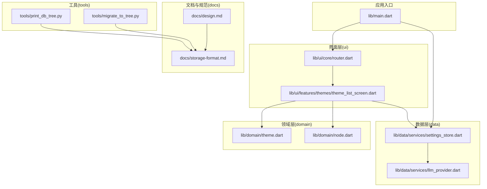
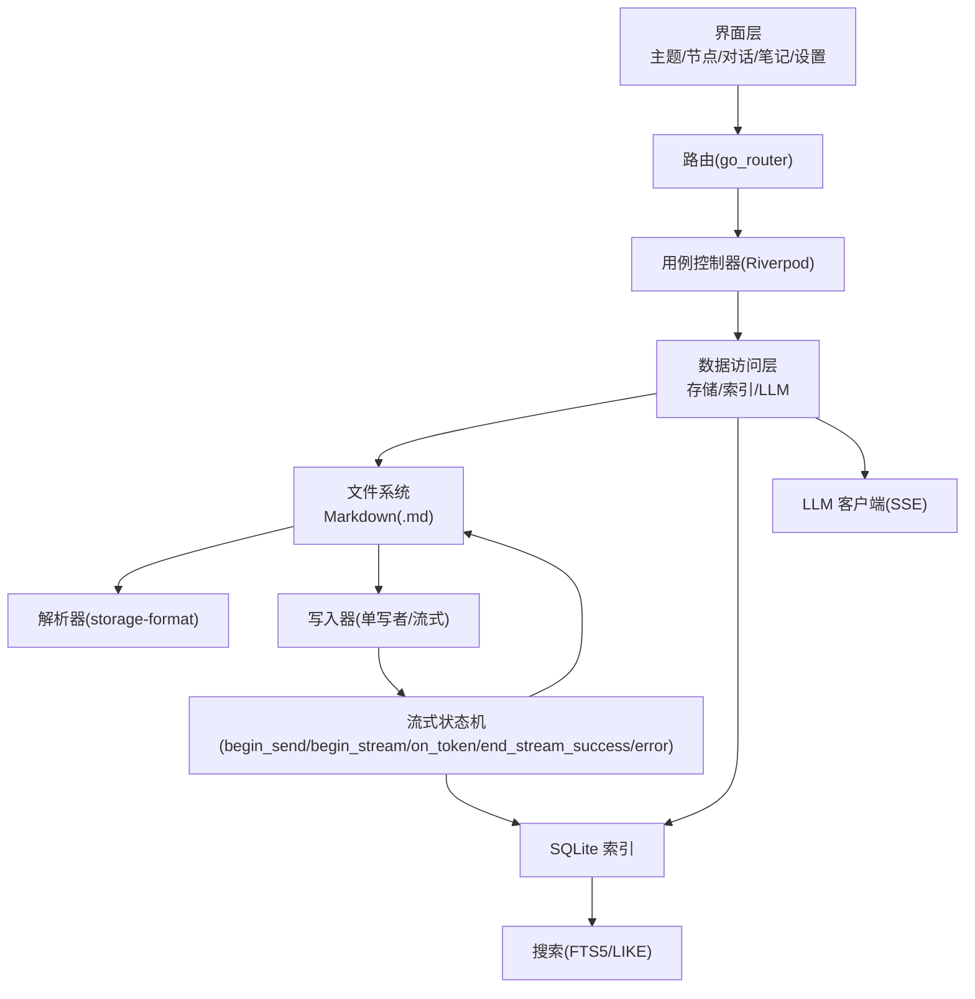
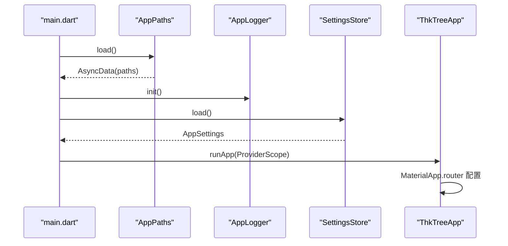
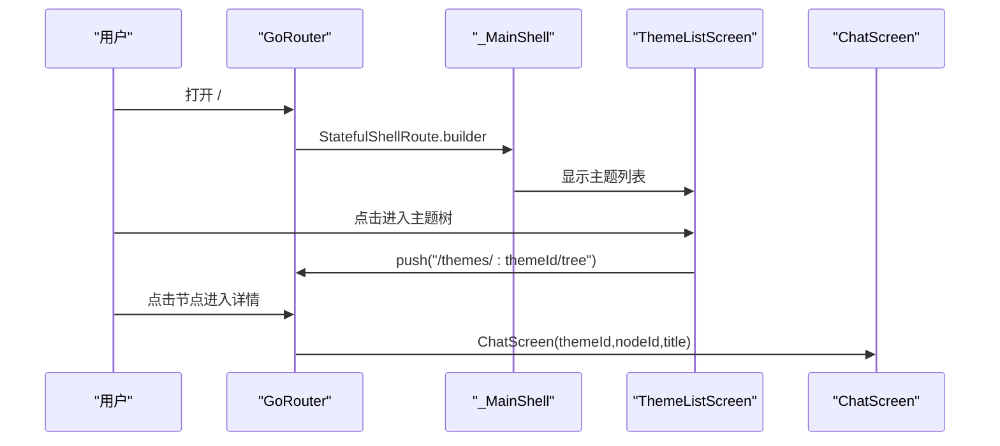
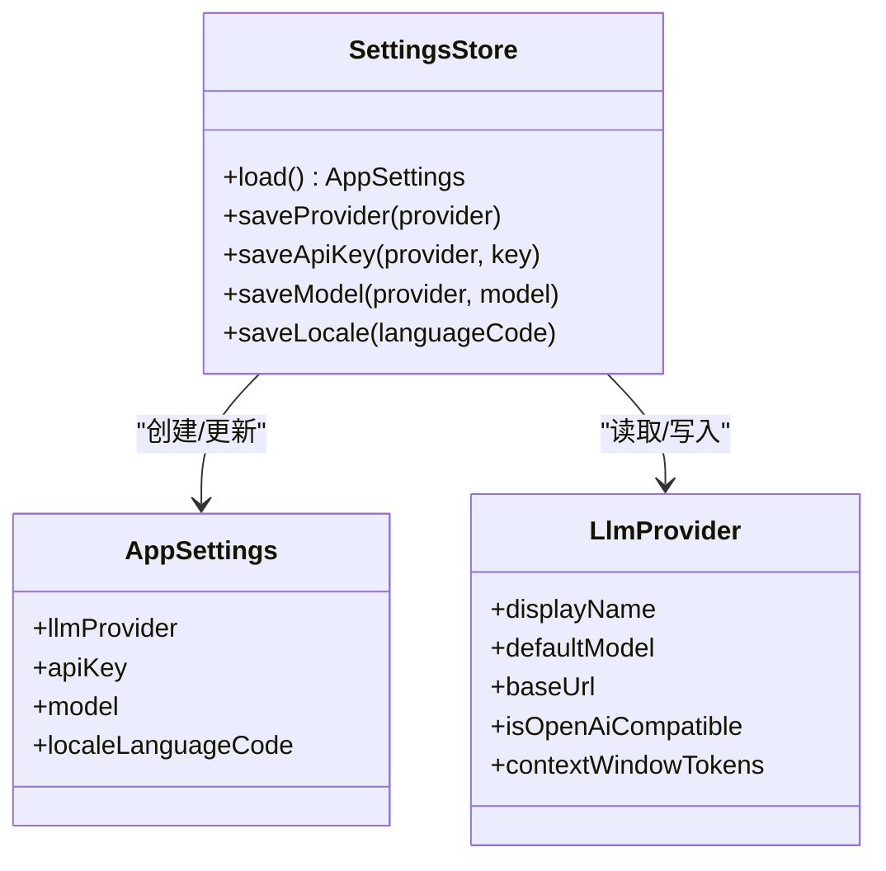
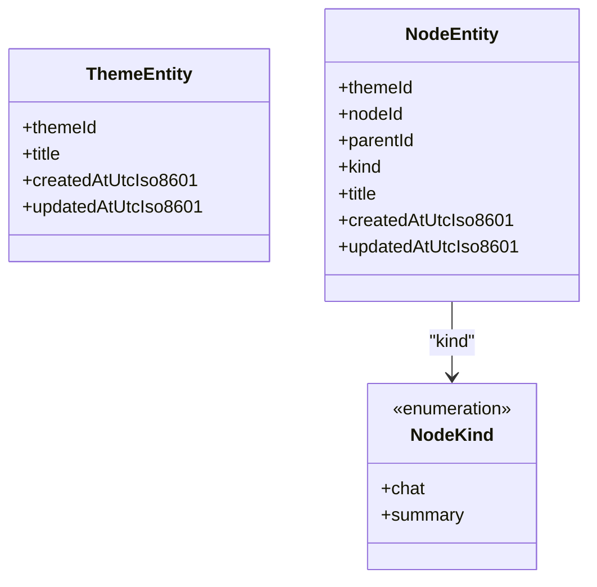
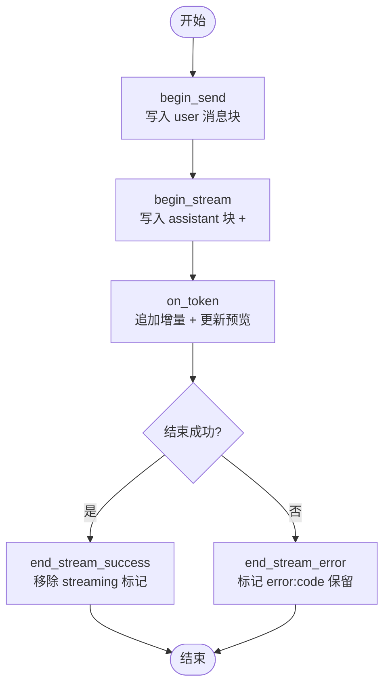
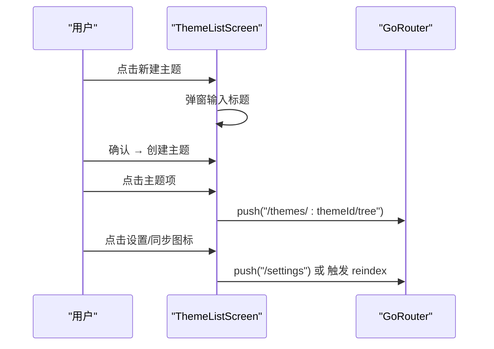
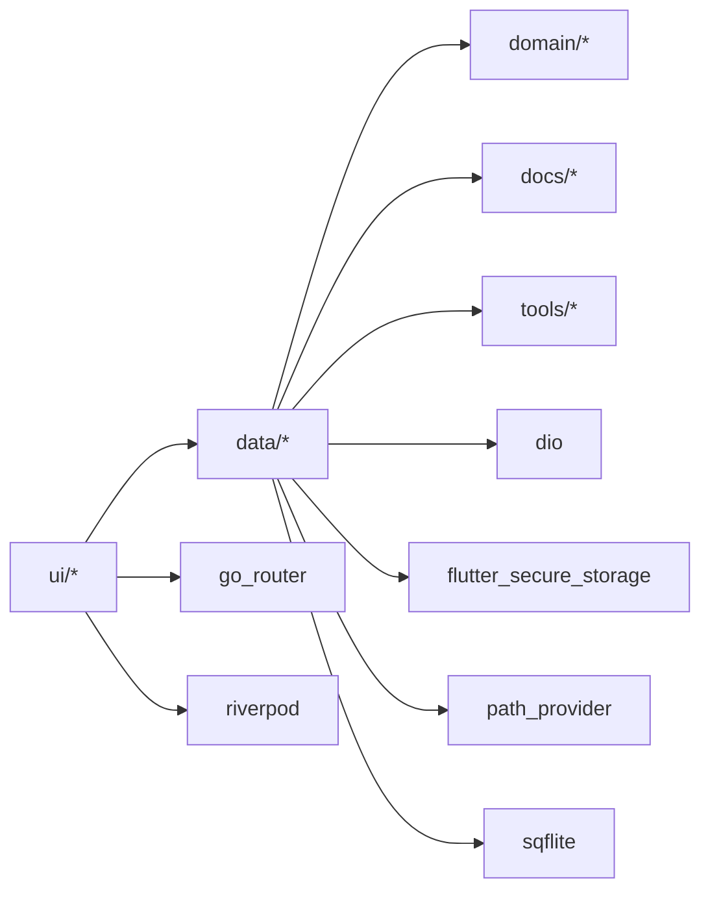

# 项目概述

<cite>
**本文引用的文件**
- [README.md](file://README.md)
- [REQUIREMENTS.md](file://REQUIREMENTS.md)
- [pubspec.yaml](file://pubspec.yaml)
- [lib/main.dart](file://lib/main.dart)
- [docs/design.md](file://docs/design.md)
- [docs/storage-format.md](file://docs/storage-format.md)
- [lib/ui/core/router.dart](file://lib/ui/core/router.dart)
- [lib/data/services/settings_store.dart](file://lib/data/services/settings_store.dart)
- [lib/domain/theme.dart](file://lib/domain/theme.dart)
- [lib/domain/node.dart](file://lib/domain/node.dart)
- [lib/data/services/llm_provider.dart](file://lib/data/services/llm_provider.dart)
- [lib/ui/features/themes/theme_list_screen.dart](file://lib/ui/features/themes/theme_list_screen.dart)
- [tools/migrate_to_tree.py](file://tools/migrate_to_tree.py)
- [tools/print_db_tree.py](file://tools/print_db_tree.py)
</cite>

## 目录
1. [简介](#简介)
2. [项目结构](#项目结构)
3. [核心组件](#核心组件)
4. [架构总览](#架构总览)
5. [详细组件分析](#详细组件分析)
6. [依赖分析](#依赖分析)
7. [性能考量](#性能考量)
8. [故障排查指南](#故障排查指南)
9. [结论](#结论)
10. [附录](#附录)

## 简介
ThkTree 是一款基于 Flutter 3.x 的跨平台移动应用，专注于“树形 LLM 对话”。其核心目标是以主题（Theme）为容器，围绕每个主题构建一棵会话树（Session Tree），每个节点代表一次或多轮的用户与 LLM 的对话。项目强调“本地优先存储”、“可控上下文注入”、“笔记与对话联动”以及“可读可接力”的数据可移植性。通过 Markdown 作为正文真相源、SQLite 作为索引与检索加速，配合流式 LLM 对话（SSE），实现高效、可审计、可被人类与自动化工具共同使用的智能对话系统。

## 项目结构
项目采用按职责分层的目录组织方式，结合 Flutter 的功能域划分，形成清晰的模块边界：
- domain：纯数据实体与 ID/错误定义
- data：数据访问层（存储、索引、LLM 客户端、设置等）
- ui：界面层（屏幕、共享控件、路由）
- tools：辅助脚本（数据库迁移、树形打印等）



图表来源
- [lib/main.dart:15-59](file://lib/main.dart#L15-L59)
- [lib/ui/core/router.dart:18-87](file://lib/ui/core/router.dart#L18-L87)
- [lib/ui/features/themes/theme_list_screen.dart:8-88](file://lib/ui/features/themes/theme_list_screen.dart#L8-L88)
- [lib/data/services/settings_store.dart:106-184](file://lib/data/services/settings_store.dart#L106-L184)
- [lib/data/services/llm_provider.dart:1-111](file://lib/data/services/llm_provider.dart#L1-L111)
- [lib/domain/theme.dart:1-15](file://lib/domain/theme.dart#L1-L15)
- [lib/domain/node.dart:1-30](file://lib/domain/node.dart#L1-L30)
- [docs/design.md:20-46](file://docs/design.md#L20-L46)
- [docs/storage-format.md:14-32](file://docs/storage-format.md#L14-L32)
- [tools/migrate_to_tree.py:34-131](file://tools/migrate_to_tree.py#L34-L131)
- [tools/print_db_tree.py:86-141](file://tools/print_db_tree.py#L86-L141)

章节来源
- [lib/main.dart:15-95](file://lib/main.dart#L15-L95)
- [lib/ui/core/router.dart:18-126](file://lib/ui/core/router.dart#L18-L126)
- [docs/design.md:20-46](file://docs/design.md#L20-L46)
- [docs/storage-format.md:14-32](file://docs/storage-format.md#L14-L32)

## 核心组件
- 应用入口与启动
  - 初始化路径、远程日志、错误处理钩子，并通过 ProviderScope 注入全局依赖（路径、日志、语言环境）。
- 路由与导航
  - 使用 go_router 实现 Shell 分支导航，主题页与笔记页分栏切换，支持参数化路由（主题 ID、节点 ID）。
- 设置与安全存储
  - SettingsStore 负责加载/保存语言、LLM 提供商、API Key、模型 ID，均通过 flutter_secure_storage 安全存储。
- 数据模型
  - ThemeEntity、NodeEntity 作为领域纯数据对象，NodeKind 枚举区分 chat/summary。
- LLM 提供商与令牌估算
  - LlmProvider 统一封装提供商、默认模型、基础 URL、兼容性与上下文窗口；提供简单令牌估算函数。
- 设计与存储契约
  - design.md 定义模块边界、状态机、索引策略、重建索引与 stale 规则；storage-format.md 为磁盘与 SQLite 的权威契约。

章节来源
- [lib/main.dart:15-95](file://lib/main.dart#L15-L95)
- [lib/ui/core/router.dart:18-126](file://lib/ui/core/router.dart#L18-L126)
- [lib/data/services/settings_store.dart:106-184](file://lib/data/services/settings_store.dart#L106-L184)
- [lib/domain/theme.dart:1-15](file://lib/domain/theme.dart#L1-L15)
- [lib/domain/node.dart:1-30](file://lib/domain/node.dart#L1-L30)
- [lib/data/services/llm_provider.dart:1-111](file://lib/data/services/llm_provider.dart#L1-L111)
- [docs/design.md:20-46](file://docs/design.md#L20-L46)
- [docs/storage-format.md:14-32](file://docs/storage-format.md#L14-L32)

## 架构总览
ThkTree 的架构以“数据可读性、可移植性、实时流式处理”为核心设计目标：
- 数据真相源：Markdown 文件（人类可读、Agent 可 grep）
- 关系与检索：SQLite（可随时重建）
- 并发写入：单写者契约，确保同一节点的 session.md 同时只有一个写入流程
- 流式处理：SSE 驱动的增量写入，带中间态标记与错误态保留
- 控制上下文：祖先总结（approved）注入，避免全量历史带来的 token 与语义完整性问题



图表来源
- [docs/design.md:49-91](file://docs/design.md#L49-L91)
- [docs/design.md:93-108](file://docs/design.md#L93-L108)
- [docs/storage-format.md:122-222](file://docs/storage-format.md#L122-L222)
- [lib/ui/core/router.dart:18-87](file://lib/ui/core/router.dart#L18-L87)

## 详细组件分析

### 组件 A：应用启动与全局依赖注入
- 初始化顺序：路径加载与创建、远程日志初始化、错误钩子注册
- 依赖注入：ProviderScope 注入 AppPaths、AppLogger、LocaleNotifier
- 应用外壳：MaterialApp.router 配置本地化、主题、路由



图表来源
- [lib/main.dart:15-59](file://lib/main.dart#L15-L59)

章节来源
- [lib/main.dart:15-95](file://lib/main.dart#L15-L95)

### 组件 B：路由与页面导航
- 使用 go_router 的 StatefulShellRoute 实现底部导航分栏
- 支持主题列表、主题树、节点详情、笔记浏览、设置等页面
- 参数化路由传递 themeId、nodeId，并在节点详情页支持 summary 辅助总结流程



图表来源
- [lib/ui/core/router.dart:18-87](file://lib/ui/core/router.dart#L18-L87)
- [lib/ui/core/router.dart:89-125](file://lib/ui/core/router.dart#L89-L125)

章节来源
- [lib/ui/core/router.dart:18-126](file://lib/ui/core/router.dart#L18-L126)

### 组件 C：设置与安全存储
- 支持多提供商（DeepSeek/OpenAI/Claude/Gemini/MiniMax/Kimi）
- API Key 与模型 ID 分别存储，支持切换提供商
- 语言设置持久化，空值时删除键



图表来源
- [lib/data/services/settings_store.dart:106-184](file://lib/data/services/settings_store.dart#L106-L184)
- [lib/data/services/llm_provider.dart:1-111](file://lib/data/services/llm_provider.dart#L1-L111)

章节来源
- [lib/data/services/settings_store.dart:106-184](file://lib/data/services/settings_store.dart#L106-L184)
- [lib/data/services/llm_provider.dart:1-111](file://lib/data/services/llm_provider.dart#L1-L111)

### 组件 D：主题与节点数据模型
- ThemeEntity：主题标识、标题、创建/更新时间
- NodeEntity：节点标识、父节点、类型(kind)、标题、创建/更新时间
- NodeKind：chat/summary 两种类型



图表来源
- [lib/domain/theme.dart:1-15](file://lib/domain/theme.dart#L1-L15)
- [lib/domain/node.dart:1-30](file://lib/domain/node.dart#L1-L30)

章节来源
- [lib/domain/theme.dart:1-15](file://lib/domain/theme.dart#L1-L15)
- [lib/domain/node.dart:1-30](file://lib/domain/node.dart#L1-L30)

### 组件 E：流式状态机与写入契约
- 状态机：begin_send → begin_stream → on_token → end_stream_success 或 end_stream_error
- 中间态与错误态：assistant 消息块以独占行标记 streaming/error，最终态清理标记
- 单写者：同一 nodeId 同时仅一个写入流程，流式期间禁用重复发送或排队提示



图表来源
- [docs/design.md:61-91](file://docs/design.md#L61-L91)
- [docs/storage-format.md:173-200](file://docs/storage-format.md#L173-L200)

章节来源
- [docs/design.md:61-91](file://docs/design.md#L61-L91)
- [docs/storage-format.md:173-200](file://docs/storage-format.md#L173-L200)

### 组件 F：笔记与对话联动
- 笔记来源：从对话气泡选择文本创建笔记，支持多次累积
- 场景 A：以此发起对话（可选 parent），进入“撰写首条消息”界面，预填笔记正文
- 场景 B：在当前对话插入笔记，作为一条 user 消息写入当前节点

```mermaid
sequenceDiagram
participant User as "用户"
participant Chat as "对话页"
participant Note as "笔记"
participant Compose as "撰写首条消息"
participant Node as "节点详情"
User->>Chat : 选段 → 创建/加入笔记
Note-->>User : 保存笔记
User->>Note : 以此发起对话
Note->>Compose : 预填笔记正文
User->>Compose : 选择 parent/编辑
User->>Compose : 发送 → 创建 SessionNode
Compose->>Node : 进入节点详情
Node->>Node : 流式请求 DeepSeek
```

图表来源
- [REQUIREMENTS.md:100-150](file://REQUIREMENTS.md#L100-L150)

章节来源
- [REQUIREMENTS.md:100-150](file://REQUIREMENTS.md#L100-L150)

### 组件 G：主题列表与交互
- 支持新建主题、进入主题树、重建索引、跳转设置
- 响应式布局：在宽屏下限制最大宽度并居中展示



图表来源
- [lib/ui/features/themes/theme_list_screen.dart:8-88](file://lib/ui/features/themes/theme_list_screen.dart#L8-L88)

章节来源
- [lib/ui/features/themes/theme_list_screen.dart:8-88](file://lib/ui/features/themes/theme_list_screen.dart#L8-L88)

## 依赖分析
- 技术栈与选择理由
  - Flutter 3.x：跨平台原生体验，生态成熟，热重载提升迭代效率
  - Riverpod：轻量、可预测的状态管理，适合复杂用例组合
  - go_router：声明式路由，支持 Shell 分支与参数化路由，导航清晰
  - Dio：HTTP 客户端，支持拦截器与 SSE 流式解析
  - flutter_secure_storage：安全存储 API Key，避免明文写入仓库
  - sqflite/path_provider：SQLite 与路径管理，满足索引与可移植性
  - flutter_markdown：Markdown 渲染，契合“正文真相源”理念
- 模块耦合与内聚
  - ui 依赖 data 的服务接口，domain 为纯数据层，耦合度低
  - data 层内部按存储/索引/LLM 分层，职责清晰
  - tools 与 docs 为外部支撑，不参与核心运行时



图表来源
- [pubspec.yaml:30-50](file://pubspec.yaml#L30-L50)
- [docs/design.md:20-46](file://docs/design.md#L20-L46)

章节来源
- [pubspec.yaml:30-50](file://pubspec.yaml#L30-L50)
- [docs/design.md:20-46](file://docs/design.md#L20-L46)

## 性能考量
- 列表渲染：预览使用 SQLite messages_meta，避免每次解析全文
- 写入性能：单写者 + 队列化，流式期间禁用重复发送或排队提示
- 搜索性能：优先 FTS5，不可用时降级 LIKE，索引可重建
- 索引一致性：先文件后索引，失败不影响正文落盘，支持重建修复
- 迁移与版本：严格 schema 版本控制，提供磁盘扫描重建索引能力

章节来源
- [docs/design.md:93-108](file://docs/design.md#L93-L108)
- [docs/design.md:111-124](file://docs/design.md#L111-L124)
- [docs/storage-format.md:324-350](file://docs/storage-format.md#L324-L350)

## 故障排查指南
- 流式未完成
  - 现象：最后一条 assistant 消息仍带 streaming 标记
  - 处理：启动或进入节点时提供“重试/继续生成”入口
- 错误态消息块
  - 现象：assistant 块标记 error:code
  - 处理：保留旧块，重试时生成新的 assistant 消息块
- 索引异常
  - 现象：index.sqlite 缺失或版本不匹配
  - 处理：提供“重建索引”按钮或在启动检测中触发
- 数据迁移
  - 工具：migrate_to_tree.py 自动发现 iOS 模拟器中的数据并迁移节点目录与 SQLite 路径
  - 验证：print_db_tree.py 打印主题与节点树，核对 nodePath/sessionPath

章节来源
- [docs/design.md:88-91](file://docs/design.md#L88-L91)
- [docs/design.md:111-119](file://docs/design.md#L111-L119)
- [tools/migrate_to_tree.py:34-131](file://tools/migrate_to_tree.py#L34-L131)
- [tools/print_db_tree.py:86-141](file://tools/print_db_tree.py#L86-L141)

## 结论
ThkTree 通过“树形对话 + 本地优先 + 流式 LLM”的组合，构建了可读、可移植、可扩展的智能对话系统。其模块化设计、严格的存储契约与流式状态机，使得应用在复杂场景下仍保持高可靠性与可维护性。对于初学者，建议从主题与节点的基本操作入手；对于有经验的开发者，可深入研究存储契约、索引策略与流式写入的工程实现。

## 附录
- 产品需求与范围：见 REQUIREMENTS.md，涵盖多主题、树形 Session、对话、本地持久化、笔记、祖先上下文总结、设置等
- 设计文档：见 docs/design.md，定义模块边界、状态机、索引策略与重建机制
- 存储格式权威：见 docs/storage-format.md，定义目录结构、JSON 元数据、session.md、context-summary.md、notes、SQLite 索引与重建

章节来源
- [REQUIREMENTS.md:12-55](file://REQUIREMENTS.md#L12-L55)
- [docs/design.md:1-17](file://docs/design.md#L1-L17)
- [docs/storage-format.md:1-12](file://docs/storage-format.md#L1-L12)