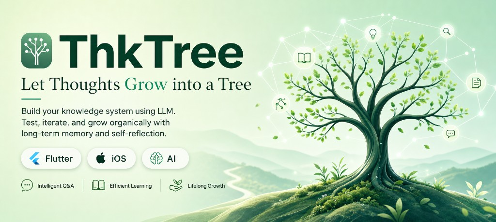
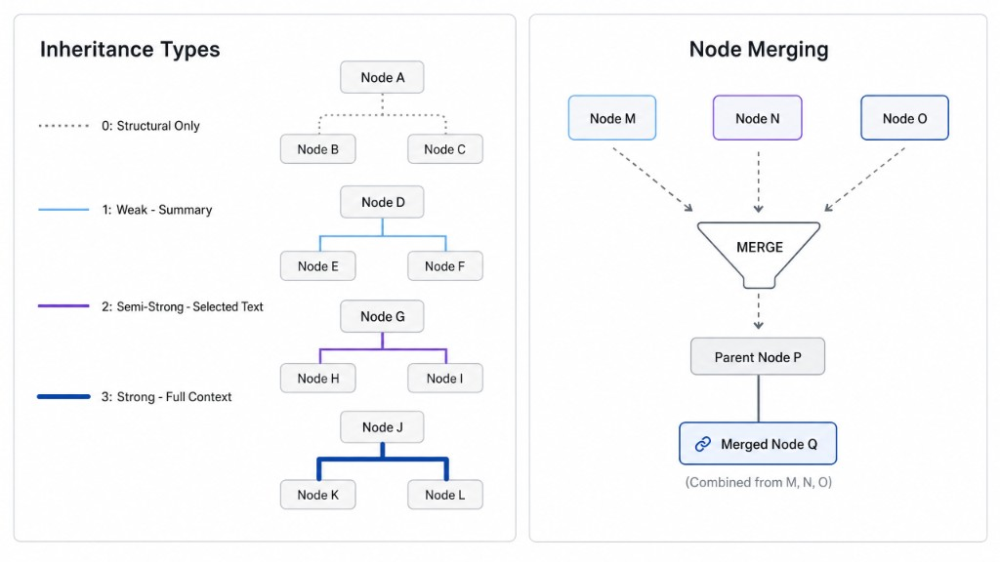

<p align="center">
  
</p>

<p align="center">
  <a href="./readme_i18n/README_zh_CN.md">简体中文</a> ·
  <strong>English</strong>
</p>

---

## What is ThkTree?

ThkTree is an AI knowledge-tree app that organizes LLM conversations into a nested, searchable, locally-grown tree — privacy-first, bring your own model.

**Core value**: Human–AI collaboration to build a structured knowledge system that grows *on you* — organic like a tree, not drowned in information overload.

### Introduction

<p align="center">
  <a href="https://youtu.be/7DeELqEsagA" target="_blank" rel="noopener noreferrer"></a>
</p>
<p align="center"><sub>Intro video on <a href="https://youtu.be/7DeELqEsagA" target="_blank" rel="noopener noreferrer">YouTube</a> · opens in a new tab</sub></p>

---

> During the holiday I wanted to vide code an app. I didn't overthink it—I went with the first idea that popped into my head: tree-shaped conversations + Flutter.
>
> **Product positioning:**
> Typical LLM chats are mostly ephemeral, and this app is no exception! It's just a way to organize your thinking. There's no server, which means data is less likely to leak. As you build the tree, your understanding of the information deepens. The app's output is wiki—you can export wiki to your PC and use whatever tools you like to consolidate and analyze, for learning and reinforcement—e.g. Claude Code, Grok build, Codex, Kimi Code, WorkBuddy ...
>
> **Biggest problem today:**
> As a solo developer it's hard to make every feature solid—and on iOS in particular, if the app goes to the background you may not receive the full LLM response. Compatibility testing across different device models hasn't been done yet.
>
> **Plan:**
> 1.x is a simple tool
>
> 2.x doesn't replace 1.x—it adds a server side, but probably not the traditional web-dev pattern of simply calling APIs
>
> **Project status:** The holiday break is wrapping up and my focus is shifting back to work, so updates may come at a slower pace for a while. ThkTree is still actively maintained — issues and PRs are welcome. If you're interested in the idea and want to help polish features, fix bugs, or improve docs/tests, I'd love to collaborate.
>
> **About Lab:** it's the entry point for experimental features, aimed at developers
>
> **About the default palette:** Just before release I noticed the Morandi palette looked a lot like the colors I'd picked when I first started the app—it felt comfortable on the eyes—so I had AI set it as the default.
>
> **Why Flutter?**
> 1. It was a tech stack choice I once recommended to a team
> 2. While reading about 3D, I came across Toyota's Fluorite—a project that supports console-grade 3D rendering
> [Toyota is using Flutter to build the game engine Fluorite - 恋猫 on Zhihu](https://zhuanlan.zhihu.com/p/2007240745833210390)
> BTW: Recently there's another interesting project:
> [Flutter 3D rendering: new options and use cases - 恋猫 on Zhihu](https://zhuanlan.zhihu.com/p/2063773097333895339)
>
> Strictly speaking I don't really know Flutter or Dart—I once wrote a simple bridge between Dart and Java. That feeling of familiar yet unfamiliar, actually very unfamiliar—isn't that perfect for vide coding practice?

---

## Features

### Markdown-first information management

- **Markdown as the source of truth**: chats live in `session.md`, notes are local Markdown; SQLite holds metadata, relations, and FTS only
- **Readable & exportable**: view/copy raw session Markdown; aggregate a tree into Wiki and export zip to your PC
- **Markdown in, Markdown out**: doc split turns Markdown documents into tree nodes; Lab reports are saved as Markdown too

### Knowledge tree (Themes)

- **Multi-theme management**: Each theme is a node tree for a cluster of related thinking
- **Tree sessions / nodes**: One node = one chat or one note; nest, expand, drag
- **Merge & new chat**: Merge up to 3 chats into a new branch to reorganize ideas

  In the tree view, select up to 3 chats to merge their full conversation history into a new node. The merged messages become the starting context—add a new question and send everything to the LLM together, turning scattered threads into one conversation.

- **Tree → Wiki snapshot**: Aggregate a tree’s chats into a readable “book”; browse by chapter and export zip
- **Doc split**: Give a Markdown document to the LLM; auto-split into tree-shaped chat nodes

Think about how a tree *grows*: when you create a branch, parent and child may relate through different levels of inheritance.

1. **Level 0** — structural only: linked in the hierarchy; content is entirely yours to shape
2. **Weak** — a summary of the full context or the selected text
3. **Semi-strong** — inherits the selected text as-is
4. **Strong** — inherits the full context or the selected text



### Chat

- **Streaming**: SSE streaming, Markdown / LaTeX rendering, image upload and vision models
- **Branch**: Branch instantly from any message or selection to compare ideas

  <a href="https://youtube.com/shorts/ek68qDjBKrw?feature=share" target="_blank" rel="noopener noreferrer"></a>

- **Web search**: Native search on KIMI / MIMO / DeepSeek / Doubao / xAI Grok, etc.
- **Deep thinking toggle**: Per-session (DeepSeek, MiniMax, etc.); some models lock server-side
- **Pin panel**: Pin key messages or notes to the screen edge for cross-chat reference

  Pin important messages or notes (up to 5). Tap the right-edge handle to open the panel and reference them across branches and tabs—jump to source, save as a note, or unpin anytime.

  <a href="https://youtube.com/shorts/cnm61xIWyK8?feature=share" target="_blank" rel="noopener noreferrer"></a>

- **iOS background recovery**: ~30s grace when backgrounded; auto-resend on foreground if killed mid-stream

### Notes

- **Markdown notes**: Local editing, required title, table and heading toolbar
- **Chat-to-note**: Save a good reply as a note in one tap
- **LLM title / move theme**: Keep structure clear across themes

### Search

- **Full-text search**: SQLite FTS5 + BM25 across chats and notes
- **Theme / node title filter**: Locate quickly inside a tree

### Lab

- **Keyword leaderboard**: LLM extracts keywords → aggregate scores → see what you think about
- **Input summary**: Scan history and generate a Markdown analysis report
- **Spark collision**: Random keyword pairs → one-line sparks from the LLM → tap to start a new chat

---

## Tech stack

| Area | Choice |
|------|--------|
| Framework | Flutter (Cupertino-only UI) |
| State | Riverpod |
| Routing | go_router (declarative + deep linking) |
| Storage | Markdown body + SQLite metadata / relations / FTS5 |
| Write safety | FileWriteQueue single-writer (atomic streaming append) |
| LLM | SSE streaming + `flutter_secure_storage` for keys |
| Rendering | `gpt_markdown` + `flutter_math_fork` (LaTeX) |
| Platform | `image_picker`, iOS MethodChannel (background grace / TTS) |

### Code layout

```
lib/
  domain/                   # Theme, Node, entity ids
  data/
    models/                 # LLM config, serialization DTOs
    services/               # LLM client, SQLite/FTS, file I/O, pins, clips, keywords, wiki export…
    stores/                 # Riverpod notifiers (session, theme, settings…)
  ui/
    core/
      router.dart           # go_router routes & shell
      app_services.dart     # DB / paths bootstrap
      shared/               # composer, branch flow, title suggestion, selection…
      theme/                # AppColors, AppTheme
      widgets/              # design-system components
    features/
      themes/               # theme list, tree view, merge chat, full tree
      chat/                 # streaming chat, auto title, pin panel widgets
      notes/                # browse, editor, detail, location picker
      search/               # FTS search screen & shared SearchContent
      lab/                  # keyword ranking, input summary, thinking collision
      llm/                  # provider list & detail
      settings/             # LLM setup, defaults, backup hooks, onboarding
      wiki/                 # tree → wiki reader
      doc_split/            # markdown doc → tree nodes
      backup_restore/       # zip import/export
      about/
    platform/               # Android-specific UI hooks
  l10n/                     # zh / en (ARB + generated)
```

Four bottom tabs: **Search / Themes / Notes / Lab**; settings via gear on the search screen.

---

## Quick start

```bash
# 1. Clone
git clone <repo-url>
cd thk_tree

# 2. Onboarding check
python3 tools/check_onboarding.py

# 3. Dependencies
flutter pub get
cd ios && pod install && cd ..

# 4. Run
flutter run
```

> **First launch**: **ThkTree** shows a one-time prompt guiding you to **Settings → LLM** to add model providers and set default models. ThkTree uses LLMs for chat, title generation, and summarization—you can tap **Later** and configure anytime in Settings.

<a href="https://youtube.com/shorts/vckfravPXek?feature=share" target="_blank" rel="noopener noreferrer"></a>

> Environment, skills, and architecture: [`docs/PROJECT.md`](docs/PROJECT.md), [`docs/ARCHITECTURE.md`](docs/ARCHITECTURE.md), [`docs/FEATURES.md`](docs/FEATURES.md).

---

## Philosophy

> Human–AI collaboration to build a structured knowledge system that grows on you — organic like a tree, not lost in the flood.

Most tools flatten chats, notes, and sources into one stream. ThkTree’s answer is a metaphor: **knowledge is a tree**.

- **Organic** — Structured but not rigid; nest, branch, experiment
- **Restraint & order** — Hierarchy through whitespace and type, not noise
- **Experimental** — Lab spirit; share trade-offs and war stories
- **Humanist** — Privacy, tools that serve people

**Promise**: Your knowledge stays yours; your structure stays clear; your tool stays restrained.

---

## Positioning

| Dimension | Stance |
|-----------|--------|
| Platform | iOS (TTS, background recovery are native iOS capabilities) |
| Data | Local-first, no ThkTree server; on iOS, `Documents/thktree/` is included in **iCloud Backup** when enabled; API keys not stored in plain text |
| Models | Your provider and model, not vendor lock-in |
| Character | “Quiet, reliable architect” — restrained, ordered, human |

**iOS backup:** App data lives under `Documents/thktree/`. With iCloud Backup turned on, it is backed up to **your** iCloud account (not to ThkTree). See [Privacy Policy](./docs/legal/privacy-policy-en.md).

---

## Docs

- Architecture & doc map: [`docs/ARCHITECTURE.md`](docs/ARCHITECTURE.md)
- Feature status: [`docs/FEATURES.md`](docs/FEATURES.md)
- Security & privacy notes: [`docs/SECURITY-en.md`](docs/SECURITY-en.md) · [中文](docs/SECURITY-zh.md)

## License

ThkTree is released under the [MIT License](./LICENSE).

| Document | English | 中文 |
|----------|---------|------|
| Privacy Policy | [privacy-policy-en.md](./docs/legal/privacy-policy-en.md) | [privacy-policy-zh.md](./docs/legal/privacy-policy-zh.md) |
| Terms of Service | [terms-of-service-en.md](./docs/legal/terms-of-service-en.md) | [terms-of-service-zh.md](./docs/legal/terms-of-service-zh.md) |

> Always **ThkTree** (PascalCase). Not `thk_tree`, `thktree`, or `Thk Tree`.
