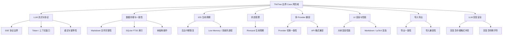

# 边界 Case 清单与测试 Backlog

> **本文件定位**：ThkTree 全量边界 case 系统化清单，覆盖 LLM 流式、数据存储、iOS 生命周期、状态管理、多 Provider、UI 渲染、导入导出等 12 个风险域。
> **适用对象**：规划集成测试 backlog、评估改动风险、Code Review 时的边界 case 检查表。
> **维护方式**：新增 case 追加到对应风险域末尾；已验证的 case 标注验证状态但不删除（保留追溯）。

---

## 1. 优先级定义

| 等级 | 含义 | 判定标准 |
|------|------|----------|
| **P0** | 数据丢失 / 崩溃 / 用户无法恢复 | 触发后用户数据永久损失或 App 不可用 |
| **P1** | 功能不可用 / 体验严重退化 | 触发后核心功能失效，用户需手动操作才能恢复 |
| **P2** | 体验瑕疵 / 边角异常 | 触发后用户体验下降但功能仍可用 |

---

## 2. 风险域总览

---

## 3. 边界 Case 详情

### 3.1 LLM 流式与 SSE 协议边界

#### EC-001 流式 chunk 不完整 UTF-8

- **风险等级**：P0
- **影响模块**：chat（`ChatController` + `LlmApiClient`）
- **场景描述**：SSE 流式传输中，一个多字节字符（如 emoji）被切在 chunk 边界，前一个 chunk 包含字节序列的前半部分，后一个 chunk 包含后半部分。
- **风险分析**：UTF-8 解码器遇到不完整字节序列时可能抛异常或产生乱码，导致流式渲染中断、App 崩溃。
- **建议验证方式**：Mock LLM 返回包含多字节 emoji 的流，手动控制 chunk 切分位置在字节中间。
- **相关代码**：`lib/data/services/` 下 SSE 解析逻辑
- **相关文档**：[chat README](../modules/chat/README.md)、[ADR-006](../DECISIONS.md)

#### EC-002 SSE 数据行含 `data:` 嵌套

- **风险等级**：P1
- **影响模块**：chat
- **场景描述**：LLM 回复正文中包含字面 `data:` 字符串（如用户让 LLM 解释 SSE 协议），SSE 解析器可能将其误认为新的 SSE event 边界。
- **风险分析**：消息内容被截断或解析出错误的 event 结构，导致回复内容缺失。
- **建议验证方式**：Mock LLM 返回含 `data: example` 文本的流。
- **相关代码**：SSE 行解析逻辑

#### EC-003 长时间无 chunk（非连接断开）

- **风险等级**：P1
- **影响模块**：chat
- **场景描述**：SSE 连接保持打开，但 30 秒内无任何 data chunk 到达（LLM 正在 "thinking" 但未输出 token）。
- **风险分析**：若无 idle timeout 机制，UI 会无限等待；用户无法区分"LLM 正在思考"和"连接已死"。
- **建议验证方式**：Mock LLM 建立连接后延迟 60s 再发第一个 chunk，验证是否有 timeout 或心跳提示。
- **相关文档**：[chat-streaming.md](integration-testing/chat-streaming.md)

#### EC-004 `[DONE]` 信号缺失

- **风险等级**：P1
- **影响模块**：chat
- **场景描述**：流正常结束（HTTP 连接关闭）但后端未发送 `[DONE]` 信号。
- **风险分析**：若解析器依赖 `[DONE]` 判定流结束，可能永不关闭流，`stop_button` 永久卡在 streaming 状态。
- **建议验证方式**：Mock LLM 发送若干 chunk 后直接关闭连接，不发 `[DONE]`。
- **相关文档**：[war-story: stop_button 卡死](../war-stories/ui-ux/2026-06-20-chat-controller-stop-button-stuck.md)

---

### 3.2 Token 与上下文窗口边界

#### EC-005 单轮消息逼近 context window 上限

- **风险等级**：P1
- **影响模块**：chat、llm
- **场景描述**：用户消息 + 祖先 context-summary + 系统提示接近 LLM 的 context window 上限（如 DeepSeek 64K）。
- **风险分析**：超出上限时 LLM 返回 400 错误或静默截断早期消息，用户无感知地丢失上下文。
- **建议验证方式**：构造超长用户消息（接近 context window），验证错误处理或截断策略（前置保留 vs 后置保留）。
- **相关代码**：`ChatController` 构造 messages 数组逻辑
- **相关文档**：[CHANGELOG/2026-06-24-llm-default-context-window](../CHANGELOG/2026-06-24-llm-default-context-window.md)

#### EC-006 LLM 回复超长导致子节点继承时超限

- **风险等级**：P1
- **影响模块**：chat
- **场景描述**：assistant 回复 10K token，用户在子节点再发消息时，context-summary + 回复内容 + 新消息合计超出 context window。
- **风险分析**：子节点对话失败或上下文被静默截断，破坏树状对话的连续性。
- **建议验证方式**：构造一个 assistant 回复接近 context window 上限的 session，在子节点发消息验证行为。

#### EC-007 空 context-summary 注入

- **风险等级**：P2
- **影响模块**：chat
- **场景描述**：`context-summary.md` 文件存在但 body 为空字符串（如总结生成失败但文件已创建）。
- **风险分析**：空 summary 注入 prompt 后可能影响 LLM 行为（如 LLM 认为没有上下文），与文件不存在的行为可能有差异。
- **建议验证方式**：创建空 body 的 `context-summary.md`，验证 prompt 构造是否有差异。
- **相关代码**：context-summary 读取与注入逻辑
- **相关文档**：[storage-format.md § 5](storage-format.md#5-contextsummarymd已确认总结)

---

### 3.3 重试与幂等性边界

#### EC-008 流式写入 session.md 中途失败后重试

- **风险等级**：P0
- **影响模块**：chat（`FileWriteQueue` + `ChatController`）
- **场景描述**：第一次流式输出写入 500 字后网络断连，`<!-- streaming -->` 标记残留。用户点重试，新的 assistant 消息块开始追加写入。
- **风险分析**：若旧 streaming 块未正确清理，文件中可能出现两个 assistant 块（一个 streaming 残留 + 一个新回复），或重复拼接导致内容混乱。
- **建议验证方式**：Mock LLM 流式中途断连，验证重试后 session.md 文件结构是否符合 [storage-format § 4.4-4.5](storage-format.md#44-流式中间态必须) 规范。
- **相关代码**：`FileWriteQueue`、`SessionStore`
- **相关文档**：[storage-format.md § 4.5 错误态](storage-format.md#45-错误态必须)

#### EC-009 Stop 后立即重试

- **风险等级**：P1
- **影响模块**：chat
- **场景描述**：用户点 Stop 取消当前流，立即点重试。
- **风险分析**：内部 streaming 状态可能未完全重置，新请求的流与旧请求的残留状态冲突，导致 UI 状态混乱（如 stop_button 不消失）。
- **建议验证方式**：集成测试中快速连续操作 Stop → Retry，验证 UI 状态正确恢复。
- **相关文档**：[war-story: stop_button 卡死](../war-stories/ui-ux/2026-06-20-chat-controller-stop-button-stuck.md)

#### EC-010 重试时 model 已变更

- **风险等级**：P2
- **影响模块**：chat、llm
- **场景描述**：用户在全局设置中切换了 LLM 模型，回到对话页点重试。
- **风险分析**：重试使用新模型还是旧模型？若使用旧模型但 API Key 已变更，可能报错；若使用新模型，回复风格突变可能让用户困惑。
- **建议验证方式**：切换模型后重试，验证使用哪个模型并确认行为符合预期。

---

### 3.4 数据存储与文件完整性边界

#### EC-011 `<!-- streaming -->` 标记残留

- **风险等级**：P1
- **影响模块**：chat（`SessionStore.findInterrupted()` + `ChatTaskService`）
- **场景描述**：App 异常退出后 `session.md` 中残留 `<!-- streaming -->` 标记，下次启动时触发 `findInterrupted()` 扫描。
- **风险分析**：此行为是设计意图（ADR-015 的 disk-first 恢复入口），但需验证：①残留标记是否正确触发重发；②重发成功后标记是否正确清除；③多次残留是否串行处理。
- **建议验证方式**：已在 `chat_async_recovery_test.dart` 覆盖 `findInterrupted` + `resumeInterrupted`，可扩展验证多次残留场景。
- **相关代码**：`SessionStore.findInterrupted()`、`ChatTaskService.resumeInterrupted()`
- **相关文档**：[ADR-015](../DECISIONS.md)、[chat-async-recovery.md](integration-testing/chat-async-recovery.md)

#### EC-012 session.md frontmatter 损坏

- **风险等级**：P0
- **影响模块**：data（`SessionStore` 解析器）
- **场景描述**：`---` 分隔符被截断或缺失（如写入到一半断电），解析器遇到非法 frontmatter。
- **风险分析**：若解析器直接 crash，整个节点不可读；若降级为空 session，用户历史对话丢失。
- **建议验证方式**：构造 frontmatter 损坏的 session.md 文件，验证解析器是否降级处理而非崩溃。
- **相关文档**：[storage-format.md § 4.2](storage-format.md#42-frontmattersessionv1必须)

#### EC-013 文件编码混用（`\r\n` vs `\n`）

- **风险等级**：P2
- **影响模块**：data
- **场景描述**：用户从 Windows 粘贴文本（含 `\r\n`）到对话输入框，内容写入 session.md。
- **风险分析**：消息块标题行解析依赖 `\n` 分割，`\r\n` 可能导致标题行匹配失败（行尾多出 `\r`），消息边界识别错误。
- **建议验证方式**：构造含 `\r\n` 的 session.md，验证消息块解析是否正常。
- **相关文档**：[storage-format.md § 2.1](storage-format.md#21-编码与换行)（规范要求统一 `\n`）

---

### 3.5 SQLite FTS5 索引边界

#### EC-014 FTS5 content 表与磁盘不同步

- **风险等级**：P1
- **影响模块**：search
- **场景描述**：磁盘 `session.md` 有数据，但 FTS5 虚拟表未同步更新（如写入成功但 FTS 索引更新失败）。
- **风险分析**：搜索结果静默遗漏已有内容，用户以为"搜不到"等于"不存在"。
- **建议验证方式**：写入笔记后手动删除 FTS5 索引行，验证搜索是否遗漏，以及 `reindex` 后是否恢复。
- **相关代码**：`SearchService`、`AppDatabase`
- **相关文档**：[search README](../modules/search/README.md)、[storage-format.md § 8](storage-format.md#8-reindex重建索引必须支持)

#### EC-015 FTS5 分词器与多语言混合 — ✅ 已修复（2026-07-08）

- **当前状态**：✅ 已修复（2026-07-08）
- **风险等级**：P2
- **影响模块**：search
- **场景描述**：中文 + 英文 + 数字混合的笔记内容，FTS5 默认分词器（`unicode61`）对中文按字分词，对英文按词分词，行为差异可能影响搜索精度。英文 CamelCase / snake_case 被视为单个 token，搜子串匹配不到。
- **风险分析**：中文搜索"思维导图"可能只能按单字命中；英文搜索 "test" 匹配不到 `TestCase`（FTS5 token 边界限制）。同一单词在不同文档中以不同形式存在时，时搜到时搜不到。
- **修复方案**：FTS5 无结果时**无条件**降级 LIKE 子串匹配（此前仅含 CJK 字符的查询才降级）。SQLite LIKE 默认对 ASCII 大小写不敏感，`Flutter` / `flutter` 互通。LIKE 仅在 FTS5 冷路径（无结果）时触发，有 `LIMIT 50` 约束。
- **修复 commit**：`codex/search-bugfix` 分支
- **相关代码**：`lib/data/services/search_service.dart` `search()` 方法（去掉 `_containsCjk` 条件）
- **相关文档**：[search spec](../modules/search/specs/2026-06-05-搜索功能-design.md)

#### EC-016 并发搜索 + 写入

- **风险等级**：P1
- **影响模块**：search、data
- **场景描述**：用户在搜索时，另一个操作（如流式写入 session.md）正在更新 SQLite。
- **风险分析**：SQLite 的 WAL 模式可支持并发读，但若 FTS5 写事务与搜索读事务冲突，可能读到中间态或阻塞。
- **建议验证方式**：集成测试中并发触发搜索和笔记写入，验证搜索结果一致性和无崩溃。
- **相关代码**：`AppDatabase`（WAL 模式配置）

#### EC-017 全文索引重建性能

- **风险等级**：P2
- **影响模块**：search、data
- **场景描述**：500+ 条笔记时触发 `rebuildIndex`（全量重建），是否阻塞 UI。
- **风险分析**：重建涉及扫描所有 `.md` 文件 + 逐条写入 FTS5，若在主 isolate 执行可能导致 jank。
- **建议验证方式**：构造 500 条笔记数据，触发 reindex 并观察 UI 响应。
- **相关代码**：`AppDatabase.reindex()`、[tools/repair_index_from_disk.py](../../tools/repair_index_from_disk.py)
- **相关文档**：[storage-format.md § 8](storage-format.md#8-reindex重建索引必须支持)

#### EC-043 搜索结果重复（FTS5 无主键 + upsert 累加）— ✅ 已修复（2026-06-29）

- **当前状态**：✅ 已完整修复（2026-06-29）
- **影响模块**：search（`SearchService` + `AppDatabase`）
- **场景描述**：`search_index` 是 FTS5 虚拟表（见 [`app_database.dart`](../../lib/data/services/app_database.dart) 行 64-73），schema 中**无显式主键**（7 列均为普通列）；FTS5 虚拟表**不支持**标准 SQLite `UNIQUE` 约束。`SearchService.upsertNote`（[search_service.dart](../../lib/data/services/search_service.dart) 行 111-138）与 `SearchService.upsertMessage`（同行 144-164）历史上使用的 `db.insert(..., conflictAlgorithm: ConflictAlgorithm.replace)` 在 FTS5 虚拟表上**静默失效**（不抛错也不替换，仍插入新 rowid 行）。`SearchService.search`（同行 53-101）历史上直接 `SELECT ... FROM search_index MATCH ?`，未做 `GROUP BY entityType, entityId` / `DISTINCT` 去重。
- **风险分析**：同一 `(entityType, entityId)` 在 `search_index` 中可存在 N 条重复行；搜索时全部返回，UI 列表出现重复条目。具体累加触发点：
  - **笔记保存**：`note_editor_screen.dart` 行 143 `_updateSearchIndex` + `note_detail_screen.dart` 行 127 `_updateSearchIndex` → 同一笔记保存 N 次 → 出现 N 条
  - **LLM 流式 onDone**：`chat_task_service.dart` 行 138-148 `onDone` → 行 167-202 `_updateSearchIndex` → `upsertMessage` → 同一对话 N 轮 LLM 完成 → 出现 N 条
  - **iOS 后台重发叠加**：按 [ADR-015](../DECISIONS.md) disk-first 策略 + `bc353815` 后台重发实现，每次重发都再调一次 `upsertMessage` → 翻倍累加
  - **严重性量化**：编辑 5 次的笔记搜索命中 5 条；10 轮对话搜索命中 10 条；后台重发一次再翻倍
- **建议验证方式**（集成测试 / UI 可见性断言）：
  1. 同一笔记连续 `upsertNote` 3 次后，搜索该笔记关键字，断言 `SearchResult` 列表长度 = 1（当前预期失败：实际返回 3）
  2. mock LLM 触发 3 轮 `finishAssistant` 后，搜索该对话关键字，断言 `message` 类型结果数 = 1（当前预期失败：实际返回 3）
  3. 验证 `rebuildAll` 路径（先 `DELETE FROM search_index` 再 INSERT）搜索结果正常，作为对照基准——说明问题不来自数据写入路径，仅来自 upsert 的 in-place 更新
- **修复方向**：✅ **已完整修复**（2026-06-29，commit `9205baa` + `cb9891f`）
  - **方案 A（源头去重）**：`upsertNote` 改用 `db.transaction` 包裹 `DELETE + INSERT`，替换原 `db.insert(..., conflictAlgorithm: ConflictAlgorithm.replace)`。FTS5 虚拟表不支持 `UNIQUE` / PRIMARY KEY，`ConflictAlgorithm.replace` 在 FTS5 上**静默失效**（不抛错也不替换，而是插入新 rowid 行），必须改为显式 DELETE + INSERT 事务保证同 `(entityType, entityId)` 只保留一行
  - **方案 B（查询兜底）**：⚠️ 上游 commit `9205baa` 的子查询 + GROUP BY 方案在 iOS SQLite 实测失败（`unable to use function snippet/bm25 in the requested context`）。下游 commit `cb9891f` **重写为扁平查询**：`search()` 直接 `SELECT ... FROM search_index MATCH ?`，`snippet(search_index, 5, '<b>', '</b>', '...', 40)` 取 col=5（content 列），`ORDER BY bm25(...) ASC, updatedAt DESC`。代价：放弃 GROUP BY 兜底历史脏数据，改为依靠方案 A 的事务 DELETE+INSERT 在每个新 upsert 时自动清理。
  - **修复范围扩大到 message 端**：下游 commit `cb9891f` 同步修复 `upsertMessage` 同款 bug（`ConflictAlgorithm.replace` 同样静默失效）；此前按 memory「问题修复范围最小化原则」暂未扩大，但本次用户实测发现 chat 搜索完全不可用，触发扩大修复。
- **验证状态**：✅ 已通过集成测试 + 用户实测
  - **Case 5（新增，2026-06-29）**：`integration_test/note_search_test.dart` Case 5——新建笔记 → 填标题+正文 → `pump(500ms)` 触发防抖 → 点 √ 触发第 2 次 `_saveNow` → 搜索唯一关键词 → 断言 `_countSearchResultEntities() == 1`
  - **Case 1-4（回归）**：全部保持原断言，GROUP BY 去重不破坏现有搜索行为
- **修复 commits**：`9205baa`（note 端 + 上游方案 B）+ `cb9891f`（message 端同步 + 方案 B 重写为扁平查询）
- **相关代码**（修复后）：
  - `lib/data/services/search_service.dart` 行 53-101（`search` 扁平查询 + col=5，下游 commit `cb9891f` 重写）
  - `lib/data/services/search_service.dart` 行 111-138（`upsertNote` 事务化 DELETE+INSERT，上游 commit `9205baa`）
  - `lib/data/services/search_service.dart` 行 154-180（`upsertMessage` 事务化 DELETE+INSERT，下游 commit `cb9891f` 同步修复）
  - `integration_test/note_search_test.dart` Case 5
- **相关文档**：[CHANGELOG 2026-06-29](../../CHANGELOG/2026-06-29-fts5-upsert-repeat.md)、[war-story 2026-06-29 FTS5 ConflictAlgorithm 静默失效](../../war-stories/packages/2026-06-29-fts5-conflict-replace-silent.md)、[search 模块 README § 关键设计原则](../../modules/search/README.md)

---

### 3.6 树结构操作数据完整性边界

#### EC-018 节点拖拽排序中途崩溃

- **风险等级**：P0
- **影响模块**：themes（`ThemeDetailController`）
- **场景描述**：reorder 操作更新了部分节点的 `sortOrder`，App 崩溃导致另一半未更新。
- **风险分析**：树序号不一致可能导致节点顺序错乱，且无法自修复（磁盘 `node.meta.json` 已被部分覆盖）。
- **建议验证方式**：在 reorder 写入中途模拟崩溃，验证重启后 sortOrder 是否可恢复或修复。
- **相关代码**：`ThemeDetailController`（拖拽逻辑）
- **相关文档**：[node-reorder.md](integration-testing/node-reorder.md)

#### EC-019 删除父节点时子节点孤立

- **风险等级**：P0
- **影响模块**：themes
- **场景描述**：删除一个有子节点的父节点，级联删除 vs 软删除策略未明确。
- **风险分析**：若级联删除未清理子节点的 `node.meta.json` 和 `session.md`，磁盘残留孤儿节点；若 FTS5 索引未同步清理，搜索结果指向已删除节点。
- **建议验证方式**：删除有子节点的父节点后，检查磁盘目录和 FTS5 索引是否干净。
- **相关代码**：节点删除逻辑

#### EC-020 并发修改同一棵树

- **风险等级**：P1
- **影响模块**：themes
- **场景描述**：两个入口同时编辑同一棵树的不同节点（如一个在编辑节点标题，另一个在拖拽排序）。
- **风险分析**：后保存的操作可能覆盖先保存的 `sortOrder` 或 `title`，导致数据丢失。
- **建议验证方式**：构造并发编辑场景，验证是否有乐观锁或冲突检测机制。

#### EC-021 导入备份时 ID 冲突

- **风险等级**：P1
- **影响模块**：data（导入逻辑）
- **场景描述**：导入的备份文件中 themeId / nodeId 与本地已有 ID 碰撞。
- **风险分析**：若直接覆盖，本地数据被替换；若跳过，用户不知道哪些被跳过；若报错，整个导入失败。
- **建议验证方式**：构造 ID 冲突的导入场景，验证冲突处理策略和用户提示。
- **相关文档**：[backup-restore.md](integration-testing/backup-restore.md)

---

### 3.7 iOS 生命周期与后台中断恢复边界

#### EC-022 后台时间到期刚好在写 session.md 中间

- **风险等级**：P0
- **影响模块**：chat（`ChatTaskService` + `BackgroundTaskBridge`）
- **场景描述**：iOS `beginBackgroundTask` 的 30s 到期，`expirationHandler` 被调用时 `FileWriteQueue` 正在写入 session.md。
- **风险分析**：系统 kill 进程时文件写入到一半，session.md 可能出现不完整的 frontmatter 或消息块。下次启动 `findInterrupted()` 需能正确识别并恢复。
- **建议验证方式**：在集成测试中模拟 bridge.expirationHandler 在写入中途触发，验证文件完整性和恢复链路。
- **相关代码**：`BackgroundTaskBridge`、`ios/Runner/BackgroundTaskHandler.swift`
- **相关文档**：[ADR-015](../DECISIONS.md)、[chat-async-recovery.md](integration-testing/chat-async-recovery.md)

#### EC-023 用户在后台期间手动改了 LLM 配置

- **风险等级**：P1
- **影响模块**：chat、llm
- **场景描述**：用户切到后台后，在系统设置中通过其他途径修改了 LLM 配置（如切换了 Provider），切回 App 时触发自动重发。
- **风险分析**：重发时使用新配置还是旧配置？若使用旧配置但 Key 已失效，重发失败；若使用新配置，回复风格突变。
- **建议验证方式**：切后台后修改 LLM 配置，切回触发重发，验证使用的配置版本。
- **相关文档**：[ADR-015](../DECISIONS.md)（30s 边界方案）

#### EC-024 Low Memory Warning 触发

- **风险等级**：P1
- **影响模块**：全局
- **场景描述**：系统内存压力下 iOS 发出 Memory Warning，Flutter engine 可能被回收。
- **风险分析**：若 engine 被回收，所有内存状态丢失，App 需冷启动恢复。需验证 `findInterrupted()` 在冷启动时是否正确触发。
- **建议验证方式**：在模拟器中模拟 Memory Warning，验证 App 恢复后状态链路完整。

#### EC-025 后台→前台切换时刚好在 SSE chunk 中间

- **风险等级**：P1
- **影响模块**：chat
- **场景描述**：SSE 流正在接收 chunk，用户切到后台再切回，网络连接可能已断开或 chunk 丢失。
- **风险分析**：切回时若连接已断，流被冻，需检测流状态并触发重发；若连接仍在但 chunk 丢失，回复内容不完整。
- **建议验证方式**：在流式接收中途切换前后台，验证回复完整性或重发行为。
- **相关文档**：[ADR-015](../DECISIONS.md)（30s 边界：短回复流仍存活 → 无缝接续；长回复流被冻 → 自动重发）

---

### 3.8 Riverpod 状态生命周期边界

#### EC-026 Notifier overrideWith 时 state 不可用（已知）

- **风险等级**：P1
- **影响模块**：全局（Riverpod）
- **场景描述**：在 Notifier 构造函数或 `overrideWith` 回调中访问 `state`，此时 state 尚未初始化。
- **风险分析**：抛 `StateError`，provider 初始化失败，依赖该 provider 的 widget 无法渲染。
- **当前状态**：✅ 已知并已有 [war-story](../war-stories/flutter/2026-06-17-riverpod-notifier-uninitialized-state.md) 记录。
- **建议验证方式**：已覆盖。扩展场景：hot reload 后 provider 重建，override 是否失效或残留旧引用。

#### EC-027 多 widget 监听同一 provider，其中一个 dispose 后 invalidate

- **风险等级**：P2
- **影响模块**：全局
- **场景描述**：两个 widget 同时监听同一 provider，其中一个 widget dispose 后触发 `ref.invalidate()`，另一个 widget 是否拿到中间态。
- **风险分析**：invalidate 触发 provider 重建，正在监听的 widget 可能短暂看到 `AsyncValue.loading`。
- **建议验证方式**：构造多监听者场景，验证 invalidate 后的 state 传播。

#### EC-028 AsyncValue.error 重试时的竞态

- **风险等级**：P1
- **影响模块**：chat
- **场景描述**：用户快速连点重试按钮，两个 Future 同时执行，后返回的覆盖先返回的结果。
- **风险分析**：可能导致回复内容混乱（两个流的 chunk 交替写入 session.md），或状态机错乱。
- **建议验证方式**：集成测试中快速连续点击重试，验证是否有防抖或 cancel 旧请求机制。
- **相关代码**：`ChatController` 重试逻辑

---

### 3.9 多 Provider 兼容性与切换边界

#### EC-029 DeepSeek API 格式 vs OpenAI 格式

- **风险等级**：P1
- **影响模块**：llm
- **场景描述**：切换 Provider 后 `messages`、`stream`、`model` 等字段映射是否正确。
- **风险分析**：不同 Provider 的 API 虽然大多兼容 OpenAI 格式，但字段名、错误码、stream 结束信号可能不同，导致解析失败。
- **建议验证方式**：在集成测试中分别用 DeepSeek 和 OpenAI Provider 发送消息，验证回复解析正确。
- **相关代码**：`LlmClient.forConfig()`
- **相关文档**：[llm README](../modules/llm/README.md)

#### EC-030 Provider 返回非标准 HTTP 状态码

- **风险等级**：P2
- **影响模块**：llm
- **场景描述**：某个 Provider 返回非标准状态码（如 418 或自定义错误码），是否归入通用错误处理还是崩溃。
- **风险分析**：若错误处理只覆盖常见状态码（400/401/429/500），非标准码可能未被捕获。
- **建议验证方式**：Mock LLM 返回 418 状态码，验证错误处理链路。
- **相关文档**：[LLM 错误统一治理](../CHANGELOG/2026-06-24-llm-error-retry.md)

#### EC-031 切换 Provider 时正在流式输出

- **风险等级**：P1
- **影响模块**：chat、llm
- **场景描述**：旧请求正在流式输出，用户在模型选择 panel 中切换了 Provider。
- **风险分析**：旧请求未取消就发起新请求，两个流的结果可能串台，session.md 中出现混合内容。
- **建议验证方式**：在流式输出中途切换 Provider，验证旧流是否被正确取消。
- **相关代码**：模型选择 panel + `ChatController`

#### EC-032 Provider A 模型列表拉取中切换到 Provider B

- **风险等级**：P2
- **影响模块**：llm
- **场景描述**：Provider A 的模型列表正在拉取（异步），用户切换到 Provider B，A 的响应延迟到达后是否覆盖 B 的列表。
- **风险分析**：若请求未取消，延迟响应可能覆盖当前 Provider 的模型列表，用户看到错误的模型选项。
- **建议验证方式**：快速切换 Provider，验证模型列表是否正确。

#### EC-033 API Key 过期或被撤销

- **风险等级**：P1
- **影响模块**：llm
- **场景描述**：之前有效的 API Key 过期或被撤销，缓存的有效状态未及时失效。
- **风险分析**：用户每次发消息都报 401 错误，但 LLM 配置页仍显示"已配置"，用户困惑。
- **建议验证方式**：使用无效 Key 发送消息，验证错误提示是否引导用户更新 Key。
- **相关代码**：`LlmConfigStore`、`LlmErrorCard`

---

### 3.10 UI 渲染与性能退化边界

#### EC-034 超大树渲染性能（500+ 节点）

- **风险等级**：P1
- **影响模块**：themes（`ThemeDetailScreen`）
- **场景描述**：单棵树 500+ 节点时，递归 `_TreeRowView` 渲染是否卡顿。
- **风险分析**：当前用递归 Column 渲染（TECH-DEBT 已记录），深嵌套时 widget 树膨胀，内存占用线性增长。
- **建议验证方式**：构造 500 节点的树，测量首次渲染时间和滚动 FPS。
- **相关文档**：[TECH-DEBT.md](../TECH-DEBT.md)（递归 _TreeRowView 改拍平）

#### EC-035 长对话历史滚动（200+ 条消息）

- **风险等级**：P2
- **影响模块**：chat（`ChatListView`）
- **场景描述**：单个 session 200+ 条消息，滚动到底部时是否出现 jank。
- **风险分析**：若未使用虚拟列表（ListView.builder + itemExtent），所有消息 widget 同时构建，内存和渲染压力大。
- **建议验证方式**：构造 200 条消息的 session，滚动到底部并观察流畅度。
- **相关代码**：`ChatListView`

#### EC-036 Markdown 渲染复杂嵌套

- **风险等级**：P2
- **影响模块**：chat（`MessageBubble` + `gpt_markdown`）
- **场景描述**：深层嵌套的引用块 + 代码块 + 列表，gpt_markdown 渲染是否溢出或超时。
- **风险分析**：复杂嵌套可能导致布局计算指数增长，或 `RenderFlex overflowed` 错误。
- **建议验证方式**：构造深层嵌套 Markdown 内容，验证渲染正确性和性能。
- **相关代码**：`lib/ui/core/shared/message_bubble.dart`

#### EC-037 LaTeX 公式异常输入

- **风险等级**：P1
- **影响模块**：chat（`markdown_builders.dart`）
- **场景描述**：不完整的 `$$` 或 `$`（如只有开标记无闭标记），`flutter_math_fork` 渲染是否 crash。
- **风险分析**：已有 war-story 记录 LaTeX `RenderLine` 溢出问题，但异常输入的边界 case 可能还有未覆盖场景。
- **建议验证方式**：构造不完整的 LaTeX 标记，验证是否降级为纯文本而非崩溃。
- **相关代码**：`lib/ui/core/shared/markdown_builders.dart`（`buildLatex`）
- **相关文档**：[war-story: LaTeX 溢出](../war-stories/ui-ux/2026-06-18-gptmarkdown-latex-renderline-overflow.md)、[CHANGELOG/2026-06-18](../CHANGELOG/2026-06-18-latex-overflow-fix.md)

---

### 3.11 导入/导出一致性边界

#### EC-038 导出中途磁盘空间不足

- **风险等级**：P1
- **影响模块**：data（导出逻辑）
- **场景描述**：导出文件生成到一半时磁盘空间不足，临时文件残留。
- **风险分析**：用户得到不完整的导出文件但可能不知情；临时文件未清理占用空间。
- **建议验证方式**：模拟磁盘空间不足，验证错误提示和临时文件清理。
- **相关文档**：[backup-restore.md](integration-testing/backup-restore.md)

#### EC-039 导入损坏的 JSON

- **风险等级**：P0
- **影响模块**：data（导入逻辑）
- **场景描述**：导入文件结构不完整或字段类型错误（如 `themeId` 为数字而非字符串）。
- **风险分析**：若导入逻辑未做 schema 验证，可能写入非法数据到磁盘和 SQLite，导致后续解析全部失败。
- **建议验证方式**：构造各种损坏的 JSON（截断、字段缺失、类型错误），验证是否全量拒绝还是降级导入。
- **相关文档**：[storage-format.md](storage-format.md)

#### EC-040 导入文件来自更高版本 app

- **风险等级**：P2
- **影响模块**：data
- **场景描述**：导出文件的 `schema` 字段为 `session/v2`，但当前 app 只支持 `session/v1`。
- **风险分析**：需验证是否有版本检测和降级处理，还是直接解析失败。
- **建议验证方式**：构造高版本 schema 的导入文件，验证错误提示。
- **相关文档**：[storage-format.md § 9](storage-format.md#9-版本升级schema-迁移)

---

### 3.12 LLM 回复安全边界

#### EC-041 LLM 回复含消息块标题行格式

- **风险等级**：P0
- **影响模块**：data（`SessionStore` 解析器）
- **场景描述**：LLM 回复正文中包含 `## user ·` 或 `## assistant ·` 行（如用户让 LLM 模拟对话），与消息块标题行格式冲突。
- **风险分析**：解析器可能将 LLM 回复中的该行误认为新消息块边界，导致消息被错误分割，后续所有消息解析错位。
- **建议验证方式**：让 LLM 回复包含 `## user · 2026-01-01T00:00:00.000Z · msg_test` 格式的文本，验证解析器是否正确处理。
- **相关代码**：`SessionStore` 消息块解析逻辑
- **相关文档**：[storage-format.md § 4.3](storage-format.md#43-消息块标题行必须)

#### EC-042 回复含零宽字符 / RTL 覆盖字符

- **风险等级**：P2
- **影响模块**：chat（UI 渲染）
- **场景描述**：LLM 回复中包含零宽字符（U+200B）或 RTL 覆盖字符（U+202E）。
- **风险分析**：可能导致 UI 渲染异常（文字方向反转）、消息计数错误、或 FTS5 索引匹配异常。
- **建议验证方式**：构造含零宽字符的 LLM 回复，验证 UI 渲染和搜索行为。

---

## 4. 优先级矩阵

### P0（数据丢失 / 崩溃 / 不可恢复）— 9 个

| 编号 | 名称 | 风险域 |
|------|------|--------|
| EC-001 | 流式 chunk 不完整 UTF-8 | SSE 协议 |
| EC-008 | 流式写入中途失败后重试 | 重试幂等 |
| EC-012 | session.md frontmatter 损坏 | 文件完整性 |
| EC-018 | 节点拖拽排序中途崩溃 | 树结构 |
| EC-019 | 删除父节点时子节点孤立 | 树结构 |
| EC-022 | 后台到期时写 session.md 中间 | iOS 后台 |
| EC-039 | 导入损坏的 JSON | 导入导出 |
| EC-041 | LLM 回复含消息块标题行格式 | 回复安全 |
| **EC-043** | **搜索结果重复（FTS5 无主键 + upsert 累加）**（2026-06-24 升级，详见卡片） | **FTS5 索引** |

### P1（功能不可用 / 体验严重退化）— 22 个

| 编号 | 名称 | 风险域 |
|------|------|--------|
| EC-002 | SSE 数据行含 `data:` 嵌套 | SSE 协议 |
| EC-003 | 长时间无 chunk | SSE 协议 |
| EC-004 | `[DONE]` 信号缺失 | SSE 协议 |
| EC-005 | 单轮消息逼近 context window | Token 边界 |
| EC-006 | LLM 回复超长导致子节点超限 | Token 边界 |
| EC-009 | Stop 后立即重试 | 重试幂等 |
| EC-011 | `<!-- streaming -->` 标记残留 | 文件完整性 |
| EC-014 | FTS5 content 表与磁盘不同步 | FTS5 索引 |
| EC-016 | 并发搜索 + 写入 | FTS5 索引 |
| EC-020 | 并发修改同一棵树 | 树结构 |
| EC-021 | 导入备份时 ID 冲突 | 树结构 |
| EC-023 | 后台期间改了 LLM 配置 | iOS 后台 |
| EC-024 | Low Memory Warning | iOS 后台 |
| EC-025 | 后台→前台切换在 chunk 中间 | iOS 后台 |
| EC-026 | Notifier overrideWith state 不可用 | Riverpod |
| EC-028 | AsyncValue.error 重试竞态 | Riverpod |
| EC-029 | DeepSeek vs OpenAI API 格式 | 多 Provider |
| EC-031 | 切换 Provider 时正在流式输出 | 多 Provider |
| EC-033 | API Key 过期或被撤销 | 多 Provider |
| EC-034 | 超大树渲染性能 | UI 性能 |
| EC-037 | LaTeX 公式异常输入 | UI 渲染 |
| EC-038 | 导出中途磁盘空间不足 | 导入导出 |

### P2（体验瑕疵 / 边角异常）— 12 个

| 编号 | 名称 | 风险域 |
|------|------|--------|
| EC-007 | 空 context-summary 注入 | Token 边界 |
| EC-010 | 重试时 model 已变更 | 重试幂等 |
| EC-013 | 文件编码混用 `\r\n` | 文件完整性 |
| EC-015 | FTS5 分词器与多语言 | FTS5 索引 |
| EC-017 | 全文索引重建性能 | FTS5 索引 |
| EC-027 | 多 widget invalidate 竞态 | Riverpod |
| EC-030 | Provider 返回非标准状态码 | 多 Provider |
| EC-032 | Provider A 列表拉取中切换 B | 多 Provider |
| EC-035 | 长对话历史滚动 | UI 性能 |
| EC-036 | Markdown 渲染复杂嵌套 | UI 渲染 |
| EC-040 | 导入文件来自高版本 app | 导入导出 |
| EC-042 | 回复含零宽字符 / RTL | 回复安全 |

---

## 5. 验证策略建议

### 5.1 按 ROI 排序的验证优先级

> **核心原则**（引自 AGENTS.md）：优先选择最便宜但足够可信的验证层。Flutter 项目默认优先关键路径集成测试。

**第一梯队（ROI 最高，建议优先落地集成测试）**：

1. **EC-008 + EC-011**：流式写入中途失败 + streaming 标记残留 — SSE 解析 + Markdown 读写一致性是 ThkTree 最脆弱的链路
2. **EC-018 + EC-019**：树结构操作数据完整性 — 用户心智模型是"树不会坏"，节点丢失/错乱的信任损失最大
3. **EC-041**：LLM 回复含标题行格式 — 解析器边界冲突可能导致所有后续消息错位

**第二梯队（高风险但验证成本较高）**：

4. **EC-022**：后台到期时写 session.md 中间 — 需要 mock `BackgroundTaskBridge.expirationHandler`
5. **EC-039**：导入损坏的 JSON — 需要构造多种损坏格式
6. **EC-001**：流式 chunk 不完整 UTF-8 — 需要 mock SSE chunk 切分

**第三梯队（可用手工验证或代码审查覆盖）**：

7. EC-012（frontmatter 损坏）、EC-013（编码混用）— 代码审查解析器降级逻辑
8. EC-034（大树性能）— 手工构造大数据量验证
9. EC-037（LaTeX 异常输入）— 手工验证

### 5.2 验证方式分配建议

| 验证方式 | 适用 Case | 说明 |
|----------|-----------|------|
| **集成测试** | EC-001, EC-004, EC-008, EC-009, EC-011, EC-018, EC-019, EC-022, EC-028, EC-031, EC-039, EC-041, **EC-043** | 需要运行时环境验证的边界 |
| **Mock LLM 测试** | EC-001, EC-002, EC-003, EC-004, EC-030, EC-033 | 不依赖真实 API 的错误态验证 |
| **代码审查** | EC-012, EC-013, EC-014, EC-016, EC-041 | 解析器/索引同步逻辑的防御性检查 |
| **手工验证** | EC-024, EC-034, EC-035, EC-036, EC-037 | 需要真实设备/大数据量的性能验证 |

### 5.3 与现有集成测试的覆盖关系

| 现有测试文件 | 已覆盖的 Case | 可扩展覆盖的 Case |
|-------------|---------------|-------------------|
| `chat_async_recovery_test.dart` | EC-011, EC-022（部分） | EC-023, EC-024, EC-025 |
| `llm_error_retry_test.dart` | EC-009（部分）, EC-033（部分） | EC-004, EC-030 |
| `node_reorder_test.dart` | EC-018（部分） | EC-019, EC-020 |
| `backup_restore_test.dart` | — | EC-021, EC-038, EC-039, EC-040 |
| `chat_streaming_test.dart` | — | EC-001, EC-002, EC-003, EC-004 |
| `note_crud_test.dart` | — | EC-014, EC-016 |
| `search_test.dart` | — | EC-014, EC-015, EC-017, **EC-043** |

---

## 6. 与现有文档的交叉引用

| 文档 | 关联 Case | 说明 |
|------|-----------|------|
| [storage-format.md](storage-format.md) | EC-008, EC-011, EC-012, EC-013, EC-039, EC-040, EC-041 | 存储格式定义了 streaming 标记、错误态、frontmatter 等规范 |
| [ADR-015](../DECISIONS.md) | EC-011, EC-022, EC-023, EC-024, EC-025 | iOS 后台中断恢复策略（disk-first + 30s 边界） |
| [ADR-006](../DECISIONS.md) | EC-001, EC-002, EC-003, EC-004, EC-029 | LLM 调用 SSE 流式 + API Key 安全存储 |
| [ADR-014](../DECISIONS.md) | EC-014, EC-016, EC-018 | DB 一致性保障（disk-first + 启动同步） |
| [chat README](../modules/chat/README.md) | EC-001~EC-011, EC-025, EC-028, EC-031 | 对话模块架构与设计原则 |
| [search README](../modules/search/README.md) | EC-014~EC-017, **EC-043** | 搜索模块 FTS5 + BM25 架构 |
| [TECH-DEBT.md](../TECH-DEBT.md) | EC-034, EC-035 | 递归渲染改拍平、并行读取等已知技术债 |
| [war-story: stop_button 卡死](../war-stories/ui-ux/2026-06-20-chat-controller-stop-button-stuck.md) | EC-004, EC-009 | 已解决的 stop_button 状态卡死问题 |
| [war-story: Riverpod state](../war-stories/flutter/2026-06-17-riverpod-notifier-uninitialized-state.md) | EC-026 | 已解决的 Notifier state 初始化问题 |
| [war-story: LaTeX 溢出](../war-stories/ui-ux/2026-06-18-gptmarkdown-latex-renderline-overflow.md) | EC-037 | 已解决的 LaTeX RenderLine 溢出 |
| [war-story: SQLite 嵌套事务](../war-stories/ui-ux/2026-06-22-sqlite-nested-transaction-crash.md) | EC-016, EC-018 | 已解决的嵌套事务崩溃 → disk-first 方案 |

---

## 7. 维护约定

- **新增 case**：在对应风险域末尾追加，编号自增（EC-043, EC-044, ...）
- **case 验证后**：在 case 详情中标注 `✅ 已验证` + 验证方式 + 日期，不删除
- **case 失效后**：标注 `⛔ 已失效` + 原因（如架构变更导致场景不存在），不删除
- **优先级调整**：直接修改风险等级，在 case 详情末尾追加调整记录
- **与 TECH-DEBT 的关系**：本文件记"需验证的边界 case"，TECH-DEBT 记"待解决的已知问题"；一个问题可同时出现在两处
- **与 war-stories 的关系**：本文件中的 case 被验证并解决后，若有复盘价值，可同时登记为 war-story
