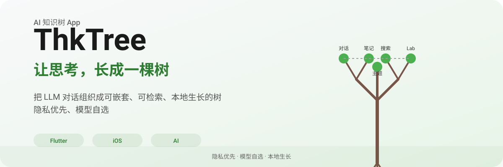

<p align="center">
  <a href="../README.md">简体中文</a> ·
  <a href="./README_zh_CN.md">简体中文（副本）</a> ·
  <strong>English</strong>
</p>

<p align="center">
  
</p>

<p align="center">
  
</p>

---

## What is ThkTree?

ThkTree is an iOS-first AI knowledge-tree app that organizes LLM conversations into a nested, searchable, locally-grown tree — privacy-first, bring your own model.

**Core value**: Human–AI collaboration to build a structured knowledge system that grows *on you* — organic like a tree, not drowned in information overload.

---

<p align="center">
  
</p>

### Knowledge tree (Themes)

- **Multi-theme management**: Each theme is a node tree for a cluster of related thinking
- **Tree sessions / nodes**: One node = one chat or one note; nest, expand, drag
- **Merge & new chat**: Merge up to 3 chats into a new branch to reorganize ideas
- **Tree → Wiki snapshot**: Aggregate a tree’s chats into a readable “book”; browse by chapter and export zip
- **Doc split**: Give a Markdown document to the LLM; auto-split into tree-shaped chat nodes

### Chat

- **Streaming**: SSE streaming, Markdown / LaTeX rendering, image upload and vision models
- **Branch**: Branch instantly from any message or selection to compare ideas
- **Web search**: Native search on KIMI / MIMO / DeepSeek / Doubao / xAI Grok, etc.
- **Deep thinking toggle**: Per-session (DeepSeek, MiniMax, etc.); some models lock server-side
- **Pin panel**: Pin key messages or notes to the screen edge for cross-chat reference
- **iOS background recovery**: ~30s grace when backgrounded; auto-resend on foreground if killed mid-stream

### Notes

- **Markdown notes**: Local editing, required title, table and heading toolbar
- **Chat-to-note**: Save a good reply as a note in one tap
- **LLM title / move theme**: Keep structure clear across themes

### Search

- **Full-text search**: SQLite FTS5 + BM25 across chats and notes
- **Theme / node title filter**: Locate quickly inside a tree

### Lab

- **Keyword leaderboard**: LLM extracts keywords → aggregate scores → see what you think about
- **Input summary**: Scan history and generate a Markdown analysis report
- **Spark collision**: Random keyword pairs → one-line sparks from the LLM → tap to start a new chat

---

<p align="center">
  
</p>

| Area | Choice |
|------|--------|
| Framework | Flutter (Cupertino-only UI) |
| State | Riverpod |
| Routing | go_router (declarative + deep linking) |
| Storage | Markdown body + SQLite metadata / relations / FTS5 |
| Write safety | FileWriteQueue single-writer (atomic streaming append) |
| LLM | SSE streaming + `flutter_secure_storage` for keys |
| Rendering | `gpt_markdown` + `flutter_math_fork` (LaTeX) |
| Platform | `image_picker`, iOS MethodChannel (background grace / TTS) |

### Code layout

```
lib/
  domain/          # Theme, Node, ids
  data/
    models/        # LLM config, meta serialization
    services/      # LLM client, file I/O, search, DB
    stores/        # Riverpod
  ui/
    core/          # Shared widgets, design system (AppColors / AppTheme)
    features/      # themes / chat / notes / lab / llm / settings / search / doc_split
  l10n/            # zh / en
```

Four bottom tabs: **Search / Themes / Notes / Lab**; settings via gear on the search screen.

---

<p align="center">
  
</p>

```bash
# 1. Clone
git clone <repo-url>
cd thk_tree

# 2. Onboarding check
python3 tools/check_onboarding.py

# 3. Dependencies
flutter pub get
cd ios && pod install && cd ..

# 4. Run
flutter run
```

> Environment, skills, and architecture: [`docs/PROJECT.md`](../docs/PROJECT.md), [`docs/ARCHITECTURE.md`](../docs/ARCHITECTURE.md), [`docs/FEATURES.md`](../docs/FEATURES.md).

---

## Philosophy

> Human–AI collaboration to build a structured knowledge system that grows on you — organic like a tree, not lost in the flood.

Most tools flatten chats, notes, and sources into one stream. ThkTree’s answer is a metaphor: **knowledge is a tree**.

- **Organic** — Structured but not rigid; nest, branch, experiment
- **Restraint & order** — Hierarchy through whitespace and type, not noise
- **Experimental** — Lab spirit; share trade-offs and war stories
- **Humanist** — Privacy, tools that serve people

**Promise**: Your knowledge stays yours; your structure stays clear; your tool stays restrained.

---

## Positioning

| Dimension | Stance |
|-----------|--------|
| Platform | iOS-first (TTS, background recovery are native iOS) |
| Data | Local-first, privacy; API keys not stored in plain text |
| Models | Your provider and model, not vendor lock-in |
| Character | “Quiet, reliable architect” — restrained, ordered, human |

---

## Docs

- Architecture & doc map: [`docs/ARCHITECTURE.md`](../docs/ARCHITECTURE.md)
- Feature status: [`docs/FEATURES.md`](../docs/FEATURES.md)

> Always **ThkTree** (PascalCase). Not `thk_tree`, `thktree`, or `Thk Tree`.

---

<p align="center">
  <a href="https://github.com/oil-oil/beautify-github-readme"></a>
</p>
