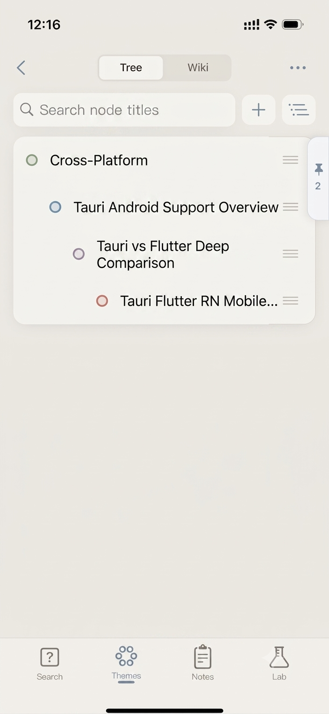

# Screenshots

产品截图与 README / App Store 演示素材。不进 `pubspec.yaml`，不打进 App 包。

| 文件 | 说明 |
|------|------|
| `tree.png` | 知识树视图 |
| `themes_english.jpg` | 主题列表（英文界面） |
| `clips.png` | Clips 功能 |
| `clips-processing.png` | Clips 处理中 |
| `pin-chat-before.jpeg` | Pin 对照栏 — 钉之前 |
| `pin-chat-after.png` | Pin 对照栏 — 钉之后 |
| `pin-view.png` | Pin 对照视图 |

在 README 中引用示例：

```markdown

```
